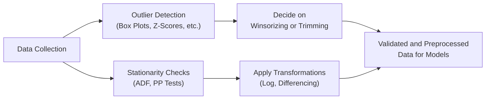

In your CFA Level II studies, you’ve probably seen plenty of examples in which a handful of extreme observations skew an analysis or in which a time series goes all wacky because it behaves differently in different periods. Well, that’s exactly the concern in this section: we’ll dive into outliers and non-stationary data, both of which can seriously undermine the reliability of valuation models. It’s a bit like trying to forecast next summer’s temperature in Antarctica based on Florida’s last five years of beach weather—you’re mixing data that just doesn’t fit together. Here, we’ll explore how to detect, treat, and interpret unusual data points and shifting trends, as well as what that means for our equity research and valuation tasks.

## Definition of Outliers
Let’s start by clarifying what we mean when we talk about outliers. An outlier is basically a data point that diverges a lot from everything else in your dataset. In daily returns for a stock, that might be a single day with ±20% return when the rest of the distribution mostly hovers around ±2%. It could also be an unusually high Price-to-Earnings (P/E) ratio that sits at 100 when the rest are closer to 15 or 20. 

Why does this matter? Because many statistical models—especially those relying on basic assumptions such as normality—can get distorted by the presence of even a single outlier. This might inflate or deflate your mean, alter your standard deviation, or change other distributional properties that your model depends on. In equity valuation, where we often rely on historical averages of returns, cash flows, or correlations, outliers can mislead our analysis if we don’t handle them carefully.

## Detection Methods
When you suspect outliers are hiding in your data, you have an arsenal of detection methods:

### Popular Approaches for Detection
• Standard Deviation Threshold: A simple method is to flag all observations that lie beyond, say, ±3 standard deviations from the mean. For a normal distribution, that’s a pretty strict threshold.  
• Interquartile Range (IQR): The IQR approach identifies outliers as points lying outside the “box” on a box plot. Specifically, you might flag points that lie 1.5 × IQR (or 3 × IQR) beyond the 25th or 75th percentile.  
• Z-Scores: A Z-score is a standardized measure of how many standard deviations an observation is from the mean. If a certain threshold (e.g., ±3) is exceeded, that data point is flagged as an outlier.  
• Box Plots and Visualization: Simple box plots can visually highlight extreme values. Sometimes you can see patterns or potential reasons for outliers just by graphing.  
• Rolling Window Analysis: Particularly for time series data like returns, you might detect outliers on a rolling basis. If a given day’s return is drastically different from recent history, you flag it.

### A Small Personal Anecdote
I once was analyzing daily stock returns for a tech company—let’s call it FutureWeb. For months, the stock more or less bobbed around the +1% to –1% range. But on one random Tuesday, it spiked 25%. Confusion reigned. Turned out it wasn’t a glitch in the data but rather a major buy-out rumor that spiked the price. Without adjusting or at least investigating that outlier, my volatility estimate would've been way higher than normal. That experience really drove home the importance of carefully examining unusual points. Sometimes they’re measurement errors, but sometimes they’re crucial signals of meaningful events.

## Dealing with Outliers: Trimming vs. Winsorizing
Once you’ve identified outliers, you can’t just pretend they don’t exist—especially if they’re real events like that buy-out rumor. But there are established ways to handle them to reduce their distorting effect on your results:

### Trimming (Removing Outliers)
Trimming means you literally remove the outlier observations from your data set. This can be seductive because it leaves you with “nice, clean” data. But if your outliers were legitimate, you risk discarding important information. If you remove too many points, or if you do it selectively (i.e., cherry-pick the ones you don’t like), you might misrepresent the true risk profile of a security.

### Winsorizing (Capping Extremes)
Winsorizing replaces outliers with values close to a chosen threshold—often the boundary at the 5th or 95th percentile, or some multiple of the IQR. For instance, if your data shows a P/E ratio of 200 when most are under 50, you might set an upper cap at 50 and replace the 200 with that cap. You haven’t totally deleted the outlier, but you’ve limited its influence. This approach is often used in robust statistics applications, particularly if the dataset must remain the same size or if you suspect a few data points are truly anomalies rather than meaningful signals.

### Pros and Cons
• Trimming can be good if you’re sure those outliers are errors. But you lose data points entirely.  
• Winsorizing preserves the number of data points but can still distort your distribution if done aggressively.  
• Both approaches can potentially increase model accuracy in the presence of “noise” but risk discarding valuable signals.

## Non-Stationary Data Overview
Many financial time series—like equity prices, exchange rates, interest rates, and macro indicators—are not stationary. Stationarity would require a time series to have a constant mean, a constant variance, and an autocorrelation structure that does not depend on time. But in reality, markets evolve, investor sentiment changes, new technologies emerge, and so on. The path a series takes can shift drastically over time.

### Why It Matters
If you rely on standard regression-based models—like OLS for forecasting returns, or if you’re just computing correlations—classic assumptions usually demand stationarity. If those assumptions are violated, your inferences might be incorrect or your model might end up with spurious regression issues (seeing patterns that are just illusions of time trends).

If you’re applying the Capital Asset Pricing Model (CAPM) to estimate expected returns, for instance, you typically assume that the beta remains somewhat stable over your sample period. But if the underlying data is non-stationary—maybe the firm’s risk profile changed after a major acquisition—then your historical estimates might not reflect the true risk going forward.

## Stationarity Tests
When you suspect a time series is non-stationary, you don’t have to guess blindly. Several robust statistical tests can help confirm or refute your concerns:

### Augmented Dickey-Fuller (ADF)
The ADF test is a popular go-to test in finance. It checks if the series has a unit root—basically if it “wanders” without a tendency to revert to a particular mean. If the test statistic is below a critical value (i.e., p-value < 0.05), you can often reject the hypothesis of a unit root, suggesting it’s stationary.

### Phillips-Perron (PP)
Another test that corrects for some forms of serial correlation and heteroskedasticity. Similar concept to ADF: reject or fail to reject the null hypothesis of a unit root.

### Visual Inspection
Yes, that’s a bit old-school, but plotting your data—looking for trend patterns, changes in variance—sometimes leads you to suspect non-stationarity. Although less formal, it’s a useful sanity check.

## Transformations to Achieve Stationarity
So what if your data is actually non-stationary? In finance, we regularly apply transformations:

• Log Transformation: Converting a price series to log-prices can sometimes stabilize variance, especially if larger values are overshadowing smaller ones.  
• Differencing: Instead of using the level of a variable, use its change. For instance, if your variable is \\(X_t\\), the first difference is \\(X_t - X_{t-1}\\). You can also do second differences if needed.  
• Detrending: If you see a definite linear or exponential trend, you might subtract that trend away to get the “residual” around the trend, which might be stationary. But watch out—sometimes it’s not purely linear.

### Example of Differencing
Let’s say you have a monthly closing price for a stock: \\(P_1, P_2, ..., P_n\\). Instead of modeling \\(P_t\\) directly, you compute the monthly change:  

\Delta P_t = P_t - P_{t-1} 
  
Or you might even look at the log returns, \\(\ln(P_t) - \ln(P_{t-1})\\). This transformation often yields a series that’s more stable in mean and variance.

## Structural Breaks and Regime Shifts
Financial data can have abrupt changes—a new monetary policy regime, a major technology shift, or the infamous 2007–2009 financial crisis. These events can permanently alter relationships, making your once-stable dataset now quite non-stationary.

### Chow Test for Breaks
The Chow test is commonly used to detect whether there is a structural break at a known point in time. Imagine you have a suspicion that something big happened in January 2020 that changed the market environment—perhaps a global pandemic. You’d test your model’s parameters before and after that date to see if they’re significantly different.

### Regime-Switching Models
For more advanced approaches, you can use regime-switching models (like Markov switching) that explicitly account for the possibility of being in one “regime” (e.g., bull market) or another “regime” (e.g., bear market). This is more advanced but can be very relevant for equity valuation work that spans varying macroeconomic cycles.

## Business Cycle Effects
Sometimes, data is not just non-stationary but also cyclical or seasonal. Some equities, for instance, might show strong quarter-end effects. Retailers may have big surges in Q4 around the holiday season. If you ignore these patterns, your forecasts might be way off.

Handling seasonality can involve adding dummy variables for months/quarters, or applying seasonal differencing (e.g., subtract the same period last year). So if you’re analyzing year-over-year growth in retail sector earnings, you want to account for the holiday effect properly in each period.

## Practical Application in Equity Research
So, how do you do all this in practice? Let’s do a quick example:

### Example Scenario
You want to value a consumer electronics retailer using a time series of quarterly earnings from the past five years. You notice:

1. Two quarters with extremely high earnings growth—potential outliers.  
2. A general upward trend in earnings, suggesting possible non-stationarity.  
3. Seasonal surges in Q4, presumably tied to holiday sales.

### Potential Approach
• First, test for outliers using an IQR-based approach or a box plot. If they are real shocks (like a product launch), consider winsorizing or leaving them as is, but be aware of the possible effect on your average growth estimates.  
• Next, run an ADF test on your earnings series. If it’s non-stationary, difference the data or use a growth-rate approach.  
• Consider seasonality by modeling the typical Q4 jump. You might add dummy variables for the holiday quarter or compare Q4 to Q4, Q3 to Q3, etc.  
• Incorporate a structural break test if you know something big changed in the company’s strategy or the economy.  

By applying these steps, your final analysis of the company’s growth trajectory and, ultimately, your discounted cash flow (DCF) model, will be more reflective of the real patterns in the data.

## Exam Contextualization
In CFA Level II, they often present item sets where part of the data is non-stationary, or an outlier skews the entire analysis. They might include a regression that seems to yield a surprisingly high R-squared, but guess what? It might be a spurious correlation if you look closer at the data’s time series properties. Or they might give you a series of returns for a certain stock over several years, with one glaring day of ±40% returns, and ask how you want to handle it in your model for CAPM or cost of equity estimation.

Key takeaway: be on guard for data properties like outliers and stationarity. If your results seem “too good to be true,” check if your analysis might actually be capturing illusions from large leaps in the data or from trending behavior that artificially increases correlation.

## Ethical Considerations
There’s a fine line between legitimate data cleaning and cherry-picking. You must ensure transparency in how you identify, treat, or remove outliers. If you do any outlier adjustment or omit certain time periods (like the 2008 crisis because it’s “too extreme”), your results could mislead stakeholders about the true risk profile of an investment. Always document your decisions, the rationale behind them, and the potential impact on final valuations.

## Software and Tools
Many standard analytic programs (Excel, R, Python) offer straightforward code libraries to detect outliers or conduct stationarity tests. For example, in Python you might use:

```python
import numpy as np
import pandas as pd
from statsmodels.tsa.stattools import adfuller

data = pd.Series([...])  # your time series data
result = adfuller(data)
print("ADF Statistic: ", result[0])
print("p-value: ", result[1])
```

And for outlier detection with Z-scores:

```python
z_scores = (data - np.mean(data)) / np.std(data)
outliers = data[np.abs(z_scores) > 3]  # threshold of 3 standard deviations
```

These routines help you quickly identify issues and transform data to get it exam-ready (and practice-ready, too).

## Process Flow Diagram
Below is a simple Mermaid diagram illustrating a typical process for handling outliers and non-stationary data before final model use:



By combining these steps—detecting outliers, deciding how to treat them, performing stationarity checks, and transforming the data as needed—you’ll ensure your dataset is more “model-friendly” and your inferences more robust.

## Best Practices and Common Pitfalls
• Always confirm whether an outlier is a genuine data point or an error. In finance, large shocks often have fundamental explanations.  
• Document how you treat outliers or non-stationary data. It matters for exam item sets and real-world compliance.  
• If your model has too-perfect results, suspect that you might have spurious correlations or overlooked a structural break.  
• Don’t rely on a single stationarity test. Use multiple methods and also do some visual checks.  
• In exam scenarios, watch for tricky wording that indicates a data series might contain outliers or a structural break.

## Conclusion
Handling outliers and non-stationary data is a critical step in building a reliable valuation or forecasting model. Remember that big-for-a-reason outliers (like the rumor-driven 25% jump in a stock price) may actually hold valuable information about a security’s risk-return profile. Meanwhile, ensuring your data is (or is made) stationary is vital for applying classical linear modeling methods. For the Level II exam, keep a sharp eye out for vignettes that include suspiciously large data points or changes in data behavior over time. Understand your detection and adjustment steps, and be prepared to justify why you’re applying them.

---

## References and Further Reading
• CFA Institute Level II Curriculum (Equity Investments)  
• Damodaran, A. “Damodaran on Valuation,” especially chapters on data adjustments  
• Pham-Gia, T. (2006). “Determining Outliers.”  
• Shumway, R. H., & Stoffer, D. S. “Time Series Analysis and Its Applications”  

These resources will help you deepen your grasp of handling outliers, stationarity, and all the nuances that accompany advanced data considerations in equity research.

## Test Your Knowledge: Handling Outliers and Non-Stationary Data



### Which of the following best describes an outlier in a set of equity returns?
- [ ] A value that is smaller than the mean.
- [x] A value that deviates significantly from most other observations.
- [ ] A value that exactly equals the median.
- [ ] A value that usually falls between the 1st and 3rd quartile.

> **Explanation:** An outlier is a data point that diverges significantly from the rest of the dataset. It could be either much higher or much lower than the bulk of the observations.

### What is the key difference between trimming and winsorizing outliers?
- [x] Trimming removes the outlier entirely, while winsorizing replaces it with a threshold value.
- [ ] Trimming replaces the outlier with an average value, while winsorizing creates a duplicate data point.
- [ ] Trimming adds an additional data point, while winsorizing removes the entire dataset.
- [ ] Both methods handle outliers in exactly the same way.

> **Explanation:** Trimming eliminates the outlier altogether, potentially shrinking the dataset size. Winsorizing preserves the number of observations but caps extreme values at a specified limit.

### Why might non-stationarity be problematic in equity valuation models?
- [ ] It ensures more stable estimates of parameters.
- [x] It can lead to spurious regressions and incorrect statistical inferences.
- [ ] It typically reduces the likelihood of structural breaks.
- [ ] It indicates a stationary time series.

> **Explanation:** When a time series is non-stationary, the usual statistical assumptions behind regression and other models (constant mean, consistent variance, no persistent trend) may not hold, leading to misleading results.

### When using an Augmented Dickey-Fuller (ADF) test, a low p-value (e.g., below 0.05) generally indicates:
- [ ] The presence of multiple outliers.
- [x] That you can reject the null hypothesis of a unit root, suggesting stationarity.
- [ ] That differencing is automatically necessary to achieve stationarity.
- [ ] The presence of a structural break.

> **Explanation:** ADF tests for a unit root. If the p-value is low, you reject the null hypothesis that a unit root exists, meaning your series is likely stationary.

### Which of the following is a valid reason to winsorize a data set?
- [x] To reduce the impact of a few extreme observations without discarding them entirely.
- [ ] To intentionally distort the dataset so it looks more predictable.
- [x] To maintain the same number of observations while mitigating outlier bias.
- [ ] To automatically remove all non-stationary data.

> **Explanation:** Winsorizing replaces extreme values with a cap or floor but keeps data points in the dataset. This can help reduce distortion from large outliers. It doesn’t remove non-stationary data by itself.

### In practice, how might seasonal effects in equity returns be addressed?
- [x] By adding dummy variables or performing seasonal differencing.
- [ ] By discarding all data that show cyclical behavior.
- [ ] By always using a two-stage DDM approach.
- [ ] By ignoring them, since seasonality rarely affects equity valuations.

> **Explanation:** Seasonal or cyclical patterns can be accounted for by using dummy variables, or by applying techniques like seasonal differencing to remove or highlight the periodic component in the data.

### A major shift in market structure (e.g., a sudden change in Fed policy) may cause:
- [ ] Data to become immediately stationary.
- [x] A structural break that invalidates historical relationships.
- [x] A regime change that requires a new modeling approach.
- [ ] The complete removal of outliers from the dataset.

> **Explanation:** Sudden changes in policy can introduce structural breaks and trigger different “market regimes.” This may render older data less useful or force a regime-switching approach in the model.

### What does a high test statistic in the Chow test most likely indicate?
- [x] A structural break may exist at the tested point in time.
- [ ] Data is automatically stationary with no outliers.
- [ ] All outliers should be trimmed immediately.
- [ ] Time series cannot be used for further analysis.

> **Explanation:** The Chow test evaluates whether there’s a statistically significant difference in your regression parameters before and after a specified time. A high test statistic suggests parameters changed, indicating a potential structural break.

### When is it potentially misleading to remove an outlier?
- [x] When it represents a genuine market event (e.g., a merger announcement) that has real valuation implications.
- [ ] When the data set is large.
- [ ] When the outlier is a measurement error.
- [ ] When the outlier is trivially small.

> **Explanation:** If the outlier reflects an actual significant event affecting a company’s risk and return profile, removing it may distort the true picture of the firm’s performance or risk.

### True or False: Differencing a series is always required to remove outliers.
- [x] False
- [ ] True

> **Explanation:** Differencing is a technique primarily used to address non-stationarity (trends, unit roots), not necessarily to remove or handle outliers. Outliers can be treated separately using winsorizing or trimming.


