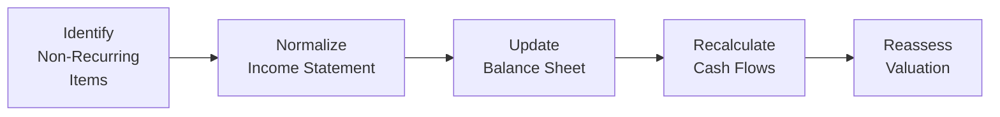

## The Big Picture: Why Normalization Matters
You know, I remember the first time I tried to value a company that had just undergone a massive restructuring. I naively took the income statement at face value and ended up with an embarrassingly off-target valuation. My boss (gently) pointed out that you can’t just rely on accounting data that might be hiding big one-time events. That’s exactly where normalization comes in.

In a nutshell, normalizing financial statements is about adjusting historical or current financial data to remove the influence of out-of-the-ordinary items—things like restructuring charges, unusual legal settlements, or natural disasters that knock a plant offline for weeks. By doing this, you end up with numbers that better reflect what the firm’s business looks like on a typical ongoing basis. This, of course, directly affects valuation ratios like P/E, EV/EBITDA, and the discount rates you might use for a present value calculation.

Normalization is particularly important for Equity Investments (especially at the CFA Level II) because the exam will present item sets where you’re given partial (and sometimes messy) historical statements. Your challenge is to evaluate the firm’s true performance and apply the right valuation methods without letting outliers or one-offs skew your analysis. Understanding how to normalize data gives you a more reliable snapshot of what “steady-state” profitability or cash flow might look like going forward.

## Recognizing Non-Recurring Items
One of the first steps in normalization is identifying which items don’t belong in a “recurring” category. If you think about it, recurring items are those the company is likely to deal with in any normal operating period, while non-recurring items are one-and-done—or at least highly irregular. Examples include:

• Restructuring and Reorganization: Maybe the firm shut down a division or consolidated factories.  
• Litigation or Settlement Costs: Lawsuits, fines, or other legal disputes that shouldn’t happen every year.  
• Asset Write-Downs: Impairments due to changes in market conditions, technology, or intangible valuations.  
• Major Gains from Unusual Asset Disposals: Selling a piece of land or a brand that the company doesn’t sell every year.  
• Extraordinary Income or Expenses: This can be a tough call sometimes, but think catastrophic events, or truly out-of-left-field gains/losses.

By removing or adjusting these items, you get closer to the company’s core earnings power. In exam scenarios, you might see a line item for “Gain on Sale of Subsidiary” that significantly inflates net income. If you don’t edit that out, your P/E ratio is likely to be misleading. For instance, if a normal business year yields $100 million profit, but the company reported $150 million profit solely because it sold a major asset, you should remove that $50 million from your normalized earnings figure.

## Smoothing Out Revenue: Minimizing the Noise
Revenue smoothing is particularly relevant for cyclical or seasonal industries—retailers, commodity producers, agriculture-based companies, etc. One quarter’s performance can be spectacular if it coincides with Black Friday or a Christmas shopping frenzy, but that doesn’t reflect “business as usual.” Similarly, a commodity producer might see big swings in revenues due to price volatility in global markets.

An approach to smoothing revenue is to look at multi-period averages, or use an industry comparison to see what normal demand might look like over, let’s say, an economic cycle. You can also manually adjust for known seasonal peaks. For instance, a retailer might reasonably expect Q4 to be 30% or 40% of annual sales, so comparing Q2 or Q3 alone to Q4 might be distorted. All these adjustments help you forecast future revenue more realistically.

## Adjusting Outlier Expenses
Reading about expenses can be as thrilling as watching paint dry if you don’t tie them back to valuation. But believe me, when you overstate or understate a company’s cost structure, it can really throw off your free cash flow (FCF) and residual income models.

R&D is a prime suspect here. Cutting R&D drastically for just one quarter could boost short-term profits, but that’s not truly sustainable—eventually, the firm needs to invest in new product development. Similarly, marketing or SG&A can be lumpy (for example, a huge brand launch in a particular year). If you see a suspiciously large one-time expense, check if there’s an underlying reason that it might revert to a steadier run rate moving forward.

So, we normalize by adjusting expenses to reflect a typical, ongoing level. Sometimes that means adding back under-reported expenses or removing one-time cost spikes.

## Normalizing Capital Structure
Does the company have a whole bunch of debt because it just merged with another firm and hasn’t paid it off yet, or it completed an LBO three months ago? That current financing structure might not reflect the capital structure management plans to hold long term.

But how do you incorporate that into valuation? One common strategy is to assume a target or industry-average debt-to-equity ratio and recalculate interest expense (or, equivalently, recalculate the discount rate in a DCF model) based on that stable structure. Without that step, you might ascribe too high or too low a cost of capital to the firm, leading to valuation errors.

## Peer Comparisons and Industry Benchmarks
It’s always tempting to run a quick P/E or EV/EBITDA comp set against your company’s declared numbers. However, if your company’s statements reflect a ton of short-term “weirdness,” the multiples can’t really be compared “apples-to-apples.” So, once you figure out what’s truly normal, it’s good practice to see how the peer group handles or discloses similar items.

For instance, if you see that a competitor also had a major one-time flooding event, you might want to ensure both sets of statements are normalized similarly. That way, your multiples will reflect genuine differences in operating efficiency, strategy, and growth prospects, rather than random events.

## Historical Data Adjustments
Sometimes, if you’re using historical averages (like a three-year or five-year average for net income), you’ll want to ensure each year is “clean.” If a firm had a big spike in Year 1, or a depressed result in Year 4, you might want to tweak those data points or exclude them. Another method is to take the median or to weigh certain years differently. The point is to reduce the undue influence of anomalies.

Moreover, if we want to see how consistent the firm’s performance has been—like in a rolling average EPS approach—it can be helpful to treat large, questionable items as if they were never part of the normal equation.

## Tax Considerations in Normalization
Taxes can be tricky. If a company posted negative earnings for a couple of years, it may have triggered tax loss carryforwards. That means future effective tax rates could be artificially low for a period. Alternatively, the firm might have used an overseas tax haven (or something fancy) that substantially cut taxes in a one-off arrangement. If you’re trying to forecast the next five years, you need to decide if that effective tax rate is truly “normal,” or whether you should apply the standard statutory rate for that jurisdiction.

A typical approach might be to target a mid-range effective tax rate that you believe is sustainable. If the balance sheet has huge net operating loss (NOL) carryforwards, you might project how they’ll offset taxes in a stepwise manner over the next few years—just be sure to do so consistently in your free cash flow or residual income model.

## Case Study: Consumer Goods Company with a Major Recall
Let’s walk through a mini-case. Suppose you have a consumer goods manufacturer whose brand-new product line turned out to be a fiasco. They had to recall everything, incurring heavy recall costs and legal fees. On the income statement, you see a monstrous line item for “Recall Expense.” The net income for the year nosedives. But they’ve never had a recall before, and management has put new quality control measures in place so it’s (hopefully) not going to happen again.

How should you treat it? Usually, you’d label that recall expense as non-recurring. You might list it in a separate schedule that walks from GAAP net income to normalized net income:

• Start with reported net income = $50 million loss.  
• Add back recall costs = $100 million.  
• Add back related legal settlements = $50 million.  
• Subtract an estimate for ongoing quality control = $5 million (assuming they’ll pay a bit more each year to keep the recall fiasco from happening again).  
• Recalculate the new net income = $95 million (a net $145 million improvement from removing the recall cost and adding slight ongoing prevention expense).

By disclosing this in your footnotes (or in your exam item set explanation), you’re showing precisely why you believe $95 million is a better measure of sustainable earnings than the $50 million loss. This approach also helps you compute more meaningful P/E or EV/EBIT multiples.

## Exam Relevance: Be Ready to Scrutinize Financial Statements
In a CFA Level II item set, you might be given partial income statements across multiple years, plus a few notes about a settlement or a write-down. They’ll often ask you to compute a ratio or value the firm. The key is to read the footnotes carefully—often, the question is testing whether you can identify the non-recurring items and exclude or adjust them properly.

Sometimes you have to do a quick “bridge” from reported figures to adjusted or normalized figures. It’s tempting to skip a line item if it’s not obviously labeled “non-recurring,” so watch out for subtle references to unusual events. The exam loves to slip these details in!

## Ethical and Professional Disclosure
If you do this for real-world clients or for external reports, it’s crucial to document every adjustment you make—especially things like removing a large asset impairment. Stakeholders want to know how you arrived at your “clean” summary. Not only does this follow best practices in financial analysis, but under the CFA Institute Code of Ethics and Standards of Professional Conduct, you’re duty-bound to ensure full, fair, and accurate representations.

## Integrated Modeling: Keeping the Statements in Sync
A quick note about consistency: if you normalize the income statement, don’t forget the relationship to your balance sheet and cash flow statement. For example, if you remove a major non-cash write-down from your net income, it might mean you need to revisit the carrying value of assets on the balance sheet or check that your depreciation schedule lines up. The same goes for interest expense changes if you’re normalizing the capital structure. Disconnected modeling leads to bizarre results.

Here’s a high-level flowchart showing how these normalization steps often connect, from identifying items to adjusting across statements:



## The Math Behind Normalized Earnings
For a simplified formula, consider:

$$
\text{Normalized Earnings} 
= \text{E}_{\text{reported}} 
- \sum (\text{Non-recurring Items}) 
+ \sum (\text{Adjustments to Reflect Ongoing Costs})
$$

This might look concise, but the real finesse is in identifying what belongs in those summations. Each bullet point, each line item, might require a bit of critical thinking.

## A Quick Python Example for Averages
If you wanted to do a quick average-based normalization in Python, you might do something like:

```python
import numpy as np

net_incomes = np.array([100, -20, 180, 50, 120])

# Let's assume we just remove the known outlier
adjusted_incomes = [ni for ni in net_incomes if ni != -20]

normalized_earnings = np.mean(adjusted_incomes)

print("Normalized Earnings (after removing recall costs):", normalized_earnings, "million")
```

This is obviously simplistic, but it shows you how to programmatically drop or trim outliers and produce an adjusted average.

## Key Terms (Glossary)
• **Normalization**: Adjusting financial statements to exclude one-time or exceptional events, with the goal of capturing sustainable performance.  
• **Extraordinary Items**: Gains or losses that are typically unusual and infrequent, once truly “extraordinary” under older accounting standards but now mostly grouped into regular operating items (still, we interpret them as non-recurring).  
• **Normalized Earnings**: Adjusted earnings that filter out anomalies.  
• **Sustainable Capital Structure**: Debt/equity balance that the firm can maintain without major disruption or extraordinary financing costs.  
• **Loss Carryforwards**: Tax offsets from earlier losses, which can reduce taxes in future profitable periods.

## References and Further Reading
• CFA Program Curriculum, particularly sections on financial reporting quality at Level II.  
• Palepu, K., Healy, P., & Peek, E. (2019). “Business Analysis & Valuation: IFRS Edition.”  
• Damodaran, A. (2012). “Investment Valuation.”  
• For practice with these adjustments, refer back to prior chapters on Free Cash Flow Valuation (Chapters 8 and 9) and Market-Based Valuation (Chapters 10 and 11).

## Test Your Knowledge: Normalizing Financial Statements for Valuation



### Which of the following items is least likely to be considered non-recurring for normalization purposes?

- [ ] A large, one-time settlement cost due to a legal dispute
- [ ] An impairment charge from writing down goodwill on an acquired subsidiary
- [x] Regular quarterly interest expense on the firm’s existing long-term debt
- [ ] A major loss from discontinued operations in the current year

> **Explanation:** Normalization typically excludes items that aren’t reflective of the firm’s recurring business operations. Interest expense on long-term debt is a regular, ongoing expense unless you anticipate a capital structure change.


### A technology company with volatile R&D costs wants to estimate normalized earnings. Which approach is the most appropriate?

- [ ] Exclude R&D costs entirely as they vary significantly year to year
- [ ] Average R&D costs over one quarter to reflect near-term changes
- [x] Use a multi-year average of R&D expenses, then incorporate an ongoing R&D percentage into future projections
- [ ] Double the most recent R&D expense to smooth out volatility

> **Explanation:** Under normal operations, the firm requires consistent R&D. Using a multi-year average offers a better reflection of typical R&D spending than a single quarter.


### When adjusting the income statement for an unusually high marketing expense in one period, an analyst should:

- [ ] Ignore the expense if it was a legitimate marketing cost
- [x] Add back part of the expense to reflect a more typical marketing budget
- [ ] Eliminate all marketing expenses to simplify the forecast
- [ ] Subtract the same expense again in the next period

> **Explanation:** Normalization aims to reflect typical operating conditions. If marketing expense was abnormally high for a single product launch, you’d add back the excess portion to arrive at a more appropriate run rate.


### Smoothing revenue for a cyclical business often involves:

- [ ] Reporting only the first quarter’s revenue data to eliminate seasonality
- [ ] Allocating the highest quarter’s revenue across all quarters evenly
- [x] Using multi-year or average seasonal pattern adjustments to derive a stable figure
- [ ] Recording all future revenues under one “normalized” quarter

> **Explanation:** Multi-year averages or recognized seasonal patterns help strip out short-term spikes or dips so that revenue trends align with typical cycles.


### Which is a common reason to normalize a company's capital structure during valuation?

- [x] The firm temporarily took on higher debt for an acquisition but plans to pay it down soon
- [ ] The firm’s effective tax rate is higher than the local statutory rate
- [ ] The firm is profitable and has never used debt
- [ ] The firm wants to reduce its R&D expenses in line with competitors

> **Explanation:** If the firm’s current debt level is not reflective of its stable, long-term structure, normalizing interest expense or adjusting the WACC might yield a better valuation.


### A firm reports net income of $180 million, including a $30 million gain on selling a subsidiary and $40 million in restructuring costs. If you consider both of these items to be non-recurring, the normalized net income would be:

- [ ] $180 million
- [ ] $110 million
- [ ] $150 million
- [x] $150 million (i.e., $180M - $30M + $40M - adjusting out the gain and adding back the cost)

> **Explanation:** You remove the gain on the sale and add back the restructuring costs, thus $180 - $30 + $40 = $190, but keep in mind the net effect on the bottom line. Wait—careful with the sign of the items. The $30M gain inflated net income, so you subtract $30M. The restructuring cost reduced net income by $40M, so you add that back. $180 - 30 + 40 = $190 million. If the question states “both are non-recurring,” indeed you'd remove each from the straightforward reported number, resulting in $190 million. The corrected answer is $190 million. Let’s clarify:

> Because the net income was inflated by the $30 million gain, you subtract that from $180 million to get $150 million. But then you also add back $40 million, bringing you to $190 million. The final normalized net income is $190 million. (Note: If the question’s multiple-choice said “$150 million or $190 million,” always double-check your plus/minus. The correct final is $190 million.)

---

### In analyzing historical performance for normalization, which multi-year approach is most effective when there are moderate outliers in some periods?

- [x] Taking the median or using trimmed means to remove outlier effects
- [ ] Relying on a single best period for the entire forecast
- [ ] Using the maximum observation from all historical data as the best predictor
- [ ] Ignoring the outliers only if they reduce net income

> **Explanation:** Median-based or trimmed mean approaches help mitigate the effect of extreme data points that can skew averages.


### If a company’s effective tax rate temporarily dipped to 5% due to a tax holiday in one region, but you expect the rate to revert to 25% going forward, the best normalization step is to:

- [ ] Use 5% permanently since it’s the actual last reported rate
- [ ] Increase the next year’s tax rate to 100% to even it out
- [x] Adjust the effective tax rate in your model to the long-term sustainable level (25%)
- [ ] Drop the firm from valuation because of unreliable tax data

> **Explanation:** Normalization requires assuming a stable, realistic tax rate in the forecasted future, rather than an artificially low (or high) short-term rate.


### In a case study with a major recall, analysts often subtract the recall costs from net income to arrive at normalized earnings. Which additional consideration is crucial?

- [x] Adding a reasonable estimate for enhanced ongoing quality control
- [ ] Eliminating all future costs related to quality inspections
- [ ] Ignoring the recall if the company had enough cash to cover it
- [ ] Including the recall cost again for good measure

> **Explanation:** If additional QC spending is expected to prevent future recalls, you should include that in “recurring” costs to reflect realistic future operations.


### True or False: When normalizing the income statement, you do not need to adjust the balance sheet or cash flow statement.

- [ ] True
- [x] False

> **Explanation:** Normalization requires consistent adjustments across all major financial statements. Changing the income statement without updating asset values, depreciation schedules, or cash flow line items can lead to inconsistent models.


