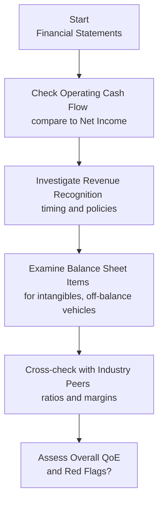

## Understanding Quality of Earnings

Quality of Earnings (QoE) is all about discerning whether a company’s reported earnings truly reflect its economic reality or whether some of that profit power is just, well, a bit of smoke and mirrors. Maybe you’ve seen financial statements that look great on the surface—strong revenue growth, impressive net income—but then you peek at the company’s cash flows and they’re nowhere near matching up. That’s a classic sign that the firm’s “earnings quality” could be compromised.

Simply put, QoE is the difference between superficial accounting results and authentic business performance. Strong QoE implies that the reported net income is a faithful representation of a firm’s underlying operations. Weak QoE, on the other hand, often arises when management uses aggressive accounting policies, manipulates revenue recognition, or engages in real activities manipulation (like slashing R&D costs) to boost short-term figures at the expense of the company’s long-term health.

## Red Flags and Warning Signs

Understanding the concept is one thing; recognizing trouble spots in the real world can be a whole different story. Let’s highlight some common red flags:

• Low or negative cash flow from operations (CFO) while net income grows.  
• Sudden or unexplained changes in accounting policies.  
• Elevated accrual items (e.g., large amounts of unbilled receivables).  
• Frequent one-time charges or “unusual” items that pop up year after year.  
• Complex or inconsistent footnotes that obscure revenue or expense recognition.  

Analysts should always be on the lookout for these patterns and investigate as soon as something doesn’t feel right. 

Below is a simplified flowchart illustrating a basic approach to investigating QoE:

## Aggressive Revenue Recognition

One of the most common forms of earnings manipulation is inflating revenue. A few tactics include:

• Channel Stuffing: The firm sends more products than distributors can realistically sell, effectively borrowing from future periods to pad the current period.  
• Recognizing Revenue Early: In long-term contracts, for example, management may decide to recognize a large chunk of revenue before the project is actually complete.  
• Sales to Related Parties: Sometimes, companies sell to affiliated entities but record it as normal revenue, which can mislead external stakeholders if not properly disclosed.  

A firm that aggressively recognizes revenue sets itself up for a day of reckoning. Eventually, fake or prematurely booked revenue must be reversed or corrected, and that shortfall can damage shareholder trust and crater the stock price.

## Earnings Management Techniques

Earnings management can be split into two broad categories: (1) real activities manipulation and (2) accounting manipulations.

• Real Activities Manipulation: This means management changes actual firm behavior to influence the numbers. For instance, management might slash marketing or research and development costs to show higher short-term margins—like skipping a car’s timely maintenance to save money in the short run. Over time, these cost cuts often hurt competitiveness.  

• Accounting Manipulations: Here we’re talking about adjusting estimates and assumptions, shifting expenses to later periods, or making overly optimistic judgments on asset valuations. Common examples include lengthening the depreciation schedule for fixed assets or adopting a more lenient recognition of intangible items.

### A Quick Example

Imagine a consumer electronics company that desperately wants to meet earnings targets for analyst projections. They might slash R&D spending for a few quarters. The short-term benefits? Great—profit margins improve, net income spikes. But the long-term consequences can be devastating if the firm fails to develop new products or update existing lines. In the next few years, that lack of innovation will likely come back to haunt the company’s competitiveness.

## Cash Flow Matching and Analysis

Analysts often say, “Cash flow never lies.” While that might be a bit of an overstatement, cash flow from operations is far harder to manipulate than reported earnings. If you see big gaps between reported net income and operating cash flow, your spider sense should tingle. Why are earnings growing steadily while the CFO stays flat or even declines? Could it be that the company is capitalizing operating expenses or inflating receivables?

### Accrual Ratios

One way to check consistency between net income and cash flow is to calculate an Accrual Ratio or similar measure. A commonly cited accrual measure:


\text{Accrual Ratio} = \frac{\text{Net Income} - \text{Cash Flow from Operations}}{\text{Average Total Assets}}


If net income mainly arises from non-cash items (i.e., large accruals), an elevated Accrual Ratio suggests the firm might be using more discretionary accounting entries. Although this does not automatically mean fraud or manipulation, it warrants deeper investigation.

## The Balance Sheet Angle

Quality of earnings issues aren’t confined to just the income statement. Sometimes the biggest revelations hide on the balance sheet:

• Overly Aggressive Intangibles: A firm might keep intangible assets on its books well after their useful life has realistically ended.  
• Off-Balance-Sheet Arrangements: Special purpose entities (SPEs) and other vehicles can mask debt and artificially improve reported metrics.  
• Extended Credit Terms to Customers: When credit terms start expanding significantly, it can temporarily boost sales, but it often signals that buyers aren’t quite ready to purchase at standard terms.  

Analysts should cross-check these items with footnotes, regulatory filings, and industry norms. If the intangible assets are ballooning while peers show a different trend, dig deeper to determine if that intangible really has ongoing economic value.

## External Scrutiny: Role of Auditors and Analysts

We might think that an external audit is like a safety firewall that catches any and all manipulations. Sadly, that’s not always guaranteed. Auditors focus on material misstatements, and management’s more subtle manipulations can slip under the radar. Furthermore, auditors often rely on management’s own assumptions and estimates, so if management justifies them well, it can be difficult to question each detail.

Sell-side and buy-side analysts sometimes uncover suspicious trends by comparing firms in the same sector. But they, too, can occasionally be swayed by company narratives—or even by conflicts of interest if their firm has an investment banking relationship with the company in question. This is why a thorough, independent appraisal of a company’s statements using fundamental analysis is so essential.

## Peer Comparisons

Speaking of cross-industry checks, these can be incredibly revealing:

• Profitability Ratios: Significant outliers in margins (gross, operating, net) could indicate inflated earnings or under-reporting of costs.  
• Growth Rates: Are sales or net income growth rates out of line with the rest of the industry, especially if overall demand is stable?  
• Working Capital Turnover: If one firm’s turnover is dramatically higher (or lower) than its peers, that might be due to channel stuffing, overly aggressive credit terms, or other manipulations.  

Comparing a target firm’s financial ratios to the averages for its industry often highlights anomalies and encourages more questions. 

## Regulatory Oversight

In jurisdictions like the United States, the Securities and Exchange Commission (SEC) has strict rules and detailed requirements for disclosures. Other countries have their own equivalents. IFRS and US GAAP, while robust, still leave room for managerial judgment—and that’s precisely where earnings quality issues can spring up. Regulators do step in when detecting chronically misleading reporting, but enforcement might come too late for an unsuspecting investor.

Hence, an analyst’s task is to stay vigilant, interpret the nuances of IFRS vs. US GAAP, and remain aware of differences in how certain items (like revenue, R&D, inventories, and intangible assets) are recognized. 

## Impact on Valuation and Consequences

From a valuation perspective, poor earnings quality ultimately leads to mispricing, especially if unscrupulous behaviors continue undetected for a while. A stock might look undervalued thanks to overly rosy earnings—until the bubble bursts, confidence wanes, and the share price plummets. We’ve seen major collapses in real-world cases (Enron, WorldCom) that left investors and employees in ruin.

For any discounted cash flow (DCF) model, your forecast is only as good as the baseline of sustainable earnings. If your inputs are inflated from day one, your terminal value will often be overestimated, leading to misguided buy/sell decisions.

## Vignette Example

To see how this might look on an exam, imagine an item set describing a consumer goods company:

The firm reports:  
• 25% increase in sales over last year, while overall industry growth was only 8%.  
• Significant sales growth in late December due to extended credit terms.  
• Net income increases, but CFO fails to keep pace (and is negative on the quarter).  
• An unusual number of “miscellaneous intangible assets” that have grown 40% in the last year.  

An investor reading these statements might suspect channel stuffing or questionable intangible asset valuation. The CFO shortfall is a major red flag. The analyst would dig into the footnotes to see whether these intangible assets are truly beneficial or whether they’re being spun up to avoid hitting the income statement with an amortization expense. They’d also want to check if extended credit terms are artificially boosting near-term revenue.

## Best Practices for Identifying Earnings Issues

• Always Compare Earnings to Cash Flow: Monitor free cash flow (FCF) or CFO side by side with net income.  
• Examine Changes in Working Capital: Look at days sales outstanding (DSO) and days inventory on hand (DOH). A sudden jump could be a sign that the company is pushing products on customers or shifting inventory around.  
• Carefully Read Footnotes: Footnotes often hold the key to understanding strange jumps in intangible assets, or large accrual entries.  
• Benchmark Versus Competitors: If your target firm’s metrics are wildly different without a solid business explanation, caution is warranted.  
• Investigate Trends, Not Just Snapshots: It’s easy to hide something for a quarter, harder over multiple accounting periods. Check patterns over a few years.  
• Follow Industry News: Sometimes new regulation or structural shifts in the marketplace can force changes in accounting.  

## Long-Term vs. Short-Term View

While short-term earnings management might boost a firm’s stock price temporarily, it can undermine real investment in the business, lower employee morale, and eventually diminish the franchise’s value. A thorough equity valuation must incorporate a longer-term perspective, especially when applying multi-stage DDM or FCFE models. If you project big growth rates based on manipulated short-term earnings, you’ll likely end up with a serious overvaluation.

## References and Further Reading

• Schilit, H. & Perler, J. (2018). “Financial Shenanigans.”  
• CFA Institute Curriculum on Financial Reporting Quality (Level II).  
• Dechow, P. & Skinner, D. (2000). “Earnings Management: Reconciling the Views of Accounting Academics, Practitioners, and Regulators.”

Below, find some questions to test your grasp of identifying quality of earnings concerns.

## Test Your Knowledge: Quality of Earnings Red Flags and Analyses



### A company shows rising net income but negative cash flow from operations. What is the most likely conclusion from an analyst’s perspective?

- [ ] The company has strong liquidity.
- [x] The company’s earnings might be overstated and require further investigation.
- [ ] The company’s reported earnings are understated for tax reasons.
- [ ] The discrepancy is always caused by timing differences in accrual accounting.

> **Explanation:** A persistent gap between net income and operating cash flow often signals potential earnings quality issues, such as aggressive accounting policies or revenue recognition practices.

### Which of the following best describes channel stuffing?

- [ ] Recognizing cash inflows before receiving payment from customers.
- [ ] Deferring revenue recognition to future periods.
- [ ] Writing down inventory to artificially reduce tax liabilities.
- [x] Shipping more products than distributors can sell, inflating near-term revenue.

> **Explanation:** Channel stuffing is the practice of pushing excessive product to distributors in order to record the sale now, often leading to future returns or uncollectible accounts.

### A firm consistently reports a high level of intangible assets compared to peers without an evident explanation. This situation suggests:

- [ ] The firm likely has superior R&D investment success.
- [x] Possible overstatement of intangible assets to boost earnings.
- [ ] The firm’s brand equity is likely undervalued on the balance sheet.
- [ ] Lower capital expenditures in the previous year.

> **Explanation:** When intangible assets balloon without rational support (e.g., successful tech patents), it may indicate an attempt to avoid high amortization expenses and artificially maintain higher earnings.

### An analyst notices that one firm’s net margin is consistently twice the industry average for four years in a row. Which action should the analyst take first?

- [x] Investigate the firm’s accounting policies for revenue and expense recognition.
- [ ] Immediately conclude that management is engaged in fraud.
- [ ] Project future margins at twice the industry without question.
- [ ] Confirm whether the firm’s CFO has changed in the last year.

> **Explanation:** Large and consistent deviations from peer averages warrant deeper investigation into accounting methods and underlying company dynamics. It does not necessarily imply fraud, but it’s a clear red flag.

### When a company engages in real earnings management, which of the following is most likely to occur?

- [x] Decrease in R&D spending to boost short-term profit.
- [ ] Capitalization of long-term assets in the current period.
- [x] Offering customers unusual discounts to accelerate sales recognition.
- [ ] Writing off intangible assets earlier than required.

> **Explanation:** Real earnings management includes actions like cutting R&D or offering heavy discounts to spike current revenues. It shifts actual business decisions to shape short-run earnings results.

### Which of the following best characterizes a high Accrual Ratio?

- [x] Net income is substantially higher than CFO.
- [ ] Net income is substantially lower than CFO.
- [ ] Net income and CFO are equal.
- [ ] Total liabilities are significantly higher than total assets.

> **Explanation:** A high Accrual Ratio occurs when reported net income is much larger than cash flow from operations, suggesting that earnings are heavily influenced by accounting accruals.

### According to best practices for assessing QoE, an analyst should:

- [x] Compare margins, growth rates, and working capital trends with industry peers.
- [ ] Focus solely on the firm’s balance sheet.
- [x] Evaluate footnote disclosures to spot unusual items.
- [ ] Always avoid speaking with external auditors due to conflicts of interest.

> **Explanation:** Identifying weaknesses in QoE requires a broad set of tools, including peer analysis, close reading of footnotes, and possibly discussions with external auditors or investor relations to clarify ambiguous reporting.

### Suppose an analyst is concerned about revenue manipulation at a firm. Which primary ratio could provide a quick hint at potential issues?

- [x] Days Sales Outstanding (DSO).
- [ ] Days Payables Outstanding (DPO).
- [ ] Debt-to-Equity Ratio.
- [ ] Gross Margin.

> **Explanation:** DSO is particularly relevant for spotting revenue manipulation. If DSO balloons, it may suggest that sales are being recognized prematurely or that customers are struggling to pay under normal terms.

### Which of the following is true about external auditors’ role in detecting manipulative accounting?

- [x] They focus on material misstatements but may miss subtle or well-camouflaged manipulations.
- [ ] They always uncover every potential earnings misrepresentation.
- [ ] They are responsible for making operational decisions on behalf of management.
- [ ] They cannot question any subjective estimates made by management.

> **Explanation:** External auditors aim to ensure financial statements are materially correct, but subtle manipulations can occasionally slip through. Auditors do challenge estimates, but if management’s assumptions are plausible, the auditor may not override them without concrete evidence.

### True or False: When earnings are inflated, the firm’s stock price always increases in the short term.

- [x] True
- [ ] False

> **Explanation:** Inflated earnings often fool the market initially, leading to short-term stock price hikes. However, when the true performance is eventually revealed, the price correction can be dramatic and painful for investors.


