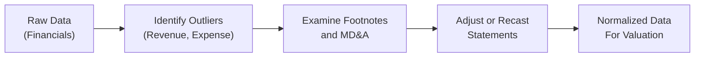

## Introduction 
“Data scrubbing”—sometimes also called “data cleaning”—is one of the less glamorous but most important tasks in equity valuation. You know how sometimes you stumble on a dataset that looks great at first glance, but then you realize some entries just don’t make sense, or maybe there’s a suspiciously large revenue jump in Q4? It’s in these moments you discover that data integrity is everything. And for CFA Level II, success often comes down to how quickly you can spot such anomalies, correct or adjust for them, and move on to the next question. 

This section focuses on “Vignette Drills,” which imitate exam-style item sets. You’ll see the messy data, footnotes, uneven trends, non-recurring charges, and potential accounting manipulations, then decide how to scrub and normalize those figures so you can arrive at a decent valuation. We’ll explore an example scenario based on a mid-cap manufacturer, highlight typical pitfalls, and see how these adjustments can feed into multi-stage forecasting. Let’s jump right in.

## Purpose of Vignette Exercises
Vignettes are deliberately designed to simulate the real-life chaos you might face as an analyst. On exam day, you’ll have a series of item sets with a limited time to read through all details—footnotes, MD&A remarks, financial statements—and make quick but accurate judgments about what is or isn’t important. 

• In the real world, unscrubbed data can mask the true performance of a firm. A one-time benefit might inflate net income, or a stealthy change in depreciation policy can artificially bolster earnings.  
• In the exam world, you’ll face the same sort of puzzle but must respond under tight time constraints.  

The end goal is to demonstrate you can spot red flags, reclassify suspicious items, and produce an adjusted data set for more reliable equity valuation. That’s what these exercises are all about—practice doing it fast and doing it right.

## Scenario: A Mid-Cap Manufacturing Firm
Picture this: You’re analyzing a 5-year financial history for a company we’ll call Mopart Inc., a mid-cap manufacturer specializing in machinery parts. The CFO changed in Year 3, followed by a sudden shift in how certain expenses were classified. Then in Year 4, Mopart sold a piece of its business for a one-time gain. Meanwhile, revenue growth looks great, but you notice a significant jump in new distribution deals—even though shipping costs have oddly remained flat.

If that’s not enough to raise your eyebrows, Mopart’s R&D costs dropped significantly in Year 5, just as they announced a brand-new product line. “Huh,” you might say. “How do you develop a new product line with less R&D spending?” This scenario is ripe for a data-scrubbing test.

## Data Scrubbing Step-by-Step
Let’s break down a process you might follow to keep your analysis squeaky clean:

### Identify Outliers and Suspicious Figures
• Look for “weird spikes”: A year or quarter where revenue or expenses deviate wildly from the trend.  
• Check footnotes or MD&A (Management Discussion & Analysis) sections for major events, such as asset sales, restructurings, or changes in accounting policy.  
• Verify any huge intangible asset write-downs, big legal settlements, or insurance payouts.  

Mathematically, many analysts do a z-score test to find outliers in historical data:


z = \frac{x_i - \bar{x}}{\sigma}


If |z| > 3 (for instance), that data point might be an outlier worth investigating.

### Examine Shifts in Reporting Policy 
A new CFO might decide to:  
• Change depreciation schedules (e.g., from straight-line to accelerated).  
• Reclassify certain operating expenses as capital expenditures.  
• Tweak inventory accounting from LIFO to FIFO (where permissible).

Each of these changes can make older periods non-comparable with the most recent data. So, watch for subtle clues in footnotes or differences in line item headings from year to year.

### Recast Statements if Necessary
If you think a one-time gain artificially boosts net income, consider removing it from your normalized figures. For example:  
• A big disposal gain from selling property might inflate net income this year, but it doesn’t reflect ongoing operating performance.  
• Conversely, a large one-time lawsuit settlement might deflate net income artificially.

After removing these effects, you can recast the financial statements. This might mean you produce an “adjusted net income” figure or restate historical depreciation charges to create consistent data across all 5 years.

### Integrate Memos from MD&A
Management Discussion & Analysis is often where companies provide explanations for big changes in results. They might talk about supply chain disruptions, reclassification of intangible assets, or new partnerships. The MD&A can be your best friend: sometimes they come right out and say, “We sold a major division for a $40 million gain.” That’s a big help in explaining suspicious figures.

### Evaluate Long-Term vs. Short-Term Trends
Sometimes a short-term anomaly is genuinely short-term. Other times it’s the start of a new “normal.” Distinguishing these requires both quantitative analysis and a qualitative assessment of the company’s fundamentals. A single quarter’s revenue spike might not be part of an upward trend if management is pulling forward future sales or offering deep discounts (aggressive revenue recognition, anyone?).  

Below is a simplified flowchart of how data scrubbing often flows from raw data to a final, normalized dataset:

## Q&A Design for Vignettes
For exam prep, you might get a single item set with Mopart Inc.’s 5-year statements—revenue, cost of goods sold, operating expenses, net income, plus a snippet from the MD&A. The questions will test you on:  
• Which line items to adjust or remove for normalizing earnings.  
• Whether certain expenses are recurring or one-offs.  
• Whether the changes in accounting policy require you to reclassify older data.  
• How you’d handle newly discovered off-balance-sheet items (like operating leases that are not capitalized).  

In a typical exam scenario, each question might be multiple-choice or short-answer style. Some queries focus on the rationale: “Why would you adjust for this gain?” Others test your calculations: “What’s the adjusted EPS for Year 4 if we remove the entire after-tax effect of that $20 million disposal?”

## Ethical Considerations
Data scrubbing isn’t just about mechanical adjustments; it's also about integrity and analysis ethics. Over-adjusting can be as misleading as ignoring the outliers:  
• It’s tempting to keep removing “bad stuff” to make the numbers look nice. But that might yield an overly rosy forecast.  
• Or, if you have a hunch the stock is overpriced, you might be too quick to label everything a “recurring expense.”  

The CFA Institute Code of Ethics demands objectivity. You want to reflect the underlying economic reality, not push an agenda. Keeping robust documentation of each adjustment, referencing official disclosures, and verifying your assumptions are essential.  

## Common Pitfalls
1. Confusing recurring vs. non-recurring items: Not all let’s-call-it-“non-recurring” items are truly one-time. Some restructuring charges ironically recur every few years.  
2. Failing to read the footnotes: You might incorrectly attribute that revenue spike to organic growth when it’s actually a new partnership that front-loaded sales.  
3. Inconsistently applying adjustments: If you recast depreciation for only one period, the rest of your time series is inconsistent.  
4. Overlooking R&D capitalization vs. expensing policies: Some companies shift their R&D to intangible assets, artificially smoothing expenses.

## Using Cleaned Data for Forecasting
Ultimately, the reason you’re doing all this scrubbing is to feed more accurate forecasts into your valuation model—like a multi-stage DCF or a multi-year FCFE approach. For instance:  
• If you correctly identify the one-time disposal gain, you won’t carry that forward as part of free cash flow.  
• If you uncover that R&D was artificially low, you might adjust your forecasted R&D expense upward to reflect the normal operational level.  
• If you see an accounting policy shift that reduces depreciation temporarily, you’ll want to reflect the correct depreciation expense in your forward estimates.  

A well-scrubbed data set helps forecast stable growth patterns or cyclical fluctuations that align with the firm’s actual operations, not illusions caused by misclassification or unusual transactions.

## Realism and Depth
It helps to look at actual companies to see how complicated real data can get. For example, in the SEC’s EDGAR system, you’ll find annual reports containing footnotes describing intangible write-downs, goodwill impairments, or acquisitions that change the entire corporate structure. If you have time, skimming a real 10-K can give you a sense of the layers of detail. 

Case studies such as Enron (though quite dated now) highlight the extremes of data manipulation, while more recent controversies involving revenue recognition or off-balance-sheet financing remind us that the lines can still be blurred in modern times. In the CFA exam, you won’t see actual brand-name companies, but you’ll see plenty of fictional ones that display the same issues.

## Conclusion
When you’re in the actual exam environment, the key to rocking a data-scrubbing vignette is systematic thinking. Check each suspicious number, dig into the footnotes, adjust or recast as needed, and remember to apply consistent logic across all periods in your analysis. Resist the urge to get emotional or make knee-jerk decisions about what “should” be removed. Instead, be methodical, unbiased, and thorough. 

That’s data scrubbing in a nutshell—maybe not the most glamorous step, but arguably one of the most critical in equity valuation. The payoff is that your final forecasts and intrinsic value estimates will be a whole lot more believable.

---

### References & Further Reading
• CFA Institute. Practice Problems on Advanced Data Issues and Normalization.  
• Sample real-world annual reports on SEC EDGAR (SEC.gov) with known anomalies.  
• Gordon, E. A., Henry, E., & Palia, D. (2004). “Related Party Transactions and Corporate Governance.”  
• Official MD&A sections in company filings: an indispensable source for context on suspicious items.

---

## Test Your Knowledge: Data Scrubbing & Normalization in Equity Valuation



### Which of the following best describes the purpose of “data scrubbing” in equity analysis?

- [x] Identifying, investigating, and adjusting inaccurate or non-recurring data to better reflect true economic performance.
- [ ] Finding data that fits a desired investment thesis and removing all other points.
- [ ] Creating complex models to hide real earnings.
- [ ] Automating the entire valuation process without human judgment.

> **Explanation:** Data scrubbing focuses on removing distortions or anomalies so that a company’s financials better reflect ongoing operations. It is not about cherry-picking data to support a specific conclusion.

### Mopart Inc. has a sudden revenue spike in Year 4, explained by a one-time gain on selling a production facility. The CFO labels this gain as “Business Expansion Income.” How should an analyst handle this item when normalizing Year 4’s earnings?

- [x] Remove or adjust it since it is a non-recurring gain that does not reflect operational performance.
- [ ] Retain it entirely because it is labeled as “Business Expansion Income.”
- [ ] Classify it as recurring revenue.
- [ ] Wait for the next year’s annual report to see if the gain recurs.

> **Explanation:** Even if it’s called “Business Expansion Income,” the item clearly stems from a one-time asset sale, which should be removed from recurring operations for accurate normalized earnings.

### Which of the following would be considered an early warning sign of potentially aggressive accounting?

- [x] Repeatedly booking large restructuring charges every year.
- [ ] Publishing well-documented revenue recognition policies.
- [ ] Capitalizing certain software development costs as per GAAP rules.
- [ ] Disclosing major one-time gains in the footnotes.

> **Explanation:** Regular “one-time” charges may not be as non-recurring as management suggests, alerting analysts to potential earnings manipulation or smoothing.

### A firm reduces its depreciation schedule from 10 years to 7 years. What impact does this have on the firm’s financial statements if everything else remains constant?

- [x] Increases annual depreciation expense and reduces net income in the early years.
- [ ] Decreases annual depreciation expense and increases net income in the early years.
- [ ] Leaves net income unchanged if the balance sheet is strong.
- [ ] Directly boosts operating cash flow by reducing taxes.

> **Explanation:** Shortening the depreciation schedule accelerates expense recognition, which typically reduces net income in the initial years.

### If R&D is consistently capitalized despite the fact that most projects generate uncertain future benefits, how should an analyst most likely adjust the statements?

- [x] Reclassify at least a portion of capitalized R&D back to expenses in operating activities.
- [ ] Move R&D costs to financing expenses.
- [x] Consolidate them with SG&A expenses on the income statement.
- [ ] Ignore capitalized R&D because it does not affect the cash flow statement.

> **Explanation:** If R&D is capitalized but lacks clear future benefits, analysts often adjust it back into the income statement as an expense to avoid inflating assets and overstating earnings. (In some industries, partial capitalization might still be valid—so an analyst might split the portion.)

### Which of the following data-scrubbing mistakes is most likely to distort forward valuation?

- [x] Ignoring the timing of recognized outliers and lumping all adjustments into a single period.
- [ ] Removing a known one-time lawsuit settlement from net income.
- [ ] Disclosing a footnote that explains intangible amortization changes.
- [ ] Including routine maintenance CAPEX in valuation models.

> **Explanation:** Messing up the timing or distribution of adjustments can significantly skew how growth trends appear in forward projections.

### Which statement regarding the ethics of data scrubbing is true?

- [x] Over-adjusting the financial statements to paint an overly optimistic or pessimistic picture violates the CFA Institute Code of Ethics.
- [ ] Data scrubbing is never allowed under IFRS or GAAP.
- [x] Recognizing known non-recurring items is considered unethical.
- [ ] The best practice is to remove legitimate recurring costs to show normalized earnings.

> **Explanation:** Objectivity is key. Over-adjusting or selectively removing legitimate costs to fit a bias can breach ethics. Proper data scrubbing focuses on reflecting economic reality.

### While analyzing a company’s five-year trend in operating margins, you notice two significant acquisitions in Year 2 and Year 4. How should these acquisitions be treated when normalizing data?

- [x] Adjust the historical periods to reflect the acquisitions if possible, or break out their impact so that comparisons remain like-for-like.
- [ ] Combine them into a single, large “extraordinary event” line item and ignore them.
- [ ] Assume the acquisitions have minimal impact on operating margins.
- [ ] Permanently remove all M&A expenses from the statements.

> **Explanation:** Large acquisitions can change the company’s operational base. Normalizing often means adjusting prior periods to ensure that margin trends properly reflect the current scale of the business.

### You learn that Mopart Inc. defers some expenses by structuring them as intangible assets. Which is the best approach to analyzing future cash flows?

- [x] Investigate the nature of these intangible assets and potentially treat them as expenses if they don’t yield sustained economic benefits.
- [ ] Accept Mopart’s approach uncritically since intangible assets always have indefinite life.
- [ ] Remove intangible assets from the balance sheet altogether.
- [ ] Avoid intangible asset analysis since there’s no immediate cash impact.

> **Explanation:** Some intangible assets might be legitimate (like patents). But if such assets don’t provide lasting benefits, it may be appropriate to treat them as current expenses when forecasting cash flows.

### True or False: Including non-recurring items in a DCF model can inflate the terminal value.

- [x] True
- [ ] False

> **Explanation:** If non-recurring items artificially inflate the cash flow used to calculate the terminal value, the entire valuation can be overstated. Removing such items is critical for accurate valuations.



---

**Additional Notes & Exam Tips**  
• When you see an unusually high or low figure, always ask “Is it sustainable?”.  
• Use footnotes, MD&A, and changes in key policy disclosures to figure out if you need to recast statements.  
• Remember that exam item sets might isolate a single line item (like an inventory write-down) or combine multiple issues (like intangible write-downs plus a shift in revenue recognition). Stay organized!  
• If you must guess on an adjustment, justify it logically. The exam is about your process as much as your final number.  

Good luck with your practice, and remember: scrubbing data is one of those unflashy tasks that can set you apart as a thorough, ethical analyst. It’s not just seeing the numbers; it’s seeing the story behind the numbers—and a story that’s free of noise or illusions is a story well told.
