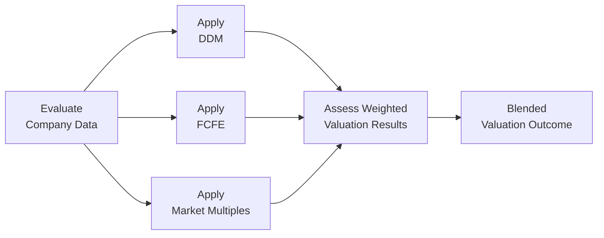

## Introduction and Overview

Equity valuation isn’t always a neat, one-size-fits-all process. Honestly, I remember being super confused the first time I tried mixing different valuation methods. We learn the Dividend Discount Model (DDM) as a “go-to” for dividend-paying stocks, but plenty of companies reinvest heavily and barely pay any dividends—so that approach alone can feel incomplete. Then there’s Free Cash Flow to Equity (FCFE), which is great for capturing the underlying operating strength of a firm, but might struggle if net borrowing or capital structure changes are expected to be erratic. And of course, the market-based multiples approach (like comparing P/E or EV/EBITDA) can be a quick reality check—provided you don’t overlook the possibility that all your comps might be collectively overvalued, or that current market sentiment is too euphoric or too negative.

In practice, combining DDM, FCFE, and multiples can help you build a more complete story. Each method captures a different angle: DDM focuses on shareholder distributions, FCFE on the cash actually available to equity holders, and multiples on how the market is pricing similar companies. In this section, we’ll talk about how to integrate all three approaches so you can walk away with a holistic value estimate. We’ll include formulas, diagrams, and real-world examples to give you a sense of how these methods look in tandem.

## DDM Refresher and Practical Considerations

### DDM Basics

The Dividend Discount Model is grounded in the idea that stock value is the present value of all future dividends. After all, dividends are (theoretically) the ultimate cash return to shareholders over time. If a company maintains a stable dividend or follows a predictable growth path, DDM is relatively straightforward.

In KaTeX notation, the classic DDM formula for a single-stage constant growth scenario (the Gordon Growth Model) is:


P_0 = \frac{D_1}{r - g}


Where:  
• \\(P_0\\) is the current value (price) of the stock  
• \\(D_1\\) is next year’s expected dividend  
• \\(r\\) is the required rate of return (cost of equity)  
• \\(g\\) is the constant growth rate of dividends  

When you see me writing \\((r - g)\\), it’s basically the difference between your required return and your expected growth. That gap can be slim if the firm’s growth is vigorous or your required return is too low. If \\(g\\) gets close to \\(r\\), the price can blow up unnervingly high, or you might find yourself in a non-sensical situation if you assume growth is forever.

### DDM Caveats

• Dividend Policy Inconsistencies: If a firm changes its payout ratio or issues special dividends sporadically, the classic constant-growth approach quickly becomes less reliable.  
• Non-Dividend-Paying Firms: DDM obviously struggles if the company doesn't pay dividends.  
• Timing and Growth: Growth rates often shift over time; a multi-stage model might be necessary.  

Sometimes, I see folks trying to use DDM on a high-tech start-up that might not pay a dividend for the next decade—DDM-based valuations might be near zero or very uncertain. That’s not exactly helpful.

## FCFE Refresher and Key Insights

### FCFE Basics

Free Cash Flow to Equity (FCFE) is the cash flow remaining after you subtract necessary operating costs, capital expenditures, and net debt payments. It’s effectively the cash that could be distributed to shareholders if the company wanted to. Analysts love using FCFE models when dividends aren’t reliable or when they want a better sense of the company’s true “internal” cash generation.

In KaTeX form, a simplified single-stage version looks like:


P_0 = \frac{FCFE_1}{r - g}


Where:  
• \\(FCFE_1\\) is the free cash flow to equity projected for next year  
• \\(r\\) is the cost of equity  
• \\(g\\) is the long-term FCFE growth rate  

Of course, you generally do a forecast for, say, five to ten years and then include a terminal value. So for a multi-stage FCFE approach:


P_0 = \sum_{t=1}^{n} \frac{FCFE_t}{(1+r)^t} + \frac{Terminal\ Value}{(1+r)^n}


### FCFE Caveats

• Forecasting Difficulties: Predicting capital expenditures, changes in working capital, and net borrowing can get complicated.  
• Capital Structure Changes: If the firm changes debt levels drastically, future FCFE analysis might need more care.  
• Negative FCFE: Younger or heavily leveraged companies might show negative FCFE at first, complicating your analysis.  

Nonetheless, FCFE can be a more comprehensive measure for capturing the financial health of firms that do not consistently return cash via dividends.  

## Market Multiples and Peer Comparisons

### Why Multiples Matter

Sometimes, I’ll start with multiples for a quick sanity check. Suppose we have a tech firm that’s grown faster than its peers, but it trades well below the average P/E ratio of the sector. This might indicate a potential undervaluation—unless, of course, the market is discounting the stock for some very valid reason like lawsuits or an unreliable R&D pipeline.  

Commonly used multiples:  

• Price to Earnings (P/E)  
• Price to Book (P/B)  
• EV/EBITDA  
• Price to Sales (P/S)  

By comparing a firm’s multiples to those of peers, we get a sense of how the market is pricing similar companies. The next step is to figure out if the difference is justified or not.

### Major Risks of Multiples

• Hard to Find True Comps: In reality, no two companies are exactly the same.  
• Sector Cycles: If the entire sector is peakishly overvalued, relative valuation might not protect you from a correction.  
• Accounting Differences: Even something as simple as different depreciation methods can skew P/E or EV/EBITDA comparisons.  

Still, multiples remain an essential piece of the puzzle. They can quickly highlight whether your DDM or FCFE assumptions seem grossly out of line with market sentiment.

## Why Blend All Three?

A single model can be misleading, especially in evolving markets or for companies undergoing big changes. Combining DDM, FCFE, and multiples allows you to see if your final valuations converge or diverge. If your DDM is telling you the stock is worth \$100, but your FCFE approach says \$60, you’d better figure out where the discrepancy lies. Maybe you assumed a certain dividend growth rate that’s unrealistic, or maybe you’re missing some nasty capital expenditure.

A blended valuation gives you an opportunity to:

• Cross-check assumptions.  
• Account for different payout policies.  
• Temper the extremes of market sentiment.  

Below is a simple flowchart to illustrate how these valuation methods can feed into a final blended approach:

## Creating a Weighted or Blended Valuation

### Assigning Weights

Let’s say you’re in a stable industry—utilities, for instance—and the company pays a predictable dividend. You might assign a higher weight to DDM (like 40%), with a decent portion to FCFE (40%) and a small portion to multiples (20%). Alternatively, for a growth-oriented firm that reinvests a lot, you might do something like 20% on DDM, 50% on FCFE, and 30% on multiples.

Think about:  
• Reliability of dividends.  
• Historical and forecasted patterns of capital expenditures.  
• Where the industry is in its life cycle (growth vs. mature).  
• Relevance of market comps (are there good comparables?).  

### Consistency of Discount Rates and Growth

If you’re using CAPM to derive \\(r\\), ensure that your cost of equity in DDM is consistent with the discount rate in FCFE. A mismatch there can artificially inflate or depress one valuation relative to the other. Also, keep your long-term growth assumptions logically aligned. For example, if your DDM assumes a 5% constant dividend growth after Year 5, your FCFE approach should be consistent about that same horizon and growth rate, unless there is a clear reason for the discrepancy.

### Step-by-Step Example (Hypothetical)

Let’s illustrate a very simplified scenario. Suppose:

• Next year’s dividend (\\(D_1\\)): \$2.50  
• Expected dividend growth: 4%  
• Cost of Equity (\\(r\\)): 9%  
• Next year’s FCFE projection (\\(FCFE_1\\)): \$3.00  
• Long-term FCFE growth: 4% as well  
• Comparable P/E for peer group: 15x  
• Company’s expected Earnings Per Share next year: \$4.00  

1) DDM Valuation  

P_{DDM} = \frac{2.50}{(0.09 - 0.04)} = \frac{2.50}{0.05} = 50


2) FCFE Valuation  

P_{FCFE} = \frac{3.00}{(0.09 - 0.04)} = \frac{3.00}{0.05} = 60


3) Multiple Valuation  
If the peer P/E is 15x and the company’s EPS is \$4.00, a rough indicated price could be:  

P_{Multiple} = 15 \times 4.00 = 60


So you get three estimates: \$50 (DDM), \$60 (FCFE), and \$60 (P/E multiple approach). Already, we see that FCFE and the multiples approach match, while the DDM number is a bit lower—maybe because the specified dividend is a bit conservative relative to the firm’s forecasted free cash flow.  

If we decided to weight them equally (just for demonstration), the final blended valuation would be:


P_{Blended} = \frac{50 + 60 + 60}{3} = 56.67


But in reality, we’d do a deeper analysis of the company, maybe decide the FCFE approach is the most reliable, and assign it a larger weight.  

## Practical Pitfalls

• Overconfident Growth Assumptions: If your growth forecasts border on “unreasonable optimism,” your valuations will be too high in both DDM and FCFE.  
• Industry Bubbles: Market multiples can reflect industry hype or gloom.  
• Mismatched Data: Double-check consistency between dividend projections, free cash flow forecasts, and earnings multiples.  
• Ignoring Capital Structure Changes: If the firm’s debt ratio is about to skyrocket or plummet, that’s going to alter net borrowing and your FCFE assumptions.  

## Exam Tips and Real-World Application

CFA exam questions love to throw scenarios at you—a company that just changed its dividend policy, or a cyclical firm with unpredictable free cash flow, or a set of peer multiples that seem suspiciously high. The key is to identify which method is most applicable and to reconcile differences:

• Watch for contradictory growth rates.  
• Keep your discount rates consistent across DDM and FCFE.  
• Use multiples as a sanity check but confirm that your comps are appropriate.  
• Make sure you highlight any special situations, like share repurchases or spin-offs, because these can alter both dividend patterns and FCFE projections.

On exam day, you might have an item set that shows a partial valuation calculation using DDM, another using a free cash flow approach, and some comps data. The question could ask for the best estimate of intrinsic value. You’ll need to weigh each approach’s strengths and weaknesses in the given context.  

In my own practice, I typically do all three (DDM, FCFE, and some multiple-based approach) for any company that’s not obviously disqualified from one of them (e.g., no reason to do DDM on a zero-dividend firm). Then, if I see a big discrepancy, I explore each assumption carefully. That’s what helps me catch potential errors or irrational market moods.

## References and Further Reading

• CFA Institute Official Curriculum Readings on Equity Valuation  
• Damodaran, A. (n.d.). “Equity Valuation” resources: [http://pages.stern.nyu.edu/~adamodar/](http://pages.stern.nyu.edu/~adamodar/)  
• Pinto, J. E. et al. “Equity Asset Valuation,” CFA Institute Investment Series  
• Koller, T., Goedhart, M., & Wessels, D. “Valuation: Measuring and Managing the Value of Companies,” McKinsey & Company  

Anyway, that’s the gist. Combining DDM, FCFE, and multiples can give you a more stable, holistic perspective—like triple-checking your flight plan before takeoff. Embrace the differences in each method; they’re there for a reason.

## Practice Questions on Combining DDM, FCFE, and Multiples



### In a single-stage Dividend Discount Model (DDM), which variable combination directly determines the intrinsic value of the firm's equity?

- [ ] Next year's earnings, cost of equity, and operating margin
- [x] Next year's dividend, required rate of return, and dividend growth rate
- [ ] Weighted Average Cost of Capital (WACC), next year's dividends, and terminal growth rate
- [ ] Free cash flow to equity, market risk premium, and growth rate of net income

> **Explanation:** The classic DDM for a perpetual growth scenario is P₀ = D₁ / (r − g). The critical inputs are next year’s dividend (D₁), the required rate of return (r), and the dividend growth rate (g).

### A retail company pays no dividends but has significant cash flow. Which valuation approach is generally the most suitable primary method?

- [ ] A traditional single-stage DDM
- [ ] Market multiples based on dividend yield
- [x] A multi-stage FCFE approach
- [ ] Price-to-Earnings ratio only

> **Explanation:** If the company pays no dividends, a DDM approach becomes less practical. FCFE measures the actual cash flows available to equity owners, making it ideal for non-dividend-paying firms.

### Which of the following is a key reason to include market multiples in a blended valuation approach?

- [ ] They eliminate the need for assumptions about growth or discount rates.
- [x] They serve as a reality check against firm-specific cash flow projections.
- [ ] They are always more accurate than DDM or FCFE.
- [ ] They avoid issues with capital structure altogether.

> **Explanation:** Market multiples (like P/E or EV/EBITDA) can quickly help validate or question the results from DDM or FCFE. If comps are priced at a drastically different level, that discrepancy presents a prompt for deeper investigation.

### Suppose your DDM calculation produces a significantly higher stock value than your FCFE valuation. Which of the following is the most likely underlying cause?

- [ ] You used different discount rate bases in DDM vs. FCFE.
- [ ] You have an excessively high net borrowing assumption in FCFE.
- [ ] The firm’s dividend payout ratio is zero.
- [x] Either the payout growth assumptions in DDM or the capital expenditures in FCFE need closer scrutiny.

> **Explanation:** When DDM and FCFE diverge considerably, it often signals inconsistent assumptions (e.g., overly generous dividend growth or understated capital expenditures). Double-check your forecasts in both models.

### An analyst decides to weight DDM at 25%, FCFE at 50%, and a P/E multiple approach at 25% for a high-growth tech company. Which factor most likely prompted the larger weight on FCFE?

- [ ] Stable dividend history
- [ ] Consistently high net profit margin
- [x] Significant reinvestment needs and minimal dividend payouts
- [ ] Current market sentiment around tech IPOs

> **Explanation:** High-growth tech firms typically reinvest earnings rather than paying large dividends. FCFE often provides a better sense of long-term earnings power and capital structure effects.

### When blending multiple valuation methods, which of the following is considered a best practice?

- [ ] Using different discount rates for DDM and FCFE to capture model diversity
- [ ] Applying multiples from unrelated industries to counterbalance biases
- [x] Ensuring consistent assumptions for growth and discount rates across all models
- [ ] Ignoring the terminal value in the FCFE approach to avoid double counting

> **Explanation:** Consistency in discount rates and key assumptions is critical to avoid artificially inflating or deflating one model’s output compared to another.

### Which is the greatest drawback of market-based valuations for a cyclical industry at its peak?

- [ ] Potentially higher intangible asset valuation
- [x] Overstated valuations due to peak cycle earnings across comparable firms
- [ ] Understated valuations because cyclical peaks adjust the cost of equity
- [ ] Inconsistent pricing of intangible assets across industries

> **Explanation:** During cyclical peaks, industry-wide earnings may look artificially strong, leading to inflated multiples. This can cause valuations to spike and risk a future correction.

### In constructing a multi-stage FCFE model, which of the following metrics is LEAST critical to forecast accurately?

- [ ] Projected depreciation expenses
- [ ] Net capital expenditures
- [ ] Changes in net borrowing
- [x] Annual dividend rate

> **Explanation:** While dividend data is central to DDM, FCFE focuses on the cash flows available to equity, which hinge on reinvestment (capex, working capital) and financing decisions (net borrowing), not necessarily on actual dividend payouts.

### For a firm with a low but stable dividend and moderate capex, you obtain these valuation results: DDM = \$70, FCFE = \$76, and P/E multiple-based estimate = \$80. The analyst decides to weight them equally. Which final valuation is correct?

- [ ] \$70
- [x] \$75.33
- [ ] \$76
- [ ] \$80

> **Explanation:** The average of those three valuations is (70 + 76 + 80) / 3 = 75.33. Equal weighting is presumably chosen for simplicity, yielding the blended figure.

### True or False: In a blended valuation approach, the weighting assigned to each method should remain static across all types of firms.

- [ ] False
- [x] True

> **Explanation:** This is actually a tricky point. The statement suggests you should never alter weights, which generally doesn't make sense. In practice, the weighting of each method changes depending on the specific characteristics of the firm, industry, and data availability. Therefore, the correct statement is that the weighting should NOT remain static. This question’s statement is reversed. The correct approach is to dynamically adjust the weighting. (So the correct answer is that the statement is False, not True!)


