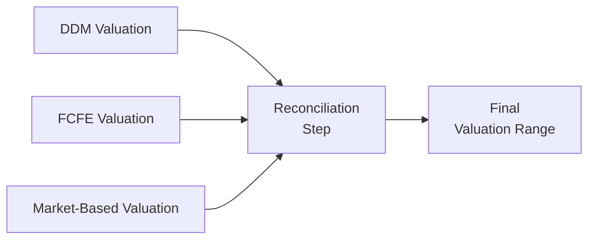

## Introduction to Valuation Reconciliation

Sometimes when evaluating a company, you might run a Dividend Discount Model (DDM), a Free Cash Flow to Equity (FCFE) projection, and a relative valuation using price multiples, and—boom—they each spit out drastically different price estimates. It’s almost like baking three different cakes using the same ingredients but ending up with three completely different flavors. You might react, “Um, did I input something incorrectly? Did I misread growth rates? Or maybe the market isn’t pricing these shares rationally at all...?”

Reconciling those differences is what this section is all about. Each valuation method offers a unique lens on a firm’s value. DDM looks at dividends as the direct reward to shareholders, FCFE captures the full spectrum of capital structure changes, and market-based approaches sniff out how the broader market views similar firms. But in reality, you rarely rely on just one approach. A single figure—even if meticulously calculated—could hide all sorts of questionable assumptions.

In practice (and, well, on the CFA exam too), reconciling valuations properly can help confirm whether your analysis is consistent, highlight potential errors, and clarify how qualitative factors might influence the final result. This section offers ideas about weighting approaches, scenario analysis, and reasons why big discrepancies sometimes happen. We’ll also discuss how to communicate your findings to stakeholders—or the exam graders—in a way that doesn’t make you sound indecisive but instead shows thorough analysis coupled with confidence.

## The Essence of Each Valuation Method

Before merging numbers from different models, it helps to revisit the main strengths and weaknesses of each. This quick review ensures you remember what “flavor” each approach brings to the table.

DDM Focus
• A deep dive on dividends as the direct form of investor rewards.  
• Best for firms that pay stable, predictable dividends (e.g., mature utilities, stable consumer staples).  
• Often yields a lower or inconclusive valuation if the firm’s distribution policy is erratic or minimal.

FCFE in a Nutshell
• Considers cash flows left for equity holders after operational costs, capital expenditures, and debt servicing.  
• Helpful when capital structures shift over time (e.g., large debt paydowns or expansions).  
• More sensitive to assumptions around working capital, net borrowing, and growth plans.

Market-Based Approaches
• Reflect sentiment around industry comparables via multiples (P/E, P/B, EV/EBITDA, etc.).  
• Dependent on peer-group selection, which can be tricky if your firm is unique or has unpredictable business segments.  
• Captures how other investors are “currently” pricing the sector, but does not always incorporate a firm’s long-term fundamental story, especially if markets are euphoric or panicked.

When each produces its own number, the challenge is to see how and why they might converge—or not.

## Common Reasons for Discrepancies

If you ever notice your DDM analysis suggests a stock is worth USD 25 per share while your FCFE calculation yields USD 52, it’s natural to wonder if the difference arises from:

• Overly optimistic or conservative growth assumptions in the DDM.  
• Potential leverage changes or heavy capital expenditures that your FCFE model captured.  
• A broad peer set or mis-chosen comparables in a relative valuation.  
• The firm’s intangible assets, brand value, or synergy potential that’s simply not reflected in a purely quantitative approach.  
• Different discount rates: maybe you used CAPM for one method and a build-up approach for another, leading to inconsistencies.

When large gaps appear, it’s a sign to roll up your sleeves and start investigating. That “sanity check” is precisely why the CFA curriculum encourages you to double- or triple-check your valuation from multiple angles.

## Approaches to Reconcile Valuation Estimates

### Average or Weighted Outcomes

One of the simplest ways to reconcile valuations is to assign a weight to each approach and compute a weighted average:

(Valuation_Reconciled) = w₁ × Valuation₁ + w₂ × Valuation₂ + w₃ × Valuation₃

Where:
• Valuation₁, Valuation₂, Valuation₃ represent, for instance, DDM, FCFE, and a market multiple, respectively.  
• w₁, w₂, w₃ are weights that sum to 1.  
• The sum yields a single figure, hopefully bridging the gap between the approaches.

It’s not uncommon, for example, to weigh the FCFE model more heavily if a firm has a dynamic capital structure, especially if new debt or equity issuance is a big part of the near future. On the other hand, if the company is known for rock-solid dividend payouts, analysts sometimes tilt the scale toward DDM. Meanwhile, you might factor in a market multiple if the firm’s sector is heavily influenced by cyclical or sentiment-driven comparables.

In terms of weighting, let’s say you feel DDM is a bit less reliable (25% weight) if the company’s dividend policy is in flux, FCFE is the main method (50% weight), and you still believe the sector’s P/E ratio provides valuable insight (25% weight). That’s how you might apportion your weighting scheme.

### Scenario-Based Reconciliation

Another strategy you’ll likely see on the exam or in real practice is scenario-based analysis. Instead of forcibly combining all three valuations into a single number, you look at how each method might behave under different environments:

Base Case  
• “Most likely” scenario where the company meets consensus earnings, invests moderately, and the industry remains stable.  

Bull Case  
• “Optimistic” scenario factoring in strong macroeconomic growth, possible synergy from a new acquisition, and a bit of multiple expansion.  

Bear Case  
• “Pessimistic” scenario reflective of economic stagnation, higher interest rates bumping up discount rates, and reduced growth.

In each scenario, you might compute DDM, FCFE, and market-based valuations. Perhaps in the Bear Case, DDM might plummet if dividends get cut, but the FCFE model doesn’t drop quite as far if the company still manages free cash flows. Then you see how each method reacts to the scenario’s assumptions. Reconciling them might involve selecting a scenario that’s your best guess for how reality unfolds and then giving the final figure from that scenario the most weight.

### Adjusting for Outliers

Sometimes the best approach to reconciliation is simply to fix or remove weird outliers. If your DDM requires a stable growth rate for 10 years but you inadvertently typed in 25% forever, your final figure might be astronomically high. Or maybe the peer group for your market-based approach isn’t actually comparable—someone added Tesla as a “peer” to an industrial manufacturer. Yeah, that’s probably not apples to apples.

Outlier adjustments demand a second look at assumptions:
• Growth rates.  
• Discount rates.  
• Peer group composition.  
• Non-recurring or extraordinary items in historical financials.  

Tweaking or removing extreme assumptions can push your valuations closer together—a good sign that your models are now more realistic.

### Qualitative Overlays

Numbers are fantastic, as they form the backbone of finance, but let’s be honest: intangible factors frequently drive valuations. This is especially true for technology or consumer brands with intangible assets, or for companies led by an iconic CEO. Good corporate governance, strong brand recognition, or competitive advantages (like highly differentiated products) might lead you to ratchet up the final valuation. In more dire circumstances—like management’s track record is questionable, or a significant legal/regulatory risk hangs overhead—some analysts apply a discount to the final figure.

Qualitative overlays can partially explain why your DDM or FCFE result lags the actual market price: maybe the market is giving that intangible factor a higher premium. These intangible or “management quality” bonuses don’t show up neatly in a spreadsheet cell. So if you see a big discrepancy, it’s worth asking yourself: Is there a strategic or intangible factor that explains the market’s more enthusiastic (or pessimistic) pricing?

## Visualizing Valuation Reconciliation

Below is a simple Mermaid diagram to illustrate the reconciliation process. You can imagine feeding in each valuation method—DDM, FCFE, and Market-based—into a single node that produces a final reconciled valuation range.

This range might come from weights, scenarios, or an overlay of qualitative judgment. The point is that you’re combining inputs with a clear set of rules or rationale.

## A Short Case Example

Let’s say we have “Farrell Foods,” a midsize consumer staples business. You run a DDM with a constant growth of 3% per year and a required return on equity of 8%. You get an intrinsic value of USD 40 per share. Then you do an FCFE analysis that accounts for management’s plan to reduce debt, and you get USD 48. Meanwhile, forward P/E multiples for comparable consumer staples imply a price of around USD 45.

An immediate question arises: Why does the DDM lag the FCFE? Possibly because the company’s dividend policy is so conservative that it doesn’t fully capture the future free cash flows that can be directed to equity holders post-deleveraging. Meanwhile, the market-based approach lands in between those numbers, likely because the comparables have moderate dividend yields but also stable, consistent earnings.

Ultimately, you might weight your final valuation 50% on FCFE, 25% on DDM, and 25% on the market multiple, giving you:

Final Value = (0.50 × 48) + (0.25 × 40) + (0.25 × 45) = 12 + 10 + 11.25 = USD 33.25?

Wait—that’s not correct. Let’s actually do the math carefully:

• 0.50 × 48 = 24  
• 0.25 × 40 = 10  
• 0.25 × 45 = 11.25  

So the final is 24 + 10 + 11.25 = 45.25. (That’s a mini example of a time you might do a quick “sanity check” on your own arithmetic.)

By reconciling them in this manner, you end up with USD 45.25. You might still do a quick “rounded figure” for your final recommended range, stating “Our valuation range is USD 44–46, with a midpoint of approximately USD 45.”

## Communicating the Final Valuation Range

Giving a single point estimate might feel more concrete, but it can also lull stakeholders (or exam graders) into believing it’s an exact science. However, anyone who’s done equity valuations for a while knows it’s more of an art-science fusion.

It’s typically wise to present both the point estimate and a range:
• “Based on these methods (DDM, FCFE, and relative valuation), we arrive at a final point estimate of USD 45 per share, which lies within a reasonable range of USD 42–48.”  
• You might mention relevant catalysts that could push the price to the high or low end of that range.

When exam graders see that you understand the “why” behind each approach and that you can logically unify them, it signals strong command of the material.

## Exam Tips and Common Pitfalls

• Consistency in Inputs: Make sure discount rates, growth assumptions, or terminal values are consistent across models, unless you have a specific reason not to.  
• Peer Group Quality: If you’re using market multiples, pick peers with similar capital structures, margins, and growth prospects. Not just big names with high P/Es that skew your results.  
• Overly Optimistic Growth: A model that compounds 15% growth “forever” can produce unrealistic valuations.  
• Communication Clarity: On the exam, show your step-by-step logic—especially for weighting or scenario-based approaches.  
• Qualitative Matters: Don’t forget to mention brand strength or corporate governance if they’re relevant. If you skip this, but your answer is drastically different from the market price, it might look incomplete.

## Ethical and Professional Standards

When reconciling valuation approaches, you’re required by the CFA Institute Code of Ethics and Standards of Professional Conduct to:
• Be transparent with assumptions and material facts.  
• Distinguish between fact and opinion.  
• Avoid cherry-picking data to artificially support a predetermined conclusion.  
• Clearly communicate limitations or uncertainties in your model.

Always keep in mind that honest, thorough reconciliation is about presenting the most accurate valuation possible, backed by reason, not about rationalizing a preconceived notion of what you’d like the value to be.

## Final Thoughts

Reconciling different valuation approaches is as much about critical thinking as it is about number crunching. Sometimes you find that your DDM, FCFE, and market-based valuations lie fairly close together, suggesting a strong sense of alignment. Other times, the numbers are all over the map because the firm or its environment is shifting rapidly—think about huge changes in consumer behavior, new technologies, or giant macroeconomic swings. That’s usually when you lean more heavily on scenario analysis and qualitative overlays.

Stay curious, be transparent in your communication, and remember that a well-reconciled valuation is often a hallmark of thorough, professional analysis. And if your reconciliation leads you to a drastically different figure than the current market price, that might be your thesis for why the stock is mispriced—just be sure you can back it up!

## References for Further Exploration

• CFA Institute Level II curriculum on reconciling valuation methods  
• Damodaran, A. “Investment Valuation: Tools and Techniques for Determining the Value of Any Asset.”  
• International Valuation Standards Council (IVSC) – Guidance on valuation best practices  
• Official CFA Institute Code of Ethics and Standards of Professional Conduct  

---

## Test Your Knowledge: Reconciling DDM, FCFE, and Market-Based Valuations



### Which statement best describes a key benefit of reconciling different valuation approaches?

- [ ] It removes the need for scenario analysis.  
- [x] It identifies questionable assumptions and provides a check on consistency.  
- [ ] It guarantees the output will match the current market price.  
- [ ] It ensures dividend growth models are always prioritized.  

> **Explanation:** Reconciling multiple valuation approaches highlights inconsistencies in assumptions. It also guards against relying too heavily on a single, possibly flawed method.  

### An analyst notices that her DDM-based valuation is significantly lower than her FCFE-based valuation for the same stock. What might be a primary reason for this discrepancy?

- [ ] The dividend yield is unusually high.  
- [x] The company’s capital structure is changing, and significant free cash flow is not being paid out as dividends.  
- [ ] She used a higher discount rate in the DDM.  
- [ ] She used a smaller peer group in her FCFE model.  

> **Explanation:** FCFE considers all free cash flow available to equity holders, not just the portion paid out as dividends. A firm can generate significant cash flows yet choose to pay limited dividends.  

### In a scenario-based reconciliation approach, which of the following is least likely to happen in a bear-case scenario?

- [ ] Projected dividend growth might be reduced.  
- [ ] Credit spreads could widen, increasing the cost of capital.  
- [x] Terminal value assumptions will necessarily increase.  
- [ ] Valuations from each model would typically be lower than in the base case.  

> **Explanation:** In a bear-case scenario, terminal values generally decrease, especially when growth outlooks and required rates of return shift adversely. So it’s least likely that terminal values necessarily increase.  

### What is one potential drawback of assigning simple equal weights to DDM, FCFE, and market-based valuations?

- [ ] It requires recalculation of the discount rate in each model.  
- [ ] It ensures a consistent share price outcome.  
- [x] It may ignore the fact that some methods are more appropriate than others for the specific firm.  
- [ ] It only applies to cyclical companies.  

> **Explanation:** Equal weighting can be too simplistic. One method might better capture the firm’s fundamental realities, so it could warrant greater weight.  

### When analysts talk about a “qualitative overlay” in reconciliation, what are they typically referring to?

- [ ] A quantitative adjustment to the hurdle rate.  
- [ ] Eliminating extreme outliers in the data.  
- [ ] Dividend smoothing in every scenario.  
- [x] Adjustments for intangible factors like management quality and brand strength.  

> **Explanation:** Qualitative overlays help incorporate intangible elements (e.g., brand, corporate culture, governance) that models alone might miss.  

### If an analyst’s market-based valuation suggests a price of USD 58 per share while her DDM and FCFE models both indicate USD 40–42, which of the following is the most appropriate next step?

- [ ] Conclude that the market-based valuation is clearly wrong.  
- [x] Investigate differences in assumptions, peer-group selection, and possible market sentiment issues.  
- [ ] Immediately finalize USD 58 as the official valuation.  
- [ ] Adjust the DDM model to match the market-based result.  

> **Explanation:** Discrepancies should prompt deeper investigation into possible errors, assumptions, or unique market dynamics before finalizing a reconciled figure.  

### Which factor is most likely to be ignored in a purely quantitative approach to valuation?

- [ ] Capital structure changes projected in the future.  
- [ ] The firm’s historical earnings growth rate.  
- [ ] The risk-free rate used in CAPM.  
- [x] The firm’s reputation and strategic brand positioning.  

> **Explanation:** Quantitative models often struggle to incorporate intangible aspects like brand reputation or a pioneering CEO’s leadership.  

### An analyst believes her DDM model’s growth assumption might be inflating the final result. Which reconciliation technique would help uncover this issue?

- [x] Scenario-based reconciliation, applying different growth assumptions to see the sensitivity of the valuation.  
- [ ] Removing the discount rate altogether.  
- [ ] Adopting a single-stage FCFE model.  
- [ ] Picking a new peer group of growth stocks.  

> **Explanation:** Scenario-based reconciliation would let her tweak the growth assumption and see how the model’s valuation changes, revealing if the assumption is too aggressive.  

### Why might the FCFE approach be particularly useful for a firm undergoing major debt restructuring?

- [ ] Dividends are guaranteed to remain unchanged.  
- [x] FCFE captures changing debt servicing requirements and net borrowing.  
- [ ] Market sentiment is irrelevant.  
- [ ] The approach uses a fixed P/E ratio for the next decade.  

> **Explanation:** Because FCFE fully accounts for interest and principal payments, it’s more sensitive to changes in leverage—and hence ideal for analyzing firms making big shifts in capital structure.  

### True or False: Presenting a point estimate for a reconciled valuation is always more transparent than presenting a valuation range.

- [ ] False  
- [x] True  

> **Explanation:** While a point estimate can be clear, a range is often more transparent about the inherent uncertainties in any valuation model. Balancing the two (point estimate plus range) can be an even better practice.  


