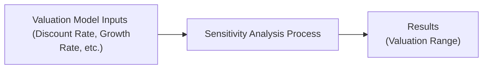

## Overview and Motivation

Picture this: You’re halfway through building a detailed free cash flow (FCF) valuation model—discount rates checked, growth assumptions in place, competitive position assessed. You feel pretty confident, right? But then someone asks, “What happens if interest rates spike?” or “What if your company’s new product launch is delayed?” Suddenly, your meticulously crafted single-point estimate seems, well, kind of fragile. This is where sensitivity and scenario analyses come to the rescue. They help you figure out how your valuation reacts if a few (or a lot) of your assumptions shift in unexpected ways.

Here, we’ll dive deep into practical sensitivity analysis—where you vary one input at a time—and scenario analysis—where multiple inputs can change simultaneously. We’ll see how these tools make your final recommendation more robust and help you better communicate risk. This practice becomes especially critical when markets are volatile, or if you’re dealing with industries prone to regulatory or technological upheavals (and, let’s be honest, these days which industry isn’t in some form of upheaval?). 

## Sensitivity Analysis: One Variable at a Time

Sometimes, you set out with the best assumptions—maybe you’d say, “Our cost of equity is 10%,” “Our perpetual growth is 3%,” or “We expect free cash flow margins to improve by 150 basis points per year.” Then you realize that each of these drivers can move around in the real world. Sensitivity analysis helps you see just how badly your valuation can be thrown off if you’re even a little bit wrong.

### Why Bother with Sensitivity Analysis?

• Prioritizing Key Assumptions: By focusing on one variable at a time, you can discover which assumptions carry the biggest punch in shifting your final valuation output. If a 1% change in growth rate affects your valuation more than a 2% shift in your discount rate, you know which assumption matters the most.  
• Identifying Tipping Points: Sensitivity analysis can reveal thresholds where a stock flips from undervalued to overvalued. It’s kind of like discovering the “pain points” in your model.   
• Communicating Risk: If you’re presenting to a client or to your portfolio manager, you can quickly highlight that “Hey, we’re good as long as our cost of equity remains below 12%. If it hits 13%, the recommendation changes entirely.”

### Building a Sensitivity Table

A common way to show your results is in a two-dimensional table. Let’s say you want to stress-test your valuation by changing both the discount rate (r) and the perpetual growth rate (g). Even though sensitivity analysis traditionally focuses on one variable at a time, it’s very typical in practice to build a grid for two critical inputs. Something like this:

|            | g = 2%  | g = 3%  | g = 4%  |
|------------|--------:|--------:|--------:|
| r = 10%    | $42.00  | $48.50  | $55.70  |
| r = 11%    | $37.20  | $42.50  | $48.00  |
| r = 12%    | $33.10  | $37.30  | $41.60  |

• Cells: Each cell displays the modeled value of the company (per share, in this example) under a particular combination of inputs.  
• Quick Interpretation: The table basically signals that if your discount rate creeps up to 12% and your growth estimate slides to 2%, you might see a valuation around $33.10—significantly below the $42–$48 range that might look appealing in more optimistic conditions.

### Spider Charts

Some folks prefer a visual approach. A spider chart (also called a tornado chart or a sensitivity graph in some contexts) shows the impact of varying a single input across multiple possible values—like discount rate from 8% to 14% in increments of 1%—and plots the resulting valuation or IRR. While mermaid.js doesn’t directly produce a conventional radar spider chart, we can illustrate the logical flow of how a single variable fans out in a chart:

• Interpretation: Sensitivity analysis goes from your initial set of model inputs to a dedicated analysis process, then outputs a valuation range. Each input tested forms a separate “spoke” on a conceptual spider chart.  

### Best Practices for Sensitivity Analysis

• Pick the Right Variables: Typically, these are your discount rate, growth rates, terminal multiples, or operating margin assumptions.  
• Don’t Overcomplicate: Start small, with the most critical variables—too many inputs can confuse your final read.  
• Document Everything: Keep track of the ranges you tested and why. This helps you defend your assumptions to colleagues or clients later on.  
• Revisit Frequently: If markets move (and they do), your cost of equity or risk-free rate might shift, so come back and re-check.

## Scenario Analysis: Multiple Variables, Multiple Narratives

Whereas sensitivity analysis is kind of like a magnifying glass, scenario analysis is a full-blown “choose your own adventure.” Instead of tweaking one variable at a time, you create entire future “worlds” with multiple shifting factors. For example:

• Base Case: Cost of equity at 10%, stable 3% long-term growth, moderate inflation, stable commodity prices.  
• Best Case: A robust economic cycle, inflation under control, cost of equity maybe 9%, a huge surge in product popularity.  
• Worst Case: Recession, cost of equity rises to 12%, or the new product launch flops, and margins shrink.

### Constructing a Three-Scenario Approach

A classic method includes at least three scenarios:  
1. **Base Case:** Your “most likely” scenario, often pegged to known guidance or consensus estimates.  
2. **Upside/Best Case:** A scenario that accounts for unexpectedly great events—maybe a competitor going out of business or a huge jump in operating efficiency.  
3. **Downside/Worst Case:** A scenario that captures the gloomier possibilities—maybe a global recession or a big jump in the cost of raw materials.

Let’s walk through an example. Suppose you’re analyzing a gadget manufacturer that’s about to launch a new type of tech widget.

| Scenario  | Discount Rate | Long-Term Growth | EBITDA Margin | Valuation ($/share) |
|-----------|--------------|------------------|--------------|---------------------|
| Worst     | 12%          | 2%               | 15%          | 28.00               |
| Base      | 10%          | 3%               | 18%          | 42.50               |
| Best      | 9%           | 4%               | 20%          | 55.10               |

• Worst Case: Higher discount rate (hello rising interest rates), lower margin assumptions, and slower growth.  
• Best Case: Lower discount rate (perhaps the risk-free rate declined), more robust margins after successful cost-cutting, and faster growth from new products.  
• Base Case: Sits in between, ideally reflecting your best estimate.

### Weighting Your Scenarios

Sometimes you might assign probabilities. For instance, you could say: 20% chance of the Worst Case, 50% chance of the Base, and 30% chance of the Best. Then your expected value is:

Expected Value = 0.20 × 28.00 + 0.50 × 42.50 + 0.30 × 55.10 ≈ 41.83

That said, you may not always want to do a simple probability-weighted approach because real-world events aren’t always normal or symmetrical. But it’s a good starting point.

### Stress Testing and Extreme Scenarios

A specialized form of scenario analysis is “stress testing.” This technique comes up a lot in banking and CFO offices, but it’s also relevant to equity analysis when you want to see how your firm endures a meltdown scenario. Let’s say a global pandemic causes an abrupt drop in demand, or a regulatory clampdown knocks down margins by 10 percentage points overnight. Stress testing basically says: “Can we handle it? And if so, how bad does it get?” 

For the CFA exam context, showing that you’ve done stress testing helps demonstrate a thorough risk management perspective. It’s not just about being thorough academically; risk managers and institutional investors will also pay attention to your ability to foresee black swan events.

## Integrating Sensitivity and Scenario Analysis into Final Recommendations

Once you run these analyses, you’ve probably got a small library of data—tables, charts, maybe reams of supporting spreadsheets. How do you wrap it all up?

• Highlight the Most Relevant Outcomes: Management teams and clients might not want to see every single sensitivity table. Show them the summary or the highlights.  
• Evaluate the Risk-Reward Tradeoff: Maybe your base case suggests 20% upside from here, but your worst case suggests 30% downside. Is that acceptable to your fund’s mandate or your personal risk tolerance?  
• Consider Probability Distribution: If you see a range that’s heavily skewed to the downside, think about how that influences your final call—maybe you dial down your position size or wait for a better entry price.  
• Communications Matter: In a real-world setting, even if your investment looks attractive in your base case, you want to be able to say, “But if X goes wrong, we could see an immediate 15% drop in fair value.”

### A Quick Personal Anecdote
I remember my first time building a scenario analysis model. I was so excited about the “base case” potential that I neglected to properly consider how a raw materials spike would crush the company’s operating margins. The real world came along, commodity prices rose, and the company underperformed. That was a potent lesson in humility—and it reminded me that ignoring downside scenarios can really mess up your track record. Let’s just say my boss was not thrilled, but I learned quickly and (thankfully) turned that into a valuable experience on how to incorporate scenario analyses going forward.

## Practical Example Walkthrough

Let’s do a quick walk-through with simplified numbers to illustrate how you could set up a sensitivity and scenario analysis for an equity valuation:

1. **Establish Base Inputs:**
   - Discount Rate (r): 10%  
   - Perpetual Growth (g): 3%  
   - Free Cash Flow at Year 1 (FCF1): \$100 million  
   - Operating Margin: 20%

2. **Sensitivity Analysis on Discount Rate:**
   - Evaluate valuations at r = 9%, 10%, 11%.
   - Keep g = 3% constant for now.

   KaTeX formula for a single-stage FCF with perpetuity:
   
   \text{Value}_0 = \frac{\text{FCF}_1}{(r - g)}
   

   - At r = 9%:
     
     \text{Value}_0 = \frac{100}{0.09 - 0.03} = \frac{100}{0.06} = 1,666.67 \text{ (million)}
     
   - At r = 10%:
     
     \text{Value}_0 = \frac{100}{0.10 - 0.03} = \frac{100}{0.07} \approx 1,428.57 \text{ (million)}
     
   - At r = 11%:
     
     \text{Value}_0 = \frac{100}{0.11 - 0.03} = \frac{100}{0.08} = 1,250.00 \text{ (million)}
     

   These results show how even a small change in the discount rate can produce a wide swing in firm value.

3. **Scenario Analysis Combining Multiple Inputs:**
   - **Base Case:** r = 10%, g = 3%, Operating Margin = 20%.  
   - **Best Case:** r = 9%, g = 4%, Operating Margin = 22%.  
   - **Worst Case:** r = 12%, g = 2%, Operating Margin = 18%.

   We incorporate the margin differences by adjusting FCF1 accordingly:  
   - Base FCF1 = \$100 million.  
   - Best Case FCF1 might be \$110 million (because of higher margins).  
   - Worst Case FCF1 might be \$90 million.

   Then, recalculate the valuations for each scenario. Summarize in a small table:

   | Scenario  | r    | g    | FCF1  | Valuation (million) |
   |-----------|------|------|-------|----------------------|
   | Worst     | 12%  | 2%   | 90    | ~1,000               |
   | Base      | 10%  | 3%   | 100   | ~1,429               |
   | Best      | 9%   | 4%   | 110   | ~1,833               |

4. **Interpretation and Decision:**
   - If the stock’s current market cap is \$1,300 million, you see that the base case suggests roughly 10%–11% upside. The worst case is below market price (1,000 vs. 1,300), indicating about a 23% downside. The best case suggests a large upside to 1,833 (about 41% upside). 
   - This distribution might be acceptable if you believe the best case is more likely than the worst, or if your firm has enough diversification to bear the downside risk.

## Common Pitfalls

• Over-Optimism on Growth Rates: It’s tempting to model unstoppable growth. One quick reality check: look at how often real-world growth rates sag below “optimistic projections.”  
• Inconsistent Macro Assumptions: If you’re adjusting interest rates for the best case, remember that might imply slightly different inflation or GDP growth assumptions. Avoid mismatched macro conditions.  
• Lack of Range: Some analysts pick arbitrarily narrow ranges—like discount rates of 9.8%, 10%, and 10.2%. That might not capture enough real-world variance.  
• Probability Overconfidence: Assigning 70% or 80% to a best-case scenario can be dangerous unless you truly have unique insights or an extremely stable environment.

## Exam Applications and Time Management

In a Level II (or even Level III) exam context, you might see scenario-based vignettes. Typically, they’ll give you a base-case valuation model and a few alternative assumptions to test. You might need to compute how the result changes when discount rates or margins are tweaked. Quick tip:  
• Practice Speed: Be able to do quick calculations on a financial calculator or in a short table.  
• Highlight Key Drivers: The exam might ask, “Which assumption has the largest impact on firm value?” or “Which scenario is the most sensitive to changes in discount rate?”

## Strategies to Overcome Common Challenges

• Document the “Why”: Every time you pick an input range—like discount rates from 9% to 12%—explain why you chose that range (historic market data, risk premium forecasts, or a typical industry range).  
• Combine Both Analyses: Show how the single-variable sensitivity results feed into broader scenario planning. This synergy offers a complete picture of risk.  
• Revisit and Update: Macroeconomic indicators change all the time. Stay updated on your risk-free rates, equity risk premiums, and growth forecasts.  
• Communicate in Plain Language: Honestly, many portfolio managers and stakeholders tune out if you get too deep into the math. Summarize your findings clearly: “Sensitivity analysis shows that even a 1% rise in the discount rate can lower value by 15%. That’s a real risk if interest rates spike.”  

## Concluding Thoughts

Sensitivity and scenario analyses might feel like extra steps—especially when you’re rushing to complete your valuation. But trust me: they’re worth it. Not only do they make you a more diligent analyst, but they also allow you to speak intelligently about risk. And in equity valuation, understanding risk is just as critical as identifying opportunity.

Whether you’re dealing with a steady-growth utility or a cutting-edge tech disruptor, these tools provide the nuance and humility that single-point estimates sometimes lack. They also set you up nicely for risk management discussions, whether for portfolio construction or for passing your next CFA exam item set. After all, being prepared for both the sunshine and the storms is the real hallmark of a strong analyst.

---

## References

- CFA Institute, Level II Curriculum on Advanced Sensitivity and Scenario Tools in Equity Valuation  
- Damodaran, A. (2018). “The Dark Side of Valuation.” New York: Stern School of Business  
- Federal Reserve (various). “Handbook of Financial Stress Testing” resources  
- Chapters on risk and uncertainty in earlier volumes of this CFA® 2025 text  

## Test Your Knowledge: Sensitivity and Scenario Analysis in Equity Valuation



### Which best describes the purpose of sensitivity analysis in equity valuation?

- [x] It tests how changes in a single variable affect the valuation outcome.
- [ ] It evaluates multiple variables across different future states.
- [ ] It determines the company’s solvency under extreme conditions.
- [ ] It focuses exclusively on interest-rate adjustments.

> **Explanation:** Sensitivity analysis involves adjusting one key variable at a time to see how it impacts the overall valuation. Scenario analysis is the approach for multiple variables.

### In a scenario analysis, which of the following is most likely to be considered part of a "worst case" scenario?

- [ ] Lower discount rates, higher margins, and higher economic growth
- [ ] Stable discount rates, stable margins, constant economic growth
- [x] Higher discount rates, lower profit margins, and weaker economic growth
- [ ] Moderate discount rates, only a slight variation in margins

> **Explanation:** Worst-case scenarios typically include more challenging conditions such as higher financing costs, lower profitability, and potential macroeconomic headwinds.

### What is the primary difference between scenario analysis and sensitivity analysis?

- [x] Scenario analysis involves changes to multiple variables; sensitivity analysis focuses on one at a time.
- [ ] Scenario analysis is based on historical data, while sensitivity analysis is forward-looking.
- [ ] Sensitivity analysis uses probabilities, while scenario analysis does not.
- [ ] Sensitivity analysis is used for stress testing, whereas scenario analysis is not.

> **Explanation:** Sensitivity analysis changes one variable at a time, while scenario analysis simultaneously adjusts multiple variables to depict different possible futures.

### An analyst assigns a 20% probability to a worst-case scenario with a share value of $28, a 50% probability to a base scenario with a share value of $42.50, and a 30% probability to a best-case scenario of $55.10. What is the expected share value?

- [x] $41.83
- [ ] $47.00
- [ ] $38.25
- [ ] $53.75

> **Explanation:** The expected value = (0.20 × 28) + (0.50 × 42.50) + (0.30 × 55.10) = 41.83.

### Which of these inputs is typically the most critical for sensitivity analysis in a DCF model?

- [x] Discount rate and growth rate
- [ ] Marketing expenditure
- [x] Terminal-year depreciation rate
- [ ] Accounts payable turnover

> **Explanation:** The discount rate and growth rate are often the most impactful for DCF valuations. (Note: Students sometimes choose operating margins or capital expenditures as second critical elements.)

### Stress testing in equity valuation focuses primarily on:

- [x] Determining valuation outcomes under severe adverse conditions.
- [ ] Finding the company’s exact break-even point on a single variable.
- [ ] Identifying day-to-day price fluctuations in the market.
- [ ] Managing short-term trading liquidity.

> **Explanation:** Stress testing models extreme situations to see how a company’s valuation holds up under severe pressure (e.g., economic crisis, major regulatory shift).

### Which statement best characterizes the role of scenario analysis in risk communication?

- [x] It helps demonstrate how different assumptions can lead to vastly different outcomes.
- [ ] It is executed only after the investment decision is finalized.
- [x] It eliminates uncertainty by specifying exact future events.
- [ ] It replaces the need for fundamental valuation entirely.

> **Explanation:** By quantifying how changes in multiple assumptions (e.g., macro environment, discount rates) can alter future results, scenario analysis highlights the uncertainties and potential outcomes.

### When you observe that a small change in profit margin produces a large swing in valuation, which concept are you seeing in action?

- [x] High sensitivity of the valuation to profit margin assumptions
- [ ] Low elasticity of valuation with respect to margins
- [ ] Diversification benefits
- [ ] External validity

> **Explanation:** If a small shift in the profit margin leads to a large change in value, that input is highly sensitive.

### How should an analyst typically handle assigning probabilities to best, base, and worst-case scenarios in a scenario analysis?

- [x] Use realistic probabilities based on research and not arbitrary guesses.
- [ ] Assign equal (33%) probabilities to all scenarios.
- [ ] Always assume the worst case happens most frequently.
- [ ] Assign the highest probability only to the best-case scenario.

> **Explanation:** Assigning probabilities should ideally be based on reasoned assumptions and available data, rather than arbitrary distributions.

### True or False: Sensitivity and scenario analyses are only useful in industries with high volatility.

- [x] True
- [ ] False

> **Explanation:** While they are particularly critical in volatile or rapidly changing industries, sensitivity and scenario analyses can offer valuable insights for any business, helping analysts understand key risk drivers regardless of volatility.


