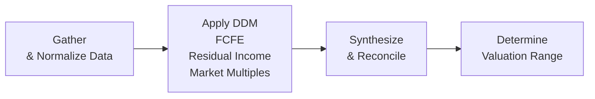

## Introduction

Imagine you’ve been handed a massive, 15-page description of a hypothetical company—complete with financial statements, murky footnotes, market overview, industry trends, and a laundry list of potential red flags. Slightly overwhelming, right? Well, that’s kind of the point. In real life, or in a rigorous exam scenario, analyzing a company holistically involves juggling everything you’ve learned: from discount rates and market multiples to intangible assets and macroeconomics. It’s not just about figuring out the value; it’s about extracting the right data, making strategic assumptions, and reconciling multiple approaches into a coherent narrative.

I recall a time when I was helping a friend evaluate a mid-cap tech firm that looked promising but had ongoing share buybacks causing confusion in the earnings-per-share data. We had to do some detective work, normalize certain numbers, and check if the buybacks were artificially boosting EPS or really signaled strong free cash flow. This messy, real-world challenge is exactly what a full vignette is all about: applying your best judgment to a broad mix of quantitative and qualitative information.

Below, we walk through a hypothetical scenario step by step. The ultimate goal is to create a well-reasoned valuation range for our sample firm—call it “Blue Raven Technologies”—and highlight best practices, pitfalls, and ethical considerations along the way.

## Understanding the Scenario

Blue Raven Technologies is a mid-sized software and hardware integrator operating in the communications industry. Here’s a snapshot of key points from the vignette-style data:

• Financial statements show a recent jump in revenue, partly due to strong demand for remote connectivity solutions.  
• Management has hinted at an upcoming share buyback program with a possibility of increasing dividends.  
• The company has intangible assets (patents and proprietary software) that account for over 35% of total assets.  
• Operating expenses last year were inflated by one-time restructuring costs.  
• Industry outlook suggests moderate growth for the next two years, followed by potential slowdowns.  

We also have macroeconomic clues: interest rates may rise in the near future, and heightened geopolitical risk could affect the market’s required equity risk premium. Our mission is to piece all these variables together into a flexible, integrated valuation approach.

## Gathering and Normalizing Data

Before diving into DDM, FCFE, or residual income models, it’s critical to scrub and prepare our data—particularly the income statement and balance sheet.

• One-Time Restructuring Costs: Last year, Blue Raven recognized a $20 million restructuring charge. Because this cost is unlikely to recur, most analysts would add it back (net of any tax effects) to produce normalized earnings.  
• Intangible Assets & R&D: The firm has patents that might not be fully reflected at fair value on the balance sheet. Meanwhile, R&D is expensed as incurred, potentially understating intangible asset value. For practical purposes, we proceed with the official statements but remain aware of the potential underreporting of intangible capital.  
• Revenue Recognition: The firm has some subscription software product lines. We verify that revenue is recognized over the term of customer contracts rather than all at once. No major adjustments needed here.  
• Tax Rate and Capital Expenditures: After removing non-recurring items, the adjusted effective tax rate is around 25%. Capital expenditures have risen from $70 million to $90 million year-over-year, suggesting that growth is ramping up and so is the future outflow of cash.

The big idea is to ensure our “base” operating metrics represent the company’s ongoing performance rather than the volatility introduced by temporary or special events.

## The Dividend Discount Model Approach

Recalling our earlier chapters on Dividend Discount Models (DDM), let’s explore whether dividends can be a direct measure of shareholder returns. Blue Raven hasn’t been the largest dividend payer, but it has signaled an increased payout ratio next year.

• Current Dividend Per Share (D0): $2.00  
• Expected Dividend (D1): $2.10 (implying a 5% immediate growth from the current level)  
• Long-Term Growth Rate (g): 3% for stable years, but we assume a slightly higher near-term growth of 5% for the next three years, consistent with historical patterns and management guidance.  

To apply a multi-stage DDM, we break the forecast into:

• Stage 1 (Years 1–3): Dividends grow at 5% each year.  
• Stage 2 (Steady State from Year 4 onward): Dividends revert to a sustainable 3% annual growth.

(If the firm’s new buyback program significantly alters share count, or if the dividend policy changes, those details would also feed into the year-by-year forecasts. Make sure to integrate share repurchases into your share count assumptions.)

### Cost of Equity

We reference CAPM (or an expanded approach) to find Blue Raven’s cost of equity. Suppose we have:

• Risk-Free Rate (Rf): 3.0%  
• Beta (β): 1.2  
• Equity Risk Premium (ERP): 5.0%  
• Additional Risk (Size Premium or Technology Factor): 1.0%  

Then the cost of equity (r) might be:


r = R_f + \beta \times ERP + (\text{Size/Tech Premium})



r = 3.0\% + (1.2 \times 5.0\%) + 1.0\% = 3.0\% + 6.0\% + 1.0\% = 10.0\%


### Multi-Stage DDM Valuation

1. Project dividends for the next three years at a 5% growth from the $2.00 base.  
2. Discount each of these dividends back at 10%.  
3. Estimate the terminal value at the end of Year 3 using the Gordon Growth formula with the 3% perpetual growth rate.

Terminal Value (end of Year 3) =  

\frac{D_4}{(r - g_{\text{stable}})} = \frac{D_3 \times (1 + g_{\text{stable}})}{(r - g_{\text{stable}})}


Then discount this terminal value back to present. Summing up the present values of the near-term dividends and the present value of the terminal value gives the DDM-based intrinsic value per share.

It’s straightforward in principle but can be messy in practice when you try to reconcile company guidance about future dividends with actual free cash flow. Also, watch out for partial-year effects or unusual share repurchase schedules; these can change the share count used for per-share cash flows.

## The FCFE Approach

We also examine if the firm’s Free Cash Flow to Equity (FCFE) metric paints a more accurate picture, especially since Blue Raven invests heavily in capital expenditures and intangible development.

Recall the simplified FCFE formula for each forecast year:


\text{FCFE} = \text{Net Income} + \text{Non-Cash Charges} - \text{CapEx} - \Delta \text{Working Capital} + \text{New Net Borrowings}


In a multi-stage FCFE model:

1. Forecast FCFE from Year 1 to Year 5 (or some near-term horizon), factoring in the firm’s ramped-up capital spending.  
2. In the stable phase (post-Year 5), assume a lower growth rate consistent with GDP or industry trends.  
3. Discount each year’s FCFE at the cost of equity (the same 10% we used above, unless we adjust for changes in capital structure).  
4. Compute the terminal value in Year 5 using a perpetual growth or exit multiple approach.

### Example: Forecasting FCFE

Let’s say normalized Net Income for next year is $200 million. After adding back non-cash charges and adjusting for the current CapEx and working capital expectations, we project an FCFE of $150 million in Year 1. If this is projected to grow by 5% for a few years before leveling at 3%, we discount these forecasts. The result might be something like:

• Present Value(FCFE Years 1–5) = $540 million  
• Present Value(Terminal Value) = $1,100 million  
• Implied Equity Value = $1,640 million  

Divide by the number of shares outstanding to get an estimated value per share. Keep in mind, if management is planning an aggressive share buyback, the share count might decrease over the forecast horizon. That can raise the per-share value if total equity value remains stable or grows.

## The Residual Income Approach

Residual income (RI) focuses on the income left over after accounting for the required return on equity. This method can prove very handy for firms that don’t pay dividends or have irregular free cash flows (common with high-growth or intangible-heavy companies).

Residual Income = Net Income - (Equity Charge)

Equity Charge = Beginning Book Value of Equity × Cost of Equity

A multi-stage residual income approach involves projecting a few years of residual income, then estimating a continuing residual income in perpetuity or until it diminishes. This can be powerful for a company like Blue Raven, which invests heavily in R&D and intangible assets that aren’t fully captured in current earnings. If we have a strong sense of the firm’s future book value growth, residual income can highlight adjustments from intangible investment.

One subtlety: intangible assets can skew the book value of equity. If intangible spending is expensed rather than capitalized, book value might appear lower than the “true” economic capital. That’s why stronger assumptions—and sometimes off-model intangible adjustments—might be necessary to refine residual income estimates.

## The Market Multiples Approach

Market-based valuation, especially using price multiples or enterprise value multiples, is a quick sanity check (and sometimes, for certain industries, the primary method). As covered in earlier chapters:

• Price/Earnings (P/E) multiple.  
• Enterprise Value/EBITDA or EV/EBIT (particularly relevant if capital structure is changing).  
• Price-to-Book (P/B), if intangible distortions are not overwhelming.  
• PEG ratio (P/E to Growth) can be used for quick screening.

For Blue Raven, suppose comparable companies in the communication software sector trade at an average forward P/E of around 18×. If Blue Raven’s normalized EPS is $6.00 (after adjusting for the one-time charge), an 18× forward multiple implies a $108 per share value. But we should refine that multiple if we believe Blue Raven’s growth prospects or risk profile differ from peers.

Likewise, if we attempt an EV/EBITDA approach, we’d adjust for net debt and compare the firm’s EBITDA to sector norms. Always watch out for adjustments around operating leases, intangible write-offs, or minority interests in consolidated subsidiaries.

## Reconciling the Valuations

So we have four potential valuations:

• DDM: Let’s pretend we get $100 per share after discounting all future dividends using a multi-stage approach.  
• FCFE: That might come out to $105 per share, factoring in near-term capex and working capital changes.  
• Residual Income: Possibly we land somewhere around $95 per share, depending on how intangible spending is capitalized or expensed.  
• Market Multiples: Suppose we get $108 per share from a forward P/E or EV/EBITDA triangulation.

Bringing these results together and applying professional judgment, we might say the “fair value range” for Blue Raven is around $95–$110. Any major discrepancy should prompt a deeper dive. If your DDM yields $50 while your FCFE yields $150, that’s a huge gap demanding some explanation (maybe the difference rests in contradictory cash flow assumptions or an incorrect growth forecast).

In practice, analysts assign weights to each method. Or they might favor one approach as the “primary” while using others as relative checks. The ultimate aim is to produce a single target value or a reasonable range accompanied by a strong narrative that defends the assumptions made.

## Ethical Considerations

When carrying out a holistic valuation—whether for a client, your own firm, or an exam scenario—remember the ethical obligations:

• Be objective and unbiased: Don’t cherry-pick assumptions just to match a desired conclusion.  
• Properly cite data sources: If you base your large intangible asset valuation on third-party research, make sure you disclose it.  
• Transparent assumptions: Make it clear which factors are uncertain (e.g., forward growth rates, intangible longevity).  
• Watch for conflicts of interest: If your employer or client has a stake in publishing a certain valuation, remain vigilant.  

In real-world practice, the CFA Institute Code of Ethics and Standards of Professional Conduct calls for independence, thoroughness, and fair representation. In the exam environment, you’ll likely be tested on your ability to demonstrate these principles while performing computations.

## Best Practices and Common Pitfalls

• Overlooking Non-Recurring Items: Always check for big one-off gains or losses that can distort your net income or EPS.  
• Misapplying Growth Rates: If the industry is cyclical, your stable growth rate might be too high. Or it could be too low if the company retains pricing power.  
• Discount Rate Blunders: A mismatch between your cost of equity in FCFE and your cost of capital assumptions can throw off valuations. Keep your data consistent.  
• Double Counting or Overlapping Methods: If you treat intangible spending in a contradictory fashion across models, you can get unreliable results.  
• Failing to Reassess Market Impressions: Sometimes, the “market” multiple might reflect ephemeral optimism. If a peer group’s multiples are inflated, calibrate carefully.

## Visualizing an Integrated Process

Below is a simple Mermaid diagram that illustrates how different valuation models feed into a final integrated conclusion:

Start with the raw data, clarify the story behind the numbers, apply the various valuation frameworks, then merge your findings into a clear recommendation.

## References

• CFA Institute: Official mock exams and practice item sets for integrated valuation vignettes.  
• Equity Asset Valuation, CFA Institute Investment Series.  
• Damodaran, Aswath: Valuation Course Notes and Case Studies, Stern School of Business.  
• Global Investment Performance Standards (GIPS) Handbook for equity research best practices.  

## Test Your Knowledge: Holistic Company Valuation



### For a company that just announced a share buyback program, which statement is most accurate regarding its effect on valuation?

- [ ] It always increases the fair value per share because EPS will be higher.  
- [ ] It always decreases the fair value per share because total equity declines.  
- [x] It can influence per-share estimates, but the overall effect depends on the firm's actual cash flows and market perception.  
- [ ] It eliminates the need to consider dividends in a DDM approach.

> **Explanation:** A buyback reduces the number of shares outstanding, potentially boosting EPS. However, if the buyback is financed improperly (e.g., excessive debt) and the firm’s fundamental cash flows cannot support it, the ultimate impact on value may be neutral or negative.

### Which of the following is a key advantage of the FCFE approach over the DDM?

- [ ] FCFE calculations are always simpler and require fewer assumptions.  
- [x] FCFE accounts for capital expenditures and working capital changes, providing a broader picture of equity cash flows.  
- [ ] Only the FCFE approach is recognized by IFRS for consolidated statements.  
- [ ] The DDM ignores changes in share count.

> **Explanation:** FCFE incorporates the firm’s reinvestment and financing decisions, capturing all cash inflows and outflows relevant to equity holders, which can be more comprehensive than focusing just on dividends.

### If a firm’s beta increases from 1.0 to 1.3, holding all else constant, which effect is most likely?

- [ ] Cost of equity remains the same under the CAPM framework.  
- [x] Cost of equity rises because the equity risk premium is applied to a higher beta.  
- [ ] The cost of equity falls because a higher beta implies greater diversification.  
- [ ] WACC remains constant because equity is not a factor.

> **Explanation:** According to CAPM, cost of equity = Rf + β × (ERP). A higher β means higher systematic risk, leading to a higher required return for equity holders.

### In a multi-stage DDM, which factor would most likely have the greatest impact on the terminal value?

- [x] The long-term growth rate for dividends.  
- [ ] The current year’s dividends.  
- [ ] The risk-free rate for the next quarter.  
- [ ] Book value of debt in the terminal year.

> **Explanation:** The terminal value in a Gordon Growth extension depends heavily on the long-term growth rate. Small changes in this rate can produce large changes in terminal value.

### Why might a market multiples approach produce a higher valuation than a residual income approach for the same firm?

- [x] Peer group valuations might be inflated or reflect short-term market optimism.  
- [ ] The residual income approach systematically overvalues intangibles.  
- [ ] The firm’s share price is always undervalued in the public market.  
- [ ] Multiples ignore growth assumptions entirely.

> **Explanation:** Market multiples can be influenced by temporary market sentiments or an overhyped sector. If comparables are trading at premium multiples, applying those multiples might yield a higher valuation than more fundamentals-based methods.

### Which of the following is most crucial in normalizing financial statements for valuation?

- [ ] Adding back intangible amortization to net income.  
- [x] Removing one-time charges or gains to reflect ongoing operations.  
- [ ] Using book value instead of fair value for assets.  
- [ ] Keeping the effective tax rate at 0%.

> **Explanation:** Normalizing typically involves removing or adjusting unusual items—like restructuring charges, legal settlements, or non-recurring gains—to better reflect the firm’s steady-state performance.

### Under a residual income model, how is residual income defined?

- [ ] The difference between revenue and cost of goods sold.  
- [ ] Earnings before interest and taxes.  
- [x] Net income minus the equity charge (cost of equity × beginning book value).  
- [ ] Cash flow from operations minus dividends paid.

> **Explanation:** Residual income is net income minus the dollar cost of equity capital. This approach highlights whether the firm is actually generating returns above its cost of equity.

### When reconciling valuation estimates from multiple methods, which practice is most appropriate?

- [ ] Automatically discard any method whose valuation differs from the average.  
- [ ] Only rely on the highest valuation.  
- [x] Investigate major discrepancies to see if assumptions or data sources need revisiting.  
- [ ] Weight all valuations equally, no matter the assumptions made.

> **Explanation:** Significant disparities among valuation approaches often point to differing assumptions or flawed data. Analysts should explore these discrepancies carefully.

### What is the primary risk if an analyst uses an inflated long-term growth rate in a two-stage FCFE model?

- [ ] The firm’s WACC will become irrelevant.  
- [x] The terminal value can be overstated significantly, inflating the fair value.  
- [ ] The model will cease to converge mathematically.  
- [ ] No specific risk, as discounting handles any overstatements.

> **Explanation:** An exaggerated long-term growth rate can cause the terminal value to skyrocket, leading to an unrealistically high equity valuation.

### True or False: Ethical considerations in equity valuation primarily concern whether the analyst’s calculations are arithmetically correct.

- [ ] True  
- [x] False  

> **Explanation:** Ethics extend well beyond mere arithmetic correctness. Objectivity, transparency of assumptions, avoidance of conflicts of interest, and compliance with professional standards are paramount to ethical valuation practice.


