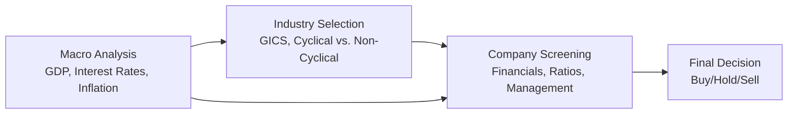
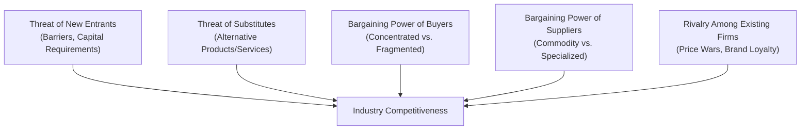

## Overview

If you’ve reached this chapter, you’re probably gearing up for that final push: pulling multiple analytical threads together and applying them in item-set questions under exam-like conditions. It’s that moment you realize how many moving parts exist in equity analysis—macroeconomic forces, industry classifications, ratio and trend analysis, you name it. At Level II, the tasks are more intricate than a simple one-step valuation. You’ll be asked to consider the interplay between broad economic indicators and highly specific company fundamentals. It’s like peeling an onion: every layer you uncover reveals another dimension to analyze.

This section is designed to equip you with intense practice drills focused on industry and company analysis. We’ll use a top-down approach (analyzing macro factors, then zooming into industries, and finally companies) and a bottom-up approach (evaluating company fundamentals first and only then broadening out to industry and macro contexts). We’ll also incorporate GICS, Porter’s Five Forces, ratio analysis, and a host of scenario-based stressors. By testing your analytical agility in multiple directions, you’ll strengthen the skills needed to address the varied item-set questions you’re bound to encounter.

## Connecting Industry & Company Analysis to Vignette Questions

In prior chapters (notably Chapter 4: “Industry and Company Analysis—Foundations” and Chapter 20: “Industry and Competitive Analysis—Deep Dive”), we explored the fundamentals of categorizing industries and evaluating competitive advantages. Now, we put all of that into practice through exam-style drills. Typically, a vignette on the CFA exam integrates both macro-level data—like GDP growth or interest rate forecasts—and micro-level data—like a company’s financial statements or a CEO’s strategic commentary. You might see incomplete footnotes, or maybe a mention of pending regulatory changes. Be ready for partial or ambiguous data, because real-world equity analysis isn’t always neatly packaged.

Sometimes you’ll see conflicting signals: for example, robust sales growth but a disturbing increase in labor costs. The challenge is to sort through that data, decide what’s material, and then answer the question asked—often under time pressure. It’s easy to get sidetracked analyzing background details that might not matter for the final conclusion. So part of this chapter’s focus is on honing your ability to read a scenario quickly, extract relevant information, and match it to the direct question prompts.

## Key Concepts Refresher

### GICS and Sector Classification

The Global Industry Classification Standard (GICS) offers a standardized way of segmenting public companies into major sectors, industries, and sub-industries. This classification is invaluable when comparing companies within the same peer group or benchmarking sector performance. For instance, under GICS, you may group consumer discretionary (often cyclical: think cars, luxury goods) separately from consumer staples (often defensive, like household products).

### Cyclical vs. Non-Cyclical

• Cyclical industries, such as automotive or travel, are heavily influenced by economic cycles. Their revenues and margins often expand when the economy is growing and contract when the economy slows.  
• Defensive (or non-cyclical) industries, such as utilities or consumer staples, tend to remain steadier through economic ups and downs. Demand is more consistent because these products or services are deemed essential (food, electricity, etc.).  

In exam item sets, watch how macroeconomic data—maybe a central bank’s interest rate decision or rising unemployment—could shift the fortunes of cyclical vs. non-cyclical sectors.

### Porter’s Five Forces (Advanced Considerations)

We all learned the basics: threat of new entrants, threat of substitutes, bargaining power of suppliers, bargaining power of buyers, and intensity of rivalry. But layered on top of that can be global expansions, technology disruptions, or shifting trade policies. For example, in the pharmaceutical industry, buyer power might spike if governments impose price controls, or new entrants might be stifled by the high cost of obtaining regulatory approvals. CFA exam vignettes may test your ability to adapt the original Five Forces framework to specific, evolving real-world contexts.

### Top-Down vs. Bottom-Up Analysis

• Top-Down: You start from the macro environment, zero in on industries best positioned to thrive, and finally select specific companies within those industries.  
• Bottom-Up: You look for outstanding companies regardless of broader sector or economic conditions. Only after you identify strong corporate fundamentals do you cross-check industry dynamics and macro indicators.

In practice, both methods can be combined. For instance, you might have a top-down sense that e-commerce is on the rise, then do bottom-up screening to find the best e-commerce player with attractive valuation metrics.

### Interpreting Conflicting Signals

It’s rarely black and white out there. A company might be winning market share (great sign!) but simultaneously locked in a margin-destroying price war (ouch!). Sales volumes can climb while selling, general, and administrative (SG&A) expenses blow up the cost structure. The key is to evaluate each data point’s magnitude and direction. Are cost pressures fleeting or structural? Is the revenue growth sustainable or a one-time shot from a newly released product? In the exam item-set environment, carefully weigh competing data, note relevant footnotes, and look to the specific question to guide your final recommendation.

## Advanced Drills: Industry & Company Analysis

Below are some structured drills and examples. Let’s briefly outline the steps you’ll usually take:

1. Skim the vignette to identify the major themes—macro environment, industry classification cues, company fundamentals, and any red flags.  
2. Note any specific references to Porter’s Five Forces, or consider them informally: “What’s the threat of new entrants here?” “Any signs of intense rivalry?” etc.  
3. Check for cyclical or defensive signals. Is the company’s revenue correlated to the overall economy? Or is demand stable through the business cycle?  
4. Perform ratio analysis if financial statements are provided (e.g., margins, leverage, turnover ratios). Keep an eye out for currency or unit-of-measure issues.  
5. Synthesize everything into a coherent conclusion. If the question is, “Which company is best positioned for growth?” your final answer draws on all relevant data points.

### An Informal Anecdote About Footnotes

I once got burned by not reading a footnote about a shift from operating leases to financing leases. It completely changed the debt-to-equity ratio. I spent way too long scanning the question for “missing info,” but it was right there in small print. So do yourself a favor—scan footnotes, disclaimers, and management commentary in your exam vignettes before you finalize any ratio calculations. This can be the difference between a correct answer and a near miss.

## Diagram: Top-Down vs. Bottom-Up Overview

Here’s a mermaid diagram illustrating the flow of a combined top-down and bottom-up approach:

Notice how macro analysis can flow directly to industry selection (the pure top-down route), but it can also feed into company screening if you start from a bottom-up perspective and then double-check macro conditions.

## Scenario Exercises and Pitfalls

### Scenario 1: Commodity Price Swings

A corporate vignette might show that the target company’s profits are highly sensitive to oil prices. You see partially improved macro data: stable GDP, moderate inflation. But the question states that global supply constraints could drive up oil prices. Instead of focusing solely on the stable macro data, highlight how the prospective rise in commodity prices could severely impact this specific firm’s cost structure. Possibly, it’s a petrochemical company or an airline. For an airline, higher fuel costs might squeeze margins. For a petrochemical firm, it might actually boost sales if they produce essential inputs. The key is to apply the scenario’s data to the firm’s unique position in the value chain.

### Scenario 2: Regulatory Shifts

Let’s say a new policy mandates stricter environmental standards for heavy polluters. If you’re analyzing a steel company, you might see capital expenditures jump dramatically to meet new requirements, which could hamper near-term free cash flow. Meanwhile, specialized firms that offer eco-friendly solutions might thrive. So watch for references to R&D or capital improvement lines in the financial statements. This is a prime example of weaving in both qualitative signals (the policy change) and quantitative data (capex budgets).

### Scenario 3: Technology Disruptions

A classic example is the shift to electric vehicles in the auto industry. Traditional automakers with large internal-combustion-engine footprints might face a costly pivot, while nimble entrants focusing on electric drivetrains can eat away at market share. Yes, you might see large incumbents with robust balance sheets, but also massive legacy costs. The exam question could ask, “Which firm is best positioned for a favorable market re-rating over the next five years?” and your analysis should weigh intangible brand equity, R&D pipelines, and the cost structure for retooling factories.

## Advanced Ratio Analysis in Vignettes

During your item-set exercises, you might be asked to compute or interpret:

• Gross, operating, and net profit margins.  
• Asset turnover and inventory turnover.  
• Leverage ratios (debt-to-equity, interest coverage).  
• Growth rates in earnings, sales, or free cash flow.  

Keep an eye out for any hints that these metrics aren’t strictly comparable across companies due to accounting differences (e.g., one uses LIFO inventory accounting, the other uses FIFO; or one expenses R&D, the other capitalizes it under IFRS in certain circumstances).

### Table: Example of High-Level Ratio Comparison

| Company        | Gross Margin | Net Margin | Debt/Equity | 5-Year EPS Growth |
|----------------|-------------:|----------:|-----------:|------------------:|
| AutoMaker A    | 22%          | 5%        | 1.2         | 2%               |
| AutoMaker B    | 18%          | 3%        | 0.8         | 5%               |
| EV Specialist  | 25%          | 7%        | 0.5         | 12%              |

In a hypothetical vignette, you could note that “AutoMaker A” has a higher gross margin than B, but also a heavier debt load, which might be riskier if interest rates rise or if sales slow. Meanwhile, the “EV Specialist” has promising growth but invests heavily in R&D. The question might be: “Which auto company is most likely to maintain stable profitability if interest rates rise by 2% next year?” You’d have to factor in the debt/equity ratio, the effect on interest coverage, and the potential resilience of EV demand.

## Time Management Strategies for Item-Set Questions

• Scan the entire vignette first. Quickly note major themes (macro data, industry classification, financials, management commentary).  
• Identify the actual question asked before doing any math. Stop, read the question prompt thoroughly. If it’s “Which company has the strongest competitive moat?” you’ll want to focus on brand, patent position, or intangible assets—maybe not get lost in lesser details.  
• Jot down formulas or key numbers as soon as you see them, so you don’t have to hunt for them later.  
• If a question looks too involved, skip it and return after addressing quicker items. Don’t let one complicated ratio analysis question consume a disproportionate chunk of your time.  
• Watch out for footnote references, especially any that reclassify expenses or mention a currency mismatch.  
• Keep an eye on your watch. If your approach is methodical, you can budget your time effectively across all item sets.

## Practice Vignette Drills

Imagine a short snippet like this: “Zwitek Foods (a domestic consumer staples firm) reported a 15% YoY increase in revenue driven largely by a spike in short-term promotional activities. However, its SG&A expenses rose by 18%, compressing the operating margin. Meanwhile, new entrants in the specialty organic market have begun luring away Zwitek’s top customers with subscription-based monthly food deliveries. Global GDP growth is currently 3%, and the central bank is expected to lower interest rates by 50 bps. Which factor poses the greatest risk to Zwitek’s margin expansion strategy over the next year?”

You’d weigh:  
• Revenue growth is from promotions—potentially temporary.  
• Elevated SG&A costs.  
• Fierce competition from new entrants.  
• Potential offset from lower interest rates (might help with borrowing for expansions).  

You might identify that competition from new subscription services is a structural threat to market share that could hamper long-term margins more than short-term interest rate moves. That’s the type of synthesis these item sets demand.

## Mermaid Diagram: Porter’s Five Forces in Global Markets

In a global context, you might add details such as trade tariffs, cross-border supply chains, or technology leaps fueling new substitutes.

## Wrapping Up and Final Tips

You might recall that feeling when you read a vignette with a flurry of data and you’re not sure where to start—don’t panic. A systematic approach helps: define the macro environment, place the firm in an industry context, do a quick ratio check, and see if the bottom-line story matches the question’s angle. And please, never forget those pesky footnotes; sometimes they contain the one clue that changes an entire conclusion.

Keep practicing; over time, you’ll intuitively spot the key signals and avoid the tempting rabbit holes. Aim to do timed exercises under test-like conditions. That means no excessive note-taking, no open books, just you, your calculator, and your wits. It may sound old-fashioned, but it’s the closest you’ll get to the real exam vibe.

## References and Further Reading

- Porter, M.E. (1979). “How Competitive Forces Shape Strategy.” Harvard Business Review.  
- CFA Institute Program Curriculum, Equity Investments Volumes.  
- Damodaran, A. (2012). Damodaran on Valuation. John Wiley & Sons.  
- Equity Asset Valuation (CFA Institute Investment Series) by Pinto, J. E., Henry, E. et al.  

---

## Practice Questions: Mastering Industry & Company Analysis



### Which statement best describes the primary benefit of GICS when comparing companies globally?

- [ ] It distinguishes only between cyclical and defensive sectors.  
- [x] It provides a standardized framework for categorizing companies into consistent industry groupings.  
- [ ] It reduces company-level volatility by adjusting financial statements.  
- [ ] It focuses on emerging markets exclusively.  

> **Explanation:** GICS is widely used to classify companies into sectors and industries, thereby facilitating consistent comparisons. It is not merely about cyclical vs. defensive categorization nor does it adjust statements.

### Considering Porter’s Five Forces, which factor is most likely to raise the threat of new entrants?

- [ ] High capital requirements for market entry.  
- [ ] Strict government licensing rules.  
- [x] Rapid technological development that lowers barriers to entry.  
- [ ] Consumers’ strong brand loyalty toward existing firms.  

> **Explanation:** When technology drives down costs or complexity, new entrants can more easily enter a market. High capital requirements, strict rules, or customer loyalty would each reduce, not raise, the threat of new entrants.

### In evaluating a company within a cyclical industry, which macroeconomic indicator is generally most relevant?

- [ ] Movements in short-term interest rates.  
- [x] Overall GDP growth trends.  
- [ ] Changes in regulatory tax codes.  
- [ ] Fluctuations in currency exchange rates.  

> **Explanation:** Cyclical industries typically correlate strongly with GDP, as consumer/business spending in expansions fuels demand for cyclical goods, and recessionary periods hit these industries hard.

### If a firm’s ratio calculation excludes certain lease obligations, which potential pitfall might arise?

- [x] Understating the firm’s leverage levels.  
- [ ] Overstating the firm’s revenue growth.  
- [ ] Overstating the gross margin.  
- [ ] Understating its intangible assets.  

> **Explanation:** Excluding lease obligations (especially finance leases under IFRS or capital leases under US GAAP) can result in a lower reported debt level, making leverage ratios look artificially low.

### In a top-down approach, which step logically comes directly after macroeconomic analysis?

- [x] Assessing industry prospects based on economic conditions.  
- [ ] Evaluating individual corporate strategies.  
- [ ] Conducting a discounted cash flow model.  
- [ ] Comparing all companies’ price multiples.  

> **Explanation:** In a top-down approach, you start from macroeconomic indicators and then narrow down to industries likely to benefit (or suffer). Only later do you pick individual stocks within that favored industry.

### An item set describes that Company Z’s revenue is growing, but margins are contracting. Which plausible explanation aligns with these signals?

- [ ] Reduction in labor costs.  
- [x] Price wars leading to higher sales volume but lower profit per unit.  
- [ ] Lower fixed overhead and stable pricing.  
- [ ] Increasing operational efficiency.  

> **Explanation:** A price war can boost sales volume (driving revenue growth), while intense competition cuts profit margins per unit. Thus, you might see revenue growth and margin contraction simultaneously.

### Which variable is generally the biggest threat for defensive (non-cyclical) industries?

- [x] Sudden regulatory changes impacting essential goods or services.  
- [ ] Normal economic downturns and recessions.  
- [ ] A minor fluctuation in GDP growth.  
- [ ] Seasonal consumer behavior shifts.  

> **Explanation:** Defensive industries aren’t usually as sensitive to economic cycles. Regulatory changes, such as price caps or new compliance rules, can disrupt the stability of these industries.

### A company’s earnings are normalizing after a one-time litigation expense, but the item-set warns that a portion of litigation claims could reappear in the future. How should an analyst approach this?

- [x] Adjust forward estimates conservatively in case the litigation expense recurs.  
- [ ] Ignore the litigation cost entirely as a non-recurring item.  
- [ ] Increase the p/e multiple to account for temporary earnings gains.  
- [ ] Assume litigation costs have no material impact going forward.  

> **Explanation:** While the expense may look one-time, the analyst must confirm whether it might reoccur. When in doubt and the vignette states the possibility of reoccurrence, be conservative in adjustments.

### If a vignette highlights rising interest rates and a company with high debt-to-equity, what is the likely conclusion?

- [x] Additional interest expense could erode net income.  
- [ ] Higher rates generally improve cyclical industry returns.  
- [ ] Interest rates never affect equity valuation.  
- [ ] The company will have no change in financing costs.  

> **Explanation:** Rising rates usually increase the cost of debt, hurting firms with high leverage. This effect often reduces net income and consequently can pressure valuations.

### A shift from a bottom-up approach to a more balanced approach means:

- [x] The analyst still focuses on strong company fundamentals, but also pays greater attention to macro and industry trends.  
- [ ] The analyst completely abandons analyzing individual companies.  
- [ ] The analyst only does macro and industry analysis from now on.  
- [ ] The analyst focuses solely on high-frequency trading signals.  

> **Explanation:** A balanced approach mixes bottom-up scrutiny of company fundamentals with top-down macro and industry insights. It doesn’t mean discarding micro-level analysis entirely.


