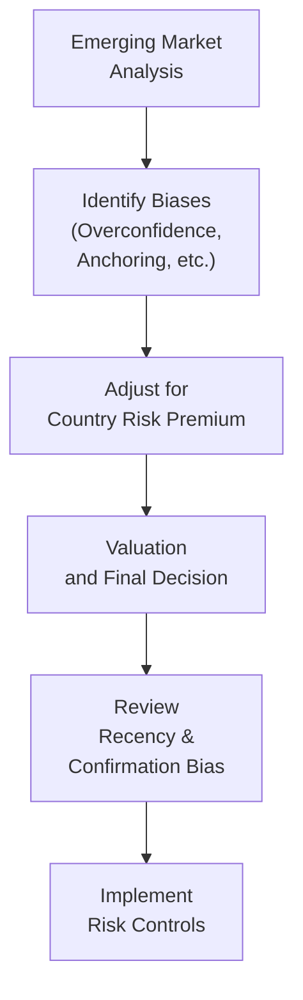

Let’s jump right in. It’s one thing to identify biases in well-established markets with all their data readily available, but it’s an entirely different ball game analyzing equity investments in emerging markets. In these less transparent arenas, biases like overconfidence, anchoring, and recency bias can compound quickly, sometimes leading to massive mispricing and volatility. This section presents a fusion of vignettes illustrating both behavioral finance pitfalls and the unique challenges of emerging market equity valuation. The goal is to help you recognize these traps and devise strategies for keeping them at bay.

## Why Behavioral Biases Are More Potent in Emerging Markets

It helps to start by understanding why blending behavioral finance and emerging markets isn’t just a flavor-of-the-month topic—it's often the very crux of real-world investing challenges. In many emerging markets, reliable information can be tough to come by. Sometimes, you rely on local newspapers or partial disclosures from company statements. That’s where recency bias creeps in (you might project only recent performance far into the future), or confirmation bias (you actively seek any scraps of info confirming your initial hunch).

If you’re anything like me, you’ve probably had that casual conversation with a friend or colleague who excitedly proclaims, “This emerging market is going to double or triple my investment!” That well-intentioned optimism sometimes edges into overconfidence. Throw in currency swings (which can amplify gains or losses in strange ways), and you get a recipe for big surprises.

## Linking Bias to Valuation Gaps

One reason these biases matter so much is that in emerging markets the bid-ask spreads can be wider, liquidity might be more constrained, and local shocks—like sudden changes in government or capital controls—can send valuations on a wild ride. Because of all these uncertainties, rational valuations are more difficult to gauge, so investors often resort to mental shortcuts, or heuristics, that inadvertently give biases free rein.

### Example of a Common Scenario

Let’s say you’re analyzing a consumer goods company based in an emerging market. You observe that the stock rocketed 40% over the past six months following news of a favorable trade agreement. Because that’s the most recent data point, you might be tempted to anchor on that 40% gain. Subconsciously, you start believing that’s a sustainable growth figure without properly accounting for the underlying fundamentals. Or, you might fall victim to recency bias, concluding that the political climate will remain stable because the last half-year was calm. Spot the pitfalls?

## Country Risk Premium and Behavioral Pitfalls

When building valuation models for emerging markets, you typically tack on a country risk premium (CRP) to your discount rate. The formula you might see is:


r_{\text{EM}} = r_f + \beta \times (r_m - r_f) + \text{CRP}


In theory, CRP should capture the added political, economic, and currency risks. However, illusions of control—thinking you’ve “got it all figured out” or that you alone can time the market—can cloud your judgment, leading you to underestimate that premium. Overly optimistic growth predictions and ignoring macro red flags (like a ballooning current account deficit) could translate into setting your CRP too low.

## Common Biases in Emerging Markets

### Overconfidence and Anchoring

Overconfidence often shows up when analysts have had a few “wins.” Say you (or a colleague) got a high return from an emerging market stock last year. You start trusting your instincts more than ever, ignoring new data that may imply caution. Anchoring is equally sneaky. You take the initial share price or some early forecast and cling to it even after receiving new or contradictory information.

### Recency Bias

Emerging markets can have periods of intense growth. Maybe you’ve seen these markets double in just a couple of years. Recency bias tempts you to extrapolate that momentum forward, discounting the possibility that global capital flows might reverse quickly, or that the local currency might depreciate, wiping out gains in dollar terms.

### Confirmation Bias

In emerging markets, limited local news and patchy disclosures intensify confirmation bias. If you start with an assumption (e.g., “this auto manufacturer is going to be the next big thing”), you might seek only the data supporting that assumption. You’ll happily note the promising ratio of cars sold, but you might skim over serious red flags like precarious finances or supply chain disruptions due to political unrest.

### Loss Aversion

When currency depreciation or market corrections hit, loss-averse investors may refuse to exit positions because “it’ll come back eventually.” In a highly volatile emerging market environment, holding on too long can jeopardize a portfolio. But, ironically, the emotional pain of realizing a loss—especially in a setting with limited liquidity—makes it harder to take rational action.

### Herding Behavior

News spreads rapidly through channels like social media, especially if there’s a sensational story about a “hot new emerging market.” Before you know it, investors rally behind the same narrative, driving prices up with limited fundamental basis. This herding can create bubbles or lead to abrupt crashes when the collective mood shifts.

## Diagram: The Flow of Emerging Market Analysis Coupled with Bias Checks

Below is a simple Mermaid flowchart to visualize how an analyst might proceed with emerging market valuation, while identifying key points to check for biases.

## Vignette Scenario: Political Risk and Anchoring

Imagine you’re reviewing an item set about a Latin American telecommunications firm experiencing liberalization in its domestic market. The question prompt reveals:
• The local authority announced partial privatization of state-owned assets.  
• The currency has depreciated by 20% year-to-date but has recovered 5% in the past month.  
• Management forecasts 30% revenue growth annually for five years, anchored on the prior month’s uptick in currency.  

The item set might ask you to calculate a fair value under multiple scenarios, adjusting for a suitable CRP while also recognizing that the management’s forecast is possibly anchored to the latest currency rebound. Your job is to question whether a one-month rally truly indicates a near-permanent upswing in growth.

## Regulatory Shifts, Currency Controls, and Analyst Bias

Capital controls—restrictions on capital inflows or outflows—are common in emerging markets. They can dramatically affect liquidity, making it harder to exit positions quickly. Knowing that you can’t easily get out might induce a kind of “sunk cost” effect: investors ignore changing fundamentals because they dread dealing with the restrictions. They might stay in an investment that is fundamentally flawed because they feel stuck. From an exam standpoint, you’ll want to dissect a vignette carefully, especially if it signals limited repatriation of funds.

Central bank interventions can also whipsaw a currency’s value, placing further pressure on valuations. All these complexities feed directly into whether you glean a realistic discount rate or inflate your growth assumptions. And as you can imagine, when your data is incomplete, it’s so easy to let recency bias or confirmation bias rule.

## Typical Data Gaps: Where Biases Flourish

One difference between developed and emerging markets is the frequency and timeliness of disclosures:

• Quarterly vs. semi-annual reporting  
• Audited financial statements can lag  
• Accounting standards may vary, undermining direct comparability  

In such a murky environment, you might rely on news bites or company press releases to piece together a story. If you’re anchored on a single press release that touts the success of a recent venture—say the launch of a 5G network—then you could drastically overestimate the firm’s future cash flows. This scenario is exactly the sort of question that might appear in a CFA vignette item set, requiring you to adjust the assumptions or highlight the limitations in the data.

## Best Practices for Managing Bias

It’s helpful to outline some buffers or guardrails that can keep your valuations grounded:

• Use standardized checklists. A structured framework for evaluating each assumption can help you catch moments where you might be anchoring on a single data point.  
• Seek diverse viewpoints. Even a second or third opinion can help combat confirmation bias.  
• Perform scenario analyses. Creating multiple scenarios for currency fluctuation, interest rates, or political transitions clarifies the potential range of outcomes.  
• Anchor your analysis in fundamentals, not news headlines. Yes, a big political speech might move markets, but the firm’s actual balance sheet, cash flows, and market position matter more in the long run.  
• Set predefined exit triggers. This approach can help you overcome loss aversion because you’ll follow a plan instead of making emotional decisions.  

## Quick Personal Anecdote

I remember being enthralled by an emerging market’s e-commerce sector—everyone said it was “the next frontier.” I anchored heavily on metrics from a banner year, ignoring a backlog of issues like skyrocketing shipping costs, local corruption, and currency restrictions. Let’s just say I ended up wiping out a big chunk of gains I had made in a more stable market. That experience made me realize how crucial it is to step back from the hype and systematically pick apart every assumption—especially in places where data can be incomplete or even misleading.

## A Holistic Approach to EM Valuation

When dealing with emerging markets, you should treat the discount rate as a living, breathing tool. Keep in mind:


\text{Required Return (EM)} = r_f + \beta \times (r_m - r_f) + \text{CRP} + \text{Firm-Specific} \; \text{Risks}


But that’s just the mechanical side. The big challenge is staying vigilant about biases as you structure your target price or intrinsic value. In a well-crafted exam vignette, you might see partial data that tries to trick you into ignoring red flags. Or maybe you’ll see a consensus forecast from local analysts that screams herding. Your job is to dissect every assumption, test it, and not let the emotional swirl of big headlines overshadow fundamentals.

## Practical Mitigation Strategies

• Create a “Devil’s Advocate” approach: Assign a team member (or part of your own analysis) to poke holes in every rosy assumption you have.  
• Employ checklists: For instance, “Did I consider the effect of currency volatility? Have I tested the assumption that the local regulator will approve the new rules?”  
• Historical Context: Look at a longer time horizon. If the past year looks too good, expand to five- or ten-year data sets to see if the recent upswing is truly an outlier.  
• Factor in multiple currency scenarios: If you’re doing a discounted cash flow (DCF), model at least three currency outlooks—appreciation, baseline, and depreciation—and see how that changes your result.  

## Conclusion and Final Thoughts

Emerging markets present fantastic opportunities, sure. But you can’t ignore the swirl of political risk, currency volatility, and data limitations that intensify the psychological quirks we all have. When you’re working through your next CFA-style item set, remember to be on guard for illusions of control, herding, or anchoring in both your calculations and the storyline. Challenge your assumptions, incorporate a healthy country risk premium, and carefully weigh any local constraints like capital controls. Above all, keep in mind that a disciplined, repeatable process is your best ally against the blind spots of our own cognitive makeup. 

## References and Further Reading

- Montier, J. (2007). Behavioral Investing: A Practitioner’s Guide to Applying Behavioral Finance. John Wiley & Sons.  
- CFA Institute Program Curriculum, Behavioral Finance Readings.  
- International Monetary Fund (IMF) and World Bank reports on emerging market structures and risks.  
- Kahneman, D. (2011). Thinking, Fast and Slow. Farrar, Straus and Giroux.  

## Test Your Knowledge: Behavioral Bias & Emerging Market Challenges



### Overconfidence in Emerging Markets
- [x] May lead analysts to overestimate earnings growth and underprice risk.  
- [ ] Is less likely to occur when data is scarce.  
- [ ] Ensures more realistic valuations due to caution.  
- [ ] Has no connection to emerging market regulatory uncertainty.  

> **Explanation:** Overconfidence can be extremely dangerous in emerging markets because analysts may rely on limited data and become convinced of their own forecasts without double-checking underlying assumptions.

### Anchoring Bias Example
- [x] Relying heavily on a recent currency appreciation to forecast future exchange rates.  
- [ ] Requiring a higher risk premium due to political uncertainty.  
- [ ] Diversifying a portfolio across multiple sectors.  
- [ ] Using scenario analysis to test different levels of inflation.  

> **Explanation:** Anchoring involves clinging to a single, often recent data point (such as a sudden currency surge), which can distort longer-term expectations.

### Country Risk Premium Integration
- [x] Should be added to the discount rate to account for local political, economic, and currency risks.  
- [ ] Is usually negative in stable emerging markets.  
- [ ] Eliminates the need for beta when calculating cost of equity.  
- [ ] Is not relevant when analyzing government bonds.  

> **Explanation:** The country risk premium is an integral adjustment that reflects added uncertainties in emerging markets. It’s always in addition to the standard equity risk premium approach.

### Recency Bias in EM Valuation
- [x] Can cause analysts to extrapolate recent high growth too far into the future.  
- [ ] Forces analysts to temper their growth forecasts.  
- [ ] Reduces volatility in emerging market prices.  
- [ ] Increases the reliance on fundamental analysis.  

> **Explanation:** Recency bias often lulls investors into believing the current trend will persist indefinitely, leading to over-optimistic valuations if the trend is positive.

### Confirmation Bias in Limited Data Environments
- [ ] Makes it easier to discover contradictory information.  
- [x] Encourages analysts to seek only data that supports their initial conclusion.  
- [ ] Mitigates the risk of overconfidence.  
- [ ] Is more relevant in developed markets than in emerging markets.  

> **Explanation:** When data is already scarce, analysts may cling to partial information that reinforces their prior views, creating a distorted valuation perspective.

### Loss Aversion Impact
- [x] May cause investors to hold onto losing positions in the hope of a rebound.  
- [ ] Encourages frequent portfolio rebalancing.  
- [ ] Eliminates emotional distress associated with volatility.  
- [ ] Leads to immediate selling when prices drop.  

> **Explanation:** Loss aversion describes the tendency to avoid realizing losses, often resulting in holding onto losing positions longer than is rational.

### Herding Behavior
- [ ] Leads to perfectly efficient market pricing.  
- [x] Can create bubbles in emerging markets as investors chase the same hype.  
- [ ] Encourages independent research and skepticism.  
- [ ] Reduces overall market volatility.  

> **Explanation:** Herding can inflate prices rapidly if everyone jumps on the same bandwagon, and it can crash prices just as fast if the sentiment shifts.

### Capital Controls and Bias
- [x] May exacerbate biases, as investors feel trapped and rely on wishful thinking.  
- [ ] Usually enhance liquidity.  
- [ ] Provide extra disclosures that clarify market conditions.  
- [ ] Eliminate the need for scenario analysis.  

> **Explanation:** Capital controls limit free flow of money in or out of a market. Investors can become excessively optimistic or turn a blind eye to fundamentals, hoping restrictions will ease before conditions deteriorate.

### Adjusting for Incomplete Disclosures
- [x] Often requires conservative assumptions and cross-verification from multiple data sources.  
- [ ] Is unnecessary if the recent trend is positive.  
- [ ] Reduces the need for a country risk premium.  
- [ ] Means ignoring local news reports entirely.  

> **Explanation:** With incomplete or delayed disclosures, it’s best to employ caution, check multiple sources, and build in margins of safety in all forecasts.

### True or False: “A structured framework or checklist is one of the best ways to mitigate bias.”
- [x] True  
- [ ] False  

> **Explanation:** Checklists foster systematic thinking and help prevent you from glossing over critical assumptions or ignoring contradictory data.


