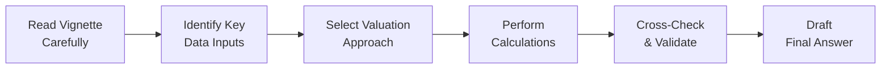

### Solutions Overview

Welcome to the detailed solutions and explanations for the mixed item set exercises in Chapter 34. If you’ve been working through the vignettes, you might’ve found yourself thinking, “Um, did I really catch that footnote?” or “Wait—did I mix up the discount rate in the last step?” Trust me, I’ve been there. We’ll break down each problem with a step-by-step approach, highlight those sneaky distractors, and emphasize the partial-credit opportunities that might save your score on exam day. 

After all, the CFA Level II exam’s item set format demands both conceptual understanding and methodical problem-solving. So let’s roll up our sleeves and walk through each solution in a way that ensures no stone is left unturned.

### Common Pitfalls and Earning Partial Credit

One of the biggest changes from Level I to Level II is how partial credit can be awarded. In a multi-step valuation or ratio calculation, the examiner might give you credit if your process is correct—even if a final numeric answer is off. Here’s what that means in practice:

• If you calculate the Weighted Average Cost of Capital (WACC) correctly but then use an incorrect long-term growth assumption for a Dividend Discount Model (DDM), you can still earn some points.  
• If you pick the right formula for Free Cash Flow to Equity (FCFE) but forget to subtract net borrowing (or do it incorrectly), at least they’ll see you started correctly and might grant partial credit.

These so-called “scrap points” add up. Always show your work. A short note like “Discount rate = 8.0% = 4% risk-free + 4% equity risk premium” can save you if the final step has a slight slip.

### Structuring Your Short Answers

When you’re dealing with written item set responses (where you might have to jot down a formula or a short justification), clarity is your ally. Try something like this:

1. Identify the relevant inputs. For instance, “The question states the risk-free rate is 3%, market risk premium is 5%, and beta is 1.2.”  
2. Perform the calculation step by step:  
   • Cost of Equity (CAPM) = Rf + β × (Market Risk Premium) = 3% + 1.2 × 5% = 3% + 6% = 9%.  
3. Briefly explain your result: “Thus, the discount rate for equity is 9%.”

By laying it out, you minimize the chance of missing partial credit. Even if you had, say, typed a growth rate incorrectly later, the examiner sees your logic was sound at this stage.

### Step-by-Step Example: FCFE Valuation

Let’s look at a sample solution that merges FCFE, discount rates, and growth assumptions. Suppose you have the following scenario:

• You’re given a forecast of net income, depreciation, and capital expenditures for the next three years.  
• The question also provides the firm’s target debt-to-equity ratio.  
• You need to compute FCFE and then discount these flows at the cost of equity.  

A typical approach might go like this:

1. Calculate FCFE for each forecast year:  
   FCFE = Net Income + Depreciation – Capital Expenditures – Incremental Working Capital ± Net Borrowing  

2. Discount each year’s FCFE at the required rate (often the cost of equity, not WACC, for FCFE-based valuations).  
3. Sum the present values. If the question calls for a terminal value, you might do a final year liquidation or terminal multiple approach.  

Candidates often confuse net borrowing with net debt repayment or forget that the cost of equity is used here, not WACC. Imagine you accidentally plugged WACC into your discounting formula—yikes. The correct process is to match the cash flow measure (FCFE) with the correct discount rate (cost of equity). Getting that wrong is a typical partial-credit moment: you’d show strong arithmetic but lose points for the conceptual mismatch.

### Comparing DDM, FCFE, and Residual Income

In many item sets, you’ll see vignettes pushing you to reconcile multiple valuation methods—maybe they’ll present a scenario where:

• The firm has a stable dividend policy, making a Single-Stage Dividend Discount Model feasible.
• They also provide enough data for you to compute FCFE.
• There are notes indicating intangible assets, raising the possibility of a Residual Income approach.

Here’s the trick: these methods should, ideally, converge to a similar intrinsic value. Differences might appear if:

• The question specifically changes the assumptions about growth in dividends vs. overall profitability.  
• The firm’s capital structure is shifting in a way that influences FCFE but not near-term dividends.  
• Residual Income picks up intangible investments that the other models might treat differently.  

When you see conflicting valuations, recheck assumptions and ask yourself, “Could a short-term growth assumption in DDM be inconsistent with the stable capital expenditures assumed in FCFE?” or “Does the Residual Income model factor in cost of equity properly, especially if the shareholders are expecting a higher risk premium?”

Comparisons like these demonstrate to graders that you recognize how different methods can validate each other. It also shows you’re vigilant about assumptions. And that vigilance is precisely what examiners love.

### Sneaky Distractors

Sometimes, an item set might bury an important detail like “The growth rate in the third year is projected to actually decrease by 1% from the original assumption.” Or they’ll show a footnote that the company has a convertible bond that could dilute shares—and they want you to see that’s relevant for the final share count. These distractors test whether you’re reading carefully. 

So watch for:

• Footnotes about shares, convertible bonds, or shares repurchased.  
• Unexpected changes in assumptions from the base year to the forecast year.  
• Market-based assumptions that differ from a theoretical approach (like mentioning a peer multiple that offers a sanity check).

In your written solutions, note how you addressed these. For instance, “Per footnote 2, the convertible bonds do not convert until next year. Therefore, I used the current share count in this year’s FCFE per-share calculation.”

### Real Examples of Candidate Mistakes

• Mixing Up Years: Using year 3’s net income but year 2’s capital expenditure forecast.  
• Confusing WACC vs. Required Return on Equity: This can happen if you skip the detail that the question is asking for an equity-based measure.  
• Overlooking “Minor” Working Capital Changes: The exam might nudge you with a small number (say $1 million in changes to accounts receivable), but forgetting it can throw off your entire FCFE.  
• Misreading the Requirements: Some questions explicitly say “State which approach is most appropriate and justify your answer.” People sometimes talk only about the pros and cons, forgetting the direct response.

I remember once thinking, “I’ve got it all done,” only to realize I used the wrong discount rate because the question specifically told me the cost of equity was 10.5%. I had used CAPM to estimate 8.5%. That’s a prime example of letting your autopilot overshadow the vignette’s direct statement.

### Practical Calculation Walk-Through

Below is a simplified snippet of how your solution framework might look. It’s an illustration of how you could structure your answer in a partial-credit environment:

```
Year 1 FCFE    = $100 (Net Income) 
                 + $20 (Depreciation)
                 – $30 (CAPEX)
                 – $5  (Working Cap)
                 + $10 (Net Borrowing) 
               = $95

Discount Rate  = 10% (stated in vignette as cost of equity)

Present Value  = $95 / (1 + 0.10)^1 = $86.36
```

By showing each line, you let the grader see exactly how you arrived at $95. If you had made a slip on CAPEX or net borrowing but everything else looked good, they might still grant you partial marks.

### Systematic Answer Review

Before turning the page:

1. Double-check your discount rate. It’s so easy to forget that a question might specify 9% when your brain is set on 10%.  
2. Confirm you used the correct growth rate if it changes from year to year.  
3. See if the question wants minority interest or associate income separated out (common in more advanced vignettes).  
4. Make sure your final answer aligns with the question’s prompt. If they ask for “value per share,” you better have divided by the number of shares.  
5. Revisit each footnote. That’s often where they hide the trickiest info.

### Using Data Triangulation

Ever see a question that, well, practically begs you to compare multiple sources? They might show:

• Analyst consensus for next year’s EPS.  
• The median P/E multiple for the industry.  
• Some quick mention of management guidance in a footnote.  

That’s your hint to do a “reality check” or “data triangulation”—comparisons across different vantage points. For instance, if your residual income approach suggests a way-out-of-line valuation compared to typical P/E-based valuations for the sector, you might suspect you made a growth or cost of equity error. Or maybe the question wants you to see that the firm is an outlier and that your initial approach is actually correct. 

### A Quick Mermaid Diagram

To visualize how these steps fit together, here’s a short flowchart:



Think of it as your mental map for each item set: Step A, then B, then so on. If you follow a logical sequence, you’ll reduce silly mistakes.

### Conclusion and Encouragement

Valuation exercises can get complicated, especially under exam pressure. But the structure and partial-credit approach means showing your process is as important as the final answers. Stay organized, verify each step, and don’t underestimate the power of reading footnotes. After a few practice runs, it gets more natural. Honestly, there were times I’d catch an error at the last minute just because I forced myself to do a quick pass and re-check the discount rate.

In short: slow down, read carefully, and be strategic about your approach. You’ve got this!

### References & Further Reading

• CFA Institute. (2025). Official Practice Problems for the CFA® Level II Exam.  
• Fabozzi, F.J. (2000). Financial Modeling of the Equity Market. John Wiley & Sons.  
• Morningstar Analyst Reports for practice on narrative and numbers alignment.  
• Professional exam preparation providers’ question banks and mock exams (Kaplan Schweser, Wiley, etc.).  

---

## Test Your Knowledge: Mixed Item Set Solutions



### A question about partial credit 
- [x] Showing your calculation steps can earn partial credit even if your final result is incorrect 
- [ ] Final answers are all that matter, as partial credit does not exist 
- [ ] Including footnotes from unprovided data can earn extra points 
- [ ] Partial credit is never awarded in multi-step solutions 

> **Explanation:** In the CFA Level II exam format, partial credit is often given for correct methodologies, so demonstrating your steps can secure points even if a final number is off.

### Calculating FCFE vs. FCFF
- [x] FCFE uses cost of equity as the discount rate while FCFF often uses WACC 
- [ ] FCFE is always greater than FCFF under any circumstances 
- [ ] FCFE and FCFF must both be discounted at the same rate for consistency 
- [ ] FCFE is always discounted at WACC 

> **Explanation:** When using an FCFE approach, the relevant discount rate is the required return on equity. FCFF typically uses the firm-wide WACC.

### Sensitivity and Scenario Analyses 
- [x] Sensitivity analysis involves changing one variable at a time to see its impact 
- [ ] Scenario analysis never requires base-case inputs 
- [ ] Sensitivity analysis is the same as scenario analysis 
- [ ] Both analyses assume the discount rate stays fixed in all scenarios 

> **Explanation:** Sensitivity analysis changes one assumption (e.g., growth rate) while holding others constant. Scenario analysis changes multiple assumptions simultaneously to present different possible outcomes.

### Distractors in Item Sets
- [x] Sometimes a footnote will modify a growth assumption, which can change downstream calculations 
- [ ] Distractors are always clearly labeled in the question 
- [ ] Distractors never affect final enterprise value 
- [ ] Distractors are irrelevant if you grasp the main formula 

> **Explanation:** Footnotes or side notes can include crucial adjustments (like a slower growth rate in the final year), causing big shifts in calculated values if overlooked.

### Using Multiple Valuation Methods
- [x] Reconciling DDM, FCFE, and Residual Income can help detect assumption errors 
- [ ] You always choose only one method for any given company 
- [x] Different methods can yield different results if assumptions aren’t aligned 
- [ ] Multiples-based approaches are only for private companies 

> **Explanation:** Each method can provide a different vantage point. A large mismatch could signify flawed inputs or a unique capital structure situation.

### Identifying WACC
- [x] WACC is the blended cost of both debt and equity, weighted by target capital structure 
- [ ] WACC is only used in private valuations 
- [ ] WACC equals the risk-free rate plus market risk premium 
- [ ] WACC ignores the effect of taxes on interest expense 

> **Explanation:** WACC is generally (Cost of Equity × Weight of Equity) + (After-Tax Cost of Debt × Weight of Debt). It incorporates equity, debt, and the tax shield on debt interest.

### Avoiding Misreading Questions
- [x] Always check if the prompt specifically provides a discount rate to use 
- [ ] CAPM is the only acceptable way to derive discount rates 
- [x] The question might override a default assumption about risk premiums 
- [ ] Reading footnotes is optional, as the main text is all that matters 

> **Explanation:** Exam questions may specify a required return outright, which must override your own estimates (like CAPM). Footnotes often contain these clarifications.

### Triangulating Data
- [x] Compare industry multiples, published EPS forecasts, and your own model to see if results are consistent 
- [ ] Only the official ratio from the question matters, so ignore outside data 
- [ ] Data triangulation always leads to a single correct number 
- [ ] Triangulation is only valid if you’re dealing with growth stocks 

> **Explanation:** Checking multiple data points ensures that you aren’t overlooking industry benchmarks or forecast discrepancies, which can validate or refute your assumptions.

### Residual Income Common Mistake
- [x] Forgetting to subtract the cost of equity charge against book value leads to overstated residual income 
- [ ] Adding interest costs back to net income in Residual Income is standard 
- [ ] Residual Income never requires discount rates 
- [ ] Residual Income is the same as net income, just with a fancy name 

> **Explanation:** Residual Income = Net Income – Equity Charge. The equity charge is usually Cost of Equity × Beginning Book Value. Forgetting this step inflates residual income.

### True or False: Partial-credit is awarded only if the final answer is correct
- [ ] True
- [x] False

> **Explanation:** You can earn partial credit by demonstrating the correct process or partially correct calculations, even if the final answer is off.


