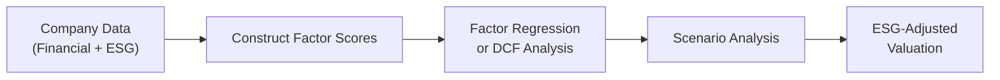

## Overview

Have you ever tried to evaluate a company that claims its new sustainability initiative will slash future costs, yet the firm’s financials currently show no evidence of it? Maybe you've looked at board composition and thought, “Well, does a more diverse board really lower my valuation risk?” Questions like these have come up for me—often at the most unexpected times—when analyzing stocks for my own portfolio research. In this section, we’ll walk through how to tackle these sorts of ESG (Environmental, Social, and Governance) considerations using a factor-based valuation approach. Our goal is to see how ESG can be systematically integrated (rather than just added as an afterthought) and how that might shape both our short- and long-term return expectations.

## Why Integrate ESG into Factor-Based Valuation

It’s no secret that factor investing has skyrocketed in popularity over the last decade. Traditional factors—value, momentum, quality, low volatility—help investors identify systematic risks or anomalies in equity markets. But times are changing, and so are the priorities of investors, regulators, and stakeholders. ESG metrics have emerged as a new lens that can reveal hidden risks (think environmental accidents, negative publicity from labor disputes, or sloppy governance that leads to lawsuits).

In a world where regulatory pressures are building—especially around carbon emissions—and where brand reputation can be damaged by a single tweet, ignoring ESG factors can be a big risk for equity valuations. For instance, suppose you’ve got a high-carbon-intensity steel manufacturer that might soon face more stringent carbon taxes. Or you discover a company with poor governance that might be prone to board-level shake-ups or fraudulent disclosures. Traditional factor models typically wouldn’t see that coming. By incorporating ESG signals, you can catch these intangible (yet increasingly important) aspects before they erode value.

## Common ESG Data Sources and Considerations

One of the first hurdles in ESG integration is data. You may have looked at third-party ESG ratings from, say, MSCI or Sustainalytics, only to find that the two providers give the same company vastly different scores. Annoying, right? It’s not unusual: each provider uses slightly different methodologies, weightings, and definitions. Due diligence matters—there are real consequences for your model’s outcomes if you feed it questionable or inconsistent inputs.

Low data coverage in some emerging or frontier markets also complicates the integration process. A large multinational will have robust ESG reports and third-party coverage, while a local manufacturing firm in a developing country might not. That’s why it’s smart to complement third-party scores with company disclosures, news reports (to track controversies), and direct engagement with management when possible. A few strategies to mitigate data issues:

• Cross-Validate: Compare ESG disclosures with third-party sources to confirm consistency.  
• Adjust for Sector Differences: Carbon intensity that looks high for a software firm might be normal for energy production.  
• Watch for Lag Times: ESG data can be slow to update, especially in markets with lower disclosure requirements.

## Translating ESG Metrics into Factor Exposures

So, practically speaking, how do we incorporate ESG metrics into a standard factor model? If you’re familiar with multi-factor or smart beta approaches, you know the typical structure might look like:

Rᵢ = α + β₁(ValueFactorᵢ) + β₂(MomentumFactorᵢ) + β₃(QualityFactorᵢ) + … + εᵢ

We can extend that to include an ESG-factor term:

Rᵢ = α + β₁(ValueFactorᵢ) + β₂(MomentumFactorᵢ) + β₃(QualityFactorᵢ) + β₄(ESGFactorᵢ) + εᵢ

But the challenge is deciding what “ESGFactorᵢ” is made of. Perhaps we form an aggregate score that’s a weighted average of:

• Environmental Factor: e.g., carbon intensity, water usage, renewable energy adoption.  
• Social Factor: e.g., supply chain ethics, employee well-being, diversity & inclusion metrics.  
• Governance Factor: e.g., board diversity, executive compensation structures, shareholder rights.

Weighting these sub-components can be subjective—some portfolio managers might stress carbon intensity if they primarily invest in carbon-heavy sectors, while others might prioritize board diversity if they’re worried about governance risks. It’s also possible to separate them into three distinct factors, each capturing a unique dimension of ESG.

### Example Table: Hypothetical ESG Factor Scores

Below is a sample table showing how you might assign factor exposures per company:

| Company   | Carbon Intensity | Board Diversity Score | ESG Controversy Penalty | Aggregate ESG Factor Score |
|-----------|------------------|-----------------------|-------------------------|----------------------------|
| Alpha Co. | Low (0.20)       | High (0.65)           | Medium (-0.15)          | 0.70                       |
| Beta Inc. | High (0.75)      | Low (0.25)            | High (-0.30)            | 0.70                       |
| Gamma Ltd.| Medium (0.45)    | Medium (0.40)         | None (0.00)             | 0.85                       |

A little surprising that Beta Inc. ends up with the same 0.70 as Alpha Co., right? But that’s because Beta Inc. has both very positive social or E component offset by a notable controversy penalty. If you’re modeling systematically, you’d transform these raw scores into factor exposures and let the regression do the rest. However, if your qualitative assessment flags Beta Inc.’s governance risk as under-reported, you might do further due diligence or reduce their final ESG score.

## Interplay Between ESG Policies and Financial Performance

Sometimes, companies invest heavily in greener processes or social programs that might reduce margins in the short term. But over the longer run, these moves can reduce regulatory risks, improve brand equity, and even lower the cost of capital. There’s no magic formula guaranteeing a positive link between ESG investments and returns, but many portfolio managers believe that strong ESG profiles do have beneficial spillover effects:

• Reduced operating costs from energy efficiency.  
• Easier time recruiting and retaining talented employees (social dimension).  
• Decreased cost of capital if lenders/investors reward stable ESG performance.  

I recall a conversation with a senior analyst who was, um, extremely skeptical of “organic packaging” cost savings for a consumer goods firm—until a year later, when a large retailer decided to remove all non-sustainable packaging from its shelves. The firm that had invested in biodegradable materials was instantly better positioned, while competitors scrambled to comply.

## Step-by-Step Hypothetical Valuation with ESG Factors

Let’s walk through a simplified process. Imagine we’re evaluating a mid-cap consumer retail stock, focusing on both standard financial and ESG factors:

1. Gather Traditional Fundamentals  
   Pull typical data: revenue growth, EBITDA margins, leverage ratios, and historical price multiples.

2. Identify Traditional Factor Exposures  
   Assess where the stock sits on value, momentum, and quality metrics. Are we dealing with a high-momentum, low-quality scenario, or is it the other way around?

3. Incorporate ESG Scores & Controversies  
   Dig into environmental disclosures (carbon, water usage), social programs (fair labor conditions, supply chain oversight), and governance structures.

4. Quantify an ESG Factor Exposure  
   Construct a consolidated score. Alternatively, keep separate E, S, and G scores. If third-party data is incomplete, adjust with your own discretionary analysis.

5. Integrate ESG Factor into the Model  
   Extend your multiple-regression or factor analysis to include this ESG dimension. Or, if you prefer a more fundamental approach, adjust your discount rate or growth assumptions to reflect ESG-related risks/opportunities.

6. Run Scenario Analysis  
   Do a bull/base/bear scenario to test how different ESG outcomes (like a new carbon emissions regulation) might affect cash flows.

7. Arrive at a Fair Value Estimate  
   Combine all factor loadings, or overlay your fundamental DCF with an ESG-adjusted discount rate. Conclude with a recommended fair value price.

### Visual Diagram of ESG Factor Integration

In this diagram, you can see ESG data flowing parallel to financial data, culminating in an integrated analysis that informs your final valuation target.

## Sector-Specific ESG Challenges

ESG factor modeling is never one-size-fits-all. A utilities company with heavy environmental concerns demands different weighting than a tech firm with intangible governance complexities, like data privacy. You might see:

• Utilities/Energy: Carbon intensity, water management, local community impacts.  
• Tech: Board oversight of privacy/security, gender and ethnic diversity, executive compensation.  
• Retail/Apparel: Labor rights in the supply chain, sustainability of materials, consumer perception.

Consider adjusting factor weights by sector or using sector-specific ESG sub-scores. This avoids penalizing a utility for being, well, a utility, while also ensuring high-risk areas (e.g., pipeline leaks or emissions controversies) are recognized adequately.

## Balancing Short-Term vs. Long-Term Goals

There’s a classic tension: management might want to hit short-term EPS targets, but big sustainability investments often pay off slowly. From a purely financial standpoint, you might see a near-term drop in net income. However, if your analysis’s time horizon extends beyond a year or two, those ESG initiatives may reduce risk or even enhance growth. In practice, it’s often about weighing intangible benefits—like brand equity or avoidance of reputational damage—against immediate margin compression. For exam purposes, be ready to show how adjusting the required rate of return can reflect this dynamic. For instance, if a firm demonstrates a robust governance framework, you might reduce the equity risk premium slightly, effectively discounting future cash flows at a lower rate.

## Scenario Analysis and Cross-Checking Methods

Let’s say you’re worried about new carbon regulations that could force higher operating costs for a manufacturing company. Scenario analysis might:

• Base Case: No major change in carbon policy—maintain standard estimates.  
• Bull Case: The company invests in greener technology, lowering cost of goods sold in five years.  
• Bear Case: Stricter carbon tax cripples margins and requires significant capital expenditures.

In each scenario, you’d reflect different revenue growth rates, margin assumptions, or capital costs. This approach helps you understand the asymmetry around ESG-driven outcomes—a small probability of extremely negative events could significantly reduce the company’s expected value.

## Potential Pitfalls with ESG Integration

I once saw a well-intentioned model pegging all socially minded companies as “low risk.” But that’s oversimplified. ESG is nuanced. Here are some common pitfalls:

• Over-Reliance on Third-Party Scores: If the coverage or methodology is poor, your results suffer.  
• Inconsistent Disclosure Standards: Emerging market firms might not reveal environmental data thoroughly.  
• Data Lag: ESG controversies can unfold quickly but might not be captured in official scores for months.  
• Subjectivity in Weighting: You might inadvertently let personal biases guide what you consider most important.

So, do your due diligence (there’s that phrase again!). Cross-reference multiple providers and, if time permits, read the qualitative footnotes in ESG reports. That’s often where the big disclaimers or clarifications hide.

## Conclusion and Exam Tips

ESG integration isn’t just a “trend.” Regulatory, societal, and market forces suggest it’s here to stay. If you’re preparing for the exam, expect item sets that mix financial data (like P/E ratios or cost of capital figures) with ESG sidebars (like a new sustainability initiative or a controversy). Your job: show you can gauge how ESG data changes valuations, discount rates, or growth expectations.

• Be systematic: Try an ESG factor extension or at least reflect ESG data in your fundamental analysis.  
• Remember sector nuances: High carbon utilities need different metrics than, say, a software startup.  
• Watch for data reliability: Evaluate the limitations or coverage gaps of third-party scores.  
• Keep an eye on the time horizon: Short-term negative hits can yield long-term benefits.  

If you can demonstrate a thorough, level-headed analysis that merges ESG considerations with a conventional factor-based approach, you’ll likely excel in these item sets.

## References

• CFA Institute’s “ESG Integration in Equity Analysis and Valuation.”  
• Damodaran, A. (2012). “Investment Valuation: Tools and Techniques for Determining the Value of Any Asset.”  
• MSCI ESG Ratings, Sustainalytics, Refinitiv ESG, and Similar Third-Party Data Providers.

## Practice Questions: ESG Factor Integration in Equity Valuation



### Which of the following best describes the main challenge analysts face when integrating ESG data into factor-based models?

- [ ] Low correlations among ESG scores over time
- [x] Variations in methodologies and incomplete coverage across ESG data providers
- [ ] The fact that ESG scores remain constant for long periods
- [ ] The inability to convert ESG data into numeric metrics

> **Explanation:** Different ESG vendors have unique scoring approaches, and coverage in certain markets is often lacking. This creates methodological inconsistency and sometimes incomplete data, making it difficult to standardize ESG into factor-based models.

### When constructing an ESG factor for a multi-factor model, an analyst obtains raw aggregate ESG scores from two providers that differ significantly. The best practice would be to:

- [ ] Reject both sets of scores and skip ESG altogether  
- [ ] Average the two scores without additional analysis  
- [x] Investigate the underlying methodologies, weightings, and coverage before deciding how to incorporate the data  
- [ ] Only use the lower of the two scores to maintain a conservative stance  

> **Explanation:** Due diligence is essential. Discrepancies among providers can stem from differences in each vendor’s coverage or weighting. Before integrating an ESG factor, the analyst should cross-check and validate data sources.

### A company invests heavily in renewable energy, expecting to reduce its carbon footprint significantly in three years. From a valuation standpoint, which of the following adjustments is most appropriate?

- [x] Incorporate a scenario analysis with lower operating costs or potential tax credits in the long run
- [ ] Ignore the investment because short-term profitability might deteriorate
- [ ] Immediately reflect higher profit margins in the next quarter’s forecast
- [ ] Increase the discount rate because capital expenditures typically add financial risk

> **Explanation:** ESG-driven strategies often take time to manifest as cost savings. Scenario analysis lets analysts model how future outcomes could impact margins or cost structures over multiple time horizons.

### An analyst wants to model reputational risk due to an ongoing social controversy. Which method is most direct in capturing this risk within a multi-factor framework?

- [ ] Subtract the firm’s stock price from the industry average
- [ ] Incorporate a lower carbon intensity score
- [x] Introduce an ESG controversy penalty that reduces the overall ESG factor score
- [ ] Assume the controversy does not affect valuation unless there is legal action

> **Explanation:** A controversy penalty is a straightforward way to reflect immediate social or reputational risks by reducing the ESG score, thereby increasing the expected required rate of return or lowering the net valuation.

### In a bottom-up factor-based approach for the utilities sector, which ESG component would likely be given a higher weight compared to the technology sector?

- [ ] Board diversity
- [ ] Executive compensation transparency
- [x] Carbon intensity and environmental compliance
- [ ] Data privacy regulation compliance

> **Explanation:** Utilities have a more pronounced environmental footprint and often face direct emissions regulations. Carbon intensity is thus a more critical ESG factor relative to tech.

### How might an analyst reflect strong governance practices in a discounted cash flow (DCF) valuation?

- [x] Adjust the discount rate downward, assuming lower firm-specific risk
- [ ] Increase the projected growth rate
- [ ] Decrease the portion of debt financing
- [ ] Ignore governance factors because DCF focuses on free cash flows

> **Explanation:** Strong governance often implies lower agency risk and fewer negative surprises. This can be captured by calibrating the discount rate to reflect potentially lower risk.

### An emerging market manufacturing firm has little ESG disclosure. Which analyst approach is most appropriate?

- [x] Combine any publicly available ESG data with local news, industry reports, and partial third-party scores to approximate an ESG rating
- [ ] Assign a zero ESG score due to insufficient information
- [ ] Assume ESG is irrelevant for emerging markets
- [ ] Use only the firm’s internal social responsibility statements

> **Explanation:** Due diligence in emerging markets may require piecing together various data sources (news coverage, local reports, partial disclosures) to build a reasoned ESG perspective.

### Which of the following is a potential pitfall in ESG factor integration?

- [ ] Using multiple ESG data providers
- [x] Treating companies with high ESG scores as automatically low risk
- [ ] Applying scenario analysis
- [ ] Incorporating carbon intensity into valuation

> **Explanation:** High ESG scores do not automatically translate to low investment risk. This misconception can lead to underestimating other factors such as leverage or competitive threats.

### Why is data lag a concern when relying on third-party ESG scores?

- [ ] ESG issues usually have no alternative data sources
- [ ] ESG controversies almost never affect short-term earnings
- [x] Material controversies may not appear in the vendor’s ESG rating until months after the event
- [ ] Data lag rarely occurs in developed markets

> **Explanation:** ESG events can unfold faster than rating agencies update their databases. Investors relying solely on stale scores might miss emerging risks or opportunities.

### True or False: Integrating ESG factors into an equity valuation always increases a company’s fair value estimate.

- [x] True
- [ ] False

> **Explanation:** Though not always intuitive, the statement is tricky. ESG integration can uncover both undervalued opportunities and overvalued stocks. In some scenarios, if intangible benefits are valued highly or risk is deemed lower, it may boost the fair value estimate. However, one could also argue that negative ESG factors might reduce the estimate—so “always” is a strong word. Still, from the perspective of certain ESG-minded frameworks, good ESG leads to positive adjustments in valuation. (Note: In practice, the effect can be positive or negative depending on actual ESG performance.)


