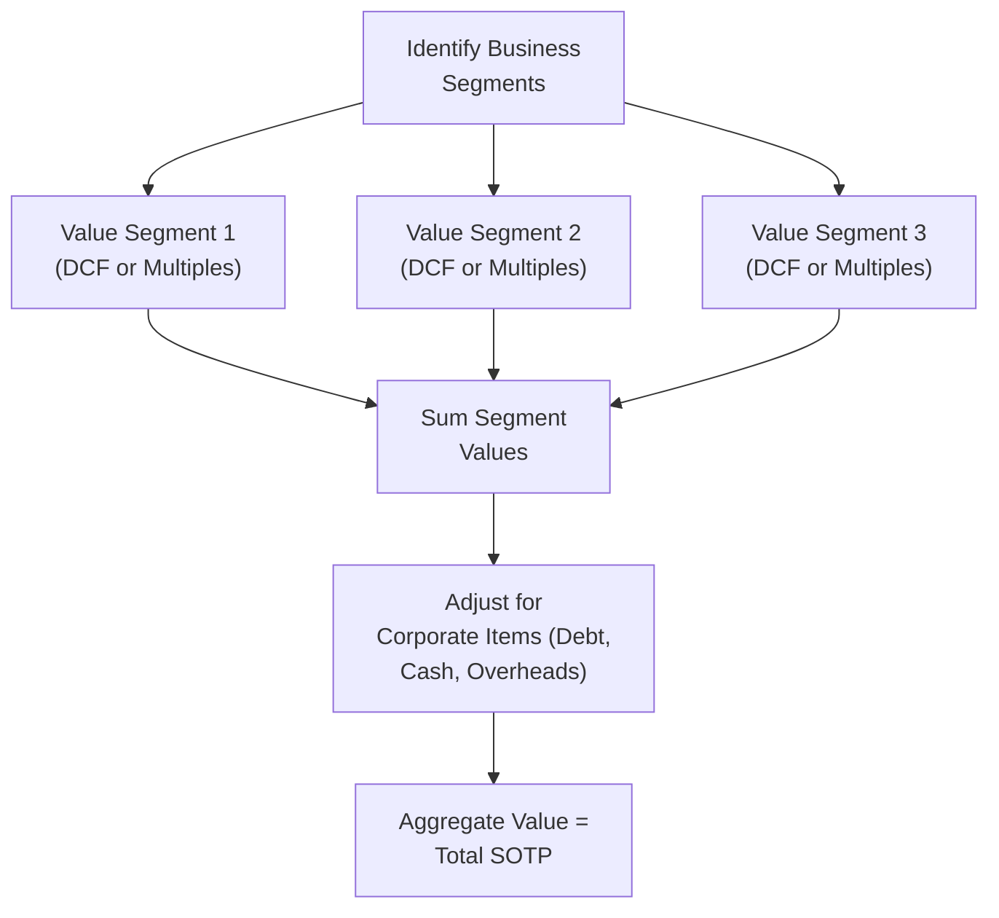

## Introduction
Mergers and acquisitions can sometimes feel downright intimidating. You’ve got two separate firms, each with its own set of assumptions, business lines, intangible assets, and possibly different accounting standards. Now you have to piece everything together—estimate potential synergy, come up with a premium to pay, and figure out how (or if) this transaction creates incremental value for shareholders. Maybe you even wonder if synergy is just a fancy finance buzzword that gets tossed around to justify big purchases. Spoiler alert: synergy can be real, but it requires careful, systematic analysis.

We’ll dig deep into complex M&A valuation, focusing on synergy identification and measurement. We'll then pivot to Sum-of-the-Parts (SOTP) valuation, a method that values each business line or asset group separately and sums them to (hopefully) produce a total that reflects the entire company's worth. And in a big, multi-division merger? Well, it can get complicated, so we’ll tackle typical pitfalls, incorporate intangible assets, and factor in cross-border complexities. Let’s head right in.

## Why Complex M&A and Sum-of-the-Parts Matter
Most equity analysts at Level II are expected to perform thorough valuations for mergers or acquisitions under time constraints—often with partial or incomplete data. Particularly in item set (vignette) formats, you might face:

• Detailed synergy breakdowns (cost savings, revenue enhancements, tax shields).  
• Purchase premiums that exceed the standalone valuation of the target.  
• Debt financing or leveraged buyouts (LBOs), which alter the capital structure.  
• Cross-border transactions introducing currency issues and different regulatory frameworks.  
• Divisions or business segments that require separate valuations.  

If you shrug this stuff off, you could easily overlook hidden value or risk. For instance, intangible assets like patents or brand equity can significantly alter the combined entity’s overall valuation. And if you incorrectly apply synergy to some divisions but not others, you might double count certain line items or mismatch your discount rates. The Sum-of-the-Parts approach helps keep everything tidy by segmenting valuation tasks in a structured manner.

## Identifying and Measuring Synergies
Synergy refers to the extra value created by combining two companies compared to the sum of their standalone values. Often, synergy is categorized into:

• Cost Synergies: Reduction in overhead, procurement, or operational redundancies (e.g., shared back-office systems, headcount rationalization).  
• Revenue Synergies: Cross-selling, expanded product lines, accessing new markets, leveraging distribution channels.  
• Financial Synergies: Lower cost of debt due to an improved credit profile, or use of a target’s net operating losses.  

### A Quick Synergy Example
Imagine Company A acquires Company B. By combining purchasing power, the new entity can lower supplier prices, saving $10 million annually. They also plan to cross-sell each other’s products, bringing in incremental gross profit of $5 million. If you discount these future benefits at, say, 10%, you get the present value of synergy. That synergy then feeds into the combined firm’s overall valuation.

But be cautious: synergy estimates can be overly optimistic—no one wants to tell management that the big deal might be underwhelming. You’d be wise to check synergy assumptions using scenario or sensitivity analysis.

## Purchase Premium and Fair Value Adjustments
When you buy a target, you typically pay a premium above its market price. Suppose the “fair” price of the target was $50 per share, yet the acquirer offers $60. That $10 gap is partly reflective of synergy expectations (or maybe just a frothy market).

Additionally, from an accounting standpoint, you’ll have to adjust many of the target’s assets and liabilities to fair value during the acquisition:

• Inventory re-valued to net realizable value.  
• Property, plant, and equipment re-valued according to market comparables.  
• Recognition of intangible assets (e.g., patents) that might not be on the target’s balance sheet.  
• Potential reclassification of certain liabilities (like legal contingencies, pension obligations, and so forth).

These adjustments matter a lot because they affect post-merger depreciation and amortization—thus impacting future earnings and, by extension, valuation.

## Sum-of-the-Parts (SOTP) Mechanics
A Sum-of-the-Parts (SOTP) approach is basically a “divide and conquer” strategy. Instead of valuing the firm as a single monolith, you carve it into logical segments—maybe by division or product line—and value each slice separately using the best possible method (DCF, multiples, or a combination). Then, you add everything up, subtract intercompany eliminations and overhead, and hopefully arrive at a comprehensive total.

It’s especially helpful in M&A when the target has multiple lines of business. You might discover that certain lines are worth far more than the multiples that the market is applying to the entire company. Or you might see that synergy is more relevant in one division than in another. SOTP can illuminate those differences. In short, analyzing each part helps you avoid burying critical details.

### Common Pitfalls in SOTP
• Double Counting Overhead: If the corporate overhead is central, be careful not to subtract it multiple times.  
• Using Mismatched Comparables: One division might align better with a certain set of peer companies or a certain multiples-based methodology, while others require a different approach.  
• Inconsistent Growth Assumptions: If you assume a 5% perpetual growth for one division and 2% for another, make sure those assumptions are justified. Otherwise, your total can be biased.  
• Ignoring Partial Ownership: If the company only owns 80% of a subsidiary, you should reflect that partial interest accordingly.

## Visualizing the SOTP Approach
Here’s a simplified flowchart illustrating a typical SOTP approach for a multi-division merger:

In practice, synergy often appears as an additional line item once you’ve valued each segment on a standalone basis. You’d add synergy’s present value (or net synergy if some synergy primarily benefits only one or two divisions) to your aggregated segment valuations for a consolidated SOTP result.

## Cross-Border M&A Considerations
If the acquiring and target firms operate under different accounting standards (say, IFRS vs. US GAAP), watch out for differences in asset valuation, revenue recognition, or pension accounting. You might have to restate or reconcile numbers before you apply your synergy calculations.

Currency risk is key, too. If the acquirer’s currency is more stable, the discount rate assumptions could differ from what the target’s local environment suggests. Political risk or capital controls can also impede synergy realization—especially for expansions or cross-selling in new markets.

## Accounting for Intangible Assets
In many transactions, intangible assets can be a huge piece of the puzzle. Things like brand value, trademarks, technology, patents, or in certain industries, even rights to natural resources. These intangible assets often don’t show on the target’s balance sheet at fair value. But once you merge, you must measure them. Sometimes intangible assets get labeled as “goodwill” if you can’t directly identify or separate them. That goodwill can blow up your post-acquisition balance sheet if the premium is large—something that might raise investor eyebrows if synergy doesn’t materialize over time.

## Minority Interest and Partial Ownership
Some divisions might be partially-owned, or the newly combined entity might only acquire 80% of a target. Each partial stake calls for a proportionate share of that division’s discounted cash flow or multiples-based value. For instance, if you value a subsidiary at $100 million but only own two-thirds of it, your share is $66.7 million. The remainder typically shows up as noncontrolling interest (NCI) in consolidated statements.

## Capital Structure Changes: The Impact on Costs of Capital
Head’s up: the M&A deal structure usually changes the acquiring firm’s capital mix. A cash-financed deal (assuming new debt issuance) swells the acquirer’s leverage. So that new debt typically means a higher weighted average cost of capital (WACC)—especially if the combined capital structure is riskier.

If the acquisition is funded by stock, you have to factor in the potential dilution to the acquiring company’s shareholders. And it might even reduce cost of capital if the combined entity has a bigger, more diversified revenue base. The effect can go either way, so you need to be systematic.

## Accretion vs. Dilution Analysis
One short-term measure many analysts use is the accretion/dilution test. It considers how the merger affects the acquiring firm’s earnings per share (EPS):

• Accretive Merger: Combined pro forma EPS is higher than the acquirer’s standalone EPS.  
• Dilutive Merger: Combined EPS is lower than the standalone EPS.  

Sometimes, you’ll see the exam question that says, “Based on the data from the synergy chart and the combined pro forma income statement, is the deal accretive or dilutive?” You’ll do calculations along these lines:

1. Estimate combined net income after synergy.  
2. Divide by the new total number of shares (acquirer + newly issued).  
3. Compare that new EPS to the acquirer’s original EPS.

If synergy is good, it can offset the additional cost of financing or the increase in share count. If synergy is low (or nonexistent), the deal might be dilutive, which can spook investors.

## Scenario and Sensitivity Analysis
Given the number of variables swirling in an M&A, you should test different synergy outcomes, discount rates, and growth assumptions. Let’s say synergy has a 70% chance of being fully realized, a 20% chance of partial realization, and a 10% chance of no synergy at all. You might want to weigh these probabilities or create scenarios for each. This step is invaluable. Because, really, synergy is just a forecast, and forecasts can be wrong—like, really wrong. Better to see how your valuation changes if synergy is 30% below management’s glowing forecast.

## Putting It All Together: A Consolidated Example
Imagine we have a hypothetical scenario:

• Acquirer: TechCo, trading at $80/share with 100 million shares outstanding.  
• Target: SoftServe Inc., trading at $40/share with 50 million shares outstanding.  
• TechCo believes that acquiring SoftServe yields $50 million/year in cost synergies (discount them at 10%). After adjusting for the integration timeline (say 5 years of synergy, then a terminal value), that synergy’s present value is $200 million.  
• Purchase premium: Suppose TechCo offers $2.2 billion total, or $44/share for SoftServe. That’s $200 million above the target’s $2.0 billion “fair” value. TechCo is basically equating synergy to that premium.  
• Capital structure: TechCo issues new shares to fund half of the deal and uses debt for the rest. Post-deal, TechCo’s share count is 115 million.  
• SOTP approach: TechCo has 3 main divisions valued at $3.5 billion total (based on DCF and comparables). SoftServe has 2 divisions: one B2B software line, one consumer app line. Valuations for each line come in at $1.2 billion and $800 million, respectively—but that’s on a standalone basis. Then we add synergy’s $200 million.  
• The new consolidated entity must handle intangible assets from SoftServe’s brand portfolio, valued at $300 million.  
• We also subtract $500 million of new debt.  

You sum up TechCo ($3.5 billion) + SoftServe’s lines ($2.0 billion total) + synergy ($200 million) = $5.7 billion, then factor in intangible brand additions but also the new debt. The final equity value might shift around as you finalize intangible calculations. If you do a pro forma EPS calculation, you might find that EPS changed from $4.00 to, say, $4.05—an accretive scenario. If synergy or intangible asset values differ from your forecast, that EPS might shift again.

## Best Practices and Common Pitfalls
• Keep synergy line items separate to avoid losing them in the noise.  
• Validate synergy claims: caution if synergy seems too large or ambitious.  
• Align discount rates with actual risk; synergy is typically riskier than stable base business cash flows.  
• Watch out for intangible asset valuations that might inflate goodwill.  
• Watch out for partial ownership; apply the correct fraction to your final sums.  
• Don’t forget the “hidden” liabilities—like pending litigation or environmental remediation costs.  

## A Personal Take
I still remember my first big M&A model at an investment bank. We had about eight tabs in the Excel workbook, each capturing synergy from a different angle—operational, financial, intangible. Let me tell you, it was partly guesswork. So a healthy dose of skepticism is not just recommended; it’s essential.

Anyway, if you keep the synergy assumptions transparent, you’ll have an easier time adjusting them, comparing different scenarios, or explaining your logic to the CFO or portfolio managers. That’s the real trick: clarity. Because M&A deals can get extremely messy if synergy is hidden behind overly optimistic labels.

## Conclusion
Complex M&A scenarios are a staple in advanced equity analysis, and for good reason. They test whether you can piece together multiple data points—synergies, intangible assets, partial interests, cross-border nuances—while still applying fundamental valuation principles. A methodical approach helps you avoid double counting and ensures robust synergy estimates. Meanwhile, a well-organized Sum-of-the-Parts analysis sheds light on the mosaic of business lines that might otherwise hide behind consolidated financial statements.

As you tackle exam questions or real-world tasks, keep your synergy logic tight, triple-check your partial ownership assumptions, and be prepared to present your findings in an easy-to-understand format. Trust me, you don’t want to find yourself stuttering in front of a boardroom because you mishandled intangible valuations or used the wrong discount rate for synergy. So go forth, model those synergy gains, and make sure your SOTP approach speaks for itself.

## References
• McKinsey & Company: “Valuation: Measuring and Managing the Value of Companies” (for synergy modeling and SOTP techniques).  
• CFA Institute’s “Corporate Finance” and “Equity Investments” curriculum readings on M&A analysis.  
• Practitioner guides from investment banks (JPMorgan, Goldman Sachs) on synergy best practices.  

## Complex M&A and Sum-of-the-Parts Valuation: Practice Questions



### 1. Evaluating Synergies
- [x] Synergy can be categorized into cost synergies, revenue synergies, and financial synergies. 
- [ ] Synergy is always less than the purchase premium. 
- [ ] Synergy calculations are typically more accurate than standalone business forecasts. 
- [ ] Synergy rarely arises from cross-selling opportunities.

> **Explanation:** Synergies appear in several forms—cost, revenue, and financial. They are not necessarily less than the purchase premium nor always more accurate than standalone forecasts. Cross-selling opportunities are a typical source of revenue synergy.

### 2. Purchase Premium Justification
- [x] A purchase premium is often justified if the present value of synergies exceeds the difference between the target’s fair value and the offered price.
- [ ] A purchase premium has no impact on the target’s balance sheet post-merger.  
- [ ] Premiums are typically recognized as negative goodwill.  
- [ ] Premiums only exist in cross-border transactions.  

> **Explanation:** If a buyer pays more than the target’s fair market value, the justification often comes from the present value of synergies. Goodwill, not negative goodwill, reflects the premium paid over fair value.

### 3. Sum-of-the-Parts (SOTP) Strategy
- [x] Break down the company’s divisions, value them individually, and sum them to arrive at a total.  
- [ ] Classify all divisions as intangible and apply a uniform discount rate.  
- [ ] Merge all divisions first, then value them as a single functional block.  
- [ ] Omit intangible assets from SOTP due to their subjective nature.  

> **Explanation:** SOTP involves isolating each division’s valuation (often by DCF or comparables). Intangible assets should be included in SOTP; ignoring them can lead to undervaluation.

### 4. Cross-Border M&A Considerations
- [x] Different accounting standards can lead to hidden valuation discrepancies.  
- [ ] Currency risk rarely affects synergy realization.  
- [ ] Political risk is negligible in cross-border deals if synergy is large.  
- [ ] You should not adjust discount rates for country risk.  

> **Explanation:** Cross-border deals often carry accounting, currency, and political risks that require thorough investigation and adjustments. Discount rates might need upward adjustments to reflect higher country-specific risks.

### 5. Minority Interests
- [x] If you own an 80% stake in a subsidiary, only 80% of that subsidiary’s value is attributed to the parent.  
- [x] Noncontrolling interest represents the remaining portion of ownership.  
- [ ] Cash flow from a partially owned subsidiary cannot be included in valuations.  
- [ ] Minority interests only matter if the subsidiary is publicly traded.  

> **Explanation:** Partial ownership means valuing only the portion you control. Noncontrolling interest accounts for what you do not own. Public listing is irrelevant to whether minority interests exist.

### 6. Capital Structure Changes
- [x] A leveraged buyout can increase WACC if the company’s risk profile rises.  
- [ ] Issuing equity will never dilute the acquirer’s EPS.  
- [ ] A higher debt ratio always lowers WACC.  
- [ ] Capital structure doesn’t affect synergy realization.  

> **Explanation:** Leveraged buyouts often raise financial risk, potentially increasing WACC. Equity issuance can dilute EPS if shares increase faster than incremental net income. Synergy realization can be influenced by how the deal is financed.

### 7. Accretion/Dilution Analysis
- [x] Accretion occurs when pro forma EPS post-merger is higher than the acquirer’s standalone EPS.  
- [ ] A merger is dilutive if synergy exceeds the purchase premium.  
- [ ] Accretion and dilution analysis only applies to private deals.  
- [ ] Synergy has no bearing on accretion/dilution outcomes.  

> **Explanation:** When the acquiring firm’s combined EPS is higher than its standalone EPS, the transaction is accretive. Synergy can offset the cost of financing, thus affecting accretion/dilution outcomes.

### 8. Common Pitfalls in SOTP
- [x] Applying mismatched comparables to different divisions can distort aggregated valuation.  
- [ ] Overhead costs should be counted multiple times so each division stays “fully burdened.”  
- [ ] Growth assumptions do not impact individual segment valuations in SOTP.  
- [ ] Double counting intangible assets is harmless if synergy is high.  

> **Explanation:** SOTP relies on appropriate comparables and consistent assumptions. Overcounting overhead or intangible assets and ignoring consistent growth assumptions can lead to inaccurate valuations.

### 9. Sensitivity Analysis
- [x] Varying discount rates and synergy estimates can show how results change under different scenarios.  
- [ ] Sensitivity analysis is seldom needed when synergy is guaranteed.  
- [ ] Only cost savings require a scenario analysis.  
- [ ] Sensitivity analysis typically understates the variability in synergy outcomes.  

> **Explanation:** Because synergy assumptions can be uncertain, varying discount rates, growth rates, and synergy estimates helps you see how the valuation changes under different “what-if” conditions.

### 10. True or False: Goodwill arises when the purchase price exceeds the identifiable fair value of the acquired net assets.
- [x] True
- [ ] False

> **Explanation:** Goodwill represents the excess of the purchase consideration over the fair value of the acquired company’s identifiable net assets (including intangible assets).


