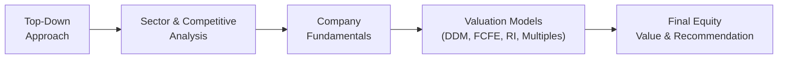
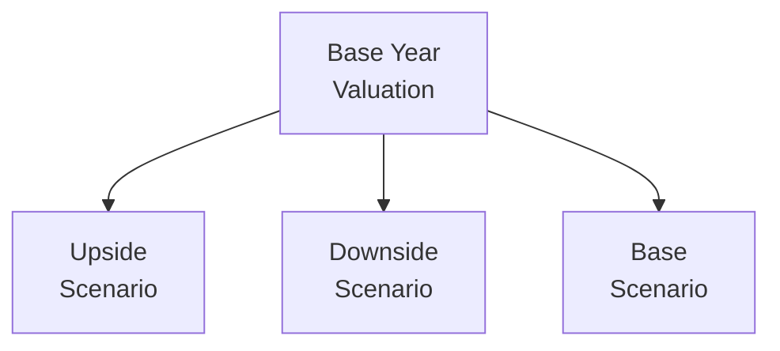

## Introduction

So, here we are: the grand finale of our Equity Investments discussion, where we tie everything together in one big story—kind of like assembling a puzzle after carefully collecting each piece. This final composite vignette is designed to simulate real-life complexity. You’ll see changing interest rates, partial data on growth forecasts, intangible asset write-downs, convertible preferred stock, and shifting consumer trends, all in a single scenario. We’ll need to juggle multiple valuation models—from Dividend Discount (Chapters 6 and 7) and Free Cash Flow (Chapters 8 and 9) to Market Multiples (Chapters 10 and 11) and Residual Income (Chapters 12 and 13). Plus, you’ll have to extract the relevant economic and industry factors (Chapters 4, 20, 26) and watch out for any ESG elements (Chapter 23) or frontier market twists (Chapter 24).

Below, we break down the process step by step so you can see how all these different analyses converge in a single, top-tier equity valuation. This is exactly the type of comprehensive question you might see in a real CFA exam item set—many different data points in a single multi-page scenario. Let’s go for it!

## The Big Picture: A Quick Flow Diagram

Before we dive in, here’s a quick visual of how these steps connect:



This flowchart more or less mirrors the structure of our final composite. We begin with a macro-level approach, we filter down to the industry and company levels, choose appropriate valuation techniques, then unify our results into a final conclusion.

## Step 1: Review Macro and Industry Factors

A good chunk of your item set might revolve around macroeconomic data—like inflation trends, interest rate decisions, changing currency exchange rates, or commodity price shocks. Sometimes, you’ll see references to the Federal Reserve or other central banks raising rates, or perhaps an emerging market environment that’s shaky due to political risks. How do we start?

• Identify Major Drivers: If your target company has significant exports, keep an eye on exchange rates, trade policies, or new tariffs.  
• Classify the Market: From Chapter 5 of this volume, recall that equity markets vary in efficiency. Also, from Chapter 24, we’ve learned about the unique risks in emerging/frontier markets—especially around liquidity and currency.  
• Top-Down Growth and Risk Premium: You might have a scenario requiring you to adjust the equity risk premium or the discount rate based on new country outlooks (Chapter 3). Possibly you’ll need to use a country risk model to incorporate political or liquidity risk.  

Personal anecdote: I remember once reading a vignette that mentioned “a pronounced slowdown in the country’s GDP growth, likely impacting consumer spending.” Such a line often signals that you should reduce your revenue growth assumptions or at least build a downside scenario. Don’t blow past these subtle hints; they’re gold.

## Step 2: Company-Specific Analysis

Now you move from the macro lens to the firm itself. You might see a ream of financial statements, footnotes, and management commentary. The CFO might mention a new product launch or an operational shift to more capital-intensive projects. Here are key elements to watch:

• Capital Structure: Chapter 3’s cost of equity discussion (especially if you have convertible preferred shares, or some unusual debt mix).  
• Dividend Policy: Are stable dividends being paid? Or is management more likely to reinvest cash flows, making a Free Cash Flow to Equity (FCFE) approach more appropriate?  
• Company Life Cycle Stage: If it’s a startup with negative earnings but fast growth, DDM may not apply. If it’s a mature, dividend-paying entity, the Gordon growth model (Chapter 6) or two-stage DDM (Chapter 7) might be your friend.  
• Management Guidance & Strategy: Chapter 21 might remind you that new M&A rumors or synergy discussions could change your assumptions around cash flow and growth.  

If your item set says something like “The CEO expects to aggressively expand into new markets,” that might affect capital expenditures, working capital needs, and thus your FCFE calculation (Chapters 8 and 9). Keep your eyes peeled for references to synergy or intangible assets that might appear in the footnotes.

## Step 3: Building the Valuation Models

Now comes the big modeling stage—where you get to pick the best approach, or sometimes multiple. Typically, the exam item set might prompt you to calculate values using four or five distinct methods, then interpret the differences. Let’s highlight some core approaches:

### Dividend Discount Model (DDM)

• Single-stage or Multi-stage: If the firm is stable, a single-stage (Gordon Growth) might suffice. Otherwise, you’ll need a two-stage or H-Model for transitional growth.  
• Terminal Value: In multi-stage models, the terminal value can represent a large chunk of total present value. Double-check your approach (Chapter 7).  

### Free Cash Flow to Equity (FCFE)

• Forecasting FCFE: Don’t forget to subtract net capital expenditures and changes in net working capital. (Chapters 8 and 9)  
• Capital Structure Changes: If the firm issues or retires debt, your path from Net Income to FCFE may shift.  

### Residual Income (RI)

• Economic Profit or Adjusted Net Profit: Evaluate net operating profit after taxes (NOPAT) or net income minus the equity charge (Chapters 12 and 13).  
• Off-Balance-Sheet Adjustments: Watch out for intangible assets or R&D capitalizations that might skew book value.  

### Market Multiples

• Price/Earnings, Price/Book, EV/EBITDA, etc.: Compare the target firm’s multiples to peers or industry averages, adjusting for different growth or margin profiles (Chapters 10 and 11).  
• Normalized Multiples: If current year earnings are abnormally high or low, you might use an average or forward multiple.  

Don’t be surprised if the question set requires you to do more than one method. You might see a single question that says “Based on both a two-stage DDM and a P/E multiple approach, what’s the value per share?” This is quite common—they want your integrated skill set.

## Step 4: Integrating Footnotes and Special Disclosures

Those pesky footnotes can hide all sorts of goodies:

• Non-Recurring Items: We chatted about this a bunch in Chapter 8. Large legal settlements, restructuring charges, or one-time write-downs are frequent.  
• Convertible Preferred Stock: This might imply potential dilution if converted, impacting the share count in your final valuation.  
• ESG Considerations: For instance, a firm might be heavily investing in “green” projects but incurring short-term losses. See Chapter 23 on how ESG can affect your risk premium or cash flow forecasts.  

Sometimes, exam vignettes mention share buyback programs or new equity issuances. This can drastically alter the cost of equity or capital structure assumptions. Keep calm and read carefully.

## Step 5: Normalizing Financial Statements

Let’s say the item set highlights how the firm had an extraordinary write-down of intangible assets last period, or spent a fortune on an advertising campaign that management claims “won’t recur.” You might need to adjust historical earnings to reflect the “true” underlying performance. 

• Remove or Smooth Anomalies: Take major lumps out of the equation so your forecast doesn’t get skewed.  
• Inflation and Currency: If you have multi-year statements in an inflation-heavy environment, revisit the guidance from Chapter 32 on data adjustments.  
• Listen to Management, But Verify: Just because the CFO says it’s “one-time” expense doesn’t mean you simply forget it. Evaluate the plausibility (and see if it’s re-labeled every year!).  

## Step 6: Scenario Analysis and Sensitivity

In a robust final valuation, you typically want an upside, base, and downside scenario. Perhaps:

1. **Upside**: Strong consumer spending, stable inflation, successful product expansion.  
2. **Base**: Modest growth, stable margins, no major disruptions.  
3. **Downside**: Recession hits, cost of capital spikes, currency fluctuations turn ugly.  

From Chapter 19, we learned about real options. If management can pivot or expand capacity only if the market remains favorable, that’s an embedded real option worth considering.  

Here’s a quick example of scenario-based discount rates using the CAPM:


r_e = R_f + \beta \times (E(R_m) - R_f) + \text{Country Risk Premium} + \text{ESG Adjustment}


Where:

• \\(R_f\\) = risk-free rate (which may change if interest rates are rising)  
• \\(\beta\\) = a measure of systematic risk relative to the market  
• \\((E(R_m) - R_f)\\) = the equity market risk premium  
• Country Risk Premium = additional risk for an emerging or frontier market  
• ESG Adjustment = if the firm has heightened reputational or compliance risk  

In a downside scenario, maybe the risk-free rate rises by 1%, or the country risk premium doubles if the political environment deteriorates.

## Step 7: Putting It All Together

After you’ve done the math for DDM, FCFE, residual income, and perhaps a few multiples, you might see different valuations. Sometimes you get a range; sometimes they cluster close. The final question might ask:

“Based on the range of valuation methods, which value is most appropriate?”

It’s not always about picking the highest or the lowest. Instead, weigh each approach’s strengths:

• If the firm is paying consistent dividends (and dividends reflect economic reality), DDM might be the best.  
• If it’s a growth company with frequent changes to capital structure, maybe FCFE is more reliable.  
• If the core intangible assets are key, maybe residual income is best because it effectively captures the value above the required return on equity.  
• Market multiples can offer a quick sense check—especially if the item set references strong peer comparables.  

And sometimes, you might see a “Weighted Approach.” They could ask for 50% weighting on DDM, 50% on FCFE, or something like that. Keep an eye out for instructions in the vignette about weighting.

## Best Practices and Time Management

When you tackle a real exam item set, it’s easy to get bogged down in details. So:

• Skim the Vignette First: Identify main sections—like footnotes, macros, or statements. You might highlight or circle key data.  
• Calculate Key Inputs Early: If you need \\(\beta\\) or cost of equity in multiple spots, do that once, store it, and reuse.  
• Don’t Over-Calculate: Don’t panic if some data seems “nice but irrelevant.” Not every number in the vignette is used. The exam might be testing your ability to filter out noise.  
• Partial Credit: Show your work. Even if the final answer has a small error, partial credit is awarded if you demonstrate correct methodology.

## Mini Python Example for Quick FCFE Calculation

Sometimes, you might want to quickly test a scenario with a tool. If you’re a Python fan, you can do a little snippet like:

```python

import math

net_income = 120_000_000
dep_amort = 50_000_000
capex = 40_000_000
wc_investment = 10_000_000
net_borrowing = 5_000_000

# FCFE = Net Income + Dep/Amort - CapEx - WC Investment + Net Borrowing

fcfe = net_income + dep_amort - capex - wc_investment + net_borrowing
print(f"FCFE estimate: ${fcfe:,.2f}")
```

Admittedly, you won’t run Python on the exam, but walking through the logic helps you remember the structure of FCFE. The exam expects you to do these steps by hand (with a financial calculator), but you can still practice on a computer for conceptual clarity.

## Additional Visualization: Scenario Tree

If you’re feeling fancy, you can visualize scenario analysis like this:



Each branch might contain different assumptions for revenue growth, margins, or discount rates. 

## Conclusion

And there you have it: an end-to-end equity evaluation that merges top-down analysis, thorough company fundamentals, multiple valuation methodologies, footnote detective work, scenario analysis, and the final sense check. This integrated approach is absolutely critical at Level II. In fact, your ability to smoothly move among DDM, FCFE, RI, and multiples—and then combine them into a cohesive final judgment—is exactly what examiners want to see.

Take your time, practice lots of vignettes, and keep an eye on not just the numbers but also the story behind them: macro shifts, management ambitions, footnotes, and risk factors. Good luck, and enjoy building that well-rounded skill set in equity valuation!

## References

• CFA Program Curriculum, Level II, Equity topic area.  
• Penman, S. H. (2012). Financial Statement Analysis and Security Valuation.  
• Koller, T., Goedhart, M., & Wessels, D. (2020). Valuation: Measuring and Managing the Value of Companies.  
• “Equity Valuation Techniques and Case Studies,” in Chapter 33 of this volume (for a deeper multi-model approach).  
• Chapter 26 (Macroeconomic Analysis), Chapter 28 (Active vs. Passive), and Chapter 32 (Advanced Data Considerations) in this book for extended context.  

## Test Your Knowledge: End-to-End Equity Valuation



### 1. In a composite vignette featuring macroeconomic uncertainty, which factor is most likely to increase the firm’s overall equity risk premium?  
- [ ] Higher expected GDP growth.  
- [x] Rising political uncertainty in the firm’s primary market.  
- [ ] Stable interest rates combined with a strong currency.  
- [ ] Lower corporate tax rates.  

> **Explanation:** Political uncertainty increases the country risk premium, leading to a higher required return on equity.

### 2. A company has convertible preferred stock outstanding. The exam vignette states that conversion could add 2 million shares to the total share count. What is the most direct valuation concern?  
- [ ] The firm’s total debt will rise.  
- [ ] The firm’s dividend yield is understated.  
- [x] Potential dilution of existing equity holders.  
- [ ] The company’s bond rating may be affected.  

> **Explanation:** Convertible preferred shares, once converted, increase the common share count, potentially diluting the existing equity base.

### 3. If you see management reporting an intangible asset write-down due to “declining brand value,” how does this typically affect the Residual Income (RI) valuation approach?  
- [x] It reduces the book value of equity, potentially increasing RI if earnings remain the same.  
- [ ] It increases the market’s P/E multiple for the firm.  
- [ ] It invalidates the use of DDM.  
- [ ] It reduces the company’s cost of equity.  

> **Explanation:** A write-down reduces book value of equity. RI focuses on earnings minus (cost of equity × book value). With a lower beginning book value, the RI can appear larger if earnings remain constant.

### 4. You are normalizing earnings for a one-time legal settlement that occurred in the past year. Which step should you take for valuation purposes?  
- [x] Add back the legal settlement expense to create a more accurate measure of core earnings.  
- [ ] Subtract an additional cost for potential future settlements.  
- [ ] Ignore it; the settlement is too small to matter.  
- [ ] Multiply the legal settlement by 2 to capture potential recurrences.  

> **Explanation:** A one-time legal settlement is typically removed from earnings to create a “normalized” figure reflecting the company’s sustainable performance.

### 5. A two-stage DDM example in an exam vignette forecasts a high growth rate for five years, then transitions to a stable growth rate. If the item set lumps the dividend at the end of each year, how do you calculate present value for the high-growth period?  
- [x] Discount each year’s expected dividend at the cost of equity, then sum those discounted dividends.  
- [ ] Multiply the final year dividend by the stable growth rate.  
- [ ] Apply the perpetuity formula from the first year onward.  
- [ ] Use net income in place of dividends.  

> **Explanation:** In a multi-stage DDM, you discount each projected dividend back to the present for the high-growth phase and later use a terminal value formula for the stable period.

### 6. Which statement best describes partial credit on the CFA exam for multi-step valuation problems?  
- [ ] Partial credit is never given; only the final numeric answer matters.  
- [x] Partial credit is awarded if your methodology is correct, even if numerical errors occur.  
- [ ] Partial credit depends on the question’s difficulty.  
- [ ] Partial credit is offered only if you show your work in a Python script.  

> **Explanation:** The CFA exam typically awards partial credit when candidates demonstrate appropriate methodology but make minor calculation errors.

### 7. In scenario analysis, you assume an upside scenario has improved EBIT margins and lower discount rates. Which of the following best characterizes how you’d reflect this in your FCFE model?  
- [x] Increase forecasted free cash flows and reduce the cost of equity.  
- [ ] Reduce forecasted free cash flows and keep the cost of equity the same.  
- [x] Eliminate terminal value, as it’s not needed in an upside scenario.  
- [ ] Increase depreciation expense.  

> **Explanation:** An upside scenario would likely have higher cash flows (due to improved margins) and a lower required return (due to a more favorable market outlook).

### 8. If the company’s CFO discloses a 25% increase in capital expenditure next year to support a major expansion project, how might this affect your FCFE calculation for that year?  
- [x] FCFE would likely decline, all else equal, due to higher CapEx.  
- [ ] FCFE would increase because more debt is being issued.  
- [ ] FCFE remains unchanged, as CapEx does not factor in.  
- [ ] FCFE is irrelevant under expansion assumptions.  

> **Explanation:** FCFE is reduced by net capital expenditures. If CapEx goes up, your free cash flow to equity typically goes down, unless offset by additional net borrowing or other factors.

### 9. While performing a sum-of-the-parts valuation, you notice one segment is unprofitable. Given limited data, which approach can help best approximate that segment’s value?  
- [x] Use an asset-based approach or liquidation approach for that segment.  
- [ ] Assume it has the same price multiple as profitable segments.  
- [ ] Assign a default zero value.  
- [ ] Exclude it entirely from final valuation.  

> **Explanation:** An unprofitable segment might not be best valued by earnings-based multiples. An asset-based approach (or a partial liquidation assumption) can be more appropriate if operating income is negative.

### 10. True or False: In an integrated vignette, if you see footnote disclosure about “off-balance-sheet leasing liabilities,” the best immediate step is to reduce the total debt on your model.  
- [x] True  
- [ ] False  

> **Explanation:** Off-balance-sheet liabilities are effectively debt-like obligations. You would typically add them to your balance sheet debt, which may reduce equity value or change your capital structure assumptions in a thorough analysis.


