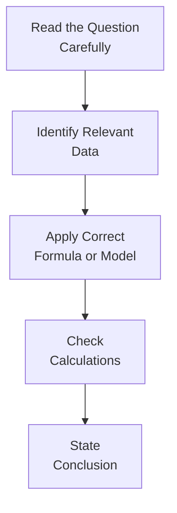

## Introduction
Well, here we are. The final stretch. It’s kind of like that feeling right before a big sports match or a big performance: you’ve trained for months, you know your strengths, but the nerves are still there. It’s normal. I remember my first CFA exam day; I had all these formula sheets taped on my wall and was guzzling coffee like it was water. And yet, I was still paranoid I’d forget something silly like discounting a partial-year cash flow. Fortunately, we can take steps to calm those nerves and maximize our performance. That’s what these final strategies are all about.

Let’s walk through some crucial tips to help you feel confident on exam day for the CFA® 2025 Level II Equity Investments section. We’ll talk about time management, partial credit scoring, logic in your short answers, and of course, all those advanced must-know equity topics—think ESG, factor-based models, synergy analysis in M&A, you name it. We’ll also chat about exam traps, “red herring” data, and building mental checklists so you can handle the item sets with clarity and efficiency.

## Time Management Strategies
Time is perhaps your biggest enemy in the exam. You might look up to see the timer ticking away, and you’ve still got three items unanswered in your last vignette. Sound familiar? Here’s how to avoid that:

• Practice rapid scanning: Item sets are loaded with details. Some matter. Some are “red herrings.” Use your first 30–45 seconds to skim the entire vignette, identifying critical formulas, footnotes, or assumptions that scream “I’m essential!”  
• Start with the question: Another approach is to skip forward to the actual questions first. This strategy lets you read precisely what’s being asked before you skim the text. That way, you know which parts of the data are relevant.  
• Allot time per item set: If you have, for instance, 120 minutes for a certain section, and you see four item sets, plan about 30 minutes each. Resist the urge to linger indefinitely on that tricky synergy valuation question—cut your losses if you’re stuck.  
• Keep notes concise: Jot down key formula references and assumptions. If the question is about free cash flow (FCFF or FCFE), quickly note your cost of equity, after-tax cost of debt, or growth assumptions. Use a consistent shorthand so you’re not rewriting entire paragraphs.

## Partial Credit & Intermediate Calculations
In the essay or short-answer portions (and sometimes even in multiple-choice item sets with partial-credit methodology), showing your work can earn you valuable points:

• Always write out intermediate steps. Even if you freeze and can’t remember the final step in computing Weighted Average Cost of Capital (WACC), the partial credit might still come your way if you’ve correctly computed the after-tax cost of debt and equity proportions.  
• Label each step. For instance, “FCFE in year 1 = Net Income + Non-cash charges – Net capital investment – Debt principal repayment + Debt issuance.” Examiners can see your logic flow.  
• Don’t panic if your final answer seems off. If you suspect your final “equity value per share” is too big or small, but you’ve logically shown every step, the grader may give you partial credit for the correct methodology, even if there was a minor slip-up in the numbers.

## Integrating Advanced Equity Topics Into One Vignette
Level II vignettes can be tricky. They often blend multiple aspects of equity valuation in a single scenario. Picture a question that demands you to integrate:

• ESG considerations affecting the discount rate or growth assumptions.  
• Factor-based insights (like the effect of a firm’s size or momentum factor on expected returns).  
• M&A synergy analysis, perhaps applying an EV/EBITDA multiple to approximate synergy gains in the second stage.  
• Reconciliation across a sum-of-the-parts approach.

You’ll need broad knowledge plus the ability to see how these topics overlap. If an item set references a potential merger, you might have to:

1. Estimate synergy in the form of cost savings.  
2. Adjust your FCFE or EVA (Economic Value Added) models accordingly.  
3. Possibly incorporate a build-up discount rate if it’s a private target.  
4. Reflect any ESG or intangible factors that could influence the firm’s cost of capital or brand equity.  

When in doubt, break it down systematically. That’s where your mental (or physical) checklists come in.

## Logic and Clarity: Short-Answer Responses
So, you’re staring at that short-answer question: “Determine Company X’s intrinsic value incorporating an ESG factor premium.” Many candidates freeze, but the best approach is to be straightforward and clear:

• State your assumptions: “Assuming the ESG premium increases the cost of equity by 50 bps due to additional operational risk, the new required return is now 10.5% instead of 10%.”  
• Apply your go-to formula: “Using a two-stage dividend discount model, with near-term growth at 8% for the first three years, tapering to 3% thereafter…”  
• Show your number line or partial-year bridging if needed. Spell out each piece of your calculation.  
• Summarize your conclusion: “Therefore, the equity is valued at approximately USD 62.50 per share.”

Clarity rules the day. If the exam has to guess at what you’re doing, you might not get credit.

## Typical Exam Traps
We’ve all heard the stories. You’re cruising along, feeling good, until you realize you used the wrong growth rate across multiple segments or you forgot to adjust for minority interests in a sum-of-the-parts analysis. Here are some common gotchas:

• Mixing up cost of equity with WACC. Remember, WACC includes both equity and debt components. If your question specifically asks for “the discount rate for equity valuations,” choose the cost of equity, not WACC.  
• Failing to incorporate partial-year adjustments. This can happen when a cash flow is realized mid-year, or you’re dealing with a shorter or longer accounting period. A factor as simple as 0.5 or 0.75 of a year can drastically alter the value.  
• Overlooking minority interests or intangible assets. Some vignettes distract you with “exciting” synergy figures but bury a footnote that 30% of the target’s equity is not part of the deal.  
• Applying a uniform growth rate to all business segments. The exam might subtly mention that the pharmaceuticals unit grows at 6%, while the consumer goods unit grows at 3%. Don’t just average them blindly.  
• Overcomplicating. Sometimes, a question is direct. Resist the temptation to do extra steps the item set never asked for.

## A Standard Approach to Dissecting Questions
You might want to develop a mini roadmap for each item set:

1. Read the question carefully: Double-check which output they want—Is it enterprise value? Equity value? Weighted or unweighted average?  
2. Identify relevant data: Skim the footnotes, watch for partial-year details, synergy disclaimers, or capital structure changes.  
3. Apply your formula: If it’s a free cash flow approach, do FCFF or FCFE. If it’s a residual income approach, identify the economic profit.  
4. Check your math: Quick logic check—does it make intuitive sense?  
5. State your conclusion: Keep it tidy and easily visible to the graders.

## Ignoring “Red Herrings”
Sometimes the item set is jam-packed with data you really do not need: repeated references to inflation forecasts or expansions in a different segment that’s not relevant to the question. If you identified the key question early, skip the fluff. The exam is known to plant extraneous details to test whether you can sift through noise quickly.

## Ethical Considerations
Remember that the CFA Institute values integrity above all. In a real-world context, you must:

• Acknowledge limitations: If you lack complete data, note it.  
• Avoid biases: Don’t let personal or client biases distort your analysis.  
• Maintain objectivity: Always question your sources, especially data that could be outdated or partial.  
• Comply with the Code and Standards: If you see a conflict of interest or unethical manipulation hidden in the item set, you might be tested on your ability to address it in line with the CFA Institute Standards of Professional Conduct.

Ethics can pop up in an equity vignette or appear as a standalone question. Be prepared to link your knowledge of the Code and Standards to valuation contexts—like disclosing that certain valuations rely on unaudited data.

## Building Mental or Physical Checklists
It might help to have a quick reference. Some candidates physically write out a mini “formula sheet” on scratch paper once the exam starts (where permitted). For instance:

| Key Formula/Item          | Quick Reference                                                            |
|---------------------------|----------------------------------------------------------------------------|
| CAPM (Cost of Equity)     | rᵉ = rᶠ + β(Market Risk Premium)                                           |
| WACC                      | rₐ = (E/V)*rᵉ + (D/V)*rᵈ(1–t)                                              |
| FCFF                      | EBIT(1–t) + Depreciation – CapEx – ΔWorking Capital                        |
| FCFE                      | FCFF – Interest(1–t) + Net Borrowing                                       |
| Gordon Growth Model       | V₀ = D₁ / (r – g)                                                          |
| Residual Income           | RI = Net Income – (Equity Charge) = Net Income – (rᵉ × BV₀)                |
| Sum-of-the-Parts          | Σ(Valuation of Each Segment) – Intersegment Overlaps + Consolidation Items |

Checking each formula helps you avoid a panic meltdown in the test center.

## Real-World References: Helpful but Not Essential
It’s perfectly fine to think about that news story you read on a big tech acquisition or an ESG scandal at a major retailer. These references might help you understand the rationale behind synergy or reputational risk. But the exam item sets are designed to be self-contained. Focus on the data given, your formulas, and the conceptual frameworks. Don’t overcomplicate by trying to re-create a real-world scenario that doesn’t mirror the data in front of you.

## Final Thoughts
The last piece of advice—relax. Not to the point of complacency, of course, but do try to keep perspective. You’ve studied, practiced countless item sets, pored over tricky synergy models, hammered out the difference between FCFF and FCFE a million times, and reviewed your residual income approach with your eyes half-shut at midnight. Trust your preparation.

And please, don’t underestimate the simplicity of human error. I once forgot to account for the existing capital structure in an M&A synergy problem and used only the acquirer’s cost of equity exclusively. My final synergy-based valuation was off. Show your work carefully, keep your calm, and no matter what, keep moving. The exam is a marathon—pacing yourself is everything.

## References and Further Reading
• CFA Institute, “Standards of Practice Handbook,” the essential source for ethical guidelines and real-world conduct.  
• Official CFA Institute Mock Exams for time management practice and for item sets that mirror the actual exam’s difficulty and format.  
• Online question bank platforms such as Kaplan Schweser or Wiley for additional multi-part problem-solving drills.

---

## Test Your Knowledge: Final Equity Exam-Prep Quiz



### Time Management Approach
You are practicing your exam strategy and notice you often run out of time. Which tactic is most effective in ensuring you tackle all items thoroughly?

- [ ] Read every line of the vignette in detail before checking the question.  
- [x] Skim the questions first to identify what data is important, then read the vignette focusing on relevant details.  
- [ ] Skip questions that look too difficult immediately and never return to them.  
- [ ] Plan eight minutes per question, regardless of complexity.  

> **Explanation:** Scanning questions first helps you pinpoint essential information in the vignette. Spending valuable minutes on irrelevant details can hamper your overall progress.

### Partial Credit
On a short-answer question that asks for the valuation of a firm’s equity using FCFE, which is the best strategy if you’re unsure of the final step?

- [ ] Leave the response blank to avoid confusing the grader.  
- [x] Show all your intermediate steps clearly, even if you can’t finish.  
- [ ] Provide a final guess with no supporting calculations.  
- [ ] Copy random formulas in hopes of partial credit.  

> **Explanation:** Demonstrating your methodology can earn partial credit; graders often award points for correct progress even if the final numerical answer is incomplete or slightly off.

### Identifying Red Herrings
A vignette provides multiple data points, including monthly inflation data for the next seven years, foreign exchange projections, and a detailed marketing budget. However, the question only asks for the cost of equity using CAPM. What is the most prudent tactic?

- [ ] Integrate at least one piece of every data set to show thoroughness.  
- [ ] Convert the monthly inflation data to annual and incorporate it into the cost of equity.  
- [x] Recognize these details may be irrelevant “red herrings” and stick to the CAPM formula inputs.  
- [ ] Provide commentary on how inflation and FX could affect the marketing budget.  

> **Explanation:** Focus on the relevant CAPM inputs: risk-free rate, beta, and market risk premium. Other data might distract and consume precious time.

### M&A Synergy Analysis
In an M&A equity valuation item set, you discover synergy estimates that affect revenue growth and cost savings. Which step is most critical to avoid an exam trap?

- [ ] Apply the synergy equally across all business segments or lines of revenue.  
- [ ] Use only the acquirer’s capital structure to value the combined firm.  
- [x] Check if there is a partial ownership or minority interest that may alter final synergy allocations.  
- [ ] Assume synergy always boosts net income by the same proportion.  

> **Explanation:** Exam items often highlight partial interests or segmented gains to test your attention to detail. Confirm who owns what percentage post-merger before applying synergy calculations.

### ESG Factor Premium
You encounter a question asking you to integrate ESG risk factors into the discount rate. Which is the most likely approach?

- [ ] Disregard ESG factors unless the question explicitly states a premium or discount.  
- [ ] Assume ESG always lowers the discount rate.  
- [x] Increase or decrease the cost of equity based on how ESG factors affect perceived risk.  
- [ ] Substitute ESG for the entire risk-free rate in CAPM.  

> **Explanation:** ESG considerations can raise or lower required returns, depending on how they alter the firm’s risk profile. Usually, poorer ESG scores mean heightened risk, raising the cost of equity, whereas strong ESG practices can reduce it.

### Summarizing Logic in Answers
A short-answer question on multi-stage DDM specifically asks you to “justify your assumptions on future growth.” Which step is most beneficial for clarity?

- [x] Briefly state each assumption and cite any data from the vignette that supports it.  
- [ ] Provide only the final formula and outcome.  
- [ ] Use an external real-world example to justify your growth estimates.  
- [ ] Skip justification to save time.  

> **Explanation:** The grader needs to see how you derived your growth assumptions from given information. Even a concise explanation can secure partial credit and demonstrate logical reasoning.

### Dealing with Partial-Year Adjustments
You have a question involving a nine-month forecast before a major capital injection. What’s the main reason partial-year adjustments might trip you up?

- [x] The discounting period or projected cash flow might not align with a standard 12-month assumption.  
- [ ] All exam items assume a 12-month cycle, so partial-year data is always a red herring.  
- [ ] The exam never asks for mid-year discounting or partial projections.  
- [ ] You must apply a zero discount rate for partial years.  

> **Explanation:** A partial-year shift can affect how you discount cash flows or measure returns. Careful is key: you can’t blindly use a full-year factor if the period is nine months.

### Common Pitfalls
Which of the following best exemplifies a common exam trap?

- [ ] Showing intermediate calculations in a well-labeled format.  
- [ ] Double-checking synergy allocations.  
- [ ] Using the cost of equity for equity valuation and WACC for overall firm valuation.  
- [x] Applying a uniform growth rate to every segment despite vignette disclosures stating different rates.  

> **Explanation:** Overlooking that different segments have different growth rates (e.g., consumer goods vs. pharmaceuticals) is a classic pitfall.

### Reconciliation Across Methods
You’re asked to reconcile valuations from DDM, FCFE, and EV/EBITDA multiples. How do you demonstrate alignment?

- [x] Explain differences in assumptions or growth rates used in each method and discuss plausible reasons for discrepancies.  
- [ ] Force all results to match exactly by arbitrarily tweaking the discount rate.  
- [ ] Present only the EV/EBITDA multiple because it’s typically simpler.  
- [ ] Assume the highest valuation is correct because it’s a “best-case scenario.”  

> **Explanation:** Reconciliation entails understanding and justifying why methods differ. For instance, FCFE might incorporate a particular capital structure assumption, while DDM focuses on dividends specifically.

### True/False on Ethics
Shading the data to achieve a client’s target valuation is acceptable so long as you disclose your assumptions.

- [x] True  
- [ ] False  

> **Explanation:** This is actually a trick. Under the CFA Institute Code and Standards, an analyst must remain objective and loyal to fair representation. Any deliberate manipulation or selective bias, even if “disclosed,” is still a serious ethics violation.


