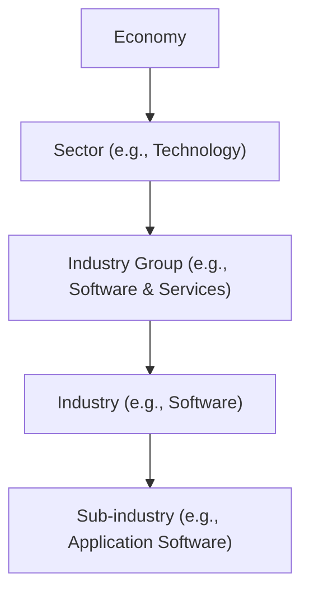

## Major Industry Classification Systems

Before we dive into the intricacies of analyzing companies and their underlying businesses, we have to, well, know where they belong in the grand scheme of sectors and industries. Different industry classification systems can sometimes feel like different languages—but each exists to help investors identify sector boundaries, measure relative performance, and learn who competes with whom. Let’s look at a few widely used systems and figure out how they compare.

### Global Industry Classification Standard (GICS)

GICS is probably the go-to system for many global investors. It was developed by MSCI and S&P, so if you’ve glanced at an S&P sector summary or an MSCI World Index fact sheet, you’ve already brushed shoulders with GICS. GICS classifies companies first by sector (like Financials, Technology, Healthcare), then narrows them down into industry groups, industries, and sub-industries.

It helps unify how analysts around the world speak about industries—an enormous advantage if you’re researching, say, a U.S.-based automotive firm that also has large manufacturing plants in Asia. That said, GICS can occasionally change how it defines certain sectors (for instance, realigning internet-based companies). So it’s wise to keep an eye out for GICS updates, or risk mixing up a so-called Consumer Discretionary company with a Technology one if the guidelines have shifted.

### Industry Classification Benchmark (ICB)

ICB, which is championed by FTSE Russell, is another heavy hitter in the classification space. Similar to GICS, ICB organizes companies into broad industry categories and then drills down into more detailed segments. However, ICB has its own naming conventions—for example, ICB might have a “Financial Services” supersector instead of the “Financials” label you’d see under GICS.

If you’re building a portfolio across different global markets, you might merge index data from providers that use GICS and providers that use ICB. This is one reason reconciling classifications can get so messy. Understanding the differences up front—like which system lumps technology hardware and software together, or which one places them in separate buckets—can help you avoid big confusion or, worse, accidental overweight or underweight exposures.

### Bloomberg Industry Classification Systems (BICS)

The Bloomberg Industry Classification Systems (BICS) is yet another framework that slices the corporate universe into unique sectors and industries. In practice, BICS has some distinct sub-industry definitions that might diverge from GICS or ICB. If you’re using Bloomberg terminals or data extensively, you’ll likely see BICS references.

Occasionally, it feels frustrating if, say, GICS calls a certain e-commerce firm “Consumer Discretionary,” while BICS categorizes it under “Internet & Direct Marketing Retail.” These small definitional discrepancies can have real consequences. Think about comparing P/E ratios across a peer group: if you’re mixing classification systems, you might be inadvertently including or excluding companies that have quite different business models.

### North American Industry Classification System (NAICS)

NAICS is more common in North America for classifying business establishments for economic data and official statistics. It’s used by the U.S., Mexico, and Canada. While you’ll see references to NAICS in corporate documents, trade data, or government releases, it’s less commonly used as the go-to system for broad portfolio investing. That said, if you’re analyzing a U.S.-based firm’s segment disclosures, they might reference NAICS codes, especially in official government filings. Being aware of NAICS categories offers additional perspective—particularly if you need granular data on manufacturing processes or if you’re focusing on certain regulated industries in North America.

## Regulatory, Technological, and Geographical Influences

Of course, classification systems aren’t formed in a vacuum. They reflect how regulators categorize businesses, how technology shapes new forms of commerce (hello, e-commerce and digital media), and how geography modifies the relationship between industries. Some classification systems separate technology hardware (like semiconductors or electronics) from software (like enterprise SaaS). Others nest hardware and software under one big “Technology” sector.

Geographical elements matter, too. A telecom firm might be classified under “Telecommunication Services” in the U.S. market. But in an emerging market country, the same core business—for instance, wireless connectivity—could be segmented differently, especially if the telecom provider is state-owned or heavily regulated. You’ll want to check how classification frameworks account for cross-border differences.

## Common Industry Groups: Cyclical vs. Non-Cyclical, Manufacturing vs. Services

You’ll often hear references to cyclical versus non-cyclical industries, or manufacturing versus service-based sectors, or emerging versus mature industries. These are broader attempts to group companies by how they respond to macroeconomic changes:

• Cyclical industries (think automobile, airline, construction) swing more widely with ups and downs in the economy. During expansions, consumers spend more, and profits jump. In recessions, these firms may get hit hard.  
• Defensive (or non-cyclical) industries (like consumer staples, utilities, healthcare) tend to be more resilient when the economy tanks. People still need essentials, from electricity to basic foodstuffs.  
• Manufacturing vs. services is another typical distinction—particularly if you want to categorize a business by where they add value in the supply chain.  
• Emerging vs. mature industries highlight how the path to growth can differ across technology-based startups, for example, versus well-established industries like heavy industrials.

Such broad categorization sets the foundation for deeper analysis. You might see GICS definitions line up with these cyclical/non-cyclical groupings in a rough sense, but it’s not perfect. Two Consumer Discretionary companies can behave differently in a recession depending on their target demographic or product offerings.

## From Macro-Level Classification to Sub-Industry Detail

Let’s say you’re analyzing a whimsically named behemoth: “TechGlobal Retail Universe Co.” They do a bit of everything: a streaming music service, an e-commerce platform, and a grocery chain. You’ll often discover that big, multinational corporations—especially those with platform business models—resist neat classification. That’s where sub-industry or segment-level breakdown can help.

In many financial statements (especially for publicly listed companies), you’ll find a segment reporting section. This is a gold mine if you’re trying to decompose revenue, EBIT, or other financial measures by line of business. Going from a broad classification like “Consumer Discretionary” to the narrower sub-industries or segments allows you to apply relevant multiples, risk metrics, or peer comparisons. For instance, the online streaming business might be a “Media” segment, while the grocery chain looks more like a “Food & Staples Retailing” sub-industry.

In other words, we start with a macro-level classification: “Consumer Discretionary.” Then we home in on sub-classifications that better reflect each revenue source. This layered approach helps mitigate the risk of using a single classification label that lumps everything together, potentially obscuring unique growth or risk characteristics.

## The Importance of Boundaries and Evolving Business Models

It’s probably no surprise that boundaries within classification frameworks can shift over time. Crossovers between sectors—like “fintech” bridging finance and technology—quantum leaps in communications technology, and all these new platform business models (think ride-sharing or short-term rentals) can stump even the best classification system. Should a ride-sharing platform be considered “Transportation,” “Technology,” or “Consumer Services”?

From an equity analyst’s standpoint, classification mismatch can lead to inaccurate correlations or factor exposures in your portfolio. If the classification thinks the company is a plain old taxi service (high correlation with cyclical indicators) but in reality it’s more a technology platform (potentially a different risk/return profile), that mismatch can wreak havoc on your expected returns or risk tolerance in a portfolio. I once spoke with a fellow analyst who realized half his “Transportation” sector exposure was actually platform-oriented tech companies. That’s a big difference if you’re relying on old classification data.

## Real-World Consequences of Misclassification

Let’s take a hypothetical scenario: An analyst invests heavily in “consumer technology” companies, expecting them to be less sensitive to commodity prices. But if some of these companies were actually heavily reliant on hardware manufacturing in resource-intensive processes, they might be more exposed to raw material fluctuations than the naive classification implied. When aluminum prices spike, the misclassified group could collectively tank, blindsiding our analyst.

Misclassification can also impact your valuation multiples (like P/E, P/B, EV/EBITDA) if your peer group is off. Suppose you inadvertently lump a subscription-based software company with hardware-intensive electronics manufacturers. The margins and capital expenditure needs for software might differ drastically from hardware. Without the correct sub-industry bracket, you might draw the wrong conclusion about fair value.

## Best Practices for Reconciling Different Classifications

• Stay Current: Classification providers periodically adjust sector definitions—like reorganizing “Communications Services” or subdividing “Information Technology.” Keep an eye on official announcements.  
• Cross-Check Data Providers: If you notice that the same company is labeled differently by GICS and ICB (or BICS), investigate why. Usually, the company’s business lines might span multiple industry definitions.  
• Use Segment Reporting: Details in 10-Ks, annual reports, or notes can give you a more accurate decomposition of the revenue streams.  
• Adjust Your Peer Group: If you find a mismatch, refine your peer group to ensure apples-to-apples. Doing so might require a bit of manual classification.  
• Document Your Rationale: In your research notes, explicitly state which classification system you used and why. This is invaluable for internal consistency.

## Classification’s Role in Portfolio Construction and Factor Investing

In advanced portfolio construction, especially factor-based (or “smart beta”) investing, how you classify industries and sectors can massively affect your factor exposures (value, growth, momentum). If your classification lumps diverse companies into a single category, you might incorrectly measure risk or correlation. For instance, cyclical “Consumer Discretionary” might appear to have “value” characteristics if certain sub-industries are mischaracterized. Meanwhile, factor investing is about precision—systematic bets on specific risks require you to know exactly which bucket a company belongs in.

Similarly, from a risk attribution perspective, you might break down your portfolio returns by sector allocation or stock selection within each industry. Using an inconsistent or outdated classification system could either overstate or understate your sector bets, making you scratch your head when your portfolio performance diverges from your risk model’s predictions.

## Glossary

• GICS (Global Industry Classification Standard): A widely used framework by MSCI and S&P that assigns every company to a sector, industry group, industry, and sub-industry.  
• ICB (Industry Classification Benchmark): FTSE Russell’s system for grouping businesses by industry and supersectors.  
• Sector Rotation: Investment strategy that shifts allocation among sectors based on forecasted economic cycles.  
• Cyclical Industry: An industry significantly affected by economic changes (e.g., automotive, consumer discretionary).  
• Defensive Industry: An industry with stable demand regardless of economic conditions (e.g., utilities, consumer staples).  
• NAICS (North American Industry Classification System): Used principally in the U.S., Canada, and Mexico to classify businesses by type of economic activity.  
• Platform Business Model: A company that generates value by facilitating exchanges among different user groups (often producers and consumers).  
• Segment Reporting: Breakdowns of a company’s financials by major business lines, essential for analyzing diversified firms.

## References and Further Reading

• CFA Institute Level II Curriculum (2025), Equity Investments topic area for official guidance on industry classification.  
• “Equity Asset Valuation” (CFA Institute Investment Series) for classification methodologies and sector analysis frameworks.  
• Damodaran, A. “Investment Valuation: Tools and Techniques for Determining the Value of Any Asset.”  
• Classification provider websites (MSCI, FTSE Russell) for up-to-date methodologies and definitions.  

## Exam Tips

• Clarify which system your practice questions assume—especially in item-set or vignette-based questions referencing various classification frameworks.  
• Watch for “trick” details in vignettes where a company straddles multiple industries.  
• Understand how classification mismatches can affect factor exposures, peer-group comparisons, and final valuation judgments.  
• Practice rewriting a company’s classification if the vignette implies outdated GICS or ICB groupings—this is a handy skill in real-world analysis, too.

## Test Your Knowledge: Identifying Industry Structures and Classifications



### Which industry classification system is most commonly used by MSCI and S&P to categorize companies?

- [x] GICS (Global Industry Classification Standard)
- [ ] ICB (Industry Classification Benchmark)
- [ ] BICS (Bloomberg Industry Classification Systems)
- [ ] NAICS (North American Industry Classification System)

> **Explanation:** GICS is developed by MSCI and S&P, and is widely used for their indices and research reports.

### When comparing GICS and ICB, which statement is correct?

- [x] Each uses similar broad categories but may differ in naming and detailed sub-industry definitions.
- [ ] They are completely identical in sector definitions and nomenclature.
- [ ] ICB is used exclusively in the United States, while GICS is used globally.
- [ ] GICS typically classifies US companies into more supersectors than ICB does.

> **Explanation:** GICS and ICB are similar in that they classify companies by sector and industry but differ in the specifics of their naming conventions and subdivisions.

### A company operates a streaming platform, an e-commerce site, and a grocery chain. When analyzing it, why is segment reporting particularly helpful?

- [x] It breaks down revenue and income by detailed business units, clarifying diverse operations.
- [ ] It consolidates all operations under a single sector label.
- [ ] It eliminates the need for a single classification system.
- [ ] It ensures no classification updates will ever be required.

> **Explanation:** Segment reporting helps you see the unique financial performance of each business line, which may straddle multiple industries or sectors.

### Which factor is least likely to influence how classification systems partition industries?

- [x] The CEO’s personal background.
- [ ] Regulatory structures.
- [ ] Geographic region.
- [ ] Technological developments in the sector.

> **Explanation:** Industry classification systems are shaped by regulation, geography, and tech changes, but not typically by the personal traits of a company’s CEO.

### How might misclassification of a “consumer technology” firm primarily reliant on hardware manufacturing affect valuation?

- [x] It could lead to incorrect assumptions about commodity exposure and distort valuation/trading multiples.
- [ ] It would not matter because all consumer firms behave the same in capital markets.
- [ ] It eliminates the need for peer-to-peer comparisons once the misunderstanding is discovered.
- [ ] It typically produces higher P/E ratios with no material risk implications.

> **Explanation:** Misclassification can lead to overlooking hardware-level commodity exposures, causing incorrect valuation assumptions in peer analysis.

### Why is it important to stay current with updates to classification systems like GICS or ICB?

- [x] Previous sector definitions may have changed, risking incompatible or outdated sector designations.
- [ ] Classification systems rarely evolve, so constant updating is wasted effort.
- [ ] Only newly IPO’d companies are impacted by changes, leaving existing ones unaffected.
- [ ] It helps reduce compliance risks concerning insider trading.

> **Explanation:** Classification frameworks do evolve; an investor relying on old definitions might incorrectly classify and benchmark companies.

### In practice, if GICS classifies a firm as “Technology” but ICB calls it “Media,” what is the best first step?

- [x] Investigate the firm’s business model and segment reporting to see which classification better reflects its main operations.
- [ ] Assume GICS is correct since MSCI is more recognized globally.
- [ ] Immediately switch your entire portfolio to ICB-based definitions.
- [ ] Disregard both definitions and classify it as “Telecommunications.”

> **Explanation:** Evaluating the firm’s segments and actual revenue sources helps resolve which classification better captures its true nature.

### What is the principal use of the North American Industry Classification System (NAICS)?

- [x] It is utilized primarily for economic analysis and government statistics in the U.S., Canada, and Mexico.
- [ ] It is a direct competitor to GICS for global equity investing.
- [ ] It applies only to small businesses lacking international operations.
- [ ] It only covers manufacturing firms in the U.S.

> **Explanation:** NAICS is used chiefly for governmental and economic data collection in North America, not typically for broad portfolio classification.

### Which scenario best illustrates the importance of cyclical vs. defensive industry distinctions?

- [x] Understanding why consumer staple stocks often hold steady in recessions, while luxury retail stocks can plunge.
- [ ] Explaining how technology companies never face cyclical risk because consumers always buy gadgets.
- [ ] Demonstrating that all industries have identical demand fluctuations.
- [ ] Concluding that cyclical industries are always more profitable over the business cycle.

> **Explanation:** Cyclical industries show wide swings depending on economic conditions, while defensive industries are generally more stable, especially during downturns.

### True or False: An analyst can safely ignore industry classifications as long as they focus on bottom-up security selection.

- [x] True
- [ ] False

> **Explanation:** This is a trick question to highlight potential misunderstandings. While bottom-up analysis is crucial, ignoring sector context can lead to misread risks and missed insights, especially regarding peer comparisons, macroeconomic impacts, and factor exposures.


