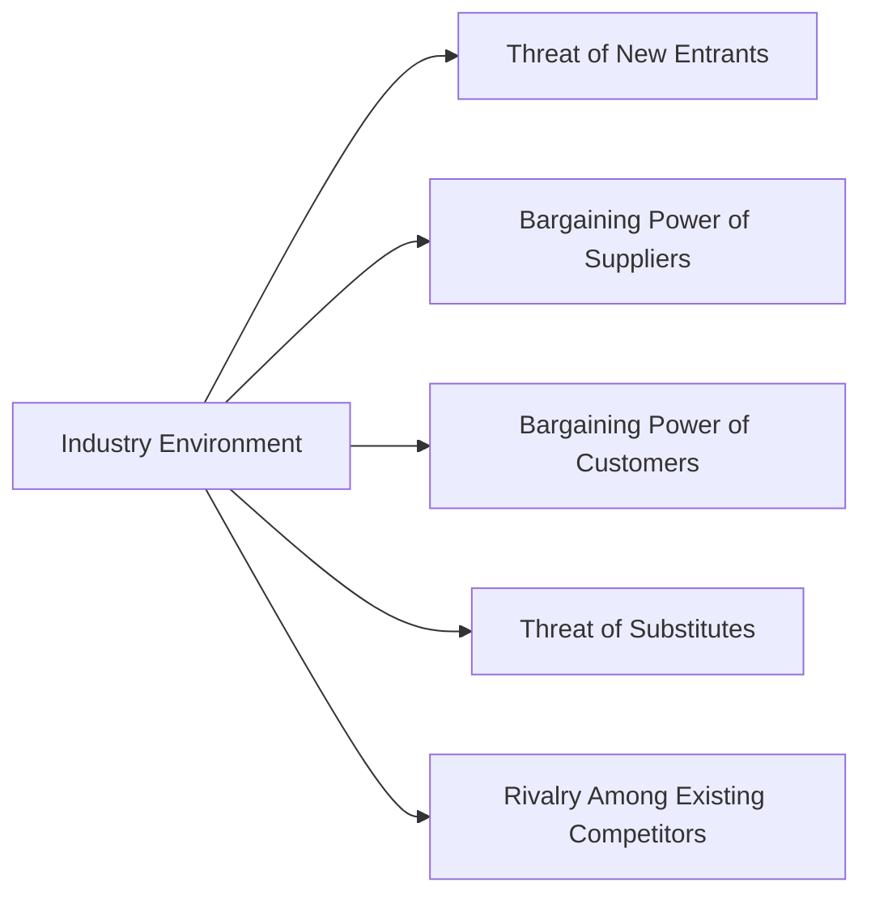

## Understanding the Importance of Competitive Positioning

It’s funny, but some of us learn the significance of competitive positioning only after we’ve spent way too many hours poring over financial statements. I remember my first time estimating fair value for a manufacturing company without fully understanding the competition it faced—I was blindsided by unexpected cost pressures, shrinking margins, and rival firms undercutting every price. That experience hammered home a key lesson: great valuation models often depend on a firm’s place in its competitive ecosystem.

Competitive positioning is all about how a company defends its profitability against competitors, new entrants, powerful suppliers, demanding customers, and substitute products. It can guide our assumptions on revenue growth rates, cost structures, and required returns in various equity valuation models—such as the Dividend Discount Model (DDM), Free Cash Flow to Equity (FCFE), and price multiples. In a way, it’s the lens through which we interpret a firm’s strategic “story,” connecting the dots between what’s happening inside the company and what’s going on outside in the broader market.

## Breaking Down Porter’s Five Forces

Michael Porter’s Five Forces framework is a classic way to analyze the competitive intensity and profit potential of an industry. Each force tells us a different story about where vulnerabilities or strengths may lie. Let’s take a quick look at the big picture:

### Threat of New Entrants

You’ve probably noticed how in some industries—think electric vehicles or streaming platforms—a new company can pop up out of nowhere and cause a massive stir. This force addresses how easily new players can enter your market. If barriers to entry are high (say you need billions in R&D or strong patents), the threat is lower. But if it’s easy to set up a digital storefront with limited capital, new entrants might flood the market. For equity valuation:

• High threat of entrants → Potential margin pressure, which may lower our projected future cash flows.  
• Low threat of entrants → Stronger competitive moat, generally more stable or growing cash flows.

Consider intangible assets here, such as well-known brand names. If a company has cultivated huge brand loyalty, a new competitor might find it harder to break in, effectively lowering the threat of new entrants.

### Bargaining Power of Suppliers

Every company has suppliers for raw materials, labor, or technology inputs. When suppliers are in short supply or provide something super specialized, they can demand higher prices or stricter contract terms. That means narrower margins for the firm. As an analyst, we pay attention to:

• Supplier concentration. Are there just a few big suppliers? That’s a big risk.  
• Differentiation of supplier inputs. If the input is unique, the supplier can charge a premium.  
• Switching costs. High switching costs lock a company into relationships.

From a valuation standpoint, heavy reliance on a single supplier might introduce volatility into cost assumptions, so you’d probably want to discount future cash flows more heavily or adjust your margin estimates downward.

### Bargaining Power of Customers

On the flip side, if your customers have serious leverage—maybe they’re large wholesale distributors or major retailers who can dictate pricing terms—your firm’s margins could suffer. A classic example here is big-box retail giants that can squeeze consumer goods producers for better prices and vendor allowances.

Factors that boost customer bargaining power:
• Customers buying in large volumes.  
• Products widely available from many competitors.  
• Low switching costs for customers.  

When analyzing a company’s revenue forecasts in an FCFE model, for instance, you might need to consider discounting future cash flows if buyer power is expected to remain strong or intensify.

### Threat of Substitutes

Over the years, we’ve seen entire industries disrupted by new technology or business models that weren’t even on the radar. Traditional cable TV got bulldozed by streaming, for instance. If there’s a feasible alternative to what your firm sells, customers might jump ship, forcing price cuts or investments in new product lines.

Signs of a high threat of substitutes:
• The substitute offers a better price-to-value balance.  
• Switching to a substitute is frictionless.  
• Rapid technological change fosters new solutions.  

When a high threat of substitutes looms, we remain cautious with the growth rates we pick for the DDM or the multiples we apply in our valuation. Because if revenue might be eaten away by new offerings, the firm’s uncertain growth story demands a higher risk premium.

### Rivalry Among Existing Competitors

At the core, rivalry is how fiercely companies fight each other on price, service, or innovation. Intense rivalry often compresses returns and can lead to price wars. Key indicators of rivalry intensity include:

• Number and relative size of rivals.  
• Industry growth rates (slow growth can stoke fights for market share).  
• Product/service differentiation (if it’s purely a commodity, rivalry is brutal).  

If careful analysis uncovers an industry locked in a relentless battle with no real winners, you’ll likely be cautious about crediting robust profit margins or stable earnings growth in your discounted cash flow or residual income calculations.

## Blending Competitive Positioning with Valuation

So how exactly do these five forces tie back to your valuation approach? Well, each force can adjust a range of inputs in your models:

• Revenue Growth: High threat of substitutes or intense rivalry may force you to lower top-line expectations. Conversely, a strong moat or limited competition can justify a more optimistic growth scenario.  
• Operating Margins: Dominant suppliers or strong customers might squeeze margins, while cost leadership or brand differentiation might stabilize or elevate them.  
• Risk Premium: The more unpredictable an industry’s dynamics, the higher the equity risk premium you might consider adding to your discount rate. That’s especially relevant when you’re building out something like a CAPM-based cost of equity.

In a Dividend Discount Model, for instance, the expected growth in dividends is highly dependent on how stable or intense the competitive environment is. In a Free Cash Flow (FCFE) model, the effect of the Five Forces might show up in everything from revenue forecasts, capital expenditure needs (e.g., to maintain a technology edge), or working capital budgets. Even when using valuation multiples (like P/E or EV/EBITDA), the quality of a firm’s competitive positioning often justifies higher or lower multiples compared to industry peers.

## Strategic Positioning: From Cost Leadership to Differentiation

While Five Forces help map the industry landscape, a firm’s own strategy decides how it might tilt or exploit those forces in its favor. Typically, companies adopt one of these main strategies:

Cost Leadership  
A cost leader aims to be the low-cost producer in the industry. Think about large retail chains that mass-purchase directly from manufacturers. If you’re analyzing a cost leader, you might assume they can weather price-based competition better, but you need to see if they have the scale or operational efficiencies to keep costs consistently low.

Differentiation  
Differentiate or die—at least that’s one mantra for brands selling a premium product or experience. For example, a luxury auto manufacturer tries to ensure that customers cannot just switch to a cheaper competitor without sacrificing the brand mystique or advanced technology. In valuations, a well-executed differentiation strategy might justify higher revenue growth and margin sustainability.

Focus  
Some companies carve out a market niche, focusing on a specialized product or a specific demographic. This can produce loyal customers and sometimes insulate against major competitors. From a valuation angle, niche focus can deliver stable—but maybe not super large—market share. The big question you’ll want to answer: is the niche big enough and defendable enough to drive robust margins in the long run?

## The Role of Intangible Assets and Moats

Now, let’s talk about something many of us find both exciting and slightly mysterious: intangible assets like brand equity, patents, and proprietary technology. These intangibles can alter how the Five Forces play out in real life. After all, if your brand is powerful enough, you effectively reduce the threat of substitutes and new entrants, while possibly boosting your ability to dictate favorable terms with suppliers or customers.

• Patents or proprietary tech → Raise barriers to entry; reduce threat of new entrants.  
• Strong brand loyalty → Lower threat of substitutes; mitigate buyer power.  
• Distribution networks → Lock down channels, limit rivalry.

In equity valuation, intangible assets can justify robust assumptions for growth, margins, or intangible synergy effects, though you want to weigh potential risk from patent expiration or brand dilution.

## Technology and Regulation: The Evolving Face of Five Forces

Let’s admit it—Porter’s model is timeless, but it doesn’t always capture how swiftly technology can upend entire markets. Digital platforms, for example, can bring new entrants into a market more easily but also create massive network effects that raise barriers for latecomers. Regulatory changes can swing the advantage from incumbents to newcomers (or vice versa). If new regulations dramatically raise the compliance costs for new entrants, existing players might lock in their advantage for years.

You can see this dynamic in fintech, where new mobile payment apps quickly challenged traditional banking. Initially, they faced low entry barriers (a good app and attractive user interface), but in some regions, regulatory hurdles eventually got steeper, changing that initial open door. As an equity analyst, it’s crucial to stay on top of these evolving landscapes—because your forecasts are only as good as your understanding of what might change tomorrow.

## Putting It All Together

Here’s how you might integrate everything step by step:

1. Industry Scan: Identify the five forces in the context of your target industry. Map out which forces are most significant.  
2. Firm-Specific Strategy: Layer the firm’s strategic positioning on top of the industry forces. Are they a cost leader? Do they differentiate?  
3. Intangible Strengths: Check for branded advantages, patents, or other moats that influence the intensity of these forces.  
4. Technological and Regulatory Landscape: Account for new disruptions or policy shifts that may amplify or mute the forces.  
5. Valuation Adjustments: Reflect each competitive insight in your valuation model assumptions (growth rates, margin expectations, discount rates, scenario analysis).

Honestly, it’s a balancing act. You don’t want to “double count” risk by assuming both a super high discount rate and slashing growth estimates. Neither do you want fairy-tale numbers that assume the best of all worlds.

## Best Practices, Pitfalls, and Conclusions

• Remain Current: Keep up with real-time industry narratives and new competitive shifts—especially with technology.  
• Watch for Over-Optimism: Too often, analysts fall in love with a company’s product or brand and overlook creeping threats like rival technologies or subtle shifts in buyer behavior.  
• Cross-Validate: Use multiple valuation approaches (DDM, FCFE, and multiples) to triangulate on a plausible range of values, ensuring your assumptions about competition are consistent throughout.  
• Leverage Scenario Analysis: Model best-, base-, and worst-case scenarios, adjusting for how you see the Five Forces playing out.  
• Revisit the Forces Periodically: Industries evolve. Today’s advantage could vanish if a new regulation or tech breaks the current rules of the game.

And, of course, keep refining your knowledge. Porter’s Five Forces is a fantastic tool, but it’s not the only analytical lens. Complement it with macroeconomic indicators, value chain analysis, and thorough due diligence on intangible assets to paint a complete picture.

---

### References

- Porter, M.E., “Competitive Strategy.”  
- Ghemawat, P. & Rivkin, J., “Strategy and the Business Landscape.”  
- Porter, M.E., “What Is Strategy?” Harvard Business Review.  
- Damodaran, A., “Damodaran Online Resources” (pages.stern.nyu.edu/~adamodar/).

---

## Test Your Knowledge: Competitive Positioning and Five Forces Quiz



### Which of the following is NOT one of Porter’s Five Forces in industry analysis?

- [ ] Threat of New Entrants
- [ ] Bargaining Power of Suppliers
- [x] Macroeconomic Inflation Rate
- [ ] Rivalry Among Existing Competitors

> **Explanation:** Porter’s framework focuses on entrants, suppliers, customers, substitutes, and rivalry. Inflation is an important macro factor but not one of the Five Forces.

### How might a high threat of potential new entrants affect a company’s estimated operating margins in a valuation model?

- [ ] Operating margins would automatically increase due to higher demand.
- [x] Operating margins could decrease because new competitors may push prices down.
- [ ] Operating margins remain unchanged if the firm has a stable strategy.
- [ ] Operating margins become unpredictable but typically double over time.

> **Explanation:** When new entrants can jump into the market easily, competition rises, often pushing prices down or boosting costs (e.g., marketing), thus reducing margins.

### Which key factor generally increases the bargaining power of suppliers?

- [x] Suppliers providing specialized or unique inputs difficult to substitute.
- [ ] A fragmented supplier base with many small players.
- [ ] Suppliers paying premium prices for the buying firm’s product.
- [ ] Easy availability of raw materials at discounted rates.

> **Explanation:** When suppliers offer specialized inputs or are few in number, their leverage rises and they can demand higher prices.

### A firm’s competitive advantage can be significantly bolstered through intangible assets. Which example best describes that scenario?

- [ ] A company’s large real estate holdings in downtown areas.
- [x] A patent-protected technology that competitors must license.
- [ ] Access to cheap commodity resources.
- [ ] A lease agreement for office equipment.

> **Explanation:** Patent-protected technology is a true intangible advantage that can impede rivals from replicating the firm’s offering.

### Which statement best describes how rivalry among existing competitors can impact equity valuations?

- [ ] It promotes uniform price increases across all firms.
- [ ] It ensures that margins will automatically grow over time.
- [x] It often compresses margins, which may reduce firm value in DDM or FCFE models.
- [ ] It creates consistent upward pressure on market share.

> **Explanation:** Fierce rivalry can trigger price wars or heavy marketing costs, lowering overall profitability and, consequently, future cash flows and valuations.

### In digital platform-based industries, how might technology alter barriers to entry?

- [ ] Technology generally has no impact on barriers to entry.
- [ ] Technology typically discourages new entrants by increasing initial capital demands.
- [ ] Technology usually eliminates all competition, making one firm dominant.
- [x] Technology might lower barriers for new entrants but also create network effects that favor incumbents.

> **Explanation:** Advanced digital tools can make it easier for newcomers to enter, but strong network effects can also help established players maintain or increase their moat.

### When analyzing the implications of buyer power on a company’s projected sales, what outcome is most commonly expected?

- [x] Prices and profit margins may be pressured downward if buyers possess strong negotiation leverage.
- [ ] Buyer power has virtually no influence on revenue.
- [x] Buyer power translates to higher product prices.
- [ ] Buyer power solely affects operating expenses, not sales.

> **Explanation:** Large or influential customers can demand better pricing or product terms, which can reduce the selling firm’s revenues and margins.

### A focus strategy differs from cost leadership and differentiation primarily in that it:

- [ ] Aims to become the exclusive supplier of raw materials for the entire industry.
- [x] Concentrates on a specific market niche or segment to tailor products or services.
- [ ] Ensures the firm has the highest market share in the entire industry.
- [ ] Relies solely on price cutting as a competitive tool.

> **Explanation:** Focus strategies target particular niches or customer segments rather than serving the entire market with low cost or premium differentiation.

### Which example best demonstrates how substitutes can undermine industry profits?

- [x] Ride-hailing apps eroding traditional taxi revenues.
- [ ] A single supplier becoming more expensive.
- [ ] A competitor merges with another firm to expand operations.
- [ ] A surprising rise in the cost of raw materials.

> **Explanation:** Substitutes like ride-hailing apps can siphon off demand from taxis, forcing original providers to cut prices or lose market share.

### True or False: In a strong differentiation strategy, a firm typically lowers its product prices significantly below competitors to capture market share.

- [ ] True
- [x] False

> **Explanation:** Differentiation focuses on creating unique value that justifies premium pricing, not undercutting competitors on price.


