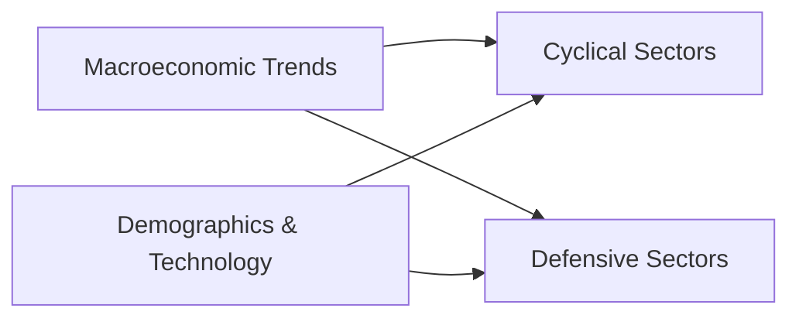

Every industry has its own unique drivers and vulnerabilities—sometimes they’re hidden just below the surface. When I was first analyzing the healthcare sector a few years back, I vividly remember the light bulb moment when I realized how an aging population wasn’t just a trend, but a persistent, powerful wave reshaping demand for everything from hospital beds to over-the-counter pain meds. It was a true “aha” that underscored why carefully focusing on sector-specific growth drivers and risks can make or break an equity investment thesis. Below, we’ll walk through what moves each major industry, how cyclical versus defensive factors play out, and how to weave together top-down and bottom-up approaches. By the end, you’ll have a solid foundation to evaluate industries and companies with more nuance and confidence.

## Understanding Sector-Specific Growth Drivers

Sectors are not created equal. Each exhibits sensitivities to different macroeconomic indicators (like GDP growth or interest rates), demographic shifts, and disruptive technologies that either accelerate or dampen growth. A good starting point is to categorize sectors into cyclical, defensive, or somewhere in between. Cyclical sectors—like consumer discretionary, industrials, and materials—thrive when the economic tide is rising. Defensive sectors—like utilities, healthcare, and consumer staples—remain relatively steady, even when the economic cycle turns south.

Key definitions worth remembering:  
• Secular Trends: These are marathon drivers, such as digital transformation or sustainability mandates, that can last for decades.  
• Cyclical Sectors: Revenues and earnings in these industries wax and wane with the business cycle. Automotive, construction, and travel typically see big ups and downs.  
• Defensive Sectors: Industries that remain comparatively stable, regardless of whether the economy is booming or in the doldrums. Think utilities, healthcare, or essential consumer products (like groceries).  

Below is a simple visual to help illustrate how drivers flow into sectors:

## Macroeconomic Trends: The Big Picture

Before zeroing in on how a specific sector behaves, it helps to consider the broader macro environment. Things like GDP growth, inflation, unemployment, interest rates, and consumer confidence play starring roles. For instance, when interest rates are low, people can borrow cheaply. This usually spikes demand for housing, vehicles, and discretionary goods—giving cyclical sectors a nice tailwind.

But if interest rates rise, or if inflation spirals out of control, the cost of capital goes up, and suddenly big-ticket purchases might be postponed. That’s often when defensive sectors shine. Utilities, for example, don’t really see their profits crater when borrowing costs spike. After all, we all use electricity and water no matter the economy’s state. Therefore:  

• Low Interest Rates: Typically benefit consumer discretionary, housing, automotive, and even financials (though banks have a tricky relationship with rates).  
• High GDP Growth: Often a boon for cyclical sectors. More people employed means more disposable income and higher consumption.  
• Rising Inflation: Can cause margin compression in sectors that can’t pass on rising input costs. At the same time, commodity-related sectors (like energy or agriculture) may benefit if they can sell at higher prices.

## Demographic Drivers

Demographics are often underestimated. An aging population (like in Japan and parts of Western Europe) can supercharge healthcare and pharmaceutical sectors. Younger populations, on the other hand, tend to drive consumer-tech adoption. In emerging markets with a rapidly growing middle class, consumer staples and financial services often take off as more people open bank accounts, borrow money, or purchase brand-name goods.  

Look out for trends such as:  
• Changing Family Structures: Smaller households might shift demand for housing types or personal convenience services.  
• Population Movement: Urbanization can boost real estate prices in certain areas, fueling commercial property developers and construction.  
• Workforce Composition: For technology, a younger, tech-savvy workforce can also lead to increased adoption of software services and digital platforms.

## Technological Forces

Technology can be the rocket fuel or the wrecking ball. Companies caught on the wrong side of a technological disruption can quickly become irrelevant (just ask anyone who bet heavily on physical media in a streaming world). On the flip side, early adopters or producers of disruptive tech often enjoy long-term growth. Some current forces to watch include:  
• Artificial Intelligence (AI): Enabling advanced analytics, automation, and personalized services across sectors—particularly in healthcare, financial services, and consumer tech.  
• Cloud Computing: Continuing to transform business models with scalable and cost-effective data management.  
• Renewable Energy Innovations: Shifting the energy sector’s focus from fossil fuels to solar, wind, and other renewables.  

This interplay of technology can create brand-new sub-sectors or transform entire industries—making them more efficient or rendering old business models obsolete.

## Regulatory and Policy Influences

Regulations can be both catalysts and risks. The financial sector knows this well, as stress tests, capital requirements, and new consumer protection laws heavily influence banks’ lending behavior and profitability. Healthcare reimbursement policies (Medicare, Medicaid, or universal healthcare systems) can shape the entire healthcare sector’s revenue model, especially for insurance providers and pharmaceutical companies.  

In the energy space, emission standards or carbon taxes can either hamper traditional fossil-fuel producers or spur growth for renewables. Policies on data privacy, such as the European Union’s General Data Protection Regulation (GDPR), affect the tech sector globally. Essentially, if you’re going to forecast the future of any sector, regulatory frameworks can cause abrupt shifts almost overnight—adding a layer of complexity to your investment thesis.

## Localized Risks in Emerging Markets

Emerging markets have an additional swirl of political, currency, and capital flow dynamics. One moment, booming commodity exports can fund infrastructure growth, lifting an entire economy. Next moment, a surprise election result or social unrest could grind growth to a standstill. For instance, the commodity-rich Latin American countries often see significant GDP fluctuations based on metal and oil prices. Meanwhile, their currencies can be volatile, adding exchange rate risk for foreign investors.

Be mindful that sector growth patterns in emerging markets can differ from those in developed countries. A mobile payments app might skip the entire retail banking step if large parts of the population never had traditional bank accounts in the first place. This “leapfrogging” phenomenon is common in tech and telecom in emerging regions, which can accelerate some industries far faster than in more established markets.

## Evaluating Company Fundamentals in a Sector Context

While top-down sector analysis sets the stage, understanding the fundamentals of individual companies is equally critical. Metrics vary by industry and reflect the nature of their business:

• Retail & Consumer Goods: Same-store sales growth, inventory turnover, brand loyalty measures, and e-commerce penetration.  
• Banking & Financials: Net interest margin (NIM), loan-to-deposit ratio, capital adequacy ratios, and fee-based income.  
• Energy & Utilities: Production capacity, reserve replacement ratios (for oil & gas), cost per kilowatt-hour, regulatory compliance costs.  
• Healthcare: Pipeline development, patent expirations, reimbursement rates, and hospital admissions or occupancy rates.  
• Technology: R&D expenditures, daily active users (DAU), monthly recurring revenue (MRR), product release cycles.

The balance between analyzing sector-specific metrics and the company’s unique strengths or weaknesses is where the magic lies. A company might excel at managing costs or have an innovative product pipeline that’s more robust than competitors, which can offset broader sector headwinds.

## Putting It All Together: Top-Down vs. Bottom-Up

This leads to the classic debate: top-down or bottom-up? Often, a successful analysis requires a blend of both. Top-down starts with macroeconomic indicators, sector trends, then zeroes in on company performance. Bottom-up flips the script—focusing first on the ins and outs of a particular company’s operations, and later relating them to the bigger picture.

You might start by forming a macroeconomic scenario—like stable GDP growth of 2–3%, modest inflation, and moderate interest rates. From there, you predict how cyclical sectors will do versus defensive. Then, you whittle down to the best candidates in your favored sector. Alternatively, if you spot a specific company with a strong balance sheet, brand loyalty, or a powerful technology advantage, you confirm your thesis by checking how sector and macro tailwinds or headwinds might affect it.

## ESG as a Key Growth Driver and Risk Factor

Environmental, social, and governance (ESG) factors are no longer just feel-good metrics. They can be existential for certain sectors. For energy, carbon regulations and climate policies can accelerate the shift from fossil fuels to renewables, while underinvestment in changing technologies can lead to massive stranded assets. For tech, data privacy regulations and social concerns about algorithmic bias and misinformation can hamper growth if mishandled.

On the governance side, companies with strong boards, ethical practices, and transparent reporting often have more stable performance and might avoid sudden reputational damage. Investors increasingly incorporate ESG analytics into valuation, adjusting the cost of equity to reflect heightened ESG risks. In certain markets, strong ESG performance can even attract a premium multiple.

## Common Pitfalls & Best Practices

It’s easy to get lost in the noise. Sometimes, folks fixate on a single driver (like demographic shifts) but overlook a major regulatory overhaul. Or they assume a cyclical upswing will indefinitely last. Here are some tips to keep in mind:

• Avoid Overreliance on One Metric: Combine macroeconomic forecasts with demographic, technologic, and regulatory analyses.  
• Check for Hidden Correlations: Commodity-driven economies can create local booms that mask underlying political or operational risks.  
• Stress-Test Forecasts: Build scenarios for best, base, and worst-case macro environments.  
• Integrate ESG: Evaluate not just near-term financial statements but the long-term sustainability of the business model.

## References

• CFA Institute Level II Curriculum (2025).  
• Industry Guides from S&P Global, FitchRatings, and Moody’s Investors Service.  
• McKinsey Global Institute Reports on global trends.  
• Handbook of Global Industry and Trade Data by Bloomberg, Refinitiv.

---

## Test Your Knowledge on Sector-Specific Growth Drivers and Risks



### Which factor typically provides the most significant growth boost for cyclical sectors like automotive and housing?

- [ ] High unemployment rate
- [ ] Commodity price spikes
- [x] Low interest rates
- [ ] High inflation

> **Explanation:** Cyclical sectors often rely on economic expansions fueled by cheaper credit and strong consumer confidence. When interest rates are low, consumers and businesses borrow more, boosting housing and automotive purchases.

### What is a key feature of defensive sectors?

- [ ] They expand revenues dramatically in strong economic cycles.
- [ ] Their capital expenditures vary greatly with interest rates.
- [x] Their demand tends to remain stable regardless of economic cycles.
- [ ] They are largely isolated from regulatory risks.

> **Explanation:** Defensive sectors produce essential services or goods (e.g., utilities, consumer staples). Demand persists even in economic downturns, so their revenues are less volatile.

### How do demographic shifts generally influence industries over the long term?

- [x] They create secular trends affecting consumption patterns.
- [ ] They cause only short-term disruptions.
- [ ] They primarily affect commodity pricing, not retail demand.
- [ ] They have minimal effect in emerging markets.

> **Explanation:** Demographic changes are secular trends with long-lasting impacts on consumption preferences and demand for products like pharmaceuticals, housing, and financial services.

### Which of the following is an example of technological disruption reshaping a sector?

- [ ] Slight changes to corporate tax rates.
- [x] Cloud computing services moving businesses away from in-house servers.
- [ ] A slowdown in global population growth.
- [ ] Seasonal variations in holiday retail sales.

> **Explanation:** Technological disruptions significantly alter existing business processes or create new ones. Cloud computing lets firms avoid heavy capital investments in IT infrastructure, reshaping how businesses operate.

### Why can changes in healthcare reimbursement policies be classified as both a driver and a risk?

- [x] They can expand or reduce the revenue pool for hospitals and pharmaceuticals.
- [ ] They only impact private insurance companies.
- [x] They typically reduce healthcare utilization.
- [ ] Reimbursement policies never change revenue models.

> **Explanation:** Policy shifts can introduce new funding (and higher demand for services) or reduce overall payments, affecting profit margins. Hence, they can be either beneficial or harmful to sector players.

### Which descriptor best fits emerging markets compared to developed markets?

- [x] Greater political and currency volatility.
- [ ] Zero dependence on commodity exports.
- [ ] Lower growth potential and stable regulations.
- [ ] Minimal influence of demographic changes.

> **Explanation:** Emerging markets often see higher growth potential but also heightened political and currency risks that can abruptly change economic trajectories.

### What is a top-down approach to equity analysis?

- [x] Evaluating macro and sector factors before analyzing individual companies.
- [ ] Focusing only on a company’s balance sheet.
- [ ] Assessing intangible assets in isolation.
- [ ] Prioritizing new product launches over economic cycles.

> **Explanation:** Top-down starts at the macro level, analyzing broad economic conditions and sector trends. Analysts then move down to look at individual company fundamentals.

### Which metric is particularly relevant when evaluating retail companies?

- [ ] Capital adequacy ratio
- [ ] Reserve replacement ratio
- [x] Same-store sales growth
- [ ] Net interest margin

> **Explanation:** For retail analysis, same-store sales growth reveals how existing outlets are performing without the noise of new store openings. Banking uses net interest margin, while energy might focus on reserve replacement.

### How can ESG factors affect the cost of equity in a valuation model?

- [x] Poor ESG credentials may raise a firm’s perceived risk, increasing its cost of equity.
- [ ] ESG factors have no relevance to cost of equity.
- [ ] Strong ESG performance always lowers dividend payouts.
- [ ] Cost of equity is set by regulators, unaffected by ESG metrics.

> **Explanation:** Investors increasingly consider ESG risks. Companies with higher ESG risks might be subject to more volatility and reputational threats, leading to a higher required rate of return for investors.

### The statement “Healthcare demand remains deflated when the economy is in recession” is:

- [ ] True
- [x] False

> **Explanation:** Healthcare is generally considered a defensive sector. Demand for essential medical services stays relatively consistent, regardless of economic booms or busts.


