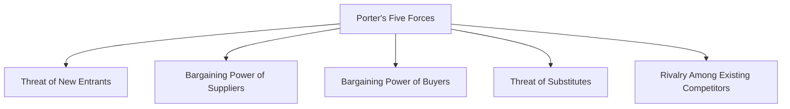

## Introduction to the Practice Vignette

Let’s say we have this brand-new tech hardware company—call it NovaChip, Inc.—ready to make its mark in the mature semiconductor industry. Maybe you’re thinking, “Uh, the semiconductor space is pretty saturated by giant players, how can a new entrant hope to compete?” Good question. This vignette attempts to walk you through the major steps in analyzing NovaChip’s industry classification, its competitive pressures, and the key growth dynamics in play. You’ll see how it all ties neatly into a preliminary revenue growth and margin analysis—critical for an equity valuation. If you’re studying for the CFA exam, especially Level II, you’ll know these frameworks (Porter’s Five Forces, industry classification, etc.) show up frequently in item sets. So let’s dig in.

## The Vignette: NovaChip, Inc.

NovaChip is a privately funded startup specializing in advanced microprocessor designs intended for consumer electronics and automotive applications. The firm is gearing up to compete where established conglomerates already dominate. At a glance:

• Industry Setting: Mature semiconductor manufacturing with fierce cost competition.  
• Regulatory Shifts: Recent government subsidies and tax incentives encourage domestic chip production. Policymakers want to reduce reliance on foreign manufacturers.  
• Rivalry and Supplier Power: A few large foundries (fabrication plants) control manufacturing capacity; high supplier power in essential production inputs. Rivalry is intense because many existing players are fighting for incremental market share.  
• Macro Trends: Global chip shortage, combined with surging demand from automotive and cloud computing. However, new capacity expansions might create overcapacity risks down the line.  
• Revenue Distribution: Current market leaders hold around 70% share (combined). Mid-tier players have 25%. Startups, including NovaChip, make up a tiny 5%.  

NovaChip has some unique angles: they have patented one next-generation microarchitecture promising lower power consumption. And yes, you might guess that academia or smaller R&D outfits often come up with these innovations, but it’s tough to scale production.

Now, let’s see how we’d classify NovaChip, apply Porter’s Five Forces, identify drivers and risks, and integrate this into the firm’s financial outlook.

## Step 1: Industry Classification

Industry classification (reviewed in Section 4.1) is our foundation. The Global Industry Classification Standard (GICS) or the Industry Classification Benchmark (ICB) typically places “Semiconductor” firms within Information Technology. But here’s the twist: NovaChip also offers embedded firmware solutions—so does the software side overshadow the hardware side?

• Primary Revenue Source: NovaChip anticipates 80% of its income from hardware sales (chips, design licensing), with 20% from software solutions. Hence, the firm is best classified under Semiconductors & Semiconductor Equipment rather than Software.  
• Potential Pitfalls: Hybrid companies can be misclassified. If the majority of revenue or strategic focus is on hardware, the classification stays with semiconductors. Another pitfall is ignoring future mix shifts: if their software offering hits it big, reclassification might occur.  

Overall, for exam-style questions, it’s key to articulate a consistent rationale: you choose the industry classification that aligns with the largest revenue or strategic emphasis and remain alert to changes over time.

## Step 2: Porter’s Five Forces Analysis

Porter’s Five Forces (discussed in Section 4.2) provides a structured approach to evaluate the competitive intensity. Let’s map these forces for NovaChip:

1. Threat of New Entrants  
   • Semiconductors demand massive capital expenditures for fabrication plants and R&D. It’s not exactly easy to waltz into the business.  
   • Government incentives reduce some barriers, but it’s still extremely capital-intensive.  
   • Conclusion: The threat of new entrants remains moderate to low.

2. Bargaining Power of Suppliers  
   • Suppliers—especially large foundries and raw materials providers—exert considerable leverage.  
   • With specialized wafer production processes in short supply, NovaChip may face higher costs or capacity constraints.  
   • Conclusion: Supplier power is high, which can squeeze margins for smaller players.

3. Bargaining Power of Buyers  
   • Electronics and automotive giants hold significant negotiating clout. They can switch to other chip suppliers if performance or prices aren’t competitive.  
   • On the flip side, the current chip shortage offers some respite for suppliers; they can charge a premium if they have a niche technology.  
   • Conclusion: Buyer power is high for commoditized chips but somewhat lower for specialized, patented designs like NovaChip’s.

4. Threat of Substitutes  
   • Major alternative solutions include competing chip technologies (ARM-based, RISC-V, etc.) or software-based optimizations that reduce the need for high-end hardware.  
   • It’s not just about brand-to-brand switching; advanced software might replace some hardware functionality.  
   • Conclusion: The threat of substitutes is moderate, especially given rapid innovation cycles.

5. Rivalry Among Existing Competitors  
   • Several heavyweight incumbents (e.g., advanced foundries and integrated device manufacturers) battle for big OEM contracts. Rivalry can be cutthroat as players jostle for incremental share.  
   • Industry consolidation intensifies rivalry because the top firms dominate capacity and distribution.  
   • Conclusion: Rivalry is high.  

Overall, from a short exam-type perspective, the areas of biggest pressure for NovaChip are rivalry among established competitors (they need to differentiate quickly) and supplier power (because they rely heavily on scarce fabrication capacity).

## Step 3: Key Sector Growth Drivers and Risks

Section 4.3 addresses sector-specific drivers. Let’s highlight NovaChip’s context:

• Growth Drivers:  
  – 5G Network Rollouts: Demand for efficient data processing chips, especially in mobile devices and telecom equipment.  
  – Automotive Electrification: Electric vehicles, advanced driver-assistance systems, and in-car infotainment create new demand for specialized semiconductors.  
  – Cloud Computing & Data Centers: Ongoing expansion of data center infrastructure calls for advanced processors and energy-efficient memory solutions.  
  – Government Subsidies: Domestic production incentives, grants, or tax breaks that lower NovaChip’s costs if they operate locally.

• Significant Risks:  
  – Overcapacity: If every firm invests in new fabrication, a capacity glut may result in price declines.  
  – Technology Obsolescence: Rapid leaps in chip technology might render NovaChip’s current designs insufficient or outdated quickly.  
  – Regulatory Complexity: Shifting geopolitical landscapes—tariffs, export restrictions—can hamper cross-border supply chains.  
  – Supplier Bottlenecks and Price Spikes: If raw materials (e.g., rare earth metals) or specialized equipment become more expensive, that squeezes margins.

## Step 4: Preliminary Revenue and Margin Outlook

So, how do we integrate all these factors to get a sense of NovaChip’s potential? This is where the final piece of a typical industry and company analysis flows into your valuation assumptions:

• Revenue Growth Potential:  
  – NovaChip’s specialized design might unlock a premium among niche buyers at first. They could target automotive suppliers in the nascent ADAS (Advanced Driver-Assistance Systems) market.  
  – Government incentives might reduce initial capital costs, spurring faster early growth.  
  – Risk of slower uptake if incumbents quickly replicate NovaChip’s lower-power design or if manufacturing constraints limit production.

• Margin Sustainability:  
  – With high supplier power, NovaChip may face tough cost structures. They need stable foundry relationships.  
  – If the chip shortage persists, NovaChip might charge higher markups—translating into strong early margins.  
  – Longer term, intense rivalry and the possibility of overcapacity can drive margin compression.

The exam tip: articulate these points succinctly. Don’t bury your conclusion in endless bullet points. The CFA exam often values clarity—demonstrate that you understand how each industry factor translates into financial outcomes.

## Key Takeaways for Exam-Style Responses

• Concise Classification Rationale: Cite revenue breakdown or strategic focus to explain the selected classification.  
• Structured Five Forces Evaluation: Address each force with one or two targeted statements, linking it to the potential profitability or risk.  
• Growth Drivers and Risks: Focus on those factors that significantly affect near-term or medium-term performance (avoid listing every minor detail).  
• Consistent Link to Valuation: Show how these factors impact your cost of capital, revenue growth forecasts, or margin assumptions.

When you get a multi-paragraph vignette loaded with data, you don’t have time to debate every minor statistic. Identify the essential pieces—for example, the mention of “supplier bottlenecks” or “government subsidies.” Those clues often reveal where you can expect margin expansion or margin pressure.

## Model Solution Approach

Below is a simplified step-by-step demonstration of how you might structure your answer when faced with a vignette like NovaChip’s. The exam loves clarity and frameworks:

1. Classification and Rationale  
   "Based on GICS definitions, NovaChip should be classified as a semiconductor firm given that hardware revenues represent 80% of total projected revenue."

2. Five Forces Summary  
   "Supplier power is high due to scarce foundry capacity. Rivalry among existing players is also high in a mature market. Buyer power is moderate to high, particularly in commoditized segments. Threat of new entrants is moderate to low given significant capital requirements. Threat of substitutes remains moderate with alternative chip solutions and software equivalents."

3. Growth Drivers and Risks  
   "Key drivers include 5G adoption, automotive electrification, and government incentives. Main risks center on overcapacity, technology obsolescence, and raw material supply constraints."

4. Preliminary Outlook  
   "Given these forces, NovaChip may experience moderate to robust initial revenue growth supported by its unique architecture but will face margin pressures from high supplier power and intense competition."

## References & Further Reading

• Official CFA Institute Practice Questions on Industry & Competitive Analysis (2025 curriculum).  
• Major Equity Research Reports from banks like Goldman Sachs and Morgan Stanley are great for real-life examples of succinct industry analyses.  
• Harvard Business Publishing Case Studies that focus on technology and semiconductor competitions.  
• Section 4.1–4.3 of this volume for deeper dives into industry classification, Porter’s Five Forces, and sector-specific growth drivers.  

Use these materials to see how professional analysts synthesize large volumes of data into a concise, structured conclusion—especially valuable for the time-pressured item set format.

## Test Your Knowledge: Industry & Competitive Strategy Vignette Analysis



### Which statement best captures the primary reason NovaChip should be classified in the Semiconductors & Semiconductor Equipment category?

- [ ] The firm's patents relate solely to software innovations.  
- [ ] The firm's products have a lower barrier to entry due to minimal R&D requirements.  
- [x] The majority of NovaChip’s projected revenue originates from hardware products.  
- [ ] No established competitor dominates the high-end chip market.  

> **Explanation:** Industry classification is typically based on main revenue sources. NovaChip’s focus on hardware sales (about 80%) makes semiconductors the most appropriate classification.

### In the context of the Five Forces, high supplier power often results in:

- [ ] Eroded supplier profitability.  
- [x] Higher input costs for buyers, reducing buyer margins.  
- [ ] Lower exit barriers for new market entrants.  
- [ ] Demand-based pricing power for buyers.  

> **Explanation:** When suppliers wield significant power, they can charge higher input prices or impose stringent contract terms, often squeezing the buyers’ profit margins.

### Which of the following is most likely to decrease buyer power for semiconductor chips?

- [ ] Growing standardization of chip designs.  
- [x] Unique, patented technology that offers performance advantages.  
- [ ] Multiple suppliers producing near-identical chips.  
- [ ] A surplus of available inventory in the market.  

> **Explanation:** If a supplier holds a distinctive technology that offers crucial benefits, buyers have less leverage because alternatives are not easily substitutable.

### The presence of government production incentives in a semiconductor industry primarily:

- [ ] Increases buyer power as more suppliers flood the market.  
- [x] Reduces barriers to entry by lowering initial capital costs.  
- [ ] Eliminates supplier power fully.  
- [ ] Does not affect rivalry among existing firms.  

> **Explanation:** Government subsidies or tax breaks encourage new entrants by reducing the capital burden, partly eroding established barriers to entry.

### Which factor most likely intensifies rivalry in the semiconductor industry?

- [x] High fixed costs and price-sensitive customers.  
- [x] Rapid technology obsolescence.  
- [ ] Abundant availability of raw materials.  
- [ ] Low capital investment requirements.  

> **Explanation:** High fixed costs often force firms to remain competitive on pricing to cover those costs, intensifying rivalry. Rapid tech changes put constant R&D pressure on existing players, hence fueling intense competition.

### A key risk for NovaChip if every competitor expands production simultaneously is:

- [x] Overcapacity leading to downward pressure on chip prices.  
- [ ] A surge in average selling prices, boosting margins.  
- [ ] Lower capital expenditures industry-wide.  
- [ ] Reduced interest in government subsidies.  

> **Explanation:** Overcapacity can push the industry into price wars or force discounting, eroding profitability for all players.

### In evaluating a young semiconductor firm, analyzing the external supply chain is critical because:

- [x] Foundry relationships and raw material availability heavily affect cost structures and production timelines.  
- [ ] Buyers rarely consider a firm’s supply chain in choosing suppliers.  
- [x] Supplier reliability can reduce margin volatility over time.  
- [ ] The supply chain has no impact on technology differentiation.  

> **Explanation:** With high supplier power, stable supply chain relationships and raw material availability can make or break a startup’s ability to scale and maintain healthy margins.

### Which statement best describes the threat of substitutes in semiconductors?

- [x] Rising software optimizations can reduce the need for powerful hardware.  
- [ ] Substitutes are irrelevant due to high capital barriers to entry.  
- [ ] There is no possibility of alternative chip architectures.  
- [ ] Threat of substitutes always dictates pricing power.  

> **Explanation:** Advances in software optimization can sometimes replace the need for specialized hardware, rendering certain chips less essential.

### When framing a concise exam answer on industry growth drivers, it helps to:

- [x] Prioritize the two or three most significant drivers and their direct impacts on revenue.  
- [ ] List a dozen minor factors with minimal explanation to be thorough.  
- [ ] Critique the data’s reliability without linking to valuation.  
- [ ] Avoid referencing macro trends since they are unpredictable.  

> **Explanation:** CFA-style item sets favor clear, direct links between an industry’s largest growth drivers and a firm’s prospective revenue or margins, helping you connect the dots in a limited time frame.

### True or False: Identifying relevant data in a vignette and connecting it directly to your analysis is a recommended best practice.

- [x] True  
- [ ] False  

> **Explanation:** Efficiently parsing large amounts of vignette data and focusing on the most essential information is critical for constructing well-supported conclusions under exam conditions.


