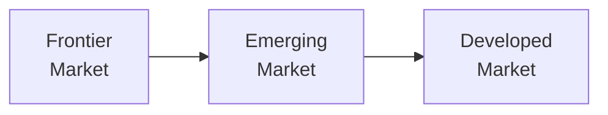

## Introduction to Market Classifications

If you’ve ever chatted with a friend about global investing, you may have thrown around terms like "emerging markets" or "developed economies." But how do we actually draw lines between these categories? And why does it matter for your portfolio? 

Markets generally get sorted into three buckets: developed, emerging, and frontier. Think of them as stages of market evolution—kind of like how we talk about tech start-ups (frontier), scale-ups (emerging), and established giants (developed). The criteria that define these classifications come from factors such as:

• Market size (usually measured by total market capitalization).  
• Liquidity (how easy it is to buy or sell shares).  
• Regulatory framework (the quality and robustness of market rules).  
• Overall economic development (e.g., GDP, infrastructure, stability).  

These distinctions aren’t just for show. They drive how fund managers allocate assets, how analysts gauge risk, and how investors pick stocks. The classification is also central to how index providers—like MSCI and FTSE—structure their country indices. In many ways, it’s the bedrock of understanding the global equity landscape.

## The Rationale for Classification

At the heart of these labels is the idea that markets move through phases of development. A country’s institutional quality, transparency, and sophistication can shape its place in the classification hierarchy. From a CFA Level II perspective, analyzing these differences is crucial because it clarifies:

• Why certain markets have higher or lower liquidity.  
• How political and regulatory conditions can impact valuations.  
• When to factor in additional risk premiums (or discount rates) for investing.  

Recognizing the strengths and weaknesses of a given market classification lets you assess opportunities and challenges more accurately—vital for constructing globally diversified portfolios.

## Developed Markets: Key Features

Developed markets (often abbreviated as DMs) are the "grown-ups" of the global investment world. They typically have:

• High Liquidity: Heavy trading volumes, robust stock exchanges, and sophisticated clearinghouses allow investors to move in and out of positions seamlessly.  
• Stable Regulatory Environment: These markets usually have well-established laws, like strict listing requirements and transparent financial reporting (IFRS, US GAAP, or equivalent). Corporate governance is consistently enforced, reducing uncertainty.  
• Lower Volatility: While no equity market is risk-free, developed markets often exhibit relatively lower volatility. That’s because institutions and investors trust the system (though events like financial crises can still shake things up).  
• Reliable Data and Disclosures: Companies in these markets adhere to internationally recognized accounting standards, which helps analysts make sense of financial statements.

Examples you’ll recognize: the United States, the United Kingdom, Japan, Canada, and much of Western Europe. If you remember how stable the S&P 500 can seem compared to, say, a small African stock exchange, you’re already picturing the difference in maturity. Developed markets are often at the core of global equity portfolios. Their relative consistency in governance and public disclosures leads many managers to consider them the “safe anchor” or “core holding.”

## Emerging Markets: Growth Potential and Risks

Emerging markets (EMs) often get center stage for their higher potential returns—like a fast-growing company that hasn’t yet reached the heights of Apple or Microsoft. Examples are countries such as Brazil, China, India, South Africa, and Indonesia. While these economies can be quite large, they might still have:

• Less Mature Regulatory Frameworks: Rules and enforcement mechanisms may be in flux. Analysts keep a close eye on government reforms, changes in foreign ownership limits, and capital controls.  
• Higher Volatility: Political uncertainty, currency fluctuations, and less liquid markets can lead to pronounced price swings.  
• Significant Growth Opportunities: Urbanization, rising middle classes, and infrastructure expansions often fuel corporate earnings growth, but the path is bumpy.  
• Currency Instability: Exchange rate movements can overshadow your equity gains (or amplify losses), especially if the local currency experiences depreciation or is subject to capital controls.

Emerging markets are the middle children—already on the world’s radar but still ironing out structural kinks. In your portfolio, these markets might offer a diversification benefit because their business cycles can differ from developed economies. On the flip side, you must handle them with care by analyzing extra risk premiums, investigating corporate governance thoroughly, and preparing for sudden regulatory twists.

## Frontier Markets

Frontier markets (FMs) are a notch below emerging markets in terms of development, liquidity, and global integration. Examples include certain countries in Africa, parts of the Middle East, and smaller Asian economies. Think of them as those tiny technology start-ups that are super-exciting but also come with huge operational and reputational risks. Key points include:

• Very Low Liquidity: Bid-ask spreads can be wide, exit opportunities scarce, and daily trading volumes minimal—implying that even medium-sized trades can move prices significantly.  
• Limited Disclosure: Companies might not adhere to robust global reporting standards. Analysts may struggle to piece together consistent historical data.  
• Restricted Access: Foreign investors may face direct ownership limits or need special approvals. Some markets restrict capital repatriation, making it tough to realize gains if you do decide to sell.  
• Potential for Upgrades: With the right structural reforms, a frontier market can graduate to emerging status (e.g., countries like Vietnam are on some index providers’ watchlists).

Approaching frontier markets calls for substantial due diligence, local partnerships, or specialized market knowledge. Investors who get it right can tap into high growth potential and diversification from mainstream global cycles. But the risks—political, operational, and currency—are not for the faint-hearted.

## Index Providers and Classification Criteria

Large index providers—MSCI, FTSE Russell, S&P Dow Jones—assess markets on quantitative and qualitative measures. These might include:

• Openness to foreign ownership: Are there caps on foreign shareholding?  
• Ease of capital repatriation: Can you freely convert and transfer money out?  
• Market depth and liquidity metrics: How big and active is the stock exchange?  
• Level of institutional framework development: Settlement cycles, custody arrangements, and corporate governance standards.

When a country’s market crosses particular thresholds—say, it improves liquidity or relaxes foreign ownership limits—it can be upgraded from frontier to emerging, or from emerging to developed. This reclassification can attract massive inflows as passive funds tracking certain indices add positions. On the flip side, downgrades can trigger substantial outflows.

Here is a simple visual to highlight the progression:

## Investment Strategies Across Classifications

Institutional investors, such as pension funds or endowment funds, often create a strategic asset allocation that segments the global equity universe into developed, emerging, and frontier allocations. Why?

• Diversification: Returns in emerging and frontier markets can be uncorrelated (or loosely correlated) to developed market returns.  
• Growth Potential: Emerging and frontier economies often grow faster, offering greater upside (but also more downside risk).  
• Entity-Level Risk: In some frontier markets, individual equity picks can be gems if you spot them early. But the flip side is higher uncertainty and volatility.

Portfolio construction might be guided by a top-down approach (allocating a specific percentage to each classification) or a bottom-up stock selection approach (looking for undervalued names regardless of classification). In either case, the classification shapes the perceived risk profile, influencing discount rates and expected returns.

## Regulatory Environment and Market Reforms

I recall investing in a company listed in an emerging market where a sudden change in foreign currency regulations caused major disruptions. The government decided to restrict repatriation of dividends and capital, creating an immediate exodus of foreign investors. That’s a prime example of how the local regulatory environment can shift in ways unthinkable in developed markets.

Yet, improvements can happen, too. Over time, with legal reforms, better trading infrastructure, and more transparent disclosures, a frontier market can transition to emerging (or an emerging to developed), often boosting valuations. Keeping a close watch on:

• Legal frameworks (e.g., robust securities laws).  
• Technology improvements in stock exchanges (e.g., better matching systems, reduced settlement times).  
• Reporting standards (move from local GAAP to IFRS).  
• Corporate governance enhancements (e.g., independent boards, protection of minority shareholder rights).  

All of these can serve as signals of upward reclassification potential.

## Implications for Valuation

When you’re doing your discounted cash flow (DCF) or dividend discount model (DDM), keep in mind that emerging and frontier markets often require higher required rates of return because of their higher perceived risk:

• Country Risk Premium: Some practitioners add a country risk premium to the baseline CAPM approach (or use models like the build-up method).  
• Currency Risk: You might model multiple exchange rate scenarios.  
• Data Limitations: Inconsistent financial statements can hamper the reliability of your forecasts.

Emerging and frontier markets can also reflect lower multiples compared to developed markets—partly because investors demand a discount until certain governance or liquidity hurdles are met.

## Challenges in Accessing Data

You might wonder, “How do I perform a thorough analysis if the data is patchy or outdated?” This is a frequent obstacle in frontier markets and, to some extent, emerging ones. Analysts resort to:

• Local research firms specializing in that market.  
• On-ground due diligence—speaking with corporate management, local investors, or government officials.  
• Proxy metrics (like cell phone penetration or satellite imagery of port traffic) to gauge economic trends.  

Yes, it can feel like detective work. But the insights can give you a true information advantage—just be prepared that the cost (time, travel, specialized expertise) isn’t trivial.

## Practical Exercises and Case Studies

• Compare the historical performance and volatility of the MSCI World Index (developed markets), the MSCI Emerging Markets Index, and an MSCI Frontier Index. Note the correlations over different time frames. This helps you see how a reclassification event might affect a portfolio’s returns.  
• Conduct a hypothetical scenario: Suppose a major global index provider announces that country X, currently frontier, will be reclassified to emerging next year. How do you expect local stocks to react? How would you adjust your portfolio or discount rates?  
• Review a real-world example of a market reclassification—such as Kuwait’s move from frontier to emerging (in certain indices). Did foreign investment increase? Did local companies adapt to new disclosure requirements?

## Advanced Analytical Approaches

For those looking to delve deeper:
• Ownership Structures: In certain emerging or frontier markets, families or state entities can hold controlling stakes, which can reduce free float and liquidity. Factor that into your analysis of true market depth.  
• Local Custodians and Settlement: Unreliable custodial relationships or complicated settlement procedures can increase transaction costs and operational risks.  
• Hedging and Repatriation: You might consider using currency futures or swaps to hedge foreign exchange risk. Always check if the local market has liquid derivatives. If not, your hedging might need to be done offshore, adding to complexity.

## Final Exam Tips for CFA Candidates

• Carefully review how index providers define developed, emerging, and frontier markets. Expect a question about how a country’s classification shift impacts expected returns, portfolio flows, or required discount rates.  
• Practice applying a country risk premium in CAPM or a build-up model. The exam might test your ability to incorporate extra risk factors for markets with differing levels of stability.  
• Be ready for scenario-based questions that reference governance or liquidity changes—often these appear in item sets to test your analytical skill in adjusting valuations or risk assessments.

## Glossary

• Market Capitalization: The total value of a company’s shares (price × shares outstanding).  
• Liquidity: The ease of transacting in a market without large price distortions.  
• Regulatory Framework: Laws, guidelines, and standards that govern trading and market conduct.  
• Index Provider: Companies like MSCI or FTSE that maintain benchmark indices.  
• Volatility: How sharply and frequently a price or market moves.  
• Convertibility Risk: The potential inability to convert local currency into foreign currency without restrictions.  
• Foreign Ownership Limits: Government- or exchange-imposed ceilings on how much of a local company foreign investors can hold.  
• Repatriation of Capital: The process of converting and transferring investment returns or principal back to an investor’s domestic market.

## References and Further Reading

• Official CFA Program Curriculum for Level II Equity Investments (Market Organization and Classification).  
• MSCI Research on market classification methodology:  
  https://www.msci.com/market-classification  
• FTSE Russell’s country classification framework:  
  https://www.ftserussell.com  
• Fabozzi, F. J. (Ed.). Handbook of Emerging Markets Investments. (Comprehensive insights on evolving markets.)  

## Test Your Knowledge: Market Classification and Investment Approaches



### Which of the following factors is commonly used by major index providers to classify markets?

- [x] Restrictions on foreign ownership
- [ ] Average passive fund inflows
- [ ] Future GDP growth projections
- [ ] Global currency swap rates

> **Explanation:** Major index providers look at various quantitative and qualitative factors like foreign ownership limits, ease of capital repatriation, and market liquidity. They do not rely purely on GDP projections or fund inflows.

### How might a sudden increase in foreign ownership limits affect an emerging market’s classification?

- [x] It could lead to a reclassification upgrade due to enhanced market openness.
- [ ] It would automatically qualify the market as developed.
- [ ] It would force a downgrade because foreign capital skews valuations.
- [ ] It has no impact on classification changes.

> **Explanation:** A country that decreases restrictions on foreign ownership might improve its openness and liquidity, meeting a criterion for reclassification from frontier to emerging or from emerging to developed.

### Which statement is most accurate regarding currency risk in emerging markets?

- [ ] Currency stability in emerging markets is typically guaranteed by floating exchange rates.
- [x] Currency volatility can significantly impair equity returns when repatriated to the investor’s home currency.
- [ ] Currency risk is minimal for long-term investors because exchange rates do not fluctuate much.
- [ ] None of the above.

> **Explanation:** Emerging markets often experience volatility in their currencies, which can reduce or enhance returns once you convert back to your home currency. Floating exchange rates do not eliminate risk.

### In developed markets, investors typically benefit from:

- [x] Well-established regulatory frameworks and higher liquidity.
- [ ] Frequent capital transfer restrictions and high transaction costs.
- [ ] Chronic data inaccuracy and unregulated stock exchanges.
- [ ] Maximum short-term price volatility due to limited governance.

> **Explanation:** Developed markets are characterized by robust infrastructure, transparent regulations, and established governance, leading to higher liquidity and consistent data quality.

### What is a key risk associated with investing in frontier markets that is less prevalent in developed markets?

- [ ] Declining demographic trends
- [x] Limited disclosure and inconsistent financial reporting
- [ ] Very low corporate tax rates
- [ ] Excessive analyst coverage skewing valuations

> **Explanation:** A hallmark of frontier markets is the limited availability and reliability of financial data. Investors face greater uncertainty and must rely on local sources or specialized research.

### Which of the following highlights a practical benefit of including emerging markets in a global portfolio?

- [x] Potential diversification benefits relative to developed markets
- [ ] Guaranteed reduction in overall portfolio volatility
- [ ] Elimination of any exchange rate risk
- [ ] Removal of all idiosyncratic political risks

> **Explanation:** While not guaranteeing lower volatility, emerging markets can provide diversification benefits due to different economic cycles and sometimes lower correlations with developed markets.

### A common approach to account for political risk in emerging market valuations is:

- [ ] Ignoring it, as political risk never materializes
- [ ] Applying only a short-term discount rate
- [x] Adding a country risk premium to the cost of equity
- [ ] Using forward exchange contracts to hedge

> **Explanation:** Analysts frequently add a country risk premium in models like CAPM or the build-up method to reflect the heightened political and regulatory uncertainty.

### One reason a frontier market might exhibit low liquidity is:

- [ ] Excess foreign institutional investment
- [x] Very few buyers and sellers leading to wide bid-ask spreads
- [ ] Overwhelming local analyst coverage
- [ ] Strict adoption of IFRS standards

> **Explanation:** Frontier markets often see low daily trading volumes and limited market participants. As a result, transactions can have a significant price impact and wide bid-ask spreads.

### When a country is upgraded from frontier to emerging status, portfolio flows are likely to:

- [x] Increase, as benchmarked funds typically add positions in the newly upgraded market.
- [ ] Immediately stop, as valuations become overpriced.
- [ ] Decrease due to investor skepticism.
- [ ] Remain unchanged because classification changes do not affect capital flows.

> **Explanation:** Many index-tracking and global investors allocate more capital to markets once they meet the criteria for emerging status, often creating a surge in inflows.

### A statement like “Frontier markets pose minimal risk to global investors” is:

- [x] True
- [ ] False

> **Explanation:** Frontier markets can be quite risky, with limited liquidity, political uncertainty, and operational barriers. Therefore, it is not accurate to say they pose minimal risk. 


