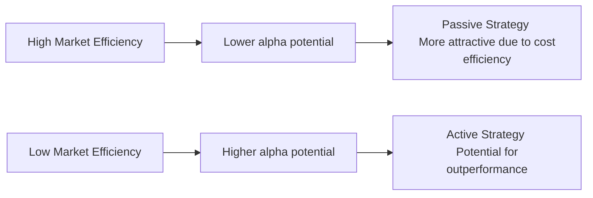

When we talk about equity market organization and efficiency, it’s easy to get caught up in theoretical models without thinking about our real-life investment decisions. However, the implications for active and passive equity strategies can be quite personal. I remember standing in a trading room early in my career, watching the frenzy of folks calling clients, making near-instant decisions about trades. And I was thinking: “Gosh, do most of these managers really beat the market, or are they just riding along with everyone else?” That moment got me hooked on the whole debate over whether active or passive is king. 

Below, we’ll explore how different forms of market efficiency shape the demand for active vs. passive management. We’ll also see how costs, behavioral quirks, and factor-based strategies fit in. Let’s get rolling.

## Market Efficiency and Strategy Choice
Being a Level II candidate, you’ve likely heard of the Efficient Market Hypothesis (EMH). In its semi-strong form, EMH says that stock prices incorporate all publicly available information, and as a result, consistent outperformance by active managers is, well, if not impossible, at least very difficult. If a market is truly semi-strong efficient, you can think of it as an intimidating place for active managers. You might find the occasional gem of a stock, but it’s not easy; all the major data and announcements are quickly reflected in prices.

On the flip side, markets that are less efficient (think certain frontier or smaller emerging markets) can leave room for some “oops” moments in pricing. Overlooked companies or slower information dissemination can create pockets of mispricings. That’s where dedicated analysts might swoop in and say, “Hey, the market has this one priced all wrong.” They might discover an under-followed gem and deliver alpha to their portfolios. Of course, the risk is higher, but so is the chance of outperformance.

If we were to visualize the basic relationship between efficiency and strategy, it might look like this:

On the left-hand side, with high efficiency, alpha is probably minimal. Passive replicates overall market returns at lower cost. On the right-hand side, with lower efficiency, alpha is potentially higher, so well-researched active approaches can make sense.

## Active Management Overview
Active management is simply the attempt to “beat the market.” Now, that might sound exciting—who doesn’t want to outdo an index? Active managers typically use one or more of these approaches:

• Fundamental analysis: Crunching balance sheets, modeling cash flows, reading footnotes to discover hidden glories or pitfalls.  
• Technical analysis: Examining price and volume patterns, trends, support, and resistance levels to time trades.  
• Quantitative methods: Using mathematical models—sometimes very fancy ones, like machine learning—to identify valuation gaps or factor exposures.

But as you might guess, chasing alpha through active management can be time-consuming and expensive. If you’re dealing with a large universe of stocks, you need a team of analysts, data-subscriptions, and, well, sometimes an expensive Bloomberg terminal flickering in the background. Whether the returns justify these costs is the million-dollar question (quite literally, for a large asset base).

## Passive Management Overview
Passive strategies revolve around tracking a benchmark index with minimal active decisions. You can do this by buying an ETF or a mutual fund that just replicates the weighting of, say, the S&P 500 or another broader index. This approach aims to harness “the market return” without all the fuss and cost of constant stock picking or timing.

Naturally, the selling point is straightforward: there’s no big attempt at outperformance, so management fees are typically lower (and trades are fewer). The main downside, of course, is that if you’re literally replicating the index, you’ll never beat it—your performance is the index’s returns minus fees and costs. It’s not glamorous, but over the long term, a surprising number of these passive ETFs do better than the average active fund once you account for fees.

## Role of Information Efficiency
So how does information efficiency tie into all this? If a particular market segment—like large-cap U.S. stocks—tends toward semi-strong or even strong-form efficiency (where not just public info is priced in, but possibly insider info is also quickly reflected, theoretically), then there’s not a lot of alpha to go around. The big hedge funds and algorithmic traders might be devouring any little glitch in pricing within milliseconds. For the average manager, this is tough to beat.

In emerging markets or smaller niches, though, coverage is thinner. Some local companies might only have a single analyst following them, or none at all, so a motivated investor can dig in and uncover insights not broadly known. Here, active management can pay off. 

## Cost Considerations
Regardless of how efficient or inefficient a market might be, costs eat into returns. Fees, taxes, and transaction costs can be big drags on performance, especially if trades are frequent. Ever watch an energetic manager work? They might place multiple trades in a single day, chasing price momentum or reacting to news. Each trade has a cost—brokerage fees, bid-ask spreads, and market impact. Those erode realized gains.

In a market that’s quite efficient, your margin for alpha is smaller anyway. If you add high management fees to the mix, it can become an uphill battle. Controlling costs is crucial in all markets, but in highly efficient realms, it can literally mean the difference between alpha and “almost alpha.”

## Behavioral Bias Exploitation
Now let’s talk about my favorite part: behavioral biases (it’s probably your favorite too if you’ve spent time reading about behavioral finance). Even in relatively efficient markets, human biases like fear, greed, overconfidence, and loss aversion still play out in real time. Think of the classic scenario: a stock misses earnings by a penny, and panicked investors dump it excessively, driving the price well below its intrinsic value. If you run a disciplined active strategy, you might see that as an overreaction and buy in.

Behavioral biases can also cause IPOs to be overhyped, leading to frothy valuations early on. Skilled active managers watch for that mania. They may short the stock or avoid it until the hype cools. So while market efficiency suggests most information is priced in quickly, emotional mistakes can create short-term dislocations and chances for profit.

## Style Factors
There is a middle ground between fully active and fully passive: factor investing (sometimes referred to as smart beta). We’re talking about strategies that deliberately tilt a portfolio toward specific factors:

• Value: Stocks trading at relatively low valuation metrics.  
• Growth: Firms or sectors with higher potential earnings growth.  
• Size: Small-cap, large-cap, or mid-cap exposure.  
• Momentum: Stocks whose prices have been rising (or falling) sharply.  
• Quality: Companies with robust balance sheets, stable earnings, and good management.  

Factor strategies are still somewhat systematic. You don’t pick an individual stock because your friend loves it. Instead, you pick all the stocks that match a certain characteristic, aiming to capture a known risk premium. Historically, factors like value and size have been found to produce higher risk-adjusted returns, though there’s no guarantee they will always repeat that performance in the future.

In essence, factor investing tries to systematically exploit known inefficiencies or risk premiums. It’s an “in-between” approach because you’re still deviating from a full market-cap index, but you’re not necessarily making individual stock calls based on your own fundamental analysis.

## Performance Measurement
Every strategy—active, passive, and everything in between—requires a benchmark for comparison. That’s how you know if you’re truly adding alpha. For instance, an active U.S. large-cap manager might compare to the S&P 500. If they beat the index net of fees on a consistent basis, you can say there’s alpha.

But we also want deeper insight. Performance attribution analysis can show whether the outperformance (or underperformance) comes from sector allocation, individual stock selection, or simply loading up on risk. If your portfolio is beating the benchmark because it’s leveraged with more volatile stocks, that’s not necessarily skill. It might just be more risk. We want to dissect performance to separate skill from luck.

## Suitability for Different Investors
So, how do we decide when to go active versus passive? Individual investors with limited time or resources might be drawn to passive funds to keep fees low and ensure broad market coverage. They might also sleep better at night knowing they’re not missing out on some big movement or paying big fees to do so.

Large institutions often adopt a core-satellite approach. The core might be passive index funds that ensure broad, stable market exposure. Then, for specific angles—like emerging market small-caps or specialized tech—a smaller fraction of the portfolio (the satellites) might be managed actively to chase alpha in less efficient segments. 

It’s also about temperament. Some folks love the thrill of active investing, diving into company reports or writing complex algorithms. Others prefer to set it and forget it. Neither approach is universally better; it’s about matching strategy to the market’s efficiency and your own goals, costs, and risk tolerance.

## Risk Management and Diversification
No matter what flavor of investing you choose, diversification is key. You want to avoid concentration risk. If you’re an active manager who invests too heavily in one sector because you think it’s your golden ticket, well, it can be exhilarating when it works but brutal when it doesn’t. For passive investors, broad market-based ETFs are inherently diversified, so that’s a straightforward advantage.

Active managers are also exposed to style drift. That’s when a manager says they’re doing, say, “value-focused investing,” but the portfolio ends up holding a bunch of growth tech stocks. If that strategy works, it might be fine. But it can blindside clients who thought they were paying for a certain style or risk profile. Proper risk management means tracking the portfolio’s exposures and ensuring it aligns with the stated objective.

## Practical Example: Frontier Market Opportunity
Let’s suppose you’re part of a small investment firm that focuses on sub-Saharan Africa. Public information might be patchy. Some companies aren’t widely covered. You might find an under-researched consumer staple stock that’s trading at an extremely low P/E ratio, with strong future prospects if the local economy picks up. Because so few people are analyzing it, you could buy in before the rest of the market notices. In an efficient market like the U.S. large-cap space, there would be a dozen sell-side reports available, and the price might already reflect that potential. 

Of course, frontier markets can come with currency risk, political instability, and less regulatory oversight, so your potential for gain might be tempered by bigger downside. If your research is solid, you might earn alpha, but if you ignore the extra risk, you could get burned. This example underscores the synergy between market inefficiency, research, and risk management in active approaches.

## Conclusion and Exam Tips
At Level II, you’re often asked to apply these efficiency concepts to real-life scenarios—like spotting a mismatch between a manager’s claims and the actual results or interpreting a scenario of a partially efficient market. Keep in mind:

• Understanding EMH forms helps you weigh the feasibility of active returns.  
• Costs (fees, taxes, trading expenses) are a big deal. Being able to show their impact on net returns can help answer exam calculations.  
• Performance attribution is your friend. You might see item sets where you have to break down performance into security selection, sector allocation, and so forth.  
• Factor investing is a popular “middle ground” modern approach, so you might see item sets about factor strategies, their rationale, and performance.

Time management tip: In the item set format, you’ll want to read carefully for detail on the benchmark. Notice whether the question wants net or gross performance. Also watch for any mention of fees—some questions test your ability to factor that in.

Now let’s wrap up with a quick glossary, plus some references if you want to dig deeper.

## Glossary
Active Management: An investment strategy aimed at outperforming benchmarks via stock selection or market timing.  
Passive Management: An investment strategy tracking a market index to replicate overall market returns.  
Alpha: The excess return of a portfolio relative to its benchmark.  
Beta: A measure of a security or portfolio’s volatility relative to the market as a whole.  
Factor Investing: A strategy focusing on specific “factors” or characteristics that drive returns (like value, growth, momentum, and so on).  
Style Drift: Deviation of a fund’s investment style from its stated objective or strategy.  
Core-Satellite Approach: A portfolio construction method blending passive (core) and active (satellite) strategies for alpha seeking.  
Market Timing: Attempting to predict future market price moves to buy or sell assets at advantageous times.

## References and Further Reading
• Grinold, R. C., & Kahn, R. N. Active Portfolio Management: A Quantitative Approach for Producing Superior Returns and Controlling Risk.  
• Bogle, J. C. Common Sense on Mutual Funds. (Offers an excellent perspective on passive vs. active.)  
• CFA Institute Research Foundation. Look for publications on factor investing trends and developments.  
• Germá, P., & Weber, S. “Cost Analysis of Active vs. Passive Funds,” Journal of Investment Management.

## Test Your Knowledge: Active and Passive Equity Strategies



### Which form of the Efficient Market Hypothesis states that prices reflect all publicly available information, making it difficult to consistently outperform the market?

- [ ] Weak-form EMH
- [x] Semi-strong form EMH
- [ ] Strong-form EMH
- [ ] Behavioral EMH

> **Explanation:** Semi-strong form EMH holds that markets quickly incorporate all publicly available information. Therefore, consistent outperformance from publicly known info alone is unlikely.

### Which of the following is the biggest advantage of passive investing for most individual investors?

- [ ] The ability to outperform the market consistently  
- [x] Lower management fees and broader market exposure  
- [ ] Exclusive access to insider information  
- [ ] Guaranteed positive returns  

> **Explanation:** Passive investors track an index, so they typically pay much lower fees. They don’t rely on picking individual stocks or timing the market, which helps keep costs low.

### Which scenario is most likely to offer higher potential for alpha generation by skilled active managers?

- [ ] Large-cap stocks with wide analyst coverage in developed markets  
- [x] Less-researched equities in frontier or niche markets  
- [ ] Passive funds in highly efficient markets  
- [ ] Index funds focused on large, stable companies  

> **Explanation:** Frontier or less efficient markets have fewer analysts and less coverage. This can create mispricing opportunities that skilled managers may exploit.

### In performance attribution, which factor would explain outperformance if a manager selects undervalued stocks within each sector, controlling for sector weight differences?

- [ ] Sector allocation  
- [ ] Market risk (Beta)  
- [x] Security selection  
- [ ] Leverage effect  

> **Explanation:** Security selection refers to picking individual undervalued or outperforming stocks within a sector. If the sector weights stay consistent with the benchmark, the outperformance is due to picking better stocks, not sector tilts.

### Which approach systematically targets risk premia shown to produce higher expected returns historically?

- [ ] Pure technical trading  
- [ ] Market timing strategies  
- [x] Factor investing  
- [ ] High-frequency trading  

> **Explanation:** Factor investing focuses on specific characteristics (value, momentum, size, etc.) that have historically offered risk premiums, aiming to capture these systematically.

### What is style drift most likely to indicate within an actively managed fund?

- [x] The manager’s portfolio deviates from its stated investment focus  
- [ ] The manager is generating alpha by controlling risk exposure  
- [ ] The fund’s performance is tracking its benchmark perfectly  
- [ ] The manager’s trading costs are lower than expected  

> **Explanation:** Style drift is when an active fund’s holdings no longer match the manager’s declared strategy (e.g., a value fund holding mostly growth stocks).

### Which statement best describes the potential relationship between behavioral biases and active management?

- [ ] Behavioral biases do not influence market prices  
- [x] Behavioral biases can create short-term mispricings that active managers may exploit  
- [ ] Behavioral biases guarantee negative returns for passive investors  
- [ ] Behavioral biases are only relevant in high-frequency trading  

> **Explanation:** Behavioral biases often lead to overreactions (panic selling, hype buying), so active managers who spot these can act swiftly to capitalize on mispricings.

### A core-satellite portfolio approach might combine a core of passive investments with satellite active managers. What is the main rationale behind this?

- [x] Achieve broad market returns at low cost while selectively seeking alpha in less efficient niches  
- [ ] Reduce overall diversification  
- [ ] Guarantee that the portfolio will exceed the market return  
- [ ] Eliminate all transaction costs  

> **Explanation:** The core-satellite approach maintains broad, low-cost exposure in a large portion of the portfolio while allowing for targeted active investments where skill might add value.

### An investor notices that after fees, an active manager has underperformed an index fund for three straight years. Which of the following is least likely to explain this?

- [ ] High transaction costs incurred due to frequent trading  
- [ ] A high expense ratio that consumes part of the return  
- [ ] Market efficiency limiting the manager’s alpha opportunities  
- [x] A broader tax advantage for active trading in all market conditions  

> **Explanation:** Active trading rarely provides a universal tax advantage. In fact, high turnover can lead to higher taxes. The other factors are common contributors to underperformance.

### True or False: In a highly efficient market, active managers are more likely to deliver consistent outperformance than in a less efficient market.

- [ ] False
- [x] True

> **Explanation:** Actually, the statement should be reversed. In a highly efficient market, it’s tougher for active managers to outperform over time. The correct stance is that they are less likely to deliver consistent outperformance in highly efficient markets.


