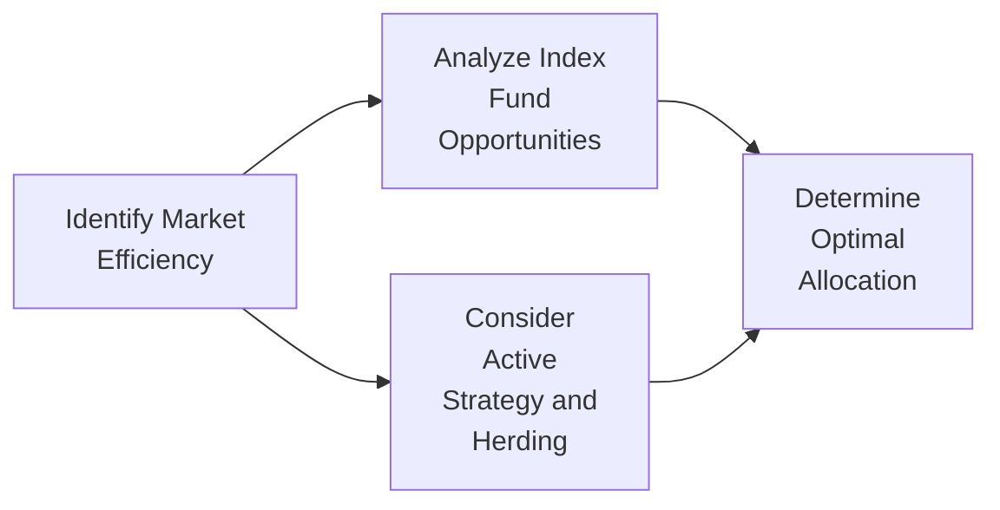

## Scenario Background

Imagine you’re an analyst sitting in your office, sipping a quick cup of coffee and pondering that age-old question: should I pursue a passive investment in an emerging market index fund, or is it time to go bold and build a concentrated active portfolio of just a handful of stocks? You’ve been following this particular emerging market for years and have witnessed a roller-coaster of major booms followed by dramatic crashes. So, you know that it can be riddled with inefficiencies, especially when local investors seem to “herd” into or out of certain sectors solely on rumor or hype.

In this vignette, we’ll try to break down the factors that might shape your decision—everything from liquidity dynamics and market fragmentation to real-world constraints like government regulations and currency risk. We’ll dive into the “why” behind each question you might ask before finalizing your approach. By the end, you’ll have a framework for defending whether a passive index-based strategy is more appropriate or whether there’s an alpha opportunity that’s too good to pass up.

## A Quick Look at the Data

You have access to five years of historical returns from an emerging market index (EMI), as well as data on expense ratios and scattered economic indicators. Let’s say the emerging market in question had a series of moderate bull runs, with an average annual return of 8% over these five years—though the volatility during that period was fairly high. The table below provides a simplified snapshot:

| Metric                                  | Value / Range             |
|-----------------------------------------|---------------------------|
| 5-Year Avg. Annual Return (Index)       | ~8%                       |
| Annualized Volatility (Index)           | 22%                       |
| Concentrated Portfolio Hypothetical ER  | 15% (High Target Return)  |
| Emerging Market Index Fund Expense      | 0.50%                     |
| Concentrated Active Fund Expense        | 1.25%+ (Est.)             |
| Currency Fluctuation vs. USD            | 12–15% annual swings      |
| GDP Growth (Local)                      | 4–5%                      |
| Political Risk Indicator                | Moderate-High             |

Some data points are incomplete—like we don’t know how stable that GDP growth is, or the exact correlation of the local currency to global macro events. Also, the so-called “concentrated portfolio hypothetical ER (expected return)” of 15% is largely aspirational, based on fundamental research that identifies undervalued companies.  

So, you’re left with the question: “Is the extra promised return from an active approach worth the higher expense ratio, the heavier research commitment, and the possibility that I might be overconfident in identifying real alpha?”

## Behavioral Overtones and Possible Alpha

One of the big themes you notice when dealing with local investors in this emerging market is that they tend to exhibit classic herding behavior—just a whiff of good news in a popular sector, and everyone piles in. When a local tech stock soared last year on rumors of a government tech initiative, the stock nearly doubled in weeks, only to revert within months once the official policy was delayed.

This so-called “herding” can lead to significant (sometimes extreme) over- and undervaluation. Historically, academically speaking, the Efficient Market Hypothesis (EMH) argues that prices should reflect all available information. However, in many emerging markets, you can see episodes that look more like a “partial efficiency” environment, where certain segments of the market get very excited (or very fearful) and move prices beyond fair value in either direction.

• **Alpha Opportunity**: When herding happens, particularly in a market lacking broad analyst coverage, mispricing might open the door to potential alpha opportunities—if (and this is the big if) you can do thorough proprietary research and not just chase the same rumors as everyone else.

• **Institutional Constraints**: At times, short-selling is limited or heavily regulated in certain emerging markets, so capturing alpha through contrarian positions might be tricky. You might find yourself unable to profit from overpriced stocks as easily as you can from undervalued ones (unless you’re comfortable with derivatives and the local regulatory environment).

• **Political Risk**: A sudden election upset or an unexpected shift in trade policy can also create pockets of undervalued (or overvalued) stocks. This risk is high, but at the same time, it can be your friend if you manage it properly and keep a healthy margin of safety.

## Risk-Return Tradeoff: Currency, Rebalancing, and Concentration

Before jumping in with both feet, it’s crucial to nail down the risk-return tradeoff. In an emerging market, you immediately face:

• **Currency Risk**: If you’re based in the U.S. or the eurozone, the local currency might fluctuate 10–15% each year relative to your base currency. That can seriously amplify your returns—or your losses. It’s not just about the local stock performance; it’s about what that performance translates to once you convert back to your home currency.

• **Sector Concentration**: A *concentrated portfolio*—which is basically a strategy holding fewer stocks or focusing heavily on specific sectors—magnifies both upside potential and downside risk. Suppose you concentrate in local technology companies. If there’s a new regulation encouraging new data centers, you might strike gold. But if that regulation is postponed or scrapped, your portfolio can tank.

• **Corridor Rebalancing**: Typically, you might set corridor thresholds, say ±5% around your target allocations. But practice shows that in emerging markets, things can move so fast and unpredictably that your rebalancing might be triggered too frequently, raising transaction costs. Meanwhile, an *emerging market index fund* can rebalance for you automatically, albeit it follows a market-cap weighting approach that might overweight overheated sectors.

• **Government Regulations**: Some emerging markets have capital flow restrictions or additional taxes on foreign investors. So if your plan is to get in and out quickly, you need to reevaluate costs (e.g., stamp duties or foreign ownership constraints). In extreme cases, you might face partial capital controls.

## Active vs. Passive Decision Points

You might be leaning one way or the other, but let’s break it down:

1. **Market Efficiency**: If you believe the market is fairly efficient overall, a passive *emerging market index fund* might be the simpler, cheaper bet. But if local herding or regulatory quirks create frequent inefficiencies, an active approach could pay off.

2. **Access to Information**: Thorough, proprietary research can be costly. You might have to hire local experts or rely on your own network. If you’re fairly certain you can gather better insights than the average investor, you could discover hidden gems. But if reliable data is scarce or expensive—and the market is still largely driven by rumor—your chances of systematically beating the index might be smaller than you think.

3. **Expense Ratios**: Typically, an emerging market index fund might charge ~0.50%. A specialized, concentrated active fund can easily run 1.25% or more. Over time, these expense differences add up. The question is whether your strategy’s alpha is enough to offset those fees (and the additional risk).

4. **Volatility Tolerance**: A concentrated portfolio could see some monstrous swings in returns, especially with herding or big currency fluctuations. An index approach is more diversified, so hopefully your standard deviation of returns is tamer—though still high by developed-market standards.

5. **Historical Surges and Crashes**: I recall a time (this was maybe about a decade ago) when a certain emerging market soared 40% in a year on the back of surging commodity prices. Many were patting themselves on the back for having an active, concentrated exposure to the hot sector. Yet the next year, the government changed export rules, and the same market plummeted almost 35%. If you’d been passively invested in a broad index, your overall drawdown would have been painful, but not quite as severe as if you’d bet heavily on a single commodity stock.

## Decision Flow Diagram

Sometimes visualizing it helps. Here’s a simplified flow diagram capturing the main “forks in the road” as you decide how to invest:

Use this as a conceptual checklist, not a strict formula. In reality, you’ll juggle these steps all at once.

## Conclusion and Recommendations

So, what’s the verdict? Well, it depends (naturally). If you sense that local investor behavior is excessively emotional (the “herding” phenomenon), and you have access to top-notch research that lets you spot discrepancies, you might reasonably opt for a concentrated active portfolio. But that path comes with higher risk. The emerging market index fund is simpler, cheaper, and more diversified—great for folks who accept the notion that markets are *reasonably* efficient or don’t want to sweat the day-to-day fluctuations and research overhead.

Key points to remember:

• Weigh the cost of research against the potential alpha.  
• Factor in currency volatility; it can make or break your returns.  
• Watch out for political and regulatory shifts that could drastically move prices.  
• Don’t underestimate the emotional roller-coaster of a concentrated strategy—especially if you’re trying to beat a diversified index over the long term.

Finally, as a gentle nudge for your CFA exam approach: these scenario-based questions (vignettes) really hinge on recognizing that markets can be both rational and irrational at times. And in emerging markets, the inefficiencies can be enticing but come with real baggage. The best approach is to methodically assess each dimension—cost, risk, accessibility of information, and behavior-driven mispricings—before deciding on active vs. passive.

## Glossary of Key Terms

• **Vignette**: A short scenario-based question format typical in CFA exams, presenting real-world data, challenges, or controversies.  
• **Emerging Market Index Fund**: An investment vehicle that tracks a diversified basket of emerging market stocks, generally with a lower expense ratio.  
• **Concentrated Portfolio**: A portfolio with fewer holdings, implying a more focused bet on outperforming but also higher volatility and risk.  
• **Corridor Rebalancing**: A method of rebalancing around set percentage thresholds. If the portfolio weight of an asset drifts outside its corridor, you rebalance to the target allocation.  
• **Political Risk**: The risk that government decisions or instability will negatively affect investments (e.g., policy changes, nationalization, capital controls).  
• **Herding**: When many investors follow the same strategy or trend, often without rigorous independent analysis, potentially creating mispricing.  
• **Institutional Constraints**: Regulatory or structural limits that might restrict trading, foreign ownership, or capital flows.  
• **Alpha Opportunity**: The chance to earn returns in excess of a benchmark by exploiting market inefficiencies or unique insights.

## References and Further Reading

• CFA Institute guidance on constructing and interpreting vignette-style exam questions (available in official CFA Program curriculum).  
• Ferri, Rick. The Power of Passive Investing: A great resource that outlines why market efficiency can favor passive approaches, especially over the long run.  
• Journal of Behavioral Finance: Various articles on herding, overconfidence, and other biases relevant to emerging markets.  
• Local regulatory bodies (e.g., your target market’s version of an SEC) for specific rules on foreign ownership, taxation, and capital controls.

--------------------------------------------------------------------------------

## Test Your Knowledge: Market Efficiency Debates



### In an emerging market scenario, which of the following factors most commonly adds to price inefficiency?

- [ ] High corporate transparency
- [x] Herding behavior among local investors
- [ ] Full capital mobility
- [ ] Low foreign ownership restrictions

> **Explanation:** Herding behavior, where investors follow each other without independent analysis, can drive prices away from intrinsic value, creating inefficiencies.

### Why might an active, concentrated portfolio strategy be riskier than investing in a diversified emerging market index fund?

- [ ] Because it requires less research
- [x] Because fewer holdings amplify both gains and losses
- [ ] Because it automatically rebalances daily
- [ ] Because it invests only in blue-chip stocks

> **Explanation:** Concentration increases idiosyncratic risk. When you have fewer holdings, any adverse event in one stock or sector can severely hit the portfolio’s performance.

### Suppose a local government imposes sudden capital controls that limit foreign investors from repatriating profits. What effect might this regulatory change have on market efficiency?

- [x] Lower market efficiency due to higher information asymmetry and limited participation
- [ ] Higher market efficiency because fewer participants can trade
- [ ] No effect on market efficiency, only on liquidity
- [ ] Complete elimination of political risk

> **Explanation:** Capital controls can deter foreign investment, decrease liquidity, and potentially increase pricing discrepancies as fewer participants can provide price discovery.

### If an analyst expects to gain an informational edge through proprietary research in an emerging market, which of the following would be most critical to achieving alpha?

- [x] Access to reliable and non-public insights
- [ ] Blindly following herding behavior
- [ ] Perfect alignment with index weightings
- [ ] Adhering strictly to a buy-and-hold approach

> **Explanation:** Alpha often comes from having insights or research that the broader market lacks. Proprietary information or deeper fundamental analysis can reveal mispriced securities.

### Which of the following is a key benefit of corridor rebalancing in a volatile emerging market?

- [x] Preventing the portfolio from drifting too far from target allocations
- [ ] Eliminating political risk
- [x] Potentially reducing risk by selling overpriced securities
- [ ] Guaranteeing absolute returns above the benchmark

> **Explanation:** Corridor rebalancing periodically realigns the portfolio with target allocations, which can help lock in gains and avoid overweighting sectors that have run too high.

### An emerging market currency has just depreciated 15% against the US dollar. Which of the following statements is most accurate regarding its impact on a US-based investor?

- [x] It reduces the investor’s returns when converting back to USD
- [ ] It guarantees higher portfolio returns
- [ ] It has no effect on realized returns
- [ ] It eliminates tracking error risk

> **Explanation:** When the local currency weakens relative to the investor’s home currency, the value of gains shrinks upon conversion, thereby lowering overall returns.

### Which factor is most likely to create alpha opportunities for a concentrated portfolio in an emerging market?

- [x] Inadequate analyst coverage and herd-driven valuations
- [ ] Widespread availability of real-time information
- [x] Occasional political shocks leading to temporary mispricing
- [ ] Perfectly efficient price discovery processes

> **Explanation:** Limited coverage and sudden policy changes frequently lead to under- or overvaluation, so careful research can potentially identify profitable opportunities.

### Why might an investor favor a broad-based index fund despite potential inefficiencies in an emerging market?

- [x] Lower cost and simpler access to a diversified portfolio
- [ ] Guaranteed higher returns than an active approach
- [ ] No political or liquidity risks
- [ ] Perfect correlation with developed markets

> **Explanation:** Even if you believe inefficiencies exist, the index fund offers broad diversification and low expenses, making it an attractive option for investors unwilling or unable to conduct extensive research.

### When referencing “institutional constraints,” which of the following is most likely included?

- [x] Regulations preventing foreign ownership beyond a certain percentage
- [ ] Unlimited foreign capital flows with no restrictions
- [ ] Zero restrictions on short-selling
- [ ] Fully transparent corporate governance standards

> **Explanation:** Institutional constraints typically include regulatory limits on foreign participation, short-selling bans, and capital controls that can affect portfolio construction.

### True or False: If local investors tend to herd in emerging markets, markets are still fully efficient.

- [ ] True
- [x] False

> **Explanation:** Herding suggests that investors might not be pricing securities based on fundamentals, which can deviate the market from full efficiency.


