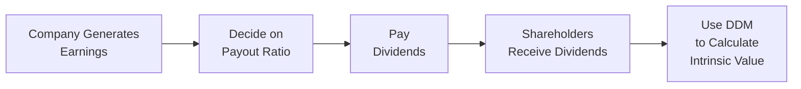

## Foundations of Dividend-Based Valuation

If you’ve ever wondered why finance folks keep going on about dividends, well, you’re not alone. I remember the first time I stumbled upon the idea that a share’s value could be pinned down by the cash distributions that land in investors’ pockets. I thought, “Wait, that’s it? We’re just focusing on the little checks investors get every quarter?” And yes, that’s pretty much the heart of the Dividend Discount Model (DDM).

But let’s make it more formal and thorough. In the simplest sense, dividend-based valuation says the value of a share is the present value of all its future dividends. This idea traces back to a classic principle in finance: a stock’s fundamental worth is determined by the cash the business can return to its owners over time. Dividends, being an actual payout, act as a direct pathway from the company’s profits to your bank account. That’s extremely powerful if you’re analyzing a firm that consistently pays dividends.

Still, dividends aren’t always straightforward. Many firms reinvest most of their excess profits into growth initiatives (especially big tech or start-ups), so they don’t distribute meaningful dividends. In those cases, you might switch to Free Cash Flow or another approach. But for consistent dividend-payers—think utilities or well-established consumer staples—DDM can be a brilliant lens through which to judge the fair value of a stock.

## Key Principles Behind DDM

DDMs hinge on a few essential assumptions:

• The company pays dividends (not exactly shocking news).  
• These dividends follow some predictable pattern of growth or stability.  
• You have a suitable required rate of return (discount rate), capturing your risk tolerance and expectations for the equity’s return.  

From the vantage point of the DDM, it doesn't matter what line items show up in the company’s financial statements unless they directly affect dividend payments. That’s part of the beauty of focusing on an actual cash payout to shareholders. Dividends are about as tangible as you get in equity analysis: once they’re paid, they’re yours. Earnings and revenue, on the other hand, can be shaped by accounting policies and “creative” management decisions.

### The Core Formula

At the most basic level, if you assume dividends grow at a constant rate into perpetuity (the famous Gordon Growth Model), the present value (V₀) is given by:


V_{0} = \frac{D_{1}}{r - g}


Where:  
• D₁ is the expected dividend one period from now,  
• r is your required rate of return (a.k.a. the discount rate),  
• g is the long-term growth rate in dividends.

This might look suspiciously simple. And it is. But be careful—simple can be deceiving. The assumption of perpetual, stable growth demands that the company’s fundamentals (like payout ratio, capital structure, and market conditions) remain reasonably predictable over time.

## Why Dividends Are a Direct Link to Shareholder Wealth

You’ve probably heard the saying “cash is king,” right? Dividends put cash directly in shareholders’ hands. And that’s typically seen as a strong marker of a company’s true earnings power—if management can pay out dividends quarter after quarter, it means the underlying operations are generating a steady stream of surplus cash. Analysts often argue that dividends have less room for manipulation than net income or operating cash flows, which can reflect non-cash items or changes in working capital policies.

Dividends also serve, in a way, as a control on corporate behavior. Overly ambitious expansion projects can be reined in if the company has a consistent track record of returning capital to shareholders. That ensures management doesn't just splurge on questionable acquisitions or pet projects. It’s sort of like paying yourself a salary: if you keep paying out a portion, you’re forced to be more selective with how you spend the remainder.

## Diagram: DDM Flow

Sometimes, it helps to visualize how dividends flow out of a firm’s earnings and land in a valuation model. The figure below outlines the path from earnings to the intrinsic stock value using the Dividend Discount Model approach:

Even though this is a simplistic representation, it highlights how we move from the firm’s operations (and policies) to equity valuation.

## Strengths of Dividend-Based Valuation

• Direct Cash Measure: Because dividends are actual cash transfers, the model deals in real rather than hypothetical numbers.  
• Historical Insight: Established companies often have a multi-year track record of dividends, giving you tangible data to feed into your analysis.  
• Alignment with Shareholder Returns: Dividends are a core component of total shareholder return (TSR), which includes both price appreciation and dividends received.  

I remember one instance in my early career when analyzing a well-known consumer goods company that had a 50-year streak of increasing dividends every single year—no interruptions. Investors love that. If you used a DDM, you could leverage that stability to make a compelling case for the intrinsic value. The stock price might fluctuate, but the underlying dividend track record provided a sense of “this is real money showing up.”  

## When DDM Might Fall Short

Let’s not sugarcoat it: not every company is a good fit for DDM. Firms that reinvest heavily in growth (like early-stage tech or biotech) may pay little or no dividends. Using DDM on them might leave you frustrated. In those scenarios, the free cash flow approaches or even residual income methods might be more relevant. Also, if the company’s dividend policy is erratic or uncertain, you’ll have difficulty forecasting a reliable stream of payouts.

### Common Pitfalls (Especially in Exam-Syle Questions)

• Overlooking Dividend Policy Changes: If the vignette hints that the firm is about to alter its payout ratio or hold dividends constant for a while, you’ve got to fold that into your DDM assumptions.  
• Ignoring Sustainable Growth Rates: Watch out for unrealistic growth assumptions. The argument “Oh, it’s grown dividends by 20% for three straight years, so it’s definitely continuing at that rate for the next 50 years” might be a trap.  
• Confusing Earnings with Dividends: Remember, we discount dividends, not earnings. If you see a big difference between net income and the actual stuck-to-the-wall dividend payment, it’s the dividend figure that drives the DDM.  
• Unclear Discount Rates: If you pick a discount rate that doesn’t match the risk profile stated in the scenario, you’ll likely misvalue the stock. For instance, using a lower-than-justified rate artificially inflates the value.

## Real-World Example

Imagine a mature telecommunications giant, TelComCo, that’s been paying dividends for 15 years. Its most recent annual dividend (D₀) was $2.00, and you expect that to grow by 3% per year in the foreseeable future. If your required rate of return on TelComCo’s equity is 7%, you can chew through some math:

• Next year’s dividend, D₁ = D₀ × (1 + g) = 2.00 × 1.03 = 2.06.  
• Intrinsic value, V₀ = D₁ / (r – g) = 2.06 / (0.07 – 0.03) = 2.06 / 0.04 = 51.50.  

So the DDM says TelComCo’s equity is worth about $51.50 per share. Now, the actual share price might slide around that figure, reflecting short-term market sentiment, new industry data, or surprises in future earnings. But from a purely dividend-based standpoint, $51.50 is the fair price given the assumptions.

## Links to CFA Level II

For your Level II studies, remember that you may need to:

• Evaluate a firm’s likelihood to maintain or alter its dividend policy.  
• Use partial histories to project future dividends. For instance, you might only have three years of data, or the question might give you partial-year payouts.  
• Tweak the model by introducing changing growth rates or discount rates. This is a stepping stone to multi-stage DDM, where you might assume a higher growth rate for a few years, then revert to a stable long-term rate. (Stay tuned for Chapter 7!)  

Pay special attention to how item sets are structured. You might see a scenario analyzing a healthcare company that claims to have a stable industry outlook but also invests heavily in R&D. The question asks you to figure out if the standard DDM is still appropriate. You have to weigh that tension between steady payouts and heavy reinvestment needs.

**Exam Tip:** Don’t just memorize formulas—be prepared to defend or attack the use of dividend-based valuation in the exam setting. If a company is clearly growth-oriented with minimal or no dividends, a question might ask you to highlight alternative valuation approaches. Conversely, if it’s a stable dividend payer, the DDM approach can shine.  

## Best Practices and a Slightly Informal Note

Some folks get so locked on the “mechanics” of the formula that they forget the big picture: DDM is all about the relationship between corporate policy and investor cash flows. If you see a question where the CFO issues a statement about future payouts, that can be your biggest clue to adjusting the model. Don’t forget to keep an eye on the capital structure too; if the company is piling on debt to pay dividends, that might not be sustainable.

Interestingly, I once saw a scenario (yes, in real life) where a firm kept raising its dividends while taking on heavier debt loads. Sure, the short-term yield looked enticing, but the underlying fundamentals were weakening. A naive DDM might have flagged the stock as undervalued, but an analyst taking a more holistic view realized those dividends weren’t sustainable. Within two years, that firm cut the dividend drastically, and the share price took a nose-dive. Lesson learned—always check the quality of the dividend source, not just the number that hits your DDM formula.

## Practical Guidance for CFA® Level II Candidates

• Understand the link between dividends and earnings: The payout ratio and retention ratio drive growth.  
• Confirm the firm’s ability to sustain (or grow) dividends: Evaluate the condition of the industry, the firm’s profit margins, and leverage.  
• Match discount rates with the appropriate risk profile: Many exam items revolve around applying CAPM or other models to get the discount rate.  
• Practice item sets that blend DDM with other data: You might have to interpret partial financial statements, gleaning hints about future payouts.  
• Watch for signals of corporate policy shifts: If the question says the company’s board plans to adopt a new dividend policy, that’s your heads-up to modify your DDM projections.

## Conclusion

Dividend-based valuation offers one of the most straightforward ways to estimate a company’s intrinsic value, especially when dividend policy is predictable and stable. Because dividends represent tangible cash flows to shareholders, the DDM underscores that, in the end, what truly matters is the cash you can take home. Still, no single model fits all situations. High-growth firms reinvesting earnings or companies with erratic payouts can render DDM far less effective. Ultimately, a good analyst knows not only the math but also the story behind the dividends and the longevity of business fundamentals that produce them.

As you wrap up your understanding of the rationale for using dividends in valuing equity, keep all of these nuances in mind. Your mastery here sets the stage for the more advanced multi-stage DDM discussions coming in Chapter 7. And trust me, you’ll see plenty of chances to practice this thinking on the exam and in your real-world investment career.

## References and Further Reading

• CFA Institute Program Curriculum (Equity Valuation: Concepts and Basic Tools).  
• Pinto, Jerald E., et al. “Equity Asset Valuation.” CFA Institute Investment Series.  
• Damodaran, A. (New York University). Writings on dividend policy and valuation. http://pages.stern.nyu.edu/~adamodar/  

## Test Your Knowledge: Dividend Discount Model Rationale Quiz



### If dividends represent the cash paid out to shareholders, which reason best explains why many analysts prefer them for valuation purposes?

- [ ] Dividends are always higher than earnings for well-managed companies.
- [ ] Dividend policies are regulated by the government, so forecasting them is free from uncertainty.
- [x] They require minimal accounting assumptions and directly represent cash returns to investors.
- [ ] Dividends are never affected by changes in a company’s capital structure.

> **Explanation:** Dividends provide a clear-cut link to investor cash flows and are not as subject to accounting decisions as earnings. They’re not always higher than earnings, nor are they entirely free from uncertainty.  

### A mature utility company has paid a stable and growing dividend for over two decades. Under which scenario might the traditional DDM still fall short?

- [ ] If the company’s stable dividend policy continues unchanged.
- [ ] If management issues guidance suggesting the dividend will increase at the historical growth rate.
- [x] If the company decides to issue large amounts of debt to fuel expansion, potentially changing its payout structure.
- [ ] If historical data on dividends is readily available for forecasting.

> **Explanation:** A large debt issuance might alter the dividend policy going forward, reducing the reliability of a simple DDM approach.  

### In the Gordon Growth Model formula V₀ = D₁ / (r – g), which component is most directly linked to the company’s operational risk and the broader market’s required return?

- [ ] D₁
- [x] r
- [ ] g
- [ ] V₀

> **Explanation:** The discount rate, r, reflects the market’s required rate of return for that equity, incorporating operating risk, financial risk, and broader factors such as interest rates.  

### An analyst is evaluating a firm that pays no dividends and reinvests all earnings. Which statement is the best advice?

- [ ] Use the standard DDM but set growth to 0%.
- [x] Consider an alternative valuation model like FCFE or residual income.
- [ ] Wait until dividends are initiated before valuing the company.
- [ ] Convert the reinvested earnings into hypothetical dividends to apply the model.

> **Explanation:** DDM generally won’t work for non-dividend payers unless you make very hypothetical assumptions. FCFE or other models are more appropriate here.  

### Which of the following is a common pitfall when applying DDM in an exam item set?

- [x] Using an outdated or incorrect payout ratio and ignoring upcoming dividend policy changes.
- [ ] Focusing on growth assumptions for future dividends.
- [x] Forgetting to adjust the discount rate for newly released industry-specific risks.
- [ ] Accurately analyzing the firm’s dividend history.

> **Explanation:** The biggest pitfalls typically involve ignoring signals of policy changes and failing to refine the discount rate.  

### A stock with a high projected dividend growth rate but limited reinvestment opportunities is under review. What caution should an analyst keep in mind?

- [x] The growth rate might not be sustainable in the long run.
- [ ] The stock’s price will never exceed its DDM value.
- [ ] Dividends are entirely risk-free at high growth rates.
- [ ] A high dividend growth rate always correlates with a low payout ratio.

> **Explanation:** If the company lacks reinvestment opportunities, maintaining a high dividend growth rate indefinitely can be unrealistic.  

### When a CFO states that dividends will be intentionally reduced to pay off debt, how does that impact a traditional single-stage DDM valuation?

- [x] The forecasted dividend stream is lower, likely reducing the computed intrinsic value.
- [ ] The valuation remains unchanged because the discount rate will adjust automatically.
- [x] The required rate of return decreases proportionally to reflect lower dividends.
- [ ] The payout ratio has no direct effect on DDM.

> **Explanation:** Reducing the dividend stream generally lowers the present value if all else remains constant. (Note: the CFO’s announcement might also affect perceived risk, but that’s a separate, more nuanced discussion.)  

### What approach is most appropriate to determine if a high dividend payout is sustainable?

- [ ] Examine only the historical dividend growth rate and extrapolate forward.
- [ ] Assume that if a company paid dividends once, it will keep paying indefinitely.
- [ ] Use the DDM with an assumed zero-growth scenario.
- [x] Analyze the firm’s free cash flow, debt levels, and reinvestment needs in combination with DDM insights.

> **Explanation:** Understanding the broader financial health—through free cash flow and leverage metrics—provides a clearer view of whether high dividends can be maintained over the long haul.  

### Which of the following best illustrates a scenario where DDM is particularly effective?

- [ ] Start-up biotech with no dividend history.
- [ ] Tech giant that pays a negligible dividend but executes frequent share buybacks.
- [ ] Company with a history of cutting and reinstating dividends in a cyclical industry.
- [x] Utility firm with a multi-decade record of stable and predictable dividend increases.

> **Explanation:** Stable, predictable dividend patterns are ideal for the Dividend Discount Model, as they yield more accurate and reliable forecasts.  

### True or False: The Dividend Discount Model completely ignores the firm’s growth opportunities.

- [x] True
- [ ] False

> **Explanation:** Strictly speaking, the DDM focuses on future dividends and the assumption for growth embedded in those payouts. It does not attempt to directly model all growth opportunities in detail; it essentially reflects them through the assumed dividend growth rate.


