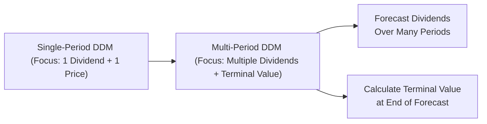

## Introduction and Context

You know, sometimes we get so involved in complicated valuation formulas that the simplest models can feel overlooked. But let me tell you, Dividend Discount Models (DDMs) remain one of the most fundamental approaches to equity valuation. They help you derive the intrinsic value of a stock by discounting expected dividends (and potentially the sale price or terminal value) back to the present. In exam scenarios—especially those pesky vignette-style item sets—you’ll probably see references to both single-period and multi-period DDM. Understanding these models is essential for tackling questions that revolve around forecasting dividends, computing terminal values, or analyzing short-term vs. long-term holdings.

In earlier sections (see Chapter 3 on Return Concepts), we talked about the required rate of return on equity (r). That concept is critical to DDM, because the rate r is used to discount future dividends. If you’re short on a refresher, you might want to pop back to Chapter 3.3, where we break down using CAPM and other models to estimate that “r.” Today, though, let’s dig into how to use that discount rate when we’re dealing with single- and multi-period dividend discount models.

## Single-Period DDM Overview

The single-period DDM is often the first formula you learn in a finance class, right after you figure out how to use the time value of money keys on your calculator. And it’s particularly relevant if you plan to hold an investment for just one period (say, one year), during which you expect to receive one dividend and then sell the stock at its projected market price at the end of that year.

### Formula and Basic Mechanics

The formula is:


V_0 = \frac{D_1 + P_1}{1 + r}


• \\( V_0 \\) is the intrinsic value of the stock today.  
• \\( D_1 \\) is the dividend you’ll receive in one period (usually one year from now).  
• \\( P_1 \\) is the expected stock price (or expected selling price) at the end of that same period.  
• \\( r \\) is your required rate of return.  

What this formula tells you is basically: “The value of the stock today is whatever money I think I’ll get from it (dividend + selling price) next year, discounted back to right now.” It’s straightforward. But the moment you only have one period in view, you’re kind of ignoring what happens after that. In a real-world scenario, you might not actually sell after just one year—or maybe you do, but you must be sure about the big assumption: that sale price at the end of the year (\\(P_1\\)). If you’re not super sure about \\(P_1\\), your final valuation results might be shaky.

### Strengths of the Single-Period DDM

• Simplicity. You only need one projected dividend and an expected selling price.  
• Speed. It’s a quick snapshot of current value for a short-term investor or an analyst who only has a one-year outlook.  
• Exam Usefulness. In item sets, sometimes you’re only given one year’s dividend or you’re asked to do a quick approximation. The single-period model can be the easiest way to arrive at an answer under time pressure.

### Limitations of the Single-Period DDM

• Heavily Dependent on the Future Price. You’re guessing \\(P_1\\), and if that guess is off, you might significantly misvalue the stock.  
• Ignores Long-Term Dividend Patterns. If you hold the stock for multiple years or if the company’s dividend policy changes after the first year, you’re missing all that.  
• Unrealistic for Many Investors. Most people don’t buy a stock for only one year. The real world typically calls for multi-period performance assessment.

## Multi-Period DDM Overview

If you’re anything like me, there was a point when you realized, “Wait, I don’t just want to know what I earn next year—I care about multiple years of dividends if I hold the stock longer.” That’s exactly where the multi-period DDM shines. Instead of focusing on a single year’s dividend and sale price, this approach discounts a stream of dividends over a more extended horizon—plus a terminal value when you eventually sell the stock (or assume a perpetuity growth phase).

### General Formula

In its general form, the multi-period DDM can be written as:


V_0 = \sum_{t=1}^{n} \frac{D_t}{(1 + r)^t} + \frac{TV_n}{(1 + r)^n}


where  
• \\(D_t\\) is the expected dividend in year \\(t\\).  
• \\(TV_n\\) is the terminal value of the stock at the end of year \\(n\\).  
• \\(r\\) is your required rate of return.  
• \\(n\\) is the number of years you explicitly forecast.  

The terminal value (\\(TV_n\\)) could be estimated in various ways. For instance, in a two-stage growth model, you might forecast dividends for the first five years (the “high-growth period”) and then apply a constant-growth model for dividends from year 6 onward, capitalizing them into a single \\(TV_5\\).

### Why Multi-Period Matters

• More Realistic. Investors commonly hold stocks for multiple years or even decades.  
• Aligns with Dividend Policies. Many firms have stable or gradually changing payout policies; capturing multiple years just feels more accurate.  
• Reduces Dependency on Terminal Value Guesswork—Though Still Not Entirely. In fact, you might be surprised how large a fraction of your total valuation can come from \\(TV_n\\). So we still need to be cautious and consistent in how we estimate it.

### Implementation Challenges

• Forecasting Dividends for Multiple Years. You have to come up with either a stable growth rate or an explicit year-by-year forecast.  
• Determining the Terminal Value. Often, the terminal value might be computed using a Gordon Growth formula or by applying a market multiple and discounting back.  
• Sensitivity to the Required Rate of Return. If your discount rate is off by even a small margin, the entire valuation might shift significantly.

## Comparison of Single-Period vs. Multi-Period DDM

Because pictures sometimes convey more than words, here’s a quick illustration showing the difference between single- and multi-period DDM.

When you apply the single-period approach, you only forecast one dividend (\\(D_1\\)) and one terminal price (\\(P_1\\)). The multi-period approach involves discounting multiple future dividends, sometimes culminating in a large terminal value that must be discounted as well. Both methods rely heavily on \\(r\\), the required rate of return, but the multi-period approach tends to be more reflective of reality for a longer-term investor.

## Practical Application in Vignette-Style Questions

You’ve practiced it, right? In the CFA exam, they’ll hand you a vignette describing a company’s predicted dividends over three or five years, possibly with assumptions about growth or payout changes. They’ll also give you a discount rate or the tools to figure it out (like CAPM parameters). Then you might see:

• A request to calculate the stock’s value if you only hold it for one period (single-period DDM).  
• A request to calculate the value using the multi-period approach, with a terminal value assumption.  
• A twist: maybe they’ll ask you to justify the differences between the two valuations.

### Example

Imagine a scenario:

1. Dividend next year (\\(D_1\\)) = \$2.  
2. Expected price next year (\\(P_1\\)) = \$40.  
3. Required rate of return (\\(r\\)) = 10%.  

Using the single-period DDM:


V_0 = \frac{2 + 40}{1 + 0.10} = \frac{42}{1.10} \approx 38.18


Now, extend that to a multi-period approach if you hold for two years:

• \\(D_1 = \$2\\)  
• \\(D_2 = \$2.10\\) (assuming 5% dividend growth)  
• Price at the end of Year 2, \\(P_2 = \$42\\) (some mild growth from \$40)  

So your forecast might look like this:


V_0 = \frac{2}{1.10} + \frac{2.10 + 42}{(1.10)^2}


That second term is the sum of the dividend in the second year plus the price in the second year, all discounted back. If you compute it, you’ll get a slightly more involved but potentially more accurate figure. In a real exam question, you might have three or four dividends to discount plus a final terminal value.

## Potential Pitfalls and Best Practices

### Pitfalls

• Overemphasizing Near-Term Dividends. If a company is in a high-growth phase, the real payoff might come in later years.  
• Underestimating the Importance of Terminal Value. Especially in multi-period models, the terminal value can represent a giant chunk of the valuation (sometimes 50%–70% or more).  
• Incorrect Discount Rate. Make sure you’re consistent about whether you’re using nominal vs. real, or if the question states a particular cost of equity from CAPM.  
• Inconsistent Growth Assumptions. If your short-term projected growth is 10% but eventually you revert to 2% stable growth, ensure the transition is logical.  

### Best Practices

• Use Reasonable Growth Estimates. If a firm consistently grows dividends by 3% historically, think carefully before plugging in 10%.  
• Check Terminal Value Calculations Twice. Because it can dominate the valuation, a small mistake in computing terminal value leads to big issues.  
• Sensitivity Analysis. If time permits, see how a 1% difference in your discount rate changes the final value. This is huge in real-world analysis (and can come up in exam item sets as well).  
• Tie Back to Fundamentals. Chapter 4.1 introduced industry structure analysis: if the industry is cyclical or near saturation, carefully reflect that in your multi-year forecasts.

## Additional Illustrative Example with Dividends

Let’s do a quick, more elaborate illustration. Suppose we have:

• Required Rate of Return (r) = 10%  
• Next Four Dividends:  
  • \\(D_1 = \$1.00\\)  
  • \\(D_2 = \$1.08\\)  
  • \\(D_3 = \$1.16\\)  
  • \\(D_4 = \$1.25\\)  
• Terminal Value at the End of Year 4 is estimated by capitalizing a constant 5% growth from year 5 onward. That means future dividends from year 5 onward are expected to grow at 5% indefinitely. If \\(D_5\\) is \\(D_4\\) grown by 5%, then \\(D_5 = \$1.25 \times 1.05 = \$1.3125\\). The Gordon Growth formula for terminal value (\\(TV_4\\)) would be:


TV_4 = \frac{D_5}{r - g} = \frac{1.3125}{0.10 - 0.05} = \frac{1.3125}{0.05} = 26.25


So:


V_0 = \frac{1.00}{1.10} + \frac{1.08}{(1.10)^2} + \frac{1.16}{(1.10)^3} + \frac{1.25 + 26.25}{(1.10)^4}


Compute each component:

• \\(1.00 / 1.10 \approx \$0.91\\)  
• \\(1.08 / 1.10^2 \approx \$0.89\\)  
• \\(1.16 / 1.10^3 \approx \$0.87\\)  
• Sum of \\(1.25 + 26.25 = \$27.50\\). Then discount by \\(1.10^4\approx 1.4641\\). So \\(27.50 / 1.4641 \approx \$18.78\\).  

Adding them up:


V_0 \approx 0.91 + 0.89 + 0.87 + 18.78 = 21.45


Sure, you might see minor rounding differences, but that’s the general result. Notice that the last term, which includes the terminal value, is by far the largest chunk of the total. That’s typical in multi-period DDM: the majority of the stock’s estimated worth often lies in the far-future cash flows, all captured by the terminal value.

## Common Challenges and Strategies to Overcome Them

• Forecast Horizon Dilemma. You might ask, “How many years do I forecast before I apply a terminal value?” A good rule of thumb is to forecast until you have a stable or predictable growth rate—maybe that’s 3 to 5 years or even 10 years.  
• Growth Rate vs. Discount Rate. Ensure that your perpetual growth rate is less than your discount rate, or you end up with nonsensical valuations (infinite or negative).  
• Dividend Policy Changes. If the case scenario says the firm is changing from a low-payout to a higher-payout policy, incorporate that carefully for each year’s dividend.  
• Exam Pressure. Truly, you just have to read carefully, highlight the key data, and plug them in precisely. Don’t overcomplicate. If they give you a straightforward multi-period set of dividends, run with it. If they explicitly say you’ll sell after one year, single-period might be all you need.  

## Conclusion and Exam Tips

At the end of the day, your success on exam day boils down to consistency and clarity:  
• Identify the correct horizon. Is it a single year? Multiple years?  
• Find or calculate the correct discount rate (check Chapter 3 for a refresh!).  
• Summarize your dividends (and terminal value) in a methodical manner.  
• Watch out for sneaky details in the vignette—like a mid-year truncation or an assumption about changing dividend policies.  

Above all, remember to keep your wits about you. Sure, these formulas look complicated, but you can systematically break them down. And you know what? That’s half the battle: staying calm and methodically applying the inputs the question provides.

## References and Further Reading

• CFA Institute Program Curriculum, Dividend Discount Models (Core Concepts).  
• Aswath Damodaran, Investment Valuation.  
• “The Relationship between Dividend Policy and Future Earnings,” Financial Analysts Journal.  
• Refer to Chapter 3 of this volume for deeper discussion on discount rates and risk premiums.  

## Mastering Single-Period vs. Multi-Period DDM: Practice Questions



### 1. In the single-period DDM, which of the following best represents the numerator in the valuation formula?

- [ ] The present value of expected dividends only
- [x] The sum of the dividend to be received plus the expected price at the end of the period
- [ ] The dividend payout ratio multiplied by the required rate of return
- [ ] The historical dividend discount

> **Explanation:** The single-period DDM formula is V₀ = (D₁ + P₁) / (1 + r). The numerator is the forecasted dividend plus the expected end-of-period price.

### 2. Which of the following is a limitation of the single-period DDM?

- [ ] It does not require a terminal value assumption
- [ ] It includes multiple interim dividends
- [ ] It is only used for companies that pay no dividends
- [x] It depends heavily on the estimate of the future selling price

> **Explanation:** The single-period model heavily relies on the assumed price (P₁) at the end of the holding period, making the valuation sensitive to that assumption.

### 3. The multi-period DDM generally requires:

- [x] Multiple dividend forecasts and a terminal value
- [ ] A single dividend forecast and a perpetuity assumption
- [ ] Zero growth in dividends throughout the entire horizon
- [ ] No assumption about the required rate of return

> **Explanation:** In the multi-period DDM, you forecast dividends over several periods, then include a terminal value. You discount each component back at the required rate of return.

### 4. An analyst forecasts a company’s dividends for five years and calculates a terminal value at the end of the fifth year. She then discounts these amounts back to the present. Which approach is she most likely using?

- [ ] The single-period dividend model
- [x] The multi-period dividend discount model
- [ ] A bond pricing model
- [ ] The free cash flow to equity model

> **Explanation:** Forecasting dividends for multiple years plus a terminal value is the standard form of a multi-period dividend discount model.

### 5. Which of the following scenarios best illustrates a potential pitfall when using a multi-period DDM?

- [ ] Including a cost of equity that is higher than the company’s return on equity
- [x] Using a terminal growth rate that exceeds the assumed required rate of return
- [ ] Conducting a sensitivity analysis on the discount rate
- [ ] Summing more than three years of dividends

> **Explanation:** If the terminal growth rate exceeds the discount rate, the model can produce unrealistic or infinite valuations. That is a classic pitfall.

### 6. Suppose a stock pays dividends that grow at 4% annually, and the required rate of return is 9%. Which of the following statements is correct?

- [ ] The stock is invalid for DDM because the growth rate must exceed r
- [ ] No terminal value calculation is necessary
- [x] A terminal value is typically based on a constant growth assumption after the explicit forecast period
- [ ] The single-period DDM is the recommended model for any growth rate below r

> **Explanation:** With constant growth, a terminal value at the end of the forecast horizon is often computed using the Gordon Growth approach. Since g < r, the valuation remains finite.

### 7. In a single-period DDM setting, if the required rate of return decreases but the expected end-of-year dividend and price remain the same, what happens to the current stock value?

- [x] It increases
- [ ] It decreases
- [x] It might stay the same if the future dividend also changes
- [ ] It becomes zero

> **Explanation:** Lowering the discount rate (r) automatically inflates the present value because the denominator (1 + r) gets smaller. The multi-select acknowledges that other factors could offset the impact, but generally, the price increases if r decreases and other variables remain unchanged.

### 8. What is the primary advantage of using a multi-period DDM over a single-period DDM?

- [ ] It requires fewer assumptions
- [ ] It ignores the role of dividends in valuation
- [x] It captures a longer horizon of cash flows plus a potentially large terminal value
- [ ] It ensures zero error in the forecast

> **Explanation:** Multi-period models capture multiple dividends over time and a terminal value, making it more realistic. It does not guarantee zero error, and it can actually require more assumptions.

### 9. Which best describes the reason terminal value often represents a large portion of a multi-period DDM valuation?

- [ ] The discount rate is typically 0%
- [ ] Year 1 dividends outweigh the future dividends
- [x] Dividends in later years are perpetuated, and most of the valuation rides on growth beyond the explicit forecast
- [ ] Companies rarely pay near-term dividends

> **Explanation:** In multi-period DDM, the sum of all future dividends beyond the forecast horizon is captured in one figure (terminal value). With strong growth assumptions, this often becomes a significant portion of the total valuation.

### 10. True or False: In a multi-period DDM, if you forecast dividends for 10 years and no longer intend to sell the stock after 10 years, you do not need a terminal value.

- [ ] True
- [x] False

> **Explanation:** Even if you don’t plan to sell, in theory, the stock extends beyond year 10, so you’d usually still include a terminal value to capture those future dividends (or assume perpetual growth).


