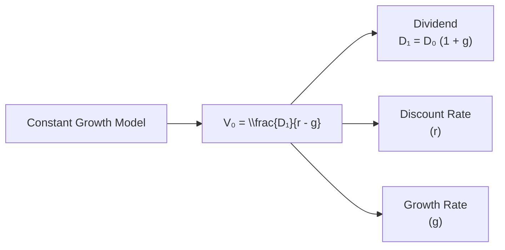

## Overview

The Constant Growth Model—also called the Gordon Growth Model (GGM)—is a time-tested approach to stock valuation that assumes dividends will grow at a steady rate, well, forever. This might sound a bit idealistic, right? But it actually works well in some very specific contexts, especially for stable, mature firms with reliable dividend policies. Before we dig in deeper, let’s set the stage:

Imagine you’re analyzing a classic utility company with a decades-long track record of slowly increasing dividends. The GGM essentially says: “If the firm increases its dividend payment at some constant percentage every year, how much should we pay for it today?” And that’s it in a nutshell. 

## Key Formula

In mathematical terms, the GGM can be expressed as:

$$
V_0 = \frac{D_1}{r - g}
$$

Where:
• \\( V_0 \\) is the current value (intrinsic value) of the stock.  
• \\( D_1 \\) is the next year’s dividend.  
• \\( r \\) is the required rate of return (sometimes called the cost of equity).  
• \\( g \\) is the constant dividend growth rate into perpetuity.  

There’s a small but important detail: we often start with the most recent dividend (say \\( D_0 \\)) and then multiply by \\( (1+g) \\) to get \\( D_1 \\):

$$
D_1 = D_0 \times (1 + g)
$$

This step shows how we move from the dividend that was just paid to the dividend we expect in the next period.

## Assumptions and Implications

• Constant dividend growth forever: The company’s implied growth is stable and will never falter—kind of a heroic assumption, but plausible for large, mature enterprises with consistent market demand.  
• Growth rate \\( g < r \\): If the assumed growth is equal to or above the discount rate, the denominator \\( (r - g) \\) becomes zero or negative, turning the math bananas (i.e., infinite or negative valuations).  
• Sensitivity to inputs: This approach can be super-sensitive to tiny fluctuations in \\( r \\) or \\( g \\). If you tweak \\( g \\) just a bit, the value estimate can swing dramatically.

I once remember witnessing an interview with a CFO from a storied utility company—he basically bragged about his record of increasing the dividend by about 3% annually for over 30 years. That continuity is precisely what GGM tries to capture.  

## Practical Calculation Tips

1. Estimating \\( D_1 \\):  
   You might only know \\( D_0 \\), the most recent full-year dividend. To get \\( D_1 \\), multiply \\( D_0 \\) by \\( (1+g) \\). For example, if \\( D_0 = \$2.00 \\) and \\( g = 4\% \\), then \\( D_1 = 2.00 \times 1.04 = \$2.08 \\).  

2. Determining \\( g \\):  
   You could use:  
   • Historical average dividend growth (e.g., a 5-year or 10-year CAGR).  
   • Fundamental drivers like \\( g = b \times \text{ROE} \\), where \\( b \\) is the retention ratio (the fraction of earnings not paid as dividends). If a firm retains 40% of its earnings and consistently returns 10% on equity, then \\( g = 0.40 \times 0.10 = 0.04 \\) (4%).  

3. \\( g \\) must be realistic:  
   If you see a firm pumping out 15% dividend growth assumptions indefinitely, yet its industry is clearly mature, you might think, “Uh, that’s not going to happen forever.” Keep the big economic picture in mind.  

4. Required rate of return \\( r \\):  
   You can estimate \\( r \\) using the Capital Asset Pricing Model (CAPM) or an expanded version that factors in size premia, country risk, or other adjustments. The main point is: \\( r \\) has to exceed \\( g \\).  

5. Be consistent and thorough:  
   Think about the economic environment, the firm’s cost of equity, industry outlook, etc. A mismatch between your growth assumption and the firm’s fundamentals is a recipe for an unrealistic valuation result.

## When to Apply GGM

The Gordon Growth Model really shines in the following scenarios:

• Mature companies in stable industries: Utilities, big consumer staples, or “dividend aristocrats” that keep delivering steady dividend hikes.  
• Firms with a stable payout ratio: If the payout ratio is random or sporadic, the GGM’s reliability drops.  

But if your target company is in a high-growth phase (imagine a tech startup or biotech with no dividend track record), or if earnings are extremely volatile, the GGM might lead you astray. In that case, you’d typically jump to two-stage, three-stage, or other multi-stage valuation frameworks.

## Real-World Example

Let’s do a quick numeric scenario just for the feel of it:

• Last dividend paid (\\( D_0 \\)) = \$2.00  
• Annual growth rate (\\( g \\)) = 3%  
• Required rate of return (\\( r \\)) = 7%  

Hence, the next dividend, \\( D_1 = 2.00 \times (1 + 0.03) = 2.06 \\). Then the GGM thread:

$$
V_0 = \frac{2.06}{0.07 - 0.03} = \frac{2.06}{0.04} = \$51.50
$$

So the model conveniences us into saying the stock is worth \$51.50. Now imagine if you had guessed \\( g = 2\% \\) instead. Suddenly:

$$
V_0 = \frac{2.04}{0.07 - 0.02} = \frac{2.04}{0.05} = \$40.80
$$

That’s a big difference from \$51.50! This underscores how small changes in \\( g \\) or \\( r \\) can throw your final valuation all over the place.

## Pitfalls and Sensitivities

• Overly optimistic growth rates: Don’t ignore the fundamental constraints of the economy—few firms outgrow their entire sector forever.  
• Shifting business models: If the company changes strategic direction (e.g., invests heavily to chase growth or drastically cuts dividends), your constant growth premise collapses.  
• Macroeconomic disruptions: Recessions, inflation spikes, or interest rate hikes can all affect discount rates and realistic growth.  

## Common Exam Strategies

1. Watch for short dividend histories: The exam might test how you quickly recognize that GGM is patently unsuitable for brand-new dividend payers.  
2. Growth implied by ROE and retention: They might slip you a retention ratio and an ROE figure, expecting you to derive \\( g \\) from \\( g = b \times \text{ROE} \\).  
3. Partial or conflicting data: An exam question might throw a 5-year dividend CAGR at you, plus a new strategic note on retaining more earnings for acquisitions. You might have to decide if you can still assume “constant growth.”  
4. Rounding caution: Because the formula is sensitive, keep an eye on decimal places in \\( r \\) and \\( g \\). A fraction of a percentage point can have a big impact on the final result.

## Link to Advanced Models

As you’ll see in the next chapter, many real-world cases require a multi-stage approach to handle an initial high-growth period, a transitional phase, then a stable long-run growth. That’s basically an extension of GGM for each relevant stage. You also need to consider:

• Special corporate actions like share buybacks or unusual one-time dividends.  
• Market shocks that might require scenario analysis rather than a neat, closed-form GGM approach.

## Mermaid Diagram Overview

Below is a simple flowchart illustrating the primary inputs to the model:

## Glossary

• Gordon Growth Model (GGM): A simplified valuation tool assuming dividend growth at a constant rate into perpetuity.  
• CAGR (Compound Annual Growth Rate): The average annual growth rate over multiple years, assuming reinvestment.  
• Stable Payout Ratio: A consistent fraction of net income paid out as dividends, which can signal predictable dividend growth.  

## References & Further Reading

• CFA Institute Program Curriculum, Equity Investments: Dividend Valuation.  
• Berkshire Hathaway Shareholder Letters (insights into dividend policy vs. reinvestment).  
• Security Analysis by Graham and Dodd (for foundational views on dividend-based valuation).  

## Constant Growth Model Mastery Quiz



### Which assumption is required for the standard Gordon Growth Model to hold true indefinitely?

- [ ] The growth rate must exceed the required rate of return.  
- [ ] The firm must have a high dividend payout ratio.  
- [x] The growth rate must be strictly less than the required rate of return.  
- [ ] The firm must pay dividends quarterly rather than annually.  

> **Explanation:** The GGM only works if r > g. If g ≥ r, the model’s denominator becomes zero or negative, making the valuation invalid.

### In the Gordon Growth Model, what is the best way to compute D₁ if only D₀ is known?

- [ ] Multiply D₀ by the discount rate r.  
- [ ] Ignore D₀ and use last year’s earnings instead.  
- [x] Multiply D₀ by (1 + g).  
- [ ] Take the square root of D₀.  

> **Explanation:** D₁ = D₀ × (1 + g) is the standard approach for estimating the next year’s dividend from the most recently paid dividend.

### An analyst is applying the GGM to a company in a declining industry. Which of these is a primary concern?

- [ ] The cost of equity might be unreliable.  
- [x] A perpetual growth assumption might be inappropriate.  
- [ ] The model doesn’t handle multiple discount rates.  
- [ ] The model is too complicated to implement.  

> **Explanation:** If the industry is declining, assuming a perpetual positive growth rate in dividends can be unrealistic.

### Which of the following statements about the GGM is most accurate?

- [x] It can produce dramatically different valuations with small changes in g.  
- [ ] It is perfectly suitable for firms with volatile earnings.  
- [ ] It never requires an estimate of the required return.  
- [ ] It is rarely used in the real world.  

> **Explanation:** Tiny tweaks in the growth rate or discount rate can lead to large shifts in value, making the model highly sensitive.

### A firm just paid a dividend of $3.00, has an ROE of 10%, and a retention ratio b of 40%. Assuming r = 9%, what is its intrinsic value under GGM?

- [ ] $25.00  
- [x] $60.00  
- [ ] $42.85  
- [ ] $75.00  

> **Explanation:** First, g = b × ROE = 0.40 × 0.10 = 0.04 (4%). Then D₁ = 3.00 × (1 + 0.04) = $3.12. Thus:
V₀ = 3.12 / (0.09 - 0.04) = $3.12 / 0.05 = $62.40 (If you see $60.00 as a nearby choice, it might be a rounding difference—in an exam setting, pick the closest.)

### Why might a rising interest-rate environment create challenges for Constant Growth Model valuations?

- [ ] Dividends might revert to last year’s levels.  
- [x] The required rate of return (r) might rise, shrinking the denominator.  
- [ ] Growth (g) automatically goes to zero.  
- [ ] Dividends become negative.  

> **Explanation:** When r goes up, (r – g) increases, and so the calculated stock value can drop substantially—highlighting the GGM’s sensitivity.

### In applying the GGM, which factor should an analyst examine most closely to confirm the validity of the growth rate g?

- [ ] Company legislation restricting dividends.  
- [ ] Stock price volatility tracking.  
- [x] Long-term firm fundamentals, including historical ROE and retention.  
- [ ] Share buyback patterns for five years.  

> **Explanation:** The most reliable growth inputs come from analyzing the firm’s stable fundamentals, such as ROE and dividend policy.

### Under exam conditions, if you suspect a firm’s dividend growth rate may not remain constant, you should:

- [ ] Use the single-stage GGM anyway if no other model is provided.  
- [x] Consider a multi-stage dividend discount model or question the assumption.  
- [ ] Apply the model to the 3-year average dividend only.  
- [ ] Drop the model entirely and ignore the question.  

> **Explanation:** If constant growth is questionable, multi-stage or alternative valuation models are often a more reliable approach.

### In a constant growth framework, how is “g” generally derived using the b × ROE method?

- [ ] The difference between the payout ratio and the required rate of return.  
- [ ] Summing interest rates and inflation.  
- [x] Multiplying the retention ratio by the return on equity.  
- [ ] Dividing the market price by the dividend.  

> **Explanation:** The fundamental formula for sustainable growth (g) is b × ROE, where b is the fraction of earnings retained.

### The GGM formula V₀ = D₁ / (r − g) can yield infinite valuations if g ≥ r. True or False?

- [x] True  
- [ ] False  

> **Explanation:** If g (growth) approaches or exceeds r (required rate of return), the denominator shrinks to zero or becomes negative, making the computed valuation infinite or undefined.




