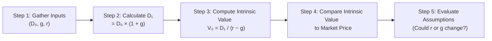

## Vignette Context and Overview

So, you’ve probably heard how the Dividend Discount Model (DDM) focuses on the present value of expected future dividends. Well, in this section, we’ll step into a classic single-stage DDM scenario. In the exam, you’ll often see it introduced with a short narrative—maybe referencing a stable firm with a consistent payout. The item-set format can include a bit of “storyline” or background, so it’s helpful to know exactly how to isolate the critical numbers. 

In our example, we’ll check out a hypothetical utility company, “Alpha Utilities,” which is projected to grow its dividend at a stable 4% rate annually. Let’s run with that. This scenario will help you sharpen your skill at reading vignettes, picking out the key data, and applying the formula quickly (but carefully).

## Single-Stage DDM: Key Inputs

The single-stage DDM—often called the Gordon Growth Model—relies on these core inputs:

• D₀: The current (most recent) dividend per share.  
• g: The expected annual growth rate of dividends (assumed constant, at least in the single-stage model).  
• r: The required rate of return or cost of equity for the firm.  

And in words, the model says: “Today’s value of the equity is essentially the next dividend divided by the difference between investor’s required return and the growth rate.” Symbolically:

$$
V_0 = \frac{D_1}{r - g}
$$

But remember, D₁ is next period’s dividend: D₁ = D₀ × (1 + g).

## Practical Example: Alpha Utilities

Let’s walk through the sample scenario. This might look super familiar from your prior reading, but it’s always nice to see it in a “test-like” format.

• D₀ = USD 2.00 (last year’s dividend)  
• g = 4% (steady growth assumption)  
• r = 9% (cost of equity based on CAPM or some risk-based approach)  

### Step 1: Calculate Next Year’s Dividend (D₁)
We start by projecting the next year’s dividend:

$$
D_1 = D_0 \times (1 + g) = 2.00 \times (1 + 0.04) = 2.00 \times 1.04 = 2.08.
$$

### Step 2: Apply the Gordon Growth Model
Now, you plug that D₁ into the single-stage formula:

$$
V_0 = \frac{D_1}{r - g} = \frac{2.08}{0.09 - 0.04} = \frac{2.08}{0.05} = 41.60.
$$

Hence, the estimated intrinsic value is USD 41.60.

### Step 3: Compare with Market Price
Imagine Alpha Utilities is trading at USD 39.00. If your calculation shows a fair value of USD 41.60, it suggests that the stock may be undervalued by USD 2.60. On an exam, you might see the question: “Is the stock overvalued, undervalued, or fairly valued based on the single-stage DDM?” You can quickly answer, “It appears to be undervalued,” given the difference.

### Step 4: Recognize Assumptions
But, well, no model is perfect. And you might want to ask: “Is 4% dividend growth realistic? Is 9% the right cost of equity?” If the utility industry’s demand is stable, maybe so. Or maybe rates are on the rise, driving up r. Even small changes in g or r can lead to significantly different valuations.

### Exam Tip: Qualitative Clues
In a vignette, the text might hint that the firm’s sector faces increased regulation, or costs are rising, or the economy is shifting. Such clues may suggest a slowdown in growth or more uncertainty in discount rates. Pay attention to these narrative bits. A typical item set might test your ability to interpret that new rate environment by doing a quick “What if r = 10%?” recalculation.

## Simple Sensitivity Analysis

A good practice is to see how interest rates or the growth assumption can shock your intrinsic value. For instance, if r were to jump to 10%, the math changes quickly:

• With r = 10%, and D₁ = 2.08,  
  $$ V_0 = \frac{2.08}{0.10 - 0.04} = \frac{2.08}{0.06} = 34.67. $$
  
That’s quite a drop from USD 41.60. The stock might actually look slightly overpriced if it still trades around USD 39.00.

## Mermaid Diagram: Single-Stage DDM Sequence

Below is a quick visual flowchart of how you’d typically proceed in analyzing a single-stage dividend scenario. It also captures the “mental steps” you might go through when reading a vignette.



## Quick Python Snippet

If you enjoy double-checking your math—or you’re super into coding—try the snippet below:

```python
D0 = 2.00
g = 0.04
r = 0.09

D1 = D0 * (1 + g)
V0 = D1 / (r - g)

print(f"Next Dividend (D1): ${D1:.2f}")
print(f"Intrinsic Value: ${V0:.2f}")
```

This should output:
• Next Dividend (D1): $2.08  
• Intrinsic Value: $41.60  

So that’s basically what we found by hand.

## Common Pitfalls and Best Practices

• Overly Precise Growth: If the exam text suggests that growth “might decline due to new competition,” maybe that stable 4% is now 3% or 2%. Check for disclaimers or footnotes.  
• Ignoring Macroeconomic Twists: Interest rate changes—like moves in the risk-free rate or shifts in market sentiment—could raise or lower the cost of equity.  
• Failing to Keep Dividend Timelines Straight: Make sure you’re always discounting the correct dividend figure (D₁ is next year’s dividend, not last year’s).  
• Confusing Intrinsic Value with Market Price: Intrinsic value is theoretical. The question might also ask you how to reconcile real-life discrepancies between your DDM-based value and the actual trading price.  

## References and Further Reading

• CFA Institute End-of-Chapter Questions, which usually include item sets similar to Alpha Utilities.  
• Corporate Finance by Berk & DeMarzo (for deeper theoretical coverage of dividend growth assumptions).  
• Periodicals like The Wall Street Journal or Financial Times to see how analysts discuss dividend expectations.  

## Single-Stage Dividend Scenarios: Practice Questions



### 1. In a single-stage dividend discount model, which of the following inputs is NOT typically used directly in the formula for calculating a stock’s intrinsic value?

- [ ] The required rate of return (r)  
- [ ] The next dividend payment (D₁)  
- [ ] The perpetual growth rate of dividends (g)  
- [x] The market beta of the stock  

> **Explanation:** While market beta can help estimate the cost of equity (r) through CAPM, it’s not a direct input in the final Gordon Growth Model formula. The formula uses r, g, and D₁ directly.


### 2. Suppose D₀ (the current dividend) is USD 3.00, the growth rate (g) is 5%, and the cost of equity (r) is 8%. What is the next dividend (D₁)?

- [x] USD 3.15  
- [ ] USD 3.00  
- [ ] USD 2.85  
- [ ] USD 3.30  

> **Explanation:** D₁ = D₀ × (1 + g) = 3.00 × 1.05 = 3.15.


### 3. Continuing from the prior question, what is the stock’s estimated intrinsic value under the Gordon Growth Model?

- [ ] USD 39.15  
- [ ] USD 45.00  
- [x] USD 105.00  
- [ ] USD 52.50  

> **Explanation:** V₀ = D₁ / (r − g) = 3.15 / (0.08 − 0.05) = 3.15 / 0.03 = 105.00.


### 4. In the Alpha Utilities vignette, if you discover that recent economic changes push the utility’s required rate of return from 9% to 10%, holding everything else constant, how would the intrinsic value be affected?

- [x] It would decrease (because the denominator of the model increases)  
- [ ] It would increase  
- [ ] It would stay the same  
- [ ] It cannot be determined  

> **Explanation:** The denominator (r − g) increases from 0.05 to 0.06, causing a lower computed intrinsic value.


### 5. Which of the following best describes a limitation of the single-stage DDM?

- [ ] It accounts for changing growth rates over a company’s lifecycle  
- [ ] It explicitly captures major acquisitions or divestitures  
- [ ] It includes increased competition or cyclical downturns in the cost of equity  
- [x] It assumes a constant growth rate forever, which might be unrealistic  

> **Explanation:** The single-stage DDM’s main assumption is constant growth into perpetuity, and that can be unrealistic in dynamic markets.


### 6. If a firm’s dividend grows at a constant rate of 4% and the cost of equity is 9%, which part of the formula would be 0.05?

- [ ] The dividend payout ratio  
- [x] The difference between r and g  
- [ ] The firm’s total return on equity  
- [ ] The ratio between D₀ and D₁  

> **Explanation:** r − g = 0.09 − 0.04 = 0.05.


### 7. True or False: In the single-stage DDM, D₀ is used directly in the formula to compute today’s intrinsic value.

- [ ] True  
- [x] False  

> **Explanation:** The model uses D₁ (the next dividend). While you start with D₀, you must multiply by (1 + g) to get D₁ for the formula.


### 8. How can a higher inflation expectation affect the Gordon Growth Model valuation, all else equal?

- [ ] It will not affect the valuation  
- [ ] It will cause dividends to remain unchanged  
- [ ] It decreases the growth rate directly  
- [x] It could raise the required rate of return, which lowers the valuation  

> **Explanation:** Higher inflation often drives higher interest rates. That pushes up r, which widens the denominator (r − g) and lowers the value.


### 9. If the market price of a stock is USD 50 but the single-stage DDM estimates the value at USD 45, how might you interpret this difference?

- [ ] The firm is definitely undervalued  
- [ ] The firm is definitely in financial trouble  
- [x] The firm might be overvalued, or the model’s assumptions may be off  
- [ ] The model automatically implies a buy recommendation  

> **Explanation:** A difference between the model’s estimate and market price can indicate potential mispricing or fundamental differences in assumptions. It's not always a clear sign to buy or sell without further analysis.


### 10. True or False: A major assumption in the single-stage DDM is that the dividend payout ratio remains stable over time.

- [x] True  
- [ ] False  

> **Explanation:** In addition to a constant growth rate, the single-stage model typically assumes a stable payout ratio that supports that growth pattern indefinitely.


