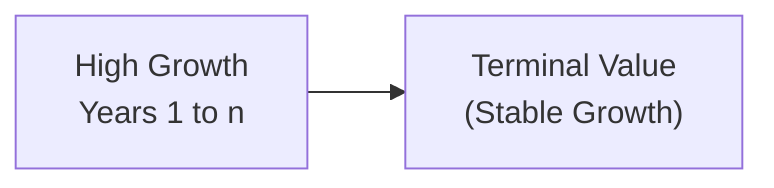
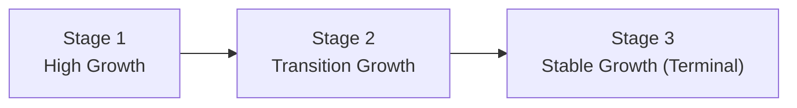

## Context and Rationale for Multi-Stage DDM

If you’ve ever tried to value a young tech company—maybe a startup that seems to be on every news headline—you’ve probably wondered how to handle dramatic early growth that may not last forever. The simplest dividend discount models (DDMs), like the Gordon Growth model, assume a single constant growth rate into perpetuity. But real-world companies evolve: they start with high (sometimes explosive) growth, move to a transitional phase, and eventually enter a mature, stable growth pattern. That’s where multi-stage models come into play, giving us a better approximation of a firm’s value by splitting its dividend growth into distinct periods.

Multi-stage DDM is especially relevant when:

• The company’s initial growth is significantly higher (or lower) than typical long-term economic growth.  
• Analysts see a clear path toward a more stable growth rate once the firm matures.  
• Industry or product life cycles indicate that the firm’s performance will likely shift over time (e.g., a pharmaceuticals firm post-patent cliff).  

The key benefit of multi-stage models is realism. Instead of cramming all assumptions into one neat “constant growth” box, they allow you to calibrate your analysis to a firm’s life cycle and strategic outlook.

## The Two-Stage DDM

### Structure of Growth Periods

The two-stage dividend discount model splits a firm’s future dividends into two distinct growth phases:

1. High-Growth Phase. A relatively short period (often 3–7 years) characterized by above-average growth in dividends. Picture a firm riding a new product wave or rapidly expanding market share.
2. Stable-Growth Phase. After the initial surge, the firm settles into a sustainable growth rate, often near the long-term rate of the economy or the industry.

By splitting the valuation this way, you’re essentially saying, “Alright, for the next X years, the company will grow dividends quickly. After that, it matures and grows at a constant, more modest rate.”

### Mathematical Formulation

In the two-stage setup, you project dividends (Dₜ) during the first phase (years 1 through n) with a higher growth rate. Then, starting in year n+1, you assume a perpetual growth rate g₂ that’s typically lower or more stable. The terminal value at the end of year n can be computed using the Gordon Growth formula:

(1)  Terminal Value (TVₙ) = D₍ₙ₊₁₎ / (r – g₂)

where:  
• D₍ₙ₊₁₎ is the first dividend after the high-growth period.  
• r is the required rate of return (or discount rate).  
• g₂ is the stable (perpetual) growth rate.

The present value of the stock, V₀, is then:

(2)  V₀ = ∑ (Dₜ / (1 + r)ᵗ) + [TVₙ / (1 + r)ⁿ], for t = 1 to n

So basically, you discount each annual dividend in the first stage back to today, plus you discount the terminal value—calculated as a perpetuity—back to today as well.

### Diagram of the Two-Stage Approach

Below is a small diagram showing the path from high growth to stable growth, with the terminal value at the end:



This structure is straightforward. But small shifts in g₂ or r can have outsize impacts on the final valuation. That’s why it’s crucial to pick realistic assumptions for stable growth, factoring in both industry norms and overall economic perspectives.

### When to Use It

Analysts typically use a two-stage DDM for companies that clearly exhibit a single inflection point: they’ll enjoy high growth for some predictable period and then shift into stable growth. Examples include consumer tech companies after initial market adoption or biotech firms once a key product hits a plateau.

## The Three-Stage DDM

### Bridging High Growth and Stability

Sometimes, a strict binary split feels too abrupt. Maybe a company won’t just flick a switch from “high growth” to “stable growth.” Instead, you might see a gradual slowdown—like a car smoothly braking rather than slamming on the brakes. That’s where a three-stage model turns helpful.

In a three-stage DDM, we add a transition phase to the equation:

1. High-Growth Phase. Rapid dividend growth for a set number of years.  
2. Transition Phase. An intermediate phase in which growth slows gradually.  
3. Stable-Growth Phase. Eventually, the firm enters a long-term steady growth rate.

### Diagram of the Three-Stage Approach

Here’s a simplified diagram illustrating the three segments:



### Mathematical Formulation

Mathematically, the three-stage model resembles a more extended version of the two-stage model. You’ll project dividends year by year in the first two phases:

(3)  V₀ = ∑ (Dₜ / (1 + r)ᵗ) for t = 1 to n₁  
          + ∑ (Dₜ / (1 + r)ᵗ) for t = n₁+1 to n₂  
          + [TV₍ₙ₂₎ / (1 + r)ⁿ²]

where n₁ is the end of the high-growth period, and n₂ is the end of the transition period. TV₍ₙ₂₎ is the terminal value at the end of the transition phase, usually determined by the Gordon Growth formula or a similar approach.

### Advantages and Considerations

• More Nuanced Growth Profile. The three-stage model offers a bit more realism if you expect the firm to tread a more gradual path to maturity.  
• Complexity. You must estimate growth rates for each of the three periods, plus you might adopt different rationales for each stage’s risk level.  
• Potential Risk Adjustments. Generally, the discount rate (r) stays constant if the firm’s risk doesn’t drastically change. However, in real practice, you might tweak it if the firm’s capital structure or market risk shifts significantly over time.

## Terminal Value Computation

In both two-stage and three-stage models, the terminal value often ranks as the single largest contributor to your valuation. Why? Because many companies derive most of their worth from the long tail of future profits or dividends. If the stable growth rate is not realistic—or if your discount rate is off—the terminal value becomes either understated or overstated.

Common ways to estimate the terminal value:

• Perpetual Dividend Growth (Gordon Growth): TV = D / (r – g).  
• Market Multiple: Sometimes analysts use a price multiple (like P/E or EV/EBITDA) to form an exit multiple. Then, discount that multiple-based value back to present.

## Sensitivity Analysis and Best Practices

Small changes in g, r, or length of the high-growth periods can create large swings in the final value estimate. If you’ve ever felt whiplash while adjusting these variables in a spreadsheet, you’re not alone. That’s a big reason we emphasize sensitivity analysis—not only for exam prep, but also in real-world investment decisions.

• Sensitivity Grid: Construct a table that shows changes in r on one axis and changes in g on the other. Evaluate how your valuation outcome moves around.  
• Scenarios: Consider a bullish scenario (slightly higher growth), a base case (your “normal” assumptions), and a bearish scenario (maybe slower growth or a recession).  
• Industry Benchmarks: Sometimes, bringing in comparables can help check your assumptions. If your stable growth rate is 8% in an industry that historically grows at 3%, you likely need a compelling justification.

## Practical Example

Let’s say you’re evaluating TechNova, a fictional firm that’s gained traction with a new data analytics platform. Analysts forecast that:

• For the first 4 years, dividend growth could average 15% annually.  
• After year 4, growth slows over a 3-year transition, dropping from 15% to 5% by year 7.  
• From year 7 onward, TechNova is expected to grow at a steady 5% indefinitely.

You’d break out your model:

• Phase 1: Project D₁, D₂, D₃, D₄ with 15% growth.  
• Phase 2: Gradually step down growth from 15% to 5% across years 5, 6, and 7.  
• Phase 3: Assume 5% constant growth from year 8 onward, with a terminal value calculated using Gordon Growth or a price multiple approach.

Within an exam item set, you might be provided each year’s projected dividend or growth assumptions; your job is to compute each year’s present value, then add them up. That’s it—though it can feel like a lot of math under time pressure. Be sure to keep track of discount factors accurately.

## Common Pitfalls

• Mixing Up Time Periods. Be certain about which year’s dividend gets which discount factor.  
• Unrealistic Growth Rates. A stable growth assumption that exceeds normal GDP or industry growth rates raises red flags.  
• Overcomplicating the Model. If you’re not sure how stable or transitional the firm’s growth will be, you might be better off with a simpler approach and robust sensitivity analyses.  
• Incorrect Terminal Value. A misapplied terminal value formula can single-handedly ruin your entire valuation.

## Exam Tips

• Show All Steps in Item Sets. If the vignette demands exact numeric results, carefully discount each dividend or free cash flow.  
• Keep an Eye on n-Year vs. (n+1)-Year Dividends. The forecasts given might start at D₀ or D₁. Make sure to interpret them correctly.  
• Thoroughly Check the Transition Details. In a three-stage model, read the vignette carefully to identify when (and how) the transition period is defined.  
• Don’t Neglect Sensitivity. You might see a question ask, “If the stable growth rate changes by 0.5%, how does the value change?” Practice these.  

## Further Reading

• CFA Institute, “Equity Valuation: Concepts and Basic Tools” in the CFA Program Curriculum.  
• Pinto, Jerald E. et al., “Equity Asset Valuation,” 4th Edition, Wiley.  
• Damodaran, Aswath, “Investment Valuation: Tools and Techniques for Determining the Value of Any Asset,” 3rd Edition, Wiley.  
• CFA Institute’s Financial Analysts Journal (https://www.cfainstitute.org) for articles on multi-stage DDM applications.

Below is a quick piece of Python code that you might adapt to run your own two-stage or three-stage calculations. This snippet is minimal, just to give an idea of how you might loop through multi-year forecasts:

```python

r = 0.10  # discount rate
g1 = 0.15 # high growth
g2 = 0.05 # stable growth
D0 = 1.00 # current dividend
n = 5     # years of high growth

dividends_high = []
for t in range(1, n+1):
    D_t = D0 * ((1 + g1)**t)
    dividends_high.append(D_t)

Dn1 = dividends_high[-1] * (1 + g2)
terminal_value = Dn1 / (r - g2)

present_value = 0
for t, D_t in enumerate(dividends_high, 1):
    present_value += D_t / ((1 + r)**t)

present_value += terminal_value / ((1 + r)**n)

print(f"Estimated Value per share: {present_value:.2f}")
```

Be sure to adjust the code for three-stage models by adding a transition period loop and adjusting the final stable growth accordingly. Realistically, your actual exam environment won’t let you run Python code, but thinking algorithmically like this can help avoid mistakes.

## Test Your Knowledge: Multi-Stage Dividend Discount Models



### Which statement best describes the rationale behind multi-stage dividend discount models?

- [ ] They assume dividends grow at a constant rate into perpetuity.  
- [ ] They are solely designed for companies with negative growth.  
- [x] They accommodate varying growth rates over different periods.  
- [ ] They only apply to cyclical firms.  

> **Explanation:** Multi-stage DDMs allow different dividend growth rates for different periods, more accurately reflecting real-world company growth transitions.

### In a typical two-stage DDM, which component usually contributes the most to the stock’s total value?

- [ ] The discounted dividends in the high-growth stage.  
- [x] The terminal value at the start of the stable-growth stage.  
- [ ] The risk-free rate assumption.  
- [ ] The inflation adjustment.  

> **Explanation:** The terminal value often constitutes the largest portion of a stock’s value because it encapsulates the present value of all future dividends beyond the explicit forecast period.

### What is the primary difference between a two-stage and a three-stage dividend discount model?

- [ ] The discount rate changes in the three-stage model but not in the two-stage model.  
- [x] The three-stage model includes an additional transition phase, allowing for a more gradual shift from high growth to stable growth.  
- [ ] The two-stage model only uses free cash flows, while the three-stage model only uses dividends.  
- [ ] The three-stage model does not allow for any stable growth period.  

> **Explanation:** The three-stage model adds a middle phase (transition) to capture a smoother change in growth before entering stable growth.

### In multi-stage DDM, which variable change has the biggest impact on the terminal value?

- [ ] Dividend payout ratio.  
- [ ] The number of shares outstanding.  
- [x] The stable growth rate.  
- [ ] The tax rate.  

> **Explanation:** The stable (long-term) growth rate is embedded in the perpetuity growth assumption for terminal value. Even small changes in this rate can significantly alter the resulting valuation.

### In a two-stage DDM, when calculating the terminal value using the Gordon Growth formula, D₍ₙ₊₁₎ refers to:

- [x] The first dividend after the high-growth period ends.  
- [ ] The dividend in the middle of the first growth period.  
- [ ] The final dividend of the stable growth period.  
- [ ] The dividend used in the transitional period.  

> **Explanation:** D₍ₙ₊₁₎ is the dividend immediately following the last year of the high-growth period (year n).

### True or False: In most multi-stage DDM applications, the discount rate changes for each stage to reflect different funding sources.

- [ ] True  
- [x] False  

> **Explanation:** Typically, the discount rate remains constant unless there’s a substantial reason to believe the firm’s overall risk profile changes. While certain analysts might adjust it, that’s not the most common approach.

### Which of the following best describes a shortcoming of the two-stage DDM for certain companies?

- [ ] It is too simplistic for a company transitioning from steady growth to high growth.  
- [ ] It can only be applied to tech firms or startups.  
- [x] It forces an immediate jump from high growth to stable growth without a smooth transition.  
- [ ] It always overvalues the company.  

> **Explanation:** Two-stage DDM can seem too rigid for companies whose growth tapers off gradually, which is why a three-stage model may be more appropriate.

### What is a benefit of performing scenario or sensitivity analysis on multi-stage DDM valuations?

- [x] It highlights how small changes in assumptions can lead to large valuation swings.  
- [ ] It always eliminates the need for a terminal value calculation.  
- [ ] It converts the model into a constant-growth DDM.  
- [ ] It guarantees an exact, single valuation for the stock.  

> **Explanation:** Scenario analysis serves to illustrate how sensitive the model is to changes in growth rates, discount rates, or other parameters.

### Which of the following is most closely related to the calculation of present value in multi-stage DDM?

- [ ] Internal Rate of Return (IRR).  
- [ ] The Modified Dietz method.  
- [x] The time value of money concept.  
- [ ] Net present value of capital budgeting only.  

> **Explanation:** Multi-stage DDM is directly based on discounting future dividends to their present values, an application of time value of money principles.

### True or False: When estimating the terminal value, using a price multiple (such as P/E) is an acceptable alternative to the Gordon Growth formula in certain cases.

- [x] True  
- [ ] False  

> **Explanation:** While Gordon Growth is the traditional approach for projecting perpetuity increases, analysts often use exit multiples like P/E or EV/EBITDA to estimate terminal value, especially if there are comparables in the market.


