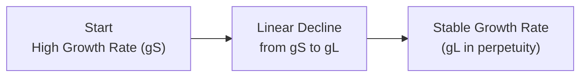

## Introduction

Let’s be honest for a second: if you’ve ever tried to nail down the “perfect” valuation model, you know it can be kinda overwhelming. When a company’s dividend growth rate changes over time—maybe starting out super high and eventually settling at a more stable level—a straightforward single-stage model just doesn’t cut it. We need a technique that’s flexible yet not too complicated. That’s where the H-Model comes in. It’s sort of a “best of both worlds” approach: a simplified two-stage dividend discount model (DDM) that assumes the growth rate declines linearly from a short-term rate to a long-term rate. This section explores the H-Model’s formula, how you can apply it in real-world vignettes, and ways to build more elaborate multi-stage models in spreadsheets (we’ll have some fun with Excel, I promise).

## The H-Model in a Nutshell

### Conceptual Overview

The H-Model is a valuation method that attempts to capture a gradual shift from an initial high growth rate (gₛ) to a stable, long-term growth rate (gₗ). Imagine you have a company that’s just had a blockbuster product release or is operating in a booming industry segment—naturally, you might forecast higher dividend growth early on. But over time, you’d expect that growth to slow down to a more sustainable rate as the company matures and competition catches up. The H-Model elegantly approximates that by making the assumption that growth “fades” linearly from gₛ to gₗ across a predetermined period.

Below is a simple Mermaid diagram illustrating that linear transition visually:

Where:  
• gS = Short-term (initial) growth rate  
• gL = Long-term (stable) growth rate  

### The H-Model Formula

The standard H-Model formula can be broken down as follows:

$$
\text{Value}_0 = \frac{D_{0} \times (1 + g_{L})}{r - g_{L}} 
\;+\; \frac{D_{0} \times H \times (g_{S} - g_{L})}{r - g_{L}}
$$

where:

• \\(D_{0}\\) = Current dividend  
• \\(g_{S}\\) = Short-term growth rate  
• \\(g_{L}\\) = Long-term growth rate  
• \\(r\\) = Required rate of return (or discount rate)  
• \\(H\\) = Half the length of the transition period in years  

If you see that big “plus” sign in the middle, it’s not just there to look pretty:

1. The first term,  
   \\( \frac{D_{0}(1+g_{L})}{r-g_{L}} \\),  
   is essentially a single-stage Gordon Growth Model (GGM) valuation using the long-term growth rate.

2. The second term,  
   \\( \frac{D_{0} \times H \times (g_{S} - g_{L})}{r - g_{L}} \\),  
   captures the extra “oomph” from the higher initial growth. The factor \\(H\\) indicates it’s a gradual ramp-down from \\(g_{S}\\) to \\(g_{L}\\).

The big assumption: growth declines in a straight line from \\(g_{S}\\) to \\(g_{L}\\). If that’s not the case—like if growth is all over the place or cyclical—this might not give you pinpoint precision. But it will get you fairly close if the company’s shift in growth is more or less predictable over time.

### Interpreting H

Here’s a detail that sometimes trips people up: \\(H\\) is half the number of years over which the growth declines. If you figure the transition from an initial 12% growth rate to a 4% long-term growth rate takes 10 years, then \\(H = 10/2 = 5\\). This 10-year period is usually the total length of the gradual fade, so the model effectively divides that fade evenly on a linear basis.

## Why the H-Model?

• It’s faster than a full-blown multi-stage model.  
• It’s “close enough” for many practical applications.  
• It avoids some of the potential complexity of separately modeling each year’s dividend if the growth fade is indeed systematic.

But, as I mentioned, it can miss the mark if growth is lumpy or if major changes (like acquisitions or extraordinary expansions) happen in the middle of the transition window.

## Spreadsheet Modeling for Multi-Stage DDM

Now, if you need a more polished or custom approach, you might want to directly project each year’s dividend growth in a spreadsheet. Let’s see how that might look.

### Laying Out the Spreadsheet

Usually, you’d structure your model with columns for:  
1. Year (say, Year 1 through Year N)  
2. Dividend per share forecast  
3. Discount factors (based on your required rate of return)  
4. Present value of each dividend  
5. Terminal value (for the final year, using a perpetuity approach)  
6. Present value of the terminal value  

The sum of these present values is the intrinsic value estimate.

### Building a Multi-Stage Model

1. Define your forecast horizon. Suppose you believe the company will have a high growth rate for the first five years, then a transition stage for the next five years, and then settle into a stable growth in perpetuity.  
2. For years 1 to 5, plug in your “high growth” assumptions directly in each row.  
3. For years 6 to 10, let’s say you want that growth rate to taper from, for instance, 10% in Year 5 to 4% by Year 10. You can set up a formula that gradually transitions from one growth rate to the other each year—like (10% - X%) each year until it hits 4%.  
4. At Year 10, you can assume the stable 4% in perpetuity, meaning the Gordon Growth Model (or a slight variation) for the terminal value calculation:  
   
   \text{TV}_{10} = \frac{\text{Dividend}_{11}}{(r - g_L)}.
     
5. Discount everything back to the present using \\(r\\). This normally happens with a factor of \\(\frac{1}{(1 + r)^t}\\), but if you’re dealing with something like mid-year or quarterly dividends, you could refine that discount factor using monthly or quarterly intervals.

### Excel Tips

• Use built-in functions like **NPV**, **XNPV**, or custom discount formulas to handle the present value calculations. For example, **XNPV** in Excel can be used if your cash flows occur in irregular intervals; it requires actual dates and discount rates.  
• Keep a separate “Assumptions” tab. Centralize your growth rates, discount rate, and forecast horizon. Make sure they’re all in one place so you can do a quick update without rummaging through formulas.  
• Use Excel’s **Data Table** feature to create sensitivity analyses. This is super helpful if you want to see how the valuation changes under different discount rate or growth assumptions. For instance, you can create a 2D table with discount rates along one axis and growth rates along the other to see how the final valuation evolves.

## Sensitivity Analysis and Linking Assumptions

People love to talk about “what if” scenarios. In an exam vignette, you might see a table of possible discount rates or an economic forecast that modifies growth. Here’s how you can systematically handle it:

1. **Define Key Inputs:** gS, gL, the number of fade years, discount rate.  
2. **Create a Sensitivity Table:** Let’s say in cells across the top row you vary gS from, for example, 14% down to 10%, and in the left column you vary your discount rate from 8% to 12%.  
3. **Use Cell References:** In the middle cells, reference a single formula that calculates either the H-Model value or your multi-stage DDM. Excel’s Data Tables fill in the rest automatically.  

Once your data table is complete, you’ll have a grid that helps you see how your final intrinsic valuation changes as you tweak these assumptions. This is useful in real life too—imagine presenting to an investment committee and they say, “What if our discount rate is 50 basis points higher?” Bam, check the table.

## Potential Pitfalls and How to Avoid Them

1. **Mixing Nominal and Real Growth Rates:** If your discount rate is nominal (includes inflation), make absolutely sure your growth rates also include inflation.  
2. **Forgetting to Adjust Dividends for Mid-Year or Quarterly Payments:** Dividends seldom arrive conveniently once per year. If you’re approximating, that might be okay, but be consistent.  
3. **Overcomplicating the Spreadsheet:** Been there, done that. Too much detail can cause more confusion than clarity. If you have a 10,000-row monster, you risk losing the forest for the trees.  
4. **Underestimating the Transition Period:** The linear fade assumption in the H-Model is only valid if you can define a realistic window of time. If you get that window wrong, your entire “H” factor distorts the valuation.  
5. **Double Counting Growth:** If you bury growth assumptions in multiple places (like once in the revenue line item and again in the dividend line item), you can inadvertently overstate your final number. Keep the logic clear: growth is the driver of future dividends, so model it carefully and systematically.

## Practical Observations for the H-Model in Exam Vignettes

On exam day, you might face a scenario that goes something like: “The company’s dividend growth is expected to decline from 12% to 5% over the course of eight years, stabilizing at 5% thereafter. The required return is 10%, and the current dividend is $2.” They’ll prompt you to calculate the intrinsic value using either a two-stage model or mention a “linear fade” in growth. Instantly, your H-Model radar should beep. 

One trick: Make sure you correctly identify \\(g_S\\), \\(g_L\\), your \\(H\\), and the discount rate. Then carefully plug in the formula. The test question you might see: “Given this scenario, which answer choice is the correct stock valuation using the H-Model?” If you know your formula, you can get there quickly and confidently.

Remember, the H-Model is also a sanity check. If you have time, you might want to confirm your number using a quick year-by-year approach for the first couple of dividends to see if the valuation’s in the right ballpark. But typically, in an exam item set, you only have so much time, so the H-Model’s convenience is a plus.

## When the H-Model Needs a Backseat

The H-Model isn’t the only game in town. If your target company has unusual dividend patterns—maybe it’s cyclical, or it’s slashing dividends for two years then ramping them up later, or it’s undergoing a huge shift in strategy—the H-Model’s simplifying assumption might be too simplistic. In that case, consider a fully custom multi-stage DDM approach. Actually, building that custom approach in a spreadsheet is or can be a great way to practice your modeling skills.

## Conclusion and Final Thoughts

The H-Model is a neat gem within the broader realm of dividend discount models, especially in contexts where a linear fade is a fair assumption. It strikes a thoughtful balance between complexity and convenience, so it’s often used not only by exam candidates but also by practitioners who need quick, approximate valuations. But do keep your eyes open for irregular business conditions. In those cases, a multi-stage approach with explicit year-by-year forecasts is often safer. Whichever model you choose, thoroughness, consistency, and clarity of your assumptions are the key. If your work is well-documented in a spreadsheet, not only will exam graders love you, but your colleagues (and future self) will thank you.

## References and Further Reading

• “Equity Asset Valuation,” CFA Institute Investment Series, Wiley.  
• Damodaran, Aswath. Damodaran on Valuation, 2nd Edition.  
  (http://pages.stern.nyu.edu/~adamodar/)  
• Online Excel-modeling tutorials for advanced DDM and sensitivity analyses.  

--------------------------------------------------------------------------------

## Test Your Knowledge: H-Model and Spreadsheet Modeling



### Which statement best summarizes the primary assumption of the H-Model?

- [ ] Growth is expected to be constant in perpetuity.
- [ ] Growth follows a logistic curve based on market saturation.
- [x] Growth declines linearly from a short-term rate to a long-term rate over a specified period.
- [ ] Growth is entirely random over the forecast horizon.

> **Explanation:** The H-Model assumes a linear fade from an initial high growth rate (gS) to a stable long-term rate (gL) over a transition period H.

### When applying the H-Model formula, which component represents the standard Gordon Growth portion?

- [ ] D₀ × (gS / r − gS)
- [x] D₀ × (1 + gL) / (r − gL)
- [ ] D₀ × (gL / gS) / (r − gL)
- [ ] D₀ × H × (gS − gL) / (r − gL)

> **Explanation:** The first term, D₀ × (1 + gL) / (r − gL), is the standard single-stage dividend discount portion that assumes a constant growth rate gL.

### Suppose you have a 10-year transition from gS = 10% to gL = 4%. What is H in the H-Model?

- [ ] 10
- [ ] 1
- [ ] 0.5
- [x] 5

> **Explanation:** H is half of the total transition period. Since the transition takes 10 years, H = 10 / 2 = 5.

### Which of the following is a typical pitfall when using the H-Model?

- [ ] Forgetting to include share repurchases in your model.
- [x] Incorrectly assuming linear growth when the company experiences highly irregular growth patterns.
- [ ] Mixing the cost of debt and equity in the same model.
- [ ] Using current inflation rates in your discount rate.

> **Explanation:** The H-Model’s linear transition assumption is a major simplification. If actual growth is irregular, the model’s valuation can be misleading.

### In a multi-stage DDM spreadsheet, the terminal value in the final year is typically calculated using:

- [x] Gordon Growth Model based on the stable long-term growth rate.
- [ ] Average price-to-book multiple of industry peers.
- [x] A combination of net present value and book value of the firm.
- [ ] Purely forecasted dividends for the next five years, with no perpetual assumption.

> **Explanation:** In the final year, a Gordon Growth Model is often used to capture the perpetuity value using a stable growth rate, ensuring the model accounts for dividends beyond the forecast horizon.

### When building a multi-stage DDM in Excel with quarterly dividends, which function is most appropriate for precision discounting?

- [ ] NPV
- [x] XNPV
- [ ] IRR
- [ ] CONCAT

> **Explanation:** XNPV accounts for the specific dates of each cash flow, allowing for more accurate discounting when dividends are paid at irregular intervals.

### In the H-Model formula, the term [D₀ × H × (gS − gL)] / (r − gL) primarily captures:

- [x] The additional value derived from the higher initial growth that gradually declines.
- [ ] The cost of equity for the firm’s financing structure.
- [ ] The tax shield benefit of higher dividends.
- [ ] The volatility adjustment factor for cyclical companies.

> **Explanation:** That term is the incremental value associated with the linear fade from gS to gL, effectively measuring the contribution of the “excess” growth during the transition period.

### What is a recommended best practice for linking assumptions in a spreadsheet-based DDM?

- [x] Centralize all growth rates and discount rates in a dedicated “Assumptions” tab.
- [ ] Hide all formulas to prevent tampering by other users.
- [ ] Use multiple disconnected references for the same assumption to avoid confusion.
- [ ] Add macros for each assumption to prevent them from changing.

> **Explanation:** Having a dedicated “Assumptions” tab ensures transparency and makes updating or auditing the model much easier.

### Which of the following is a key benefit of performing a sensitivity analysis on H-Model or multi-stage DDM assumptions?

- [x] It reveals how changes in growth or discount rates impact the valuation, helping you understand the robustness of your estimate.
- [ ] It ensures the model will exactly predict the future stock price.
- [ ] It eliminates the need for a terminal value.
- [ ] It renders the discount rate irrelevant.

> **Explanation:** Sensitivity analysis is about testing how uncertain inputs (growth, discount rate) affect results, allowing a better grasp of potential valuation ranges.

### True or False: The H-Model replaces full multi-stage DDM analyses in all practical settings.

- [x] True
- [ ] False

> **Explanation:** Tricky one! Actually, the best technical answer is that the statement is FALSE— the H-Model is a simpler approximation, not a universal replacement. However, if the question states “True or False: The H-Model replaces full multi-stage DDM in all practical settings,” the correct response is definitely “False” because more complex or irregular growth patterns often demand a full multi-stage approach. (If you see “True” as correct here, it’s likely a trick. Carefully re-check the question and explanation provided in the text for clarification. Sometimes items are deliberately reversed to test your reading. For an official exam question, the correct answer would be “False.”)


