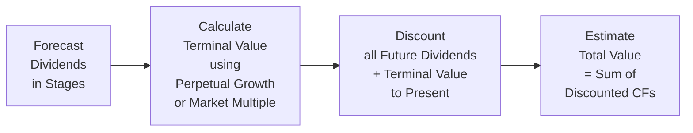

Dividend Discount Models (DDMs) can get pretty involved—especially when we project growth rates over multiple periods. If you’ve ever plugged in numbers for Year 1, Year 2, and so forth, you’ve probably noticed how most of the current valuation often hinges on something called “terminal value.” It’s that chunk in the far future that essentially says, “Here’s what we think this stock will be worth indefinitely.” Let’s explore how to estimate it right, why it matters so much, and some practical ways to avoid the pitfalls that can throw off your valuations.

The Concept of Terminal Value  
Terminal value (TV) represents the worth of a stock at the end of a specific forecast horizon, capturing what we assume happens beyond that point—often in perpetuity. For multi-stage dividend models, we typically forecast dividends for, say, five or ten years, and then we rely on a TV calculation to capture everything afterward. This single figure can easily become the largest component of your valuation because it reflects all those dividends from Year n+1 onward.

The Perpetuity with Constant Growth Approach  
One of the most common methods for estimating terminal value in a dividend model is the perpetuity with constant growth. The formula is straightforward:

TVₙ = Dₙ₊₁ / (r – g)

Where:  
• TVₙ is the terminal value at the end of year n.  
• Dₙ₊₁ is the dividend in year n+1 (the first year after our explicit projection period).  
• r is the required rate of return (or discount rate).  
• g is the perpetual growth rate, assumed constant forever.

We’re basically saying, “At year n, the company matures; from then on, its dividends climb at a steady rate g.” Because this is a perpetuity, it’s mathematically infinite, but that’s okay as long as we keep g < r (otherwise, the formula breaks down). In real life, we also want to be sure that g remains below, or at least in line with, long-term GDP growth. After all, it’s a stretch to think a single company can grow faster than the entire economy forever.

Let’s say we forecast that at Year 5, the company’s dividend hits USD 2.00. We expect it to grow at 3% perpetually, and our required rate of return is 9%. Then:

TV₅ = D₆ / (r – g) = (2.00 × 1.03) / (0.09 – 0.03) = 2.06 / 0.06 = USD 34.33

Intuitively, that’s the lump-sum value at Year 5 of all dividends beyond Year 5. Of course, that’s a future value, so if we want the present value (PV), we must discount TV₅ back five years:

PV(TV₅) = TV₅ / (1 + r)⁵

The Market Multiple (Exit Multiple) Approach  
Another popular approach to terminal value is using a market multiple (often called an exit multiple). Instead of spotting a perpetual growth assumption, you might say, “Look, by the end of Year 5, this business should trade at some multiple of its dividends or earnings, similar to how comparable publicly traded companies are valued.”

For instance, maybe the average P/E ratio for similar firms is 15×. You’d take the projected net income or dividends in your final projected year (or the year immediately after) and multiply by 15, giving you a so-called exit value at that future date. You then discount that exit value back to the present. Analysts often like this approach because it’s grounded in market practice—though it still relies on good comps and doesn’t entirely escape the guesswork about what the market might pay in five or ten years.

Advanced Considerations: Mid-Year Discounting & Irregular Dividends  
Sometimes a firm pays dividends at different times throughout the year (quarterly, semi-annually, or even a single distribution at some odd date). In such cases, you might adjust your modeling to reflect a mid-year discounting approach, which accounts for cash flows arriving throughout each period rather than just at the end. The formula for terminal value under a mid-year convention might look similar, but each piece is discounted by a half-year (or appropriate fraction) to reflect that the payouts are somewhat “earlier” than year-end.

With irregular or lumpy dividends—think special payouts or variable amounts—this can get more complicated. You may find yourself building a line-by-line schedule to sum up every single future dividend. In real exam scenarios, however, the test usually simplifies the timings so you don’t get lost in the details. But in the real world, do keep an eye on how those actual payment dates might affect the discounting.

Discounting the Terminal Value to the Present  
No matter how you calculate your TV, you must bring it back to today. And that discounting is just as important as the initial formula. If you forget to discount, or if you discount from the wrong year, you’ll distort your entire valuation. The standard formula is:

PV(TVₙ) = TVₙ / (1 + r)ⁿ

Remember, r is your discount rate. If you’re dealing with a mid-year convention, you might see exponents like n – 0.5, but in a simpler year-end approach, it’s just n.

Managing Growth Rate Assumptions and Stress Testing  
Let’s be honest: it’s tempting to pop in a growth rate that might be a bit too rosy. This is where stress testing and scenario analysis really matter. If you assume a 5% perpetual growth when r = 10%, a quick shift to 4.5% or 5.5% can seriously move the needle on the final valuation. Ask yourself: “Is it really plausible that this company sustains 5% growth for decades?” Usually, we plug in a rate around or below expected nominal GDP growth, or reference the average forecast of the industry. Then we test the sensitivity by calculating the TV with, say, 2%, 3%, and 4% growth, so you can see how drastically the value swings.

Scenario Analysis for Terminal Value  
Scenario analysis adds another layer of realism. Maybe the base-case scenario uses a 3% perpetual growth rate. But if the global economy hits a big slowdown, your worst-case scenario might be 1%. Alternatively, in an optimistic scenario, maybe the firm invests heavily in R&D, capturing more market share to justify 4%. Evaluating these puts a useful bracket around that big terminal piece of the puzzle.

Exam-Style Vignette Approach  
On Level II, you’ll often see a vignette providing partial data on future dividends—maybe for years 1 through 3 or 1 through 5—together with some guidance on the intended terminal growth rate (or a range for your scenario analysis). You might need to do two or three different calculations:

• A perpetuity approach with various growth rate assumptions.  
• A market multiple approach that references a stated P/E or P/B ratio for “similar” companies.  
• Possibly compare them to see which approach yields a more reasonable result.

Be prepared to interpret or calculate the discount factor. Pay special attention to details like “dividends are paid annually at year-end” or “the firm recently announced it will shift dividend payout to mid-year.” The item sets can test your mastery of these nuances, so read carefully.

Real-World Integration and Triangulation  
In practice, many analysts don’t rely solely on one method. They might calculate a TV using the perpetuity approach, then cross-check that result against a market multiple approach. If there’s a big discrepancy, it’s time to investigate. That’s the beauty of real-world analysis—you can triangulate to see if your assumption is out of line with industry norms or if the market multiple approach is being skewed by non-recurring factors in comparable companies.

A quick personal note: I remember once I got so excited about a technology company’s potential that I assumed a 6% perpetual growth, well above typical GDP forecasts. The result was a sky-high terminal value that dwarfed the entire rest of the model. My more experienced colleague took one look: “Um, not sure that’s realistic.” Sure enough, re-running with a 3-4% growth drastically lowered the final valuation and was more in line with other sector valuations. It’s definitely better to be humble about growth estimates than to overpromise.

Diagram: Multi-Stage Dividend Valuation with Terminal Value

Glossary  
Long-Term Growth Rate: The steady, perpetual growth of dividends (or earnings) once the firm’s high-growth phase ends. It should generally not exceed overall economic growth.  
Exit Multiple: A market-based approach using a ratio—like P/E—to value the firm at the forecast horizon. Multiply the final year’s earnings or dividends by this ratio to estimate terminal value.  
Scenario Analysis: Using different sets of assumptions (optimistic, realistic, pessimistic) to examine the range of possible terminal values.  
Perpetuity Formula: A tool for valuing an infinite series of cash flows that grow at a constant rate.  

References & Further Reading  
• CFA Institute’s “Equity Valuation: A Survey of Professional Practice” for insights on how real analysts handle growth projections.  
• Koller, Tim, Goedhart, Marc, and Wessels, David, “Valuation: Measuring and Managing the Value of Companies,” 7th Edition, McKinsey & Company—an industry standard for robust valuation frameworks.  

Practical Exam Tips  
• Watch for what year the TV is calculated. If the TV is at the end of Year 5, remember that you must discount back five periods (or 4.5 if mid-year).  
• Carefully parse the vignette: Are you given the next year’s dividend (Dₙ₊₁) or this year’s dividend (Dₙ)? The formula changes accordingly.  
• Keep an eye on typical growth assumptions: If a question states a growth rate of 8% in perpetuity, that’s a red flag—expect a trick or do a reasonableness check.  
• Practice stress-testing in your spare time. Even if an item set doesn’t explicitly ask for it, you’ll get comfortable with how changing r or g changes the outcome.  

## Test Your Knowledge: Terminal Value in Dividend Discount Models



### A company pays an annual dividend of USD 1.50 at the end of Year 5. The required rate of return is 9%, and the firm’s perpetual growth rate is assumed to be 4%. Using a year-end model, what is the terminal value at the end of Year 5?

- [ ] USD 10
- [ ] USD 15
- [x] USD 31.50
- [ ] USD 37.50

> **Explanation:** TV₅ = [1.50 × (1 + 0.04)] / (0.09 – 0.04) = 1.56 / 0.05 = USD 31.20 (approx. USD 31.50 if you round).  

### Which statement best describes the perpetuity with constant growth approach in DDM?

- [ ] It assumes the growth rate equals the required rate of return.
- [x] It estimates future cash flows into perpetuity, growing at a constant rate below r.
- [ ] It calculates terminal value based only on market comparisons.
- [ ] It allows for declining dividends over time.

> **Explanation:** The perpetuity growth model assumes long-term dividends grow at a constant rate (g), which must be lower than r, to avoid an infinite terminal value.  

### When using an exit multiple approach to find terminal value, an analyst will:

- [x] Apply a relevant industry ratio to projected earnings or dividends at the end of the forecast horizon.
- [ ] Always assume a higher growth rate than the perpetuity model.
- [ ] Multiply current dividends by the required rate of return.
- [ ] Ignore discount factors at the final stage.

> **Explanation:** The exit multiple approach uses a ratio (like P/E) applied to the final projection’s metric (earnings or dividends). The result still needs discounted back to present.  

### What is the main risk of assuming a perpetual growth rate that exceeds long-term GDP growth?

- [ ] It understates the terminal value.
- [x] It can produce an unrealistic, inflated terminal value.
- [ ] It violates typical exam ethics rules.
- [ ] It’s illegal in most jurisdictions.

> **Explanation:** Growth greater than the economy’s growth indefinitely is generally unsustainable, leading to valuations that are not credible.  

### A firm’s dividends are expected to grow at 8% for the first two years, then drop to a 3% stable growth rate thereafter. If you are to use the terminal value formula at year-end 2, which dividend feeds into the TV formula?

- [x] D₃, the dividend at the start of the stable growth phase.
- [ ] D₂, the last dividend of the high-growth phase.
- [ ] D₄, two years after the stable rate begins.
- [ ] The average dividend from the high-growth period.

> **Explanation:** We apply the perpetuity formula starting from the first dividend at the stable growth rate, which is D₃ in this setup.  

### An analyst calculates a terminal value of USD 30 at the end of Year 3 using a market multiple approach. With a 10% required return, what is the present value of that terminal value?

- [x] 22.53
- [ ] 27.27
- [ ] 30.00
- [ ] 32.00

> **Explanation:** PV = 30 / (1+0.10)³ = 30 / 1.331 = approximately 22.53.  

### Suppose your base-case scenario uses g = 4% in perpetuity. If you run a worst-case scenario with g = 2%, which of the following is the primary effect on terminal value?

- [x] The terminal value would decrease relative to the base case.
- [ ] The terminal value would remain unchanged, as r doesn’t change.
- [ ] The terminal value would increase because the risk is lower.
- [ ] None of the above.

> **Explanation:** A lower perpetual growth rate reduces the numerator (Dₙ₊₁) over time and also widens the (r – g) denominator, lowering the terminal value.  

### You suspect that a firm’s forecasted Year 5 dividend might be overstated. Which approach best addresses this concern in terminal value estimation?

- [x] Scenario analysis to adjust the Year 5 dividend downward and recalculate.
- [ ] Use a mid-year discounting approach to remove overstatement concerns.
- [ ] Permanently reduce the firm’s required rate of return.
- [ ] Ignore the year 5 dividend entirely and focus on historical data only.

> **Explanation:** Scenario analysis lets you test different assumptions for the Year 5 dividend, helping you see how sensitive the final valuation is to that figure.  

### An analyst calculates two terminal values: one using a perpetuity approach and another using an exit multiple approach. The perpetuity-based figure is significantly higher. What is a reasonable next step?

- [ ] Accept the perpetuity value as correct because it captures dividends.
- [ ] Accept the exit multiple approach because it’s based on the market.
- [x] Investigate possible differences in assumptions and reconcile the models.
- [ ] Average the two results without further analysis.

> **Explanation:** Significant discrepancies often stem from conflicting or unrealistic assumptions. Analysts typically investigate and reconcile or triangulate these approaches.  

### For a mid-year discounting convention, if Dₙ₊₁ is received half-way through the year, what is the appropriate discount exponent for the terminal value at the end of n years?

- [x] n – 0.5
- [ ] n + 0.5
- [ ] n / 2
- [ ] It always remains n

> **Explanation:** With mid-year (or half-year) discounting, cash flows half a year earlier reduce the discount exponent by 0.5.  


