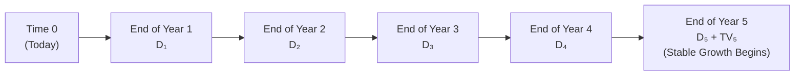

## Introduction

So, you’ve probably seen basic dividend discount models (DDM) back at Level I—like the simple Gordon Growth Model—even if you felt a bit of a headache doing the math. At Level II, though, it’s time to take that foundation and build a more robust multi-stage approach. The reality is that a company doesn’t just grow at one constant rate forever. Firms often start with rapid “supernormal” growth, then slow down to more stable rates. That’s where multi-stage models come in handy.  

I remember the first time I tackled a multi-stage DDM problem on a practice exam. I was so focused on the first few years of high growth that I forgot to carefully compute the continuing (terminal) value at the end of that growth phase. Oops! Let’s try to keep you from making the same mistakes by walking through a typical vignette-style scenario step by step.

## TechNova Inc. Scenario

Imagine we have a case on the exam featuring TechNova Inc. The story goes like this: TechNova is just finishing its super-charged expansion phase and is expected to continue growing quickly for five more years (though at a bit slower rate each year). After that, management projects a shift into a stable, long-term growth trend. We have to estimate the value of TechNova’s stock right now, based on future dividends.

Here’s the gist of the data you might see:

• The company has just paid a dividend (D₀).  
• Over the next five years, it expects dividends to grow at specified rates, say:  
  – Year 1: 15% growth  
  – Year 2: 12% growth  
  – Year 3: 10% growth  
  – Year 4: 8% growth  
  – Year 5: 6% growth  
• After Year 5, the stable (perpetual) growth rate is expected to be 3%.  
• We’re given a required rate of return (r), which might be derived from the CAPM or another cost of equity model. Let’s call it 10% just for illustration.  

Your task: Estimate today’s stock price (P₀) using a multi-stage dividend discount approach.

## Step-by-Step Approach

### Identify the Given Data

First, parse the vignette thoroughly. Often, you’ll get hints about:

• The dividend just paid (D₀) or about to be paid (D₁).  
• High-growth (supernormal) stage assumptions: growth rates for each of the next several years.  
• The stable growth rate after the high-growth phase.  
• The required return on equity (r) based on beta, risk-free rate, and equity risk premium—or from a build-up approach.  

Double-check if the item set references annual or quarterly dividends. The exam can slip in a detail like “quarterly dividends.” That changes your timeline and discounting.

### Project Each Dividend in the High-Growth Stage

Calculate the dividend for each year using the growth rates provided. For example, if the most recent dividend (D₀) was $2.00 and the first-year growth rate is 15%, then:

D₁ = D₀ × (1 + 0.15) = $2.00 × 1.15 = $2.30  

Then for the second year:

D₂ = D₁ × (1 + 0.12) = $2.30 × 1.12 = $2.576  

Continue that process for each of the high-growth years, carefully applying each distinct growth rate.

### Transition to the Stable Growth Stage

After you project, say, five years of dividends, the stable growth stage begins in Year 6 (which means the first stable-growth dividend is D₆). That’s the moment you typically calculate a terminal value (TV₅) that represents the present value at Year 5 of all future dividends starting in Year 6 and continuing forever.

One common formula for that perpetuity-based terminal value is:


TV_5 = \frac{D_6}{r - g_{stable}}


where gₛₜₐ_bₗₑ is the long-term growth rate (e.g., 3%).

And remember, D₆ = D₅ × (1 + gₛₜₐ_bₗₑ).

### Calculate the Terminal Value

Let’s say we found D₅ = $2.80, and the stable growth rate is 3%. Then:

D₆ = $2.80 × (1 + 0.03) = $2.88  

So:


TV_5 = \frac{2.88}{0.10 - 0.03} = \frac{2.88}{0.07} \approx \$41.14


This $41.14 is the value of all dividends from Year 6 onward, but it’s expressed in end-of-Year-5 dollars. We still have to discount it back to Time 0.

### Discount All Projected Dividends and the Terminal Value

Now that we have all the future dividends in the supernormal years (D₁, D₂, D₃, D₄, D₅) plus the terminal value at the end of Year 5, we discount each cash flow to today’s value.  

The present value of each dividend Dₜ is:


\text{PV}(D_t) = \frac{D_t}{(1 + r)^t}


And the present value of the terminal value is:


\text{PV}(TV_5) = \frac{TV_5}{(1 + r)^5}


Finally, add up all those discounted cash flows:


P_0 = \sum_{t=1}^{5} \frac{D_t}{(1+r)^t} + \frac{TV_5}{(1+r)^5}


That’s the multi-stage DDM price.

## Diagram of Timelines

To keep everything clear, I often like to sketch a quick timeline:

Each node shows when a dividend is paid. At Year 5, you also have that “TV₅,” which represents all dividends from Year 6 onward. Then you discount each flow back to Time 0 at the required rate r.

## Practical Example

Let’s put some hypothetical numbers together:

• D₀ = $2.00 (just paid)  
• Growth rates: 15%, 12%, 10%, 8%, 6% for Years 1 through 5  
• Stable growth rate = 3%  
• r = 10%

1) Project Dividends:  
   • D₁ = $2.00 × 1.15 = $2.30  
   • D₂ = $2.30 × 1.12 = $2.58 (rounded)  
   • D₃ = $2.58 × 1.10 = $2.84 (approximately)  
   • D₄ = $2.84 × 1.08 = $3.06 (approximately)  
   • D₅ = $3.06 × 1.06 = $3.24 (approximately)

2) Next Dividend in Stable Growth:  
   • D₆ = $3.24 × 1.03 = $3.34  

3) Terminal Value:  
   • \\( TV_5 = \frac{3.34}{0.10 - 0.03} \approx \frac{3.34}{0.07} \approx \$47.71 \\)

4) Present Values:  
   - \\( \text{PV}(D_1) = \frac{2.30}{(1.10)^1} = 2.09 \\)  
   - \\( \text{PV}(D_2) = \frac{2.58}{(1.10)^2} \approx 2.14 \\)  
   - \\( \text{PV}(D_3) = \frac{2.84}{(1.10)^3} \approx 2.13 \\)  
   - \\( \text{PV}(D_4) = \frac{3.06}{(1.10)^4} \approx 2.09 \\)  
   - \\( \text{PV}(D_5) = \frac{3.24}{(1.10)^5} \approx 2.01 \\)  
   - \\( \text{PV}(TV_5) = \frac{47.71}{(1.10)^5} \approx 29.59 \\)

5) Add ’em Up:  
   - Price \\( P_0 = 2.09 + 2.14 + 2.13 + 2.09 + 2.01 + 29.59 = \$39.05 \\) (approx.)

Depending on rounding or small differences in the discount factor, you might see an answer in the range of $39.00—$39.10. On exam day, you’d check which answer choice lands near your result.

## Key Exam-Day Strategies

• Watch Your Timeline: Carefully label each dividend as D₁, D₂, etc. If you accidentally label the next dividend as D₀, you’ll misplace your growth.  
• Double-Check the Growth Rates: If you see a sudden drop in growth in the data, confirm that’s not your terminal growth.  
• Keep an Eye on Partial-Year Dividends: Occasionally, an item set might say, “The dividend is paid mid-year.” Then you need a half-year discount factor.  
• Use the Same Units: Annual rates, annual dividends. If the item set provides multiples periods (quarter, semiannual), unify them carefully.  
• Look Out for a Dividend Cut: A tricky scenario might have the dividend reduce in a year before bouncing back.  
• Re-Check Cost of Equity: If they mention increased risk or changes in capital structure, that might affect your discount rate.  

In a timed exam environment, it’s easy to scramble. But if you methodically follow the steps—project each dividend, figure out the terminal value, discount them all—you’ll be less likely to make an error.  

## Advanced Techniques

Sometimes, a multi-stage dividend model can be complicated by share repurchases or new equity issuance. If the company is repurchasing shares, the effective dividend per share might be adjusted (fewer shares outstanding). Watch for signals that the question wants you to incorporate such changes.  

Another twist might be if the exam references an exit multiple or market-based approach for the terminal value instead of a perpetual growth model. In that case, you’ll use something like EV/EBITDA or P/E to approximate the stock’s value at the end of Year 5. Then you discount that “exit” value back.  

If you have partial information—like no direct mention of D₆ but a statement about “$3.24 is the final high-growth dividend, after which stable growth at 3% commences”—just be sure to interpret that properly: stable growth picks up from the next period.

## Conclusion

I think the biggest takeaway is that multi-stage DDM is an expansion of the single-stage approach. You account for higher growth in the near term and then shift to a stable rate later. This is more realistic than assuming a single growth rate forever, especially for companies in transitional phases, like our fictional TechNova Inc. Practice is key: The more you run these calculations (with different growth patterns, discount rates, or even a mid-year convention), the faster and more confident you’ll be on exam day.

## References

• Official CFA Program Curriculum for Level II, Equity Investments—Dividend Discount Models  
• Investopedia, “Multistage Dividend Discount Models” (https://www.investopedia.com)  
• Kaplan Schweser Practice Exams and Mock Tests  
• AnalystNotes.com (for additional practice sets)  

## Test Your Knowledge: Multi-Stage Dividend Forecasting Quiz



### A practitioner is evaluating a stock using a two-stage dividend discount model. If the dividend discount model question has a known D₀, a high-growth period of 4 years, and then a stable growth rate, which of the following best describes the use of the terminal value?

- [ ] Terminal value is computed at Year 4 but discounted from Year 0 to Year 3.
- [x] Terminal value is computed at Year 4, then discounted back to Time 0.
- [ ] Terminal value is computed at Year 5, with no discounting needed for those 4 years.
- [ ] Terminal value cannot be computed within a two-stage model.

> **Explanation:** In a two-stage model, the terminal value is calculated at the end of the supernormal growth period (Year 4) and then discounted to Time 0.  

### Which of the following statements about the multi-stage DDM is most accurate?

- [ ] Multi-stage DDM cannot accommodate changes in discount rate.
- [ ] Multi-stage DDM always assumes a stable growth rate in all forecast periods.
- [x] Multi-stage DDM handles varying growth rates over different time horizons.
- [ ] Multi-stage DDM only applies to firms with an immediate constant growth.

> **Explanation:** A multi-stage DDM captures different growth phases (e.g., high growth followed by stable growth), making it flexible enough to handle transitions.  

### If we observe a mid-year dividend payment in a three-stage DDM, which approach is best for discounting the dividends?

- [ ] Add 0.5% to the discount rate for each year.
- [x] Use a mid-year convention, discounting using fractional exponents or adjusting timing explicitly.
- [ ] Round dividends to the nearest full year to simplify calculations.
- [ ] Divide each dividend by two.

> **Explanation:** A mid-year convention in DDM typically means dividends are discounted over half-year intervals, requiring an explicit mid-year discount factor.  

### An analyst expects a firm to pay dividends for the next five years, then repurchase shares rather than pay dividends in years 6 and onward. How should the terminal value be calculated?

- [ ] Use a perpetuity formula based on the Year 5 dividend.
- [ ] Use the same dividends from the first five years beyond Year 5.
- [x] Estimate the stock’s price in Year 5 when the repurchase occurs (e.g., exit multiple or other approach), then discount it.
- [ ] Value the repurchase as if it violates the dividend discount principle.

> **Explanation:** If a firm switches to share buybacks, you can compute a terminal value based on expected price at the end of Year 5, often using an exit multiple approach or a continuing free cash flow approach.  

### Suppose D₁ is $2.50, the required return (r) is 12%, and expected growth is 8% for the next two years and 4% thereafter. Which step is crucial when transitioning from the second year to the perpetuity?

- [x] Compute D₃ using the 4% growth rate and use it to find terminal value at Year 2.
- [ ] Use D₂ for the entire perpetuity since growth is no longer supernormal.
- [ ] Compute dividend growth at 8% for the first perpetuity payment.
- [ ] Discard supernormal growth entirely.

> **Explanation:** After the high-growth period (two years at 8%), the dividend for Year 3 must use the stable rate. Then that Year 3 dividend is used to calculate the terminal value at the end of Year 2.  

### An item set provides the required return using CAPM: 5% risk-free rate, 6% market risk premium, and a beta of 1.2. If the question references a multi-stage DDM context, what is the correct discount rate?

- [x] 5% + (1.2 × 6%) = 12.2%.
- [ ] 5% + (1.2 × 6%) = 12%.
- [ ] 5% + 1.2 + 6% = 12.2%.
- [ ] 5% + 6% + 1.2% = 12.2%.

> **Explanation:** Using CAPM, r = rf + β × (ERP). Here: 5% + 1.2 × 6% = 5% + 7.2% = 12.2%.  

### When adjusting for both supernormal growth and changing capital structure, which factor might directly alter the discount rate?

- [x] Higher financial risk from increased debt may increase the cost of equity.
- [ ] Dividend payments remain the same under any capital structure.
- [ ] Tax rates reduce the dividend discount rate.
- [ ] The supernormal rate of growth is independent of the capital structure.

> **Explanation:** A firm’s capital structure can impact its cost of equity, because taking on more debt often increases equity holders’ risk.  

### An analyst using a multi-stage DDM calculates all dividend payments correctly but ends up with a higher price due to an inflated terminal value. Which is the most plausible reason?

- [ ] The discount rate was too high.
- [ ] They used a shorter supernormal growth horizon.
- [x] The stable growth rate used in perpetuity was set too high.
- [ ] They forgot to discount the terminal value.

> **Explanation:** Overestimating the stable growth rate inflates the terminal value quickly. Terminal values are highly sensitive to small changes in the stable growth assumption.  

### A firm’s dividend yields are expected to remain constant for three years before transitioning to a stable growth rate. If the question states D₀ = $1.50, and no dividend increase for three years, how would you handle D₁, D₂, and D₃?

- [x] D₁ = D₂ = D₃ = $1.50 before moving to the stable growth dividend in D₄.
- [ ] Increase each year’s dividend by the stable growth rate.
- [ ] They are automatically increased by the supernormal rate.
- [ ] Assume no future dividends at all.

> **Explanation:** If the question explicitly says there will be no dividend increase, then for the first three years, dividends are flat. Only at the beginning of the stable phase do we apply the stable growth rate.  

### True or False: A two-stage dividend discount model cannot be successfully applied if the high-growth period is unknown.

- [x] True
- [ ] False

> **Explanation:** In a two-stage model, you must define the duration of the high-growth period. Without specifying when the stable phase begins, the model cannot be structured properly.  


