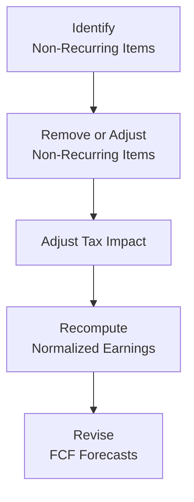

## Understanding the Need for Normalization

Let’s be honest: reported earnings can be a bit, um, “noisy.” Companies have all sorts of one-time costs—restructuring expenses, legal settlements, asset write-downs, you name it—and these events can obscure a firm’s underlying performance. This is where normalizing earnings comes in. By stripping out non-recurring items and smoothing larger fluctuations, we get closer to a picture of what a firm's ongoing, sustainable profit potential looks like.

Analysts at the Level II CFA stage should be comfortable identifying and adjusting these items. After all, an accurate free cash flow forecast (whether FCFF or FCFE) depends on a company’s recurring performance rather than once-in-a-blue-moon events. For instance, if a firm reports a “windfall” from selling an old manufacturing plant, that gain might artificially inflate net income. Conversely, a massive, one-time penalty for a lawsuit can deflate earnings that would otherwise be strong. Without normalizing, you could find yourself significantly over- or underestimating a company’s intrinsic value.

## Core Concepts and Definitions

Before diving deeper into the mechanics, let’s establish some working definitions:

• Normalization: Adjusting a firm’s financials (often the income statement) to remove non-recurring or non-operational items.  
• Non-Recurring Items: Gains or losses that are not expected to persist in the future, such as restructuring charges, one-time gains on asset sales, or legal settlements.  
• Sustainable Earnings: The profit levels an entity can reasonably maintain (and potentially grow) over time.  
• Recurring Capex: Capital expenditures required to maintain normal business operations (e.g., routine equipment replacement).  
• Extraordinary Items (Historical Concept): Under older GAAP rules, these were events both unusual and infrequent. IFRS and updated US GAAP no longer use the “extraordinary” label, but the idea remains: certain items truly fall outside a company’s ordinary course of business.

## Why Non-Recurring Items Can Distort Valuation

When you see a big increase (or decrease) in net income, it’s natural to wonder, “So…is that real, or is it some accounting oddity?” That’s pretty much the big question in equity valuation. And if you’re building a free cash flow forecast, these lumps and bumps matter:

• They affect your base level of earnings. If a one-time cost weighs down net income, you may underestimate future profitability. Yet if you forget to remove a one-time windfall, you might overestimate it.  
• They may have tax consequences, causing the effective tax rate to fluctuate a lot in these special periods.  
• They can alter the company’s risk perception if you don’t separate the “normal” from the “abnormal.”  

Anytime you rely on future estimates (particularly for multi-year cash flow projections), you want to anchor them to a stable, reliable metric. That’s the main objective of normalizing.

## Identifying Non-Recurring Items

Finding non-recurring items can feel tricky, but with practice, you’ll develop a sort of radar for them. Common red flags include:

• Large Restructuring Charges: If a firm restructures once in a decade, that cost shouldn’t weigh down all future years.  
• Gains or Losses on Asset Sales: Disposing of a business segment or major asset can generate abnormal gains.  
• Legal Settlements: Lawsuits and fines vary significantly. If they’re unlikely to reoccur, exclude them—from an ongoing earnings perspective.  
• Early Retirement of Debt: This can result in big charges or gains, but not part of recurring operations.  
• Unusual Expenditures: A major R&D push to acquire a new patent might be “strategic” but not a regular cost. 

One personal anecdote: I once analyzed a retail client whose financials were hammered one quarter by a store closure in a high-profile location. The closure costs were huge—lease termination fees, severance, asset write-downs. However, the company insisted it was taking “proactive steps” to optimize. So, while the headlines touted a big net loss, the real ongoing performance was far more stable. Recognizing these closure costs as temporary was crucial in ensuring we didn’t view them as a permanent drag on profits.

## Adjustments to the Income Statement

### Step 1: Remove the Effect of Non-Recurring Items

Suppose a company’s net income for the year is $1,000,000. Within that figure lurks a $200,000 restructuring charge. If the firm doesn't anticipate further restructuring for the foreseeable future, you would add that $200,000 back to your adjusted net income—though you also need to consider the related tax effect. If the marginal tax rate is 25%, the net effect is $200,000 × (1 – 0.25) = $150,000. So, the adjusted net income might be $1,150,000.

### Step 2: Adjust the Tax Impact

Non-recurring items typically have a tax impact. If you remove an expense, you will reduce the tax shield that the expense provided, so the net addition to income should be after taxes. Similarly, if you remove a one-time gain, you need to reduce net income by the after-tax portion of that gain. Be meticulous here; ignoring the tax effect is a common pitfall.

### Step 3: Smooth Out Revenue Anomalies

Sometimes the top line can show big, sudden spikes or dips. For instance, a retailer might experience an unusually large revenue boost from a hurricane that drove panic buying in certain regions. Or a manufacturing firm might get a windfall from a government contract that is not likely to repeat. In such scenarios, you can look at multi-year averages or trend lines to approximate a more “normal” revenue figure.

### Step 4: Adjusting for Capex

In free cash flow valuations, you’ll want to figure out which capital expenditures are truly recurring. Many large projects—like building a new corporate headquarters—may not occur regularly. If you keep that multi-million-dollar outflow in your forward capex assumptions, you might drastically underestimate free cash flow. Instead, try to isolate:

• Maintenance Capex: The portion you must spend to keep facilities and equipment running.  
• Expansion/Strategic Capex: Expenditures for new product lines, expansions, or acquisitions.  

Maintenance capex is typically part of normal operations and should remain in your model. One-time expansions can be flagged separately if they’re immaterial for the ongoing run rate.

### Constructing a Normalized Earnings Statement

Below is a simplistic flowchart that outlines the typical process for normalizing earnings:

Once you compute normalizing adjustments, you can carry the updated figures into your free cash flow (FCFF or FCFE) projections. Remember, your discount rate might stay the same if the firm’s risk profile hasn’t really shifted. But if your adjustments reflect fundamental changes in operational risk, you could revisit your cost of equity or WACC.

## Practical Example

Let’s do a quick numeric example. Suppose you have the following:

• Reported Net Income: $2,500,000  
• Includes a $400,000 charge for a legal settlement (non-recurring)  
• Includes an abnormal $100,000 gain on an asset sale  
• Corporate tax rate: 20%  

Step 1: Remove the $400,000 legal settlement expense. After tax, this adds back $400,000 × (1 – 0.20) = $320,000.  
Step 2: Remove the $100,000 gain from net income. After tax, subtract $100,000 × (1 – 0.20) = $80,000.  
Step 3: Adjusted Net Income = $2,500,000 + $320,000 – $80,000 = $2,740,000.  

So your normalized net income is $2,740,000. This new figure excludes both the non-recurring settlement cost and the unusual asset sale gain. It presumably better reflects ongoing profitability.

## Documenting Your Adjustments

Transparency is key. If you remove a chunk of expense or revenue in your model, you should explicitly note:

• The original item: what it was and why it’s non-recurring.  
• The dollar amount adjusted.  
• The tax rate applied.  
• The net after-tax impact.  
• Whether there is any future likelihood of that item repeating.  

In practicality, you might keep a separate adjustment schedule in Excel for each year you analyze, so your vantage on “normal” remains consistent over time.

## Common Pitfalls

• Over-Aggressive Normalization: Be skeptical. Not all “non-recurring” expenses are truly non-recurring. Some firms restructure every few years—so maybe it’s, um, sort of recurring?  
• Ignoring the Tax Effect: This is extremely common and results in overstating or understating adjusted earnings.  
• Misjudging Revenue Surges: A short-term sales boost might repeat if the firm has changed its product mix, so confirm whether it’s genuinely a one-off.  
• Disregarding Maintenance Capex: One big error is to assume all capex is “non-recurring.” The business still needs to replenish and replace equipment to operate effectively.

## Tying Normalized Earnings to FCFF or FCFE

Once you’ve pinned down a normalized income figure, you can project free cash flows with better reliability. For FCFF:

FCFF = NOPAT + Depreciation and Amortization – CAPEX – ∆Working Capital

But ensure your NOPAT (Net Operating Profit After Tax) is based on normalized operating income. Similarly, for equity-based valuations (e.g., FCFE), ensure net income and adjustments for interest expense, changes in debt, etc., reflect the corrected baseline.

## Exam Relevance and Strategies

Level II of the CFA Program often tests your ability to read a vignette, spot the one-time items in an income statement, and figure out how they’d affect your valuation. You may be asked to:

• Recalculate net income or operating income after adjusting for a variety of unusual items.  
• Identify how ignoring non-recurring items could lead to a misvaluation.  
• Combine normalization with forecasting in a multi-year setting.  

A time-saving tip: highlight any mention of “unusual charge,” “gain on sale,” or “settlement,” and do a quick analysis on whether it’s likely to recur. Then, apply the relevant tax adjustments.

## Best Practices

• Always examine multiple years of data. A single year can be misleading; multi-year trends help you see what’s truly recurring.  
• Compare to industry norms. If a firm’s R&D practice is consistently higher than peers, it might not be “non-recurring,” even if management claims it’s a special project.  
• Revisit the footnotes. Often, the real story about non-recurring items is hidden in those pesky (but critical) disclosures.  

## References and Further Reading

• CFA Institute Level II Curriculum, sections on earnings quality and financial statement analysis.  
• Aswath Damodaran, “Investment Valuation,” for methods to adjust earnings and cash flows.  
• Thornton L. O’glove, “Quality of Earnings,” for an analyst’s perspective on separating real performance from accounting distortions.  
• IFRS and US GAAP guidelines on reporting unusual or infrequent items (though not labeled “extraordinary” anymore, the concept endures).  

## Final Thoughts

So, normalizing earnings is about taking a good, hard look at what’s truly “business as usual” and what’s just a fluke—whether positive or negative. If you handle these adjustments carefully, you’ll walk into your next valuation exercise (and the CFA Level II exam) more prepared to create truly reliable models. And trust me, once you get good at spotting these nuances, you’ll see them in every financial statement you touch.

Stay curious, document your assumptions, and happy adjusting!

---

## Assessing Normalized Earnings Mastery: 10 Sample Questions



### Which of the following best describes the purpose of normalizing earnings?

- [ ] To increase reported earnings for tax benefits  
- [x] To present a company’s sustainable earnings by removing non-recurring items  
- [ ] To align all companies’ earnings for cross-sectional comparison  
- [ ] To reconcile net income with EBITDA  

> **Explanation:** Normalizing earnings means removing unique or non-recurring events to show recurring financial performance.

### A company reported $1 million in net income, which included a $300,000 after-tax loss from a product line it sold and will not replace. What would be the normalized net income?

- [ ] $700,000  
- [ ] $1,000,000  
- [ ] $1,300,000  
- [x] $1,300,000, assuming that $300,000 loss won’t recur  

> **Explanation:** If the $300,000 loss is truly one-time and won’t repeat, adding it back yields $1.3 million normalized net income.

### When removing a one-time restructuring charge from net income:

- [ ] The full charge should be added back to net income without regard to taxes  
- [ ] Only half the charge should be restored; the rest is likely recurring  
- [x] The charge should be added back net of taxes  
- [ ] The charge should be subtracted from net income net of taxes  

> **Explanation:** Non-recurring items must be adjusted for their tax impact before adjusting net income.

### Which of the following would typically be considered a non-recurring item?

- [ ] Depreciation expense on manufacturing equipment  
- [ ] Annual software licensing fees  
- [x] A large litigation settlement from a class-action lawsuit  
- [ ] Cost of raw materials for regular production  

> **Explanation:** Litigation settlements are usually one-time charges that are not part of ongoing operations.

### A firm’s tax rate is 30%. If they recorded a one-time gain of $500,000 from selling an old warehouse, how much of that gain would you remove from net income when normalizing earnings?

- [ ] $500,000  
- [x] $350,000  
- [ ] $150,000  
- [ ] $0, because gains don’t affect normalization  

> **Explanation:** The after-tax gain is $500,000 × (1 – 0.30) = $350,000. This amount is removed to reflect ongoing earnings.

### How might an abnormal revenue spike from a short-term, weather-related event best be handled?

- [x] Adjust revenue by using a multi-year average that excludes the spike  
- [ ] Eliminate the entire revenue for that period  
- [ ] Reduce revenue by half to reflect partially recurring demand  
- [ ] Carry the spike forward indefinitely  

> **Explanation:** Using a multi-year average helps remove the effects of one-off surges and reflect a more normal revenue level.

### Which of these capital expenditures is generally considered recurring?

- [ ] Major acquisitions of new subsidiaries  
- [x] Routine equipment maintenance and replacements  
- [ ] Building a new corporate headquarters every fifteen years  
- [ ] One-time technology overhaul for a brand-new product line  

> **Explanation:** Maintenance capex is the recurring expense required to sustain existing operations.

### In practice, adjustments for non-recurring items should:

- [x] Always be transparent and well documented  
- [ ] Be applied only to the last reported fiscal period  
- [ ] Maximize reported net income for valuation purposes  
- [ ] Minimize risk by lowering net income  

> **Explanation:** Transparency ensures users of your valuation understand how the adjustments were made and why.

### A software firm has ongoing R&D expenses that they claim are “strategic” and not part of regular operations. What’s the key consideration before removing these costs from earnings?

- [ ] Whether the R&D is tax deductible  
- [ ] Whether the R&D is similar to the firm’s competitors  
- [x] Whether such “strategic” R&D is expected to happen regularly  
- [ ] Whether the cost is 10% or more of revenue  

> **Explanation:** If the firm invests in R&D on a consistent basis, it’s part of their recurring operational cost and should remain in the normalized figure.

### True or False: In some cases, a firm’s risk profile may change so significantly after a large restructuring that normalizing the discount rate is also necessary.

- [x] True  
- [ ] False  

> **Explanation:** If a restructuring changes the firm’s fundamental operations, leverage, or market exposure, it can affect its risk and potentially alter the discount rate used.


