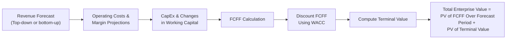

## Overview

So, here we are—ready to roll up our sleeves and build a basic free cash flow (FCF) model. At first glance, setting up a free cash flow valuation can feel intimidating. You’ve got forecasts, discount rates, capital expenditures, working capital adjustments, terminal values, and all these moving parts that can make even the most seasoned analyst take a deep breath. But fear not! This section breaks down the process step-by-step, helping you develop a comprehensive and reliable FCF model.

Free cash flow modeling is a core valuation skill at CFA Level II. Knowing how to estimate free cash flows effectively is especially important for item-set and vignette-style questions where a company’s future growth, operating profitability, and capital needs all come into play. Here, we’ll walk through each piece of the puzzle—from revenue forecasting to terminal value calculations—so you can see how everything fits together.

## Setting the Forecast Horizon

One of the first things you need—no surprise—is a defined projection or forecast horizon. Many analysts choose a period of around 5 years, while others go as long as 10 years for stable, mature companies. The idea is to pick a period long enough to capture all the near-term growth you can reasonably predict, yet not so long that your assumptions become pure guesswork.

• Shorter horizons (3–5 years) can work well for industries undergoing rapid change because long-term predictions become more uncertain.  
• Longer horizons (7–10 years) might fit a stable industry where the growth trajectory is more predictable.

In practice, you might do a sanity check by comparing your chosen horizon to that used by industry peers or recommended by the CFA curriculum’s best practices in forecasting. Remember, as you’ll see later, much of the firm’s valuation can depend on the tail period captured by your terminal value assumptions. So pick your horizon carefully.

## Revenue Projections: Top-Down or Bottom-Up

Revenue is usually the starting point for any forecast. After all, you can’t get to your free cash flow if you haven’t pinned down how much you’ll sell and at what price. There are two broad ways to tackle this:

### Top-Down Approach

A top-down approach can be useful for large firms that operate in well-defined industries. You might start with overall industry growth (which could be driven by macroeconomic factors such as GDP or consumer spending) and then allocate a market share to your firm. An example:

• Suppose you forecast that the global widget industry will grow at 8% annually for the next 5 years.  
• Your target firm currently holds an 8% market share. You project it might nudge that up to 9% by year 3 due to a new marketing strategy.  

So you take total industry revenues, multiply by the anticipated share, and voilà—you’ve estimated the company’s top line in a structured, big-picture way.

### Bottom-Up Approach

Alternatively, a bottom-up approach might begin with specific product lines, unit sales, and average selling prices. Maybe you know the firm sells three main widget types:  
• Premium Widget at $100 each, expected unit growth of 5% annually  
• Basic Widget at $40 each, expected unit growth of 2% annually  
• Economy Widget at $20 each, expected unit growth of 10% annually  

You then scale up from each product category to get the aggregate revenue. This bottom-up approach can be more granular and can capture differences in each product line’s cost structure and growth potential.

In practice, you’ll choose whichever approach (or a combination of both) makes sense given the data at your disposal, the nature of the business, and the reliability of the assumptions.

## Operating Costs, Margins, and Efficiency

Let’s talk a bit about expenses. After you’ve projected your top line, you need a handle on operating costs. This is one place folks can get tripped up, especially if the company has both fixed and variable cost components.

• Variable Costs: They scale with revenue or production. If you expect a 10% increase in sales volume, you might see a comparable increase in raw materials cost.  
• Fixed Costs: Operating leases, salaried labor, rent—these don’t necessarily fluctuate (at least in the short run) with changes in sales. But be mindful of step-cost behavior: a rapid jump in capacity might bring on new fixed costs.

Margins can also be influenced by economies of scale and cost-efficiency initiatives. For instance, if the company invests heavily in process automation or integrates new technology, you might expect a higher operating margin over your forecast horizon.

## Capital Expenditures (Capex)

Capex is often the big expenditure that can make or break your free cash flow model’s accuracy. In an FCFF formula, you subtract Capex out to arrive at the free cash left over for providers of capital. Same with FCFE, but the calculation can differ a bit if you plan to fund Capex with new debt.

A few considerations:

• Growth Strategy: If the firm plans to expand capacity by building new plants or investing in R&D, you may see a higher Capex in the near term, followed by stable maintenance Capex in later years.  
• Industry Norms: Check industry benchmarks for Capex/revenue or Capex/depreciation ratios. Some industries, like telecom or energy, demand heavy capital investment, while software companies might be more light on fixed assets.

It’s easy to either overestimate or underestimate future Capex, so do be thorough. One trick is to try a ratio approach: for instance, Capex that’s a certain percentage of revenue or a certain multiple of depreciation. Then compare your results to management guidance (if available) or industry standard practices.

## Changes in Net Working Capital

Working capital (WC) is the difference between current assets and current liabilities. For free cash flow, you’re mainly interested in changes in that working capital:

• If you forecast sales to rise, you’ll probably need more inventory or might see an increase in receivables. This increase in net working capital is a cash outflow (it reduces free cash flow).  
• Conversely, if you delay payables (though that might lead to unhappy suppliers) or if your business model requires less inventory, you might see a release of working capital, boosting free cash flow.

In other words, watch how your forecasted growth changes the timing of cash flows. A big sales push might look great on the income statement, but if your receivables balloon, you won’t actually see that cash in your bank account for months—or even longer.

## Discount Rates: WACC vs. Cost of Equity

Now let’s differentiate between two frequently discussed free cash flow measures:

• Free Cash Flow to the Firm (FCFF): The after-tax cash flow available to all suppliers of capital (both debt and equity). Because it’s for the entire firm, we discount FCFF by the Weighted Average Cost of Capital (WACC).  
• Free Cash Flow to Equity (FCFE): The cash flow left over for equity holders after accounting for interest and net debt changes. Because it’s strictly for owners, we discount FCFE at the cost of equity.

### Stability of Capital Structure  
If you expect the capital structure (debt/equity ratio) to remain somewhat consistent over your forecast horizon, using an FCFF approach is often simpler. But if you foresee changes in debt levels—like a major refinancing or leveraged recap—FCFE can be more direct (albeit a bit trickier to calculate, given that interest expense and debt repayment must be forecast more carefully).

## Terminal Value

Even if you forecast out 5 or 10 years, the truth is that many businesses have a life beyond that horizon. Enter terminal value (TV), which often makes up a large chunk—sometimes the majority—of a firm’s total valuation. Two common ways to estimate it:

• Perpetuity Growth Method (Gordon Growth): You assume that in the final forecast year, free cash flow grows at a constant rate forever. The formula often looks like:


\text{Terminal Value} = \frac{\text{FCF}_{\text{final}} \times (1 + g)}{(r - g)}


Where:  
– FCF_final is the free cash flow in the last forecast year (or the next year’s projected amount),  
– g is the perpetual growth rate,  
– r is your discount rate (WACC for FCFF or cost of equity for FCFE).

• Exit Multiple: Another common approach is to apply a market multiple—like EV/EBITDA or P/E—to the final year’s metrics. For instance, if comparable companies trade at 8× their EBITDA, you’d multiply your last forecast year’s EBITDA by 8, then adjust for net debt if you’re deriving equity value.

Your choice often depends on data availability and analyst preference. The perpetuity growth method is more theoretically grounded, while the multiple method might be more in tune with current market sentiment.

## Bringing It All Together

Let’s look at how each component flows in a typical FCFF framework. (FCFE is similar but has extra steps for net debt issuance and interest.)



### Present Value of Forecasted Cash Flows

Each year’s FCFF is discounted by (1 + WACC)^(year). Summing up all these discounted values gives you the present value of the forecast period. Then you find your discounted terminal value and add it. That total is your enterprise value (EV). To get equity value, subtract net debt from EV.

### Compare to Market Prices and Perform Sensitivity Analysis

Once you have your total intrinsic value, you can compare it to the current market price. If your model suggests a price of $50 per share while the market trades at $40, you might think the stock is undervalued—assuming your assumptions are correct. Yet, it’s crucial to realize that small changes in WACC or long-term growth can swing your valuation significantly.

That’s why sensitivity analysis is essential. Play with growth rates, discount rates, and margin assumptions to see how robust your valuation is under different scenarios. In actual practice, or in a Level II item set, you might see a question like: “If the WACC rises by 1%, which of the following is the new intrinsic value?” Then you’d quickly recalculate based on the higher discount rate.

## A Brief Example

Let’s do a simplified numeric run-through. Suppose we have the following assumptions for a 5-year forecast:

• Year 1 revenue: \$100 million, growing at 6% per year  
• Operating margin: 16% (constant)  
• Depreciation: \$5 million each year  
• Capex: \$6 million each year  
• Increase in net working capital each year: \$2 million  
• Tax rate: 25%  
• WACC: 9%  
• Perpetual growth rate for the terminal value: 3%

First, compute FCFF for each year (we’re doing a short, rough version):

1) EBIT = Revenue × Operating margin. Then EBIT after tax = EBIT × (1 – tax rate).  
2) Add back depreciation.  
3) Subtract Capex.  
4) Subtract the increase in net working capital.

For Year 1:  
• Revenue = \$100M  
• EBIT = 100 × 0.16 = \$16M  
• EBIT after tax = 16 × (1 – 0.25) = \$12M  
• Depreciation = \$5M  
• (EBIT – tax) + Depreciation = \$12M + \$5M = \$17M  
• Subtract Capex: \$17M – \$6M = \$11M  
• Subtract net working capital: \$11M – \$2M = \$9M = FCFF Year 1

You’d repeat this for 5 years, applying a 6% annual growth to revenue, which in turn escalates EBIT. Then you discount each FCFF at WACC = 9%. For terminal value, you might assume your Year 5 FCFF continues to grow 3% perpetually. If that final year’s FCFF is \$X, the terminal value at Year 5 is:


\text{TV}_{5} = \frac{X \times (1 + 0.03)}{0.09 - 0.03}


Then discount that back to the present. Sum everything, and—voilà—an intrinsic value that you can compare to the company’s market value.

Below is a tiny snippet of Python-like pseudocode (just for fun) that shows how such a calculation might look:

```python
import math

WACC = 0.09
g = 0.03
tax_rate = 0.25

fcff = [9.0, 9.5, 10.0, 10.5, 11.0]  # hypothetical values

present_value_fcff = 0
for i, cash_flow in enumerate(fcff, start=1):
    present_value_fcff += cash_flow / ((1 + WACC) ** i)

last_fcff = fcff[-1] * 1.06  # if we assume 6% revenue growth continues
terminal_value = (last_fcff * (1 + g)) / (WACC - g)
present_value_tv = terminal_value / ((1 + WACC) ** 5)

enterprise_value = present_value_fcff + present_value_tv
```

In reality, you’ll refine each variable and keep the logic consistent with your revenue and cost forecasts, plus the type of free cash flow you’re calculating (to the firm vs. to equity).

## Sensitivity Analysis

Look, the real world loves to throw curveballs. What if interest rates suddenly spike? Or raw material costs jump? Running a sensitivity analysis means adjusting key inputs—like discount rates, perpetual growth rates, or margins—to see how these changes flow through to your final valuation.

This is super helpful in a testing scenario as well. On the Level II exam, you might be given a base-case scenario plus multiple alternative assumptions and asked to choose the correct new valuation. Practicing these sensitivity “what-ifs” is a powerful way to prepare.

## Common Pitfalls and Best Practices

1. Overestimating Growth Rates: Be realistic. A 10% perpetual growth rate is usually not sustainable in the long run.  
2. Ignoring Working Capital: It’s easy to forget that building up receivables or inventory drains cash. Don’t let net working capital changes slip by.  
3. Underestimating Capex: Especially in capital-intensive industries, your valuation can be way off if you downplay future investment needs.  
4. Mixing FCFF and FCFE Approaches: If you’re doing an FCFF valuation, use WACC. If it’s FCFE, use cost of equity. Don’t discount FCFF with cost of equity or FCFE with WACC.  
5. Terminal Value Over-Reliance: Terminal value can easily make up 70% or more of your total valuation. Double-check your assumptions in that final year, because a small percentage tweak can have a big impact.

## Exam Tips

• Show clear, concise work. In a vignette scenario, you’ll likely be given partial data—like revenue growth, margins, net capital expenditures—and asked to fill in the rest.  
• Keep track of your discounting if you’re given mid-year or end-of-year conventions.  
• Watch out for trick questions involving negative working capital or one-time items in Capex.  
• If the items mention changes in share count or revolve around new equity/debt issuance, pay attention to how that toggles between FCFE and FCFF.  

## Glossary

• Projection Horizon: The explicit forecast period (e.g., 5 to 10 years).  
• Capital Expenditures (Capex): Money spent to acquire or upgrade physical assets (like machinery, real estate).  
• Working Capital: Current assets minus current liabilities; essential for daily operations, but expansions or contractions in working capital directly affect free cash flow.  
• Terminal Value (TV): Value at the end of the forecast horizon, typically calculated using either a perpetuity growth model or an exit multiple.  
• Perpetuity Growth Model: Assumes free cash flows grow at a constant rate forever.  
• Exit Multiple: Uses a market multiple (like EV/EBITDA) to estimate a terminal value based on the final year’s projected performance.

## References and Further Exploration

• CFA Institute Level II Curriculum Sections on Pro Forma Statement Modeling and Valuation.  
• McKinsey & Company’s “Valuation: Measuring and Managing the Value of Companies” provides a thorough, step-by-step approach to free cash flow modeling.  
• Articles from the Journal of Applied Corporate Finance discussing FCFF and FCFE in real-world contexts.

## Test Your Knowledge: Building a Basic Free Cash Flow Model



### Which of the following statements best describes a key advantage of using a longer forecast horizon for free cash flow modeling?

- [ ] It reduces the impact of the terminal value on the overall valuation. 
- [ ] It allows an analyst to ignore economies of scale in earlier years. 
- [x] It captures more of the company's anticipated growth period in detail. 
- [ ] It completely eliminates uncertainty in the final valuation.

> **Explanation:** A longer horizon lets you model more of the firm’s growth and operational plans explicitly, though you still face uncertainty in later years.

### In a top-down revenue forecasting approach, which factor typically forms the initial reference point for a company's revenue estimate?

- [ ] The firm’s historical revenue growth rate. 
- [x] The entire industry’s projected growth rate. 
- [ ] The company’s most recent product launch performance. 
- [ ] Direct competitor’s market share trends.

> **Explanation:** A top-down approach starts with an industry-wide forecast and then estimates how much market share the company can capture.

### What is the primary difference between FCFF and FCFE in terms of discount rate?

- [ ] FCFF uses the cost of equity, while FCFE uses the WACC. 
- [ ] Both FCFF and FCFE use the cost of equity. 
- [x] FCFF is discounted at WACC, whereas FCFE is discounted at the cost of equity. 
- [ ] The discount rate is irrelevant for FCFE valuations.

> **Explanation:** FCFF is available to all capital providers (debt and equity), so it’s discounted using WACC. FCFE is for equity holders, so it uses the cost of equity.

### If a firm decides to increase its target debt ratio significantly during the forecast period, which valuation approach might become more complex due to changing interest expense?

- [ ] FCFF, because it requires constant interest expense forecasting. 
- [x] FCFE, because interest expense and debt levels need to be modeled carefully. 
- [ ] Both FCFF and FCFE become simpler. 
- [ ] Changing debt ratios do not affect free cash flow modeling.

> **Explanation:** FCFE requires factoring in changing debt levels and interest expenses, making it more cumbersome when the capital structure changes significantly.

### When forecasting capital expenditures (Capex), which of the following is often considered a practical method to project future amounts?

- [x] Setting Capex as a percentage of revenue or depreciation. 
- [ ] Randomly assigning a fixed amount each year. 
- [ ] Using management’s confident statements without question. 
- [ ] Assuming zero Capex beyond the current year.

> **Explanation:** A common and straightforward method is to estimate future Capex relative to revenue, depreciation, or another relevant financial metric, then refine based on industry norms and management guidance.

### Why is incorporating changes in net working capital crucial in building a free cash flow model?

- [ ] Net working capital only affects long-term growth. 
- [x] Increases in receivables or inventory consume cash, reducing free cash flow. 
- [ ] Net working capital is irrelevant for capital-intensive industries. 
- [ ] Decreases in payables always improve free cash flow.

> **Explanation:** Increases in net working capital represent a cash outflow (for example, more inventory or receivables); ignoring this understates cash needs.

### Which of the following is a significant benefit of using the Perpetuity Growth (Gordon Growth) method for terminal value calculation?

- [ ] It guarantees the most accurate measure of value. 
- [ ] It uses market multiples, reflecting current investor sentiment. 
- [x] It is grounded in the theoretical assumption of stable growth forever. 
- [ ] It automatically adjusts for cyclical industries.

> **Explanation:** The perpetuity (Gordon) growth method aligns with the idea of stable cash flow growth continuing indefinitely, making it a popular theoretical approach.

### If a high-growth technology company expects to reinvest substantially in new research after the forecast horizon, which terminal value approach might require special caution?

- [ ] Ratio-based multiples. 
- [x] Perpetuity growth model. 
- [ ] No approach is recommended. 
- [ ] Calculating terminal value is unnecessary.

> **Explanation:** A perpetuity growth model might overlook substantial Capex or R&D outlays that continue beyond the forecast window, so extra caution is necessary.

### In the context of free cash flow to the firm (FCFF), the total enterprise value is obtained by summing which of the following?

- [ ] The present value of future dividends plus net debt. 
- [ ] The present value of future equity issuances plus terminal value. 
- [x] The present value of forecast FCFF plus the present value of terminal value. 
- [ ] The present value of total debt plus the present value of share repurchases.

> **Explanation:** You calculate the enterprise value by adding the discounted value of forecasted FCFF up to the horizon and the discounted terminal value.

### True or False: A small change in the long-term growth rate assumption for the terminal value can dramatically affect the overall valuation.

- [x] True
- [ ] False

> **Explanation:** Terminal value often represents a large portion of a firm’s total valuation. Even a small change in the perpetual growth rate can lead to a significant shift in the calculated intrinsic value.


