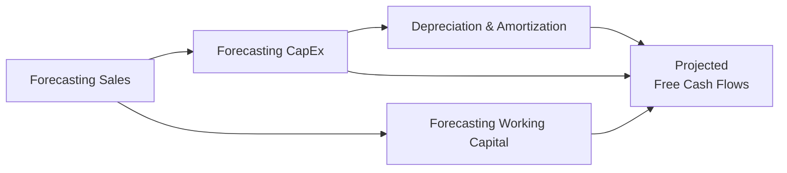

## Introduction
So, you’re sitting there, scratching your head and thinking: “I know how to get from Net Income to Free Cash Flow, but how do I bring in these big, sometimes unpredictable capital expenditures and changes in working capital?” This question tends to pop up in real-world valuation all the time. It’s also a major focus of your CFA® exam preparation, especially when analyzing multinational companies with complex expansions or cyclical inventory patterns. 

When we forecast Free Cash Flow to the Firm (FCFF) or Free Cash Flow to Equity (FCFE), we rely heavily on assumptions around both capital expenditures (CapEx) and working capital. In fact, if you underestimate CapEx or over-simplify changes in working capital, you can end up with a valuation that looks too good to be true. Next thing you know, you’re in front of your supervisor—perhaps like I was when I first tried a naive approach—having to explain why your forecasted free cash flows are oddly high. 

Below, we’ll dive into the nuts and bolts of forecasting CapEx and working capital. We’ll look at maintenance vs. growth CapEx, the effect of depreciation, the fundamentals of accounts receivable and inventory forecasting, and how to tie it all together into a coherent set of financial statements. Let’s get started.

## Capital Expenditures Forecasting
Capital expenditures represent a company’s long-term investments in fixed assets—think things like machinery, factories, store expansions, or intangible assets tied to technology. Accurately forecasting CapEx is vital, and it begins with understanding the company’s strategy. 

• Management guidance and capital budgets: Lots of management teams, especially in larger firms, provide forward-looking guidance. This might come as a formal capital budget, or perhaps in the form of press releases that describe expansion plans. Don’t just take their word for it—compare that guidance to historical spending patterns and current capacity constraints. Are they planning 30% growth in production when the factory is only at 50% utilization? Double-check if that really makes sense.

• Maintenance vs. Growth CapEx: 
  – Maintenance CapEx: The dollars spent each year to keep the lights on, the machines well-oiled, and the current capacity humming. When you’re simply replacing old equipment or renovating existing facilities with no plan to increase output capacity, that’s maintenance CapEx.  
  – Growth CapEx: When the company invests in a bold new expansion—like opening 50 new stores or launching a brand-new product line—that’s growth CapEx. Growth CapEx can vary widely, and it’s often the difference-maker in projecting the company’s future strategic trajectory.

• Incremental Factors to Consider: 
  – Inflation and Commodity Prices: If your key inputs are steel, copper, or semiconductors, your CapEx forecast can get battered around by commodity price swings.  
  – Technological Shifts: Technology revamps can lower capital costs or shorten the useful life of existing assets, which may trigger earlier replacements.  
  – Industry Benchmarks: Some industries, such as utilities, telecommunication, or energy, have specialized CapEx ratios or standard capital intensity metrics. Cross-referencing these can refine your forecast.

For instance, let’s imagine you’re analyzing a regional grocery chain with big plans to open 10 new stores per year. First, look at what each store typically costs and how that spend is allocated (e.g., land acquisition, building construction, technology systems, store fixtures). Then, factor in any desired improvements to existing stores—are they aging, requiring major remodels every three years? Stick those expenditures into your maintenance CapEx bracket.

### A Quick Python Snippet
Below is a very basic code snippet (you absolutely don’t need to memorize coding for the CFA® exam, but it can illustrate a quick check) that forecasts CapEx over five years assuming a base level of $100 million and 5% annual growth:

```python
import math

base_capex = 100.0  # in millions
growth_rate = 0.05  # 5 percent
years = 5

forecasted_capex = []
for year in range(1, years+1):
    projected = base_capex * ((1 + growth_rate)**(year-1))
    forecasted_capex.append(projected)
    print(f"Year {year} CapEx: {projected:.2f} million")
```

In real life, you might refine this with store expansion count, inflation assumptions, or different ramp-up speeds in different years.

## Depreciation and Amortization
Well, if we’re going to project CapEx effectively, we can’t forget about depreciation. Depreciation is that noncash charge that spreads the cost of tangible assets over their useful lives. When a company invests heavily in CapEx one year, you’ll see an impact on depreciation expense in the following years. 

• Consistency with CapEx: If you forecast a bunch of new stores in 2026, guess what happens in 2027 and beyond? Depreciation on those newly capitalized stores will ramp up. If you forget that, you’ll either understate or overstate your net income and the resulting free cash flows.  

• Tax Shield: Depreciation lowers taxable income, which means your after-tax free cash flow can vary more than you might expect. Make sure to factor in any special tax treatments—like accelerated depreciation—where relevant. The exam might give you a scenario in which you have to apply different depreciation methods (straight-line vs. declining balance).  

• Amortization: Similar concept to depreciation, but used for intangible assets (patents, licenses). Just keep in mind that intangible asset spending is often either capitalized or expensed depending on local GAAP or IFRS rules. Project intangible asset amortization in tandem with intangible CapEx if that’s relevant for the industry.

## Working Capital Forecasting
Working capital changes can be surprisingly large, especially for companies in seasonal or cyclical industries. In many real-life valuations, intangible differences in inventory management or credit policy can lead to big changes in net working capital. Let’s break it down:

• Components of Working Capital:  
  – Accounts Receivable (A/R): The cash you’re owed by customers. If the company loosens payment terms or sells to less creditworthy buyers, A/R can balloon.  
  – Inventory: Think about product type. Is it perishable? Highly seasonal? Predicting inventory typically involves analyzing your days of inventory on hand or inventory turnover ratio.  
  – Accounts Payable (A/P): The money owed to suppliers. Extended payment terms can reduce net working capital, but be careful pushing this too far if it jeopardizes supplier relationships.

• Linking to Sales: A common approach is to forecast your revenue (top line), then assume certain “days” metrics—Days Sales Outstanding (for A/R), Days Inventory Held, and Days Payable Outstanding (for A/P). This can be as simple as:
  
  (A/R Days ÷ 365) × Forecasted Sales = Forecasted A/R  

  or  

  (Inventory Turnover) = COGS ÷ Average Inventory  
 
  You can then project average inventory needed for next year. 

• Seasonality and Cyclicality: Some firms do half or more of their annual sales in one quarter (like holiday retailers). That’s a big reason a straightforward linear forecast can fail. Also, cyclical resource industries can see large swings in commodity prices, which drastically alter the cost and carrying value of inventories.

## Linking to the Financial Statements
If you approach forecasting systematically, your income statement, balance sheet, and cash flow statement should remain coherent.



Let’s break it down in words:
• Start with assumptions around sales growth, cost structure, and capital requirements.  
• From your CapEx forecast, incorporate relevant depreciation and any intangible amortization. These feed into your income statement (impacting net income) and balance sheet (increasing net PP&E).  
• Your working capital assumptions adjust A/R, Inventory, and A/P on the balance sheet. Corresponding changes flow into your cash flow statement.  
• The final free cash flow figures come after all of these items have been accounted for.

## Practical Applications
Picture a mid-sized manufacturing firm that’s grown historically at about 5% a year. Suddenly, management announces an international expansion, meaning they might double CapEx for the next two years. This shift will likely ramp up depreciation in the out-years as new assets come online. Meanwhile, if they’re expanding into a region where customers tend to pay slower, you could see an increase in days sales outstanding, raising working capital. The combined effect? Lower free cash flow in the early years, but potentially an even bigger payoff if the expansion goes according to plan.

In another scenario, consider a software firm that invests heavily in intangible assets and sees practically no inventory. Forecasting intangible assets might revolve more around R&D capitalization rules rather than store expansions—but the logic remains the same: estimate the amount spent, line it up with the expected lifespans, and watch how that affects amortization.

## Common Pitfalls
Let’s be honest: we’ve probably all run into at least one forecast that was way too rosy or too dire. Here are some easy traps to fall into:

• Ignoring Major CapEx: You might skim the management’s discussion & analysis and see no mention of expansions. You assume CapEx will be stable, but you miss a footnote about a new production line they’re installing next year. Suddenly, your free cash flow is overstated.  

• Overly Simplistic Working Capital Percentage: Some folks apply a fixed percentage of sales for working capital. That might be fine in a pinch, but it can mislead you if the company is cyclical, changing suppliers, or adopting a new just-in-time inventory system.  

• Inconsistent Depreciation: If your CapEx is rising quickly, depreciation probably will too—unless you’re dealing with intangible, short-lived assets or new, more efficient technology. Keep your depreciation policy consistent with your CapEx timeline.

• Underestimating Seasonality: Retail, agriculture, and any holiday-oriented product lines can yield major discrepancies if you forecast linearly. 

## Glossary
Maintenance CapEx: Capital spent to preserve current operating efficiency or capacity.  
Growth CapEx: Capital spent to expand the business, add new locations, or enter new markets.  
Depreciation Expense: Noncash allocation of the cost of tangible assets over their useful lives.  
Amortization Expense: Similar to depreciation but for intangible assets.  
Net Working Capital (NWC): Typically Current Assets minus Current Liabilities, excluding items like excess cash or short-term debt.  
A/R Days (DSO): A measure of how many days on average it takes customers to pay invoices.  
Inventory Turnover: How many times a company’s inventory is sold and replaced each period.

## References
• Rosenbaum, J., & Pearl, J. (2013). Investment Banking: Valuation, Leveraged Buyouts, and Mergers & Acquisitions. Wiley Finance.  
• Koller, T., Goedhart, M., & Wessels, D. (2020). Valuation: Measuring and Managing the Value of Companies (7th ed.). McKinsey & Company.  
• Bloomberg and FactSet (2024). Industry Data on Capital Spending Trends.  
• CFA Institute. (2025). CFA® Program Curriculum Level II, various readings on free cash flow and equity valuation.

## Exam Tips
For CFA® Level II item sets, carefully read any references to planned expansions or capital budgets in the vignettes. They might hide a big CapEx spike in a footnote or embed an assumption about intangible asset capitalization in the text. Use historical data to confirm that any management guidance is plausible. Then reflect those assumptions in your working capital forecast: watch for changes in days sales outstanding, inventory turnover, or payment terms with suppliers. 

If you see a mismatch between historical patterns and the forecast, ask yourself: “Does this mismatch reflect a justifiable shift, or is it an oversight?” On exam day, those details can tip you off to the correct or incorrect approach in multiple-choice items or performance analysis. 

And remember: always integrate your CapEx and working capital assumptions across your projected financial statements so that everything remains consistent. People slip on that detail all the time—don’t let it be you.

---

## Check Your Knowledge: Forecasting CapEx and Working Capital



### In forecasting a firm’s capital expenditures, which approach is most appropriate?
- [x] Review management guidance, compare to historical spending and capacity constraints, and adjust based on industry norms.
- [ ] Take the firm’s most recent capital expenditure figure and grow it by inflation annually.
- [ ] Assume that all CapEx is purely for maintenance and does not contribute to growth.
- [ ] Rely solely on equity analysts’ consensus estimates for capital expenditure projections.

> **Explanation:** The best practice is to begin with management guidance and compare it to historical spending patterns and capacity constraints. Then adjust based on industry benchmarks and current expansion plans.

### Which of the following best describes the distinction between maintenance and growth CapEx?
- [ ] Maintenance CapEx is usually zero once the firm is established; growth CapEx continues indefinitely.
- [x] Maintenance CapEx keeps existing operations functional, while growth CapEx expands the business into new markets or capacities.
- [ ] Growth CapEx covers the normalized replacement of fixed assets, while maintenance CapEx pays for intangible patent renewals.
- [ ] Maintenance CapEx relates mostly to intangible assets; growth CapEx relates mostly to tangible assets.

> **Explanation:** Maintenance CapEx is for preserving current operations, while growth CapEx is for expansion or modernization beyond existing capacity.

### What is a likely consequence of ignoring significant CapEx spending in your free cash flow forecast?
- [ ] Overstating depreciation expense.
- [x] Overstating forecasted free cash flow.
- [ ] Overstating the assumed cost of equity.
- [ ] Understating net working capital.

> **Explanation:** If you don’t incorporate major CapEx, you will fail to recognize the cash outflow, leading to artificially high free cash flow forecasts.

### How does depreciation typically affect free cash flows?
- [ ] It directly lowers operating cash flow by the amount of the depreciation charge.
- [ ] It has no impact on free cash flow because it’s a noncash expense.
- [x] It creates a tax shield and thus increases operating cash flow if recognized for tax purposes.
- [ ] It reduces EBIT but always increases net income.

> **Explanation:** Depreciation is a noncash expense that lowers taxable income, which provides a tax shield, effectively increasing operating cash flow relative to net income alone.

### Why is forecasting the balance of accounts receivable important in free cash flow projection?
- [x] Changes in accounts receivable affect the timing of cash inflows and can increase or decrease operating cash flows.
- [ ] Accounts receivable balances are only recorded at the end of each accounting period and do not affect cash flow.
- [ ] Changes in accounts receivable are irrelevant because of depreciation offsets.
- [ ] Forecasting A/R is strictly a managerial accounting function with no impact on valuation.

> **Explanation:** Accounts receivable can significantly affect short-term cash flows by delaying or accelerating when revenue is actually received as cash.

### Which of the following best describes Days Sales Outstanding (DSO)?
- [ ] It is an expense category that tracks accounts payable days.
- [x] It is the average number of days it takes for customers to pay invoices.
- [ ] It measures how many times inventory is sold in a year.
- [ ] It is the difference between sales growth and cost of goods sold.

> **Explanation:** DSO measures how long, in days, it takes for a company’s credit sales to be collected from its customers.

### What is a key danger in applying linear working capital growth assumptions across all forecast years?
- [ ] It always leads to understated free cash flow.
- [ ] It automatically captures cyclical fluctuations in the industry.
- [x] It may ignore seasonality or economically driven swings in receivables and inventory levels.
- [ ] It doubles the effect of interest expense in annual projections.

> **Explanation:** A linear approach may fail to account for seasonal or cyclical changes that significantly impact working capital balances.

### If a firm reduces its days of inventory from 60 days to 40 days, what is the most direct impact on free cash flows, assuming sales remain stable?
- [x] Free cash flow increases because less cash is tied up in inventory.
- [ ] Free cash flow decreases due to higher depreciation expenses.
- [ ] No change in free cash flow because inventory does not affect cash.
- [ ] Free cash flow decreases because net operating income decreases.

> **Explanation:** Lower inventory days means the firm releases cash previously tied up in inventory, increasing cash flow.

### Which of the following statements regarding depreciation is correct under a typical tax regime?
- [x] Higher depreciation in earlier years leads to lower taxable income and increased operating cash flows in those years.
- [ ] Depreciation is irrelevant to taxes because it’s a noncash charge.
- [ ] Depreciation immediately creates a reduction in net working capital.
- [ ] Depreciation has an identical impact on cash flows each year.

> **Explanation:** When depreciation is accelerated, it lowers taxable income in the early years and, therefore, increases operating cash flow by reducing taxes in those years.

### In a firm’s financial model, capital expenditures should:
- [x] Be linked to the strategic expansion plans, capacity constraints, and any major technology upgrades.
- [ ] Be set as a fixed percentage of EBITDA each year.
- [ ] Always equal historical depreciation.
- [ ] Be forecasted at zero to simplify modeling.

> **Explanation:** CapEx is typically driven by management’s long-term strategies, capacity limits, and technological or market changes. While some analysts use heuristic ratios, thorough modeling reflects real-world strategic expenditures.


