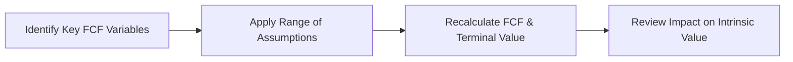
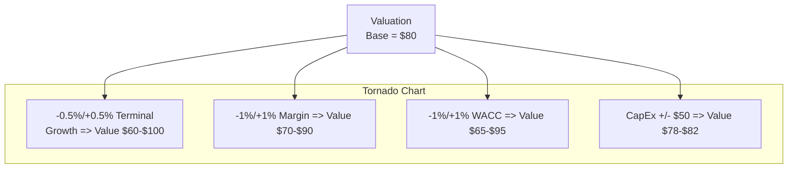

## Overview and Purpose

Sensitivity analysis in Free Cash Flow (FCF) valuation is one of those topics that can sound a bit dry on paper—or screen—but trust me, it’s hugely important. We often spend hours (sometimes days) building fancy multi-stage cash-flow models, only to realize we have no idea how robust our answer is if, say, revenue growth slows by 2% or the discount rate climbs by half a percentage point. This is exactly where sensitivity analysis steps in. By systematically tweaking our key input variables, we can see how they ripple through the valuation. It’s basically a what-if approach that helps you avoid (or at least anticipate) unwelcome surprises.

Whether you’re working on a standalone analysis for a Fortune 500 acquisition or trying to understand your own portfolio’s exposure to a particular macroeconomic factor, sensitivity analysis not only flags the biggest drivers of valuation but also highlights the potential range of outcomes. At the CFA Level II level, it’s a tool that underscores how everything we do in finance is a guess—well, an educated guess—based on the best information we have at the time. Let’s explore some scenarios, best practices, and watch-outs so you can do a better job of evaluating your valuations (and avoid heartbreak when actual results differ from your assumptions).

## Core Concepts of Sensitivity Analysis

Sensitivity analysis is essentially a stress test that asks: “What happens to my final FCF-based intrinsic value if one or more of my core assumptions change?” Here are the most common variables that analysts like to stress-test:

• Growth rates (sales growth, EBITDA growth).  
• Operating margins (how small or big can these get?).  
• Discount rate or weighted average cost of capital (WACC).  
• Capital expenditures or working capital needs.  
• Terminal value assumptions (long-term growth, exit multiples, or both).  

Because FCF valuation can be highly sensitive to even moderate changes in these inputs, it’s best to explore a range of possibilities. In practice, we might prepare a data table or a “tornado chart” that ranks which inputs have the most significant impact on valuation. If you’re seeing that 80% of your final value is explained by the terminal growth rate alone, you’ll probably spend more time justifying or analyzing that assumption in your write-up.

Below is a simple Mermaid diagram illustrating how changes in each assumption feed into the final valuation:



## Scenario-Based Approaches

### Best Case, Base Case, and Worst Case

It’s not unusual to see a CFO or lead investor deck present three versions of a forecast: the “everything goes swimmingly” scenario, the “reasonable guess” scenario, and the “batten down the hatches” scenario. We often call these Best Case, Base Case, and Worst Case scenarios. The main difference compared to simple one-dimensional sensitivity analysis is that you’re changing multiple variables at once. For instance:

• Best Case: Higher GDP growth than expected, improved margins due to tech efficiencies, stable interest rates, and lower CapEx requirements.  
• Base Case: Modest growth in line with general economic forecasts, stable margins, normal CapEx.  
• Worst Case: Lower consumer demand, margin pressures from competition, interest rates rising faster, and CapEx cost overruns.

This multi-input scenario approach can give you a more holistic sense of how your final valuation might shift. Let’s say your target firm’s value is $80 per share under the base case, $100 under the best case, and $60 under the worst case—suddenly you see a likely range of $60–$100. Using that range, you might decide how comfortable you are with the current stock price.

### Monte Carlo Simulations

If you really want to get fancy—or if the stakes are high—you can run a Monte Carlo simulation. This is basically using statistical distributions (e.g., normal, triangular, or even custom distributions) for each uncertain input, then letting a computer randomly pick values for those inputs thousands (or even millions) of times. When you’re done, you get a distribution—like a bell curve—of possible valuations.

Here’s some pseudocode in Python to illustrate:

```python
import numpy as np

def project_fcf(sales_growth, margin, wacc, capex):
    # A hypothetical function that calculates FCF 
    # based on input variables
    # (Simplified for demonstration)
    fcf = (1000*(1+sales_growth)*margin) - capex
    # Discount this hypothetical FCF for one period using wacc
    present_value = fcf / (1 + wacc)
    return present_value

N = 100000  # number of simulations
sales_growth_dist = np.random.normal(0.05, 0.02, N)  # mean 5%, std 2%
margin_dist       = np.random.normal(0.2, 0.05, N)   # mean 20%, std 5%
wacc_dist         = np.random.normal(0.08, 0.01, N)  # mean 8%, std 1%
capex_dist        = np.random.normal(200, 20, N)     # mean 200, std 20

results = []
for i in range(N):
    val = project_fcf(sales_growth_dist[i], margin_dist[i], 
                      wacc_dist[i], capex_dist[i])
    results.append(val)

median_val = np.median(results) 
percentile_5 = np.percentile(results, 5)
percentile_95 = np.percentile(results, 95)

print(f"Median Valuation: {median_val:.2f}")
print(f"5th Percentile: {percentile_5:.2f}, 95th Percentile: {percentile_95:.2f}")
```

You might run something like this (with a more robust FCF formula) to see how likely a certain valuation outcome might be. For instance, maybe you find there’s a 10% chance your valuation is over $120 per share, but also a 20% chance the valuation is under $70. This approach can get complicated, but it’s powerful for exploring the full probability range of outcomes.

## Key Variables to Stress Test

Let’s outline the common factors in FCF valuation that deserve special attention:

• Revenue or EBITDA growth: If you’re analyzing a cyclical business (e.g., automotive, airlines), small changes in economic growth can dramatically affect their sales.  
• Operating margin: Margin assumptions often fluctuate based on cost discipline, competition, and input prices. A 1% shift in margin can have a massive effect on net operating profits—especially if you’re modeling future years.  
• Capital expenditures: Many industries, like telecommunications or energy, require heavy upfront capital. Underestimating CapEx can inflate your FCF and lead to an unrealistically high valuation.  
• WACC or discount rate: This is arguably one of the most important—and hardest—estimates. If interest rates rise or the business’s equity risk premium changes, the discount rate could jump, significantly reducing the present value of future cash flows.  
• Terminal value assumptions: Terminal value typically makes up a big chunk of your total valuation. A small tweak in the terminal growth rate (say from 2.5% to 3.0%) can translate to a notable jump in final value.

## Interpreting the Results

After you’ve run your numbers, you might see that your valuation is extremely sensitive to a particular variable—i.e., if your terminal growth drops below 2%, the valuation collapses from $50 per share to $30. That’s super important to know, right? You’d pay extra attention to that growth assumption in your analysis, perhaps digging deeper into the sustainability of the firm’s competitive advantage or analyzing macro trends that could hamper growth.

One handy visual method is a tornado chart, which orders variables by their impact on final valuation. The biggest “slice” on the bar is the factor that affects your result the most. That chart might look something like the following (conceptually):



From that chart, you can see the difference in how each factor might move the valuation range up or down. Terminal growth is creating the widest swing, while CapEx changes create only a narrow band.

## Practical Applications

Beyond the classroom or exam context, sensitivity analysis has broad real-world use:

• Investor presentations: Management teams use it to highlight the potential upside, while also being transparent about the downside.  
• Regulatory stress tests: After the 2008 financial crisis, regulators started requiring banks to run stress scenarios on capital adequacy. While that’s more about credit and market risk, the concept is similar.  
• LBO (Leveraged Buyout) analysis: Sponsors want to see if rising interest rates or missed synergy targets would prevent the business from servicing its debt.  
• Forecasting new projects: If you’re analyzing a new product line with uncertain market acceptance, scenario analysis can give you a sense of the potential payoff distribution.

## Common Pitfalls

Mark these down, because these pitfalls can easily trip you up:

• Overly optimistic or unrealistic ranges: It doesn’t help your analysis if your “worst case” is still basically a best case. Make sure the range is fair, even if it isn’t what management wants to hear.  
• Ignoring correlations: Sometimes operating margin and revenue growth are highly correlated (e.g., if there’s a recession, you might see sales dropping and margins widening or tightening). Treating them as independent can lead to misleading results.  
• Underestimating cyclical factors: For industries sensitive to commodity prices or global economic cycles, ignoring big swings can reduce the usefulness of your analysis.  
• Failing to re-check the logic behind your inputs: Are you sure that a 10% incremental margin is realistic? Did you double count synergy benefits? If you’re making an assumption that significant, you better be able to back it up.

## Best Practices and Strategies

• Document your assumptions: If you present a data table on valuations from $60 to $120, note which variables changed and by how much.  
• Use a consistent framework: For example, define your base-case scenario with mainstream consensus forecasts for GDP growth, inflation, and so on. Then define your best and worst cases as a +/- percentage from those consensus numbers.  
• Evaluate the extremes: “Stress testing” means you also consider extreme events (e.g., cost overruns, double-digit inflation, unexpected regulation) to see how robust the valuation is if the world goes haywire.  
• Present findings clearly: Decision-makers appreciate a quick sense of the downside risk. Tables, charts, or short bullet points are better than paragraphs of text.

## Mini Case Study

Imagine you have a technology firm, SoftwareCo, that you’re valuing with a multi-stage FCFE model (remember from earlier in Chapter 9 how we handle multi-stage growth?). The base-case data says:

• 8% revenue growth for the next three years, then 3% terminal growth.  
• 15% operating margin.  
• 9% WACC.  
• Annual CapEx of $50 million.  

Your base-case intrinsic value is $40 per share. Let’s do a quick sensitivity table, adjusting terminal growth and WACC:

|                       | WACC = 8%   | WACC = 9%   | WACC = 10%  |
|-----------------------|------------:|------------:|------------:|
| Terminal Growth = 2%  | $45         | $36         | $30         |
| Terminal Growth = 3%  | $55         | $40         | $34         |
| Terminal Growth = 4%  | $68         | $47         | $38         |

From that table alone, you can see how your $40 valuation will jump to $47 if you keep your WACC at 9% but assume a 1% higher terminal growth rate. Conversely, if the WACC rises to 10% and terminal growth dips to 2%, your share price drops to $30. That’s a $17 swing! So if Terminal Growth is the biggest source of your valuation, you’ll want to investigate the sustainability of that growth in real detail.

## Glossary You Should Know

• Sensitivity Table (Data Table): A spreadsheet tool (often in Excel or Google Sheets) that calculates your valuation output for a range of input values.  
• Tornado Chart: A specialized bar chart that ranks each variable by the magnitude of its impact on valuation, typically from largest to smallest.  
• Monte Carlo Simulation: A method of repeatedly sampling random values from probability distributions to produce a distribution of possible outcomes, as opposed to single-point estimates.  
• Stress Testing: A technique to see how a valuation might hold up under extreme circumstances (e.g., a sudden interest rate hike or a dramatic decline in sales).  
• Correlation: A statistical measure (ranging from -1 to +1) indicating whether two variables move in the same or opposite directions.

## References and Further Reading

• CFA Institute Level II Curriculum: “Equity Valuation—Free Cash Flow Models.”  
• Hull, J. (2018). Risk Management and Financial Institutions (5th ed.). Wiley Finance.  
• Copeland, T., Koller, T., & Murrin, J. (2000). Valuation: Measuring and Managing the Value of Companies (3rd ed.). Wiley Finance.  
• Damodaran, A. (2012). Investment Valuation: Tools and Techniques for Determining the Value of Any Asset (3rd ed.). Wiley Finance.

## Exam Relevance and Final Tips

On the CFA Level II exam, you might see an item set describing a company’s finances, asking you to recalculate the intrinsic value under different discount rates or different growth assumptions. They could also drop in some additional cost or synergy data to see if you can figure out the net effect on FCF. Sensitivity analysis typically appears in:

• Vignette-based questions requiring calculations of intrinsic value under various input changes.  
• Conceptual questions about the importance or ranking of valuation drivers.  
• Qualitative discussions about risk management and how to interpret wide distributions of valuations.

Advice: Practice with data tables, be comfortable with how changes in one or two key metrics affect your bottom line, and remember to reevaluate the realism of your assumptions. Good luck!

## Sensitivity Analysis in FCF Valuation: Practice Questions



### Sensitivity to Growth and WACC
- [x] A small change in terminal growth rate can significantly impact a firm’s FCF valuation.
- [ ] A small change in the revenue growth rate has no effect on terminal value.
- [ ] Changing the WACC by 1% normally has a negligible impact.
- [ ] The discount rate does not affect near-term free cash flows.

> **Explanation:** Both the discount rate (WACC) and the terminal growth rate are critical assumptions in FCF valuation. A small shift in either can cause large valuation swings.

### Correlation Effects
- [ ] In building a sensitivity analysis, it is always safe to assume variables are independent.
- [x] Correlated variables can magnify or reduce the overall impact on valuation.
- [ ] Correlations never affect terminal value.
- [ ] Correlations always have a value of -1.

> **Explanation:** Correlation matters because one variable changing often leads to changes in another. Treating them as independent when in fact they move together can lead to misleading results.

### Best/Worst Case Scenario Range
- [x] It’s useful to present a best case, base case, and worst case to capture a range of outcomes.
- [ ] Only “best case” and “base case” are typically enough for a robust analysis.
- [ ] Worst-case scenarios are too pessimistic and can safely be ignored.
- [ ] The worst case scenario is always zero revenue growth.

> **Explanation:** A three-scenario approach helps present a realistic range of possibilities. Worst-case scenarios are essential to understand downside risk.

### Monte Carlo Essentials
- [x] Monte Carlo simulations generate a distribution of possible valuation outcomes.
- [ ] Monte Carlo simulations produce a single price target.
- [ ] Monte Carlo simulations are never used in FCF valuation.
- [ ] Monte Carlo simulations do not require assumptions on variables.

> **Explanation:** Monte Carlo methods leverage probability distributions to simulate numerous outcomes, allowing analysts to see the overall distribution rather than a single estimate.

### Interpreting a Tornado Chart
- [x] A tornado chart ranks variables by their impact on the final valuation.
- [ ] A tornado chart requires at least 10 variables to be meaningful.
- [ ] A tornado chart always shows a linear relationship.
- [ ] Tornado charts are only used in marketing materials.

> **Explanation:** Tornado charts visually display the sensitivity of valuation outputs to changes in individual inputs, ranking them from most impactful to least impactful.

### Primary Objective
- [x] The main objective of sensitivity analysis is to identify how key assumptions affect valuation.
- [ ] The main objective is to reduce the complexity of the model.
- [ ] The main objective is to eliminate uncertainty entirely.
- [ ] The main objective is to replace scenario analysis.

> **Explanation:** You can’t remove uncertainty completely, but you can figure out which assumptions most influence your results and prepare accordingly.

### Pitfalls to Avoid
- [x] Overlooking correlation among variables while changing them.
- [ ] Being too generous in adjusting for worst case scenarios.
- [x] Using unrealistic ranges for input assumptions.
- [ ] Allocating more resources to scenario analysis than to the base model structure.

> **Explanation:** Overlooking correlation and picking unrealistic ranges are among the most common errors when doing sensitivity analysis.

### Stress Testing
- [x] Stress testing typically involves applying extreme but plausible changes in major variables.
- [ ] Stress testing is only relevant for interest rate changes.
- [ ] Stress testing always uses normal distribution assumptions.
- [ ] Stress testing is used exclusively in academic contexts.

> **Explanation:** Stress testing helps measure robustness under extreme market conditions or cost assumptions, not just mild or typical changes.

### Data Tables in Practice
- [x] Data tables recalculate valuation outputs across multiple input values.
- [ ] Data tables are the same thing as pivot tables.
- [ ] Data tables show correlation coefficients between variables.
- [ ] Data tables are invalid for multinational companies.

> **Explanation:** In Excel or Google Sheets, data tables allow you to see how valuation fluctuates for different combinations of assumptions, which is particularly useful in sensitivity analysis.

### True or False: Monte Carlo vs. Scenario Analysis
- [x] True
- [ ] False

> **Explanation:** Monte Carlo analysis is more comprehensive, creating numerous iterations with random draws from assumed distributions, while scenario analysis tends to focus on a small set of discrete cases.


