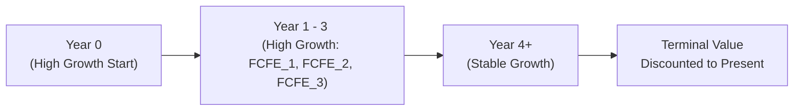

## The Two-Stage FCFE Concept: Setting Up the Vignette

Have you ever looked at a company that’s just exploding with growth—new factories sprouting up, product lines extending like crazy, maybe even a rumored convertible-debt issuance on the horizon—and thought, “How on earth do I value this mess?” Well, you’re not alone. One of the most common challenges in equity analysis is dealing with businesses that have shifting capital structures and multiple growth phases. We see these scenarios all the time in the CFA® item set (vignette) format, where a miniature case study provides you with a swirl of data points—some relevant, some red herrings—and wants you to figure out the firm’s intrinsic stock value.

The two-stage Free Cash Flow to Equity (FCFE) model is a tried-and-true approach for these kinds of companies. It lets us break out the high-growth stage (which might last a few years) and then shift to a more “steady-state” or stable-growth stage afterward. By the time we’re done, we can discount the projected free cash flows, add a terminal value, and figure out the firm’s equity value per share.

Below, we walk through the essentials of applying a two-stage FCFE model, examine real-world (and exam-day) considerations, and share a detailed vignette-style example. The goal? For you to feel comfortable no matter what curveballs you face on exam day.

## Why Two-Stage FCFE Matters

The reason for a two-stage approach is that many firms don’t grow at a single constant rate forever. In reality, you might see:

- An early or transitional period of rapid expansion and higher capital expenditures (CapEx), accompanied by heavier debt loads.
- A shift into a stable or mature phase, often with moderate growth in revenue, stable CapEx, and more predictable financing needs.

Splitting the forecast period into these two phases means our model handles the reality that business expansions, competitive advantages, or product cycles eventually decelerate (or at least stabilize).

## Recap of FCFE Basics

Before we jump into two-stage specifics, let’s recall the formula for FCFE. One straightforward version (under US GAAP or IFRS with minor classification differences) is:


\text{FCFE} = \text{NI} + \text{NCC} - \text{WCInv} - \text{FCInv} + \text{Net Borrowing},


where:  
- NI = Net Income  
- NCC = Non-cash Charges (like depreciation or amortization)  
- WCInv = Working Capital Investments (increases in receivables, inventories, etc.)  
- FCInv = Fixed Capital Investments (CapEx for new machinery, expansions, etc.)  
- Net Borrowing = New Debt Issued – Debt Repayments  

The above is a direct method. Alternatively, you can start with CFO (cash flow from operations) and adjust for after-tax net interest. But for most exam-style questions, you’ll see a series of incremental steps that reflect expansions in working capital, capital expenditures, and changes in the firm’s debt load.

## Key Steps in a Two-Stage FCFE Vignette

### Identifying Growth Stages

The first job in your vignette is to figure out how to slice up the forecast horizon. For example:

- High-growth stage: Years 1 through 3, with annual growth in sales around 15% and higher CapEx. Often, the item set will directly tell you, “Management expects above-average growth for three years.”
- Transition to stable growth: From Year 4 onward (or Year 5 onward), where growth tapers to a more sustainable rate aligned with GDP or industry norms.

Remember: The capital structure might evolve. Perhaps the firm is heavily levering up in the first couple of years to fund expansions, but then steadily repays debt as the business matures. Make sure you carefully gather all those footnote details so you catch how interest expense or net borrowing changes.

### Projecting FCFE in Each Stage

Once you know how many years of high growth you have, you can project the firm’s FCFE year by year. Look for data such as:

- Expected revenue growth or margin expansions.  
- Proposed CapEx spending.  
- Additional debt the company plans to take on.  
- Non-cash charges like depreciation that might increase as new assets come online.

These details are often scattered throughout the vignette. Sometimes you’ll have to do a little detective work.

For the high-growth stage, it might look like:


\text{FCFE}_1 = (\text{NI}_1 + \text{NCC}_1) - \text{WCInv}_1 - \text{FCInv}_1 + \text{Net Borrowing}_1,


\text{FCFE}_2 = (\text{NI}_2 + \text{NCC}_2) - \text{WCInv}_2 - \text{FCInv}_2 + \text{Net Borrowing}_2,

and so on, until the final year of high growth.

### Calculating the Terminal Value

Now, after the final “explicit forecast” year, we assume the firm transitions into stable growth. We typically estimate a perpetual growth rate (g) that’s modest (like 2–3%, or sometimes 0–1% if we’re being conservative). The terminal value (TV) at the end of the final high-growth year (often labeled n) is:


\text{TV}_n = \frac{\text{FCFE}_{n+1}}{(r - g)},


where r is the required return on equity. If the capital structure changes drastically, your discount rate might also shift. Sometimes you’ll see item sets that mention new target debt-to-equity ratios or higher credit risk as expansions occur. This means you should confirm the discount rate in each stage or at least be aware if the exam question is hinting at a different required rate of return post-expansion.

### Discounting and Summing It All Up

After we have:

• The yearly FCFE forecasts during the high-growth window.  
• The terminal value at the end of that window.  

We discount each cash flow back to the present using the required return on equity (often derived via CAPM, an expanded CAPM, or a build-up method for private firms). The integrated valuation approach is:


\text{Value of Equity} = \sum_{t=1}^{n} \frac{\text{FCFE}_t}{(1+r)^t} + \frac{\text{TV}_n}{(1+r)^n}.


Finally, we divide by the number of shares outstanding. That’s your equity value per share.

### Common Pitfalls and Curveballs

- Non-Recurring Items: The vignette might mention a large one-time goodwill impairment or a COVID-19 related charge. Don’t let that distort your forward FCFE estimates.
- Changing Interest Costs: If net borrowing changes, your interest expense and cost of equity can move. A quick footnote might say something like, “Management expects to refinance 50% of existing debt at a projected interest rate of 6%.” Factor that in.
- Sensitivity Analysis: Many exam questions ask, “If growth is 1% lower (or higher) than projected, how does that change your final answer?” Keep your baseline assumptions clearly labeled so you can tweak them quickly.
- Terminal Growth Rate Realism: Don’t apply a 7% terminal growth rate for an economy that’s growing at 2%. The exam loves testing your ability to sense-check assumptions.
- Discounting the Right Cash Flows: Carefully keep track of the timeline. Sometimes you might see partial-year data or adjustments for mid-year discounting.

## A Handy Diagram of a Two-Stage FCFE Timeline

Below is a simple flowchart illustrating the sequence of free cash flows during high growth, followed by the stable period where we apply a terminal value:

This visual helps remind us that we explicitly forecast each year’s FCFE in the first stage. At the transition to stable growth, we calculate a terminal value, discount it back, then sum it up with earlier discounted FCFE amounts.

## Detailed Vignette Example

Let’s call our subject firm “BrightLife Medical Corp.” The company is in the early stages of a major expansion. Management forecast includes:

- Three years of high growth at 12% annual increases in revenue.  
- CapEx is expected to be substantial during these three years.  
- At the end of Year 3, the company will reduce its CapEx significantly, resulting in stable annual growth of 3%.  
- BrightLife’s CFO also indicates that net borrowing will be positive in Years 1 and 2 but will turn negative in Year 3 (as they start repaying debt).  

Let’s say we have:

- r (required return on equity) = 10%.  
- Shares outstanding = 100 million.  

For simplicity, suppose we’re given partial data in the exam vignette that yields the following explicit FCFE:

• Year 1 FCFE = \$80 million  
• Year 2 FCFE = \$100 million  
• Year 3 FCFE = \$120 million  

At Year 3, the firm transitions into stable growth. We assume Year 4 FCFE (the first stable-growth year) will grow at 3% over Year 3. So:


\text{FCFE}_{4} = 120 \times (1 + 0.03) = 120 \times 1.03 = 123.6 \text{ million}.


Now using a perpetual growth model for the terminal value at the end of Year 3:


\text{TV}_{3} = \frac{\text{FCFE}_{4}}{(r - g)} = \frac{123.6}{(0.10 - 0.03)} = \frac{123.6}{0.07} \approx 1,765.7 \text{ million}.


The present value of the Year 1 FCFE discounted one year at 10% is:


\frac{80}{(1.10)^1} = 72.7 \text{ million (approx.)}.


Year 2 discounted two years:


\frac{100}{(1.10)^2} = \frac{100}{1.21} \approx 82.6 \text{ million}.


Year 3 discounted three years:


\frac{120}{(1.10)^3} = \frac{120}{1.331} \approx 90.2 \text{ million}.


And the discounted terminal value (also at Year 3) is:


\frac{1,765.7}{(1.10)^3} \approx \frac{1,765.7}{1.331} \approx 1,326.2 \text{ million}.


Summing all those present values:


72.7 + 82.6 + 90.2 + 1,326.2 = 1,571.7 \text{ million}.


So, total estimated equity value is \$1,571.7 million. Divided by 100 million shares:


\frac{1,571.7}{100} = \$15.72 \text{ per share (approx.)}.


This might be your final answer in the exam item set. Then you might see a follow-up question: “What if the stable growth rate is 2% instead of 3%?” That question tests your ability to quickly recalc the terminal value and see how sensitive your final valuation is.

## Exam-Day Best Practices

- Read Every Footnote: This can’t be overemphasized. If the footnote says the firm will invest heavily in intangible assets in the next two years, that probably impacts CapEx or net borrowing.
- Keep a Clear Timeline: Label your discounting. If you miss a year or shuffle up the discount factor, your final number will be off.
- Systematic Adjustments: If you change the discount rate, see if it affects all the projected FCFE or only part of it. Stay consistent.
- Identify Non-Recurring Items: If the company has one-time charges or extraordinary gains, exclude them from the forecast unless the vignette explicitly says otherwise.
- Practice Vignette Interpretation: The exam loves partial data. You might need to compute net income from EBIT, or handle partial-year depreciation from a newly acquired asset. The more you practice, the more comfortable you’ll feel with the exam’s puzzle nature.

## A Personal Anecdote

Years ago, I was working on valuing a mid-sized retail chain that had just announced a big push into e-commerce. Suddenly, their working capital needs soared (inventory expansions for local distribution centers), and they raised several million dollars in new debt. Everything in the statements changed from the prior year—interest expense, net borrowing, CapEx. We ended up using a two-stage FCFE approach, forecasting three years of “ramp-up chaos,” after which we assumed they’d return to normal inventory turnover and a stable credit facility. It was messy, but the two-stage approach gave us clarity. On exam day, you’ll likely see a smaller-scale version of exactly that scenario.

## Common Pitfalls

- Double-Counting the Terminal Value: Make sure you don’t tack on a terminal value in multiple places. Sometimes it’s easy to slip.
- Unrealistic Growth or Discount Rates: The exam might specifically mention that the firm’s stable growth is “in line with the brpad economy at 2%.” Don’t ignore that detail.
- Misapplying Net Borrowing: If the item set indicates the firm repays debt, net borrowing could be negative. That’s okay. Just ensure you handle it properly when you sum up the annual FCFE.

## Strategies to Overcome Challenges

- Build a Small Table: On scratch paper (or your exam workspace), create columns for each year, row by row: Net Income, Depreciation, CapEx, ∆WC, Net Borrowing, FCFE. Then discount separately. Checking your additions in table format reduces errors.
- Approximation vs. Precision: The exam might accept a range of values if you’re using decimals. Don’t panic if your final number is \$15.70 while the next candidate got \$15.76. In general, exam questions will give answer choices that differ enough so that minor rounding doesn’t kill you.
- Sensitivity: If you have time, do a quick sensitivity check on your own forecast. If you see something drastically off from the answer choices, it might be a sign you misapplied data.

## References for Additional Study

- CFA Institute, Level II Official Curriculum (2025 Edition), Equity Investments, particularly the sections on Free Cash Flow Valuation.  
- Aswath Damodaran, “Investment Valuation,” 4th Edition, for deeper dives into multi-stage models.  
- Kaplan Schweser or Wiley CFA prep materials for item set drills and practice exams.  
- Regularly updated IFRS and US GAAP references to see how companies classify certain expenses and intangible investments for real-world consistency.

## Final Thoughts

So, yeah—two-stage FCFE can seem a bit intimidating at first, especially when the exam vignette throws in changing capital structures, new product lines, or partial data. But with a systematic approach, it’s actually quite manageable. You want to:

• Identify your high-growth window.  
• Forecast FCFE year by year (or by validated assumptions).  
• Compute a realistic terminal value.  
• Discount all those cash flows back.  
• Sum, divide by shares, done.  

Just like that, you’ll have a robust valuation that accounts for a business’s evolving nature. And on exam day, trust me, your methodical approach will help you remain calm, even if something in the footnotes tries to trip you up.

## Two-Stage FCFE Valuation Practice: Mastery Questions



### Which of the following best describes why analysts use a two-stage FCFE model?  
- [ ] To reflect constant growth over the entire forecast horizon.  
- [ ] To ignore terminal value once the firm enters stable growth.  
- [x] To capture distinct periods of higher growth followed by a stable growth period.  
- [ ] To ensure net borrowing is always discounted in perpetuity.  

> **Explanation:** A two-stage FCFE model allows analysts to reflect a high-growth phase and then a stable growth phase, which is more realistic for many firms with changing growth patterns.

### In a two-stage FCFE approach, the terminal value is typically calculated:  
- [x] At the end of the last explicitly forecasted high-growth year using a perpetual growth rate.  
- [ ] At the beginning of the forecast when growth is highest.  
- [ ] Only after discounting all FCFE to the present.  
- [ ] By summing the net borrowings over the forecast period.  

> **Explanation:** The terminal value is calculated at the end of the final year of high growth, using a perpetual growth rate or other exit multiple, and is then discounted back to the present.

### An analyst is valuing a company with three years of high growth at 15%. The stable growth rate is 4%, and the discount rate is 10%. Which of the following is most correct when calculating Year 4 FCFE for the stable growth stage?  
- [x] Multiply the Year 3 FCFE by (1 + 4%).  
- [ ] Multiply the Year 3 FCFE by 15%.  
- [ ] Use the discount rate of 10% directly to project the cash flows.  
- [ ] Subtract the interest expense from Year 3.  

> **Explanation:** Under a two-stage model, once the firm enters stable growth, FCFE is assumed to grow at the stable rate (4% here). So you apply 1.04 to the final high-growth year’s FCFE.

### When discounting FCFE, which rate is typically used?  
- [ ] Weighted Average Cost of Capital (WACC) for all years.  
- [x] Required return on equity.  
- [ ] Risk-free rate plus the firm’s beta.  
- [ ] Divide net income by cost of debt.  

> **Explanation:** To value equity using FCFE, analysts usually discount those equity cash flows at the required return on equity. WACC is used more often for firm-level (FCFF) valuations.

### If the vignette states that net borrowing turns negative in Year 3, it implies:  
- [x] The company is repaying more debt than it is issuing that year.  
- [ ] The interest rate automatically goes down.  
- [ ] The firm’s cost of equity must increase.  
- [ ] Depreciation expense must rise.  

> **Explanation:** Negative net borrowing means the company is paying off more debt than it issues, which can affect FCFE and possibly alter interest expense. It doesn’t automatically change cost of equity or depreciation.

### A large one-time legal settlement payment included in Year 2’s FCFE should generally be:  
- [x] Removed or treated separately if it’s truly non-recurring.  
- [ ] Smoothed out evenly over all forecast years.  
- [ ] Added to net borrowing.  
- [ ] Doubled in the stable growth stage.  

> **Explanation:** A non-recurring item should be excluded from ongoing FCFE projection assumptions because it doesn’t reflect the firm’s normal operational cash flows.

### An exam item set presents you with partial data for net income, depreciation, changes in working capital, and CapEx but not net borrowing. You suspect net borrowing data can be found:  
- [ ] In the stable growth year only.  
- [ ] By subtracting non-recurring items from depreciation.  
- [x] In footnotes or by analyzing the debt schedule.  
- [ ] In the dividend payout ratio.  

> **Explanation:** Net borrowing often comes from details on debt issuance and repayment, which may reside in footnotes or the debt schedule in the vignette. It’s not tied to the dividend payout or depreciation directly.

### Which of the following is a potential misconception about the stable growth phase?  
- [x] That a company’s stable growth rate can exceed the overall economic growth rate indefinitely.  
- [ ] That the stable phase requires consistent capital expenditures.  
- [ ] That the stable growth rate is typically lower than the discount rate.  
- [ ] That the stable phase reduces year-by-year forecasting complexity.  

> **Explanation:** While the stable growth phase does simplify forecasts, it’s not realistic to assume a firm can grow above the broader economy forever. Eventually, most firms converge to or below the economy’s long-term growth rate.

### You calculate a firm’s two-stage FCFE-based equity value to be \$2,000 million. The firm has 400 million shares outstanding. What is the estimated intrinsic value per share?  
- [ ] \$8.00  
- [ ] \$0.20  
- [ ] \$200.00  
- [x] \$5.00  

> **Explanation:** \$2,000 million / 400 million shares = \$5.00 per share.

### True or False: If an analyst changes the stable growth rate assumption from 2% to 3%, the terminal value will usually increase, everything else remaining constant.  
- [x] True  
- [ ] False  

> **Explanation:** A higher stable growth rate (while discount rate and other factors remain constant) typically raises the terminal value in a perpetuity formula, resulting in a larger equity valuation.


