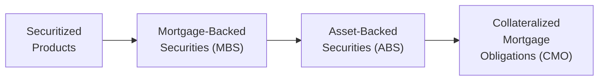

## Context and Core Importance

So, you’ve made it through Level I of the CFA® Program, which is no small accomplishment. Level II, well, it’s a different game—especially when it comes to Fixed Income. You’re stepping into a broader world of bond mathematics, deeper credit modeling, and a lot more real-world applications. It’s pretty exciting, but maybe a little overwhelming at first. We’ll explore how this section of the curriculum bridges the gap between those fundamental concepts you learned at Level I and the more advanced, practice-oriented analysis you’ll handle at Level II.

This scope overview offers a roadmap of what to expect—kind of like a quick orientation before you really dig into the details in later chapters. We’ll cover topics like bond valuation (including forward rates, spot rates, and yield curve construction), structured products, credit risk, and how they all fit into portfolio management. Let’s jump in and see how these pieces connect.

## From Foundation to Application

Level II’s Fixed Income curriculum builds on everything from Level I—time value of money, yield measures, bond structures—but now takes you deeper into quantitative modeling, scenario analysis, and advanced bond pricing tools. There’s a stronger expectation that you can not only plug numbers into formulas but also interpret them in a real-world context. You may be dealing with interest rate scenarios, calls and puts on bonds, or dissecting the effect of prepayment risk on mortgage-backed securities. 

And let me tell you, my first time bridging from Level I to Level II felt like going from reciting definitions to conducting an orchestra of different instruments—pun intended! You’ll see how each of these concepts intertwines with portfolio objectives and risk management decisions.

## Key Focal Points at Level II

### More Advanced Bond Valuation Models

Remember calculating yield to maturity (YTM) at Level I and thinking you had it all figured out? Well, now add forward rates, spot rates, and zero-coupon yield curve bootstrapping. These tools are essential for advanced valuation—particularly when you’re dealing with theories on the term structure of interest rates and scenario analysis.

Expect to:
• Derive spot rates from coupon bonds.  
• Understand forward rate pricing in deterministic vs. stochastic contexts.  
• Explore convexity and duration in more detail (including effective duration for bonds with embedded options).  

### Embedded Options and Volatility

One huge topic that sets Level II Fixed Income apart is embedded options. Callable, putable, and convertible bonds each bring unique pricing challenges. The big twist? Interest rate volatility. A bond with an embedded call, for instance, can become more or less valuable depending on how volatility changes. 

You’ll learn how:
• Option-Adjusted Spread (OAS) is used to isolate credit risk from optionality.  
• One-sided durations matter for callable bonds, where the call option may cap price appreciation.  
• Shifting yield curves or volatility regimes can affect the bond’s payoff profile.  

### Expanded Coverage of Credit Analysis

Naturally, credit risk gets more sophisticated here. You’ll see structural models (like Merton), which view equity as a call option on assets, and reduced-form models that rely on hazard rates or intensity measures. This means:
• You quantify probabilities of default (PD) and loss given default (LGD).  
• You factor in how credit spreads might evolve as firms approach certain leverage thresholds.  
• You learn how the term structure of credit spreads affects your portfolio risk profile.  

Throw in some real-world credit rating transitions, and you’ve got a thorough examination of how to handle different types of default and recovery scenarios.

### Structured Products and Securitization

At Level I, you might have only touched on how mortgage-backed securities (MBS) work. Now you’re diving into the nitty-gritty of Collateralized Mortgage Obligations (CMOs), Asset-Backed Securities (ABS), Commercial Mortgage-Backed Securities (CMBS), and more. And you have to master prepayment speed assumptions, extension risk, contraction risk—basically a crash course in how these complex instruments are structured and priced.

Check out this quick diagram illustrating the hierarchy of securitized products:

### Yield Curve Strategies

If bond market nerds get excited about one thing, it’s yield curve strategies! You’ve probably heard of bullet and barbell portfolios—well, now we add riding the yield curve, rolling down the yield curve, and anticipating curve twists:

• Parallel shifts: The entire curve moves up or down.  
• Twists: The slope changes, with short rates moving differently from long rates.  
• Butterfly shifts: Imply changes in curvature.  

We’ll look at how managers try to profit from these yield curve movements (and sometimes get it horribly wrong, which is an equally important lesson).

### Connections to Derivatives

Swaps, futures, forwards, and more advanced hedging instruments become indispensable at Level II. You won’t just memorize the definition of a payer swap—you’ll integrate it into strategies for immunizing a pension liability or speculating on interest rate moves. Understanding the synergy between fixed income instruments and derivatives is a big part of this level.

### Ethical Considerations

Yes, ethics matter big time. The CFA Institute Code of Ethics and Standards of Professional Conduct underpins everything, but fixed income markets have unique issues—like front running, misuse of insider info, or conflicts of interest when underwriting esoteric securitized deals. You’ll be expected to manage these ethically in real-world contexts.

## Why Deeper Quantitative Skills?

You might think, “Oh boy, more math?” But trust me, it’s not just about the formulas. It’s about building intuition. When you see how a 50-basis-point parallel shift in the yield curve changes your portfolio’s value by, say, a million dollars, you start to appreciate exactly how durations or convexities matter. It’s that combined sense of numbers plus narrative that you’ll need to master.

## Real-World Relevance

If you crack open a financial news site, you’ll see references to credit spreads, yield curve inversions, or concerns about interest rate volatility. That’s where your new toolkit shines. Maybe you’re evaluating a corporate bond that’s priced cheaply because the market’s worried about a default, or a mortgage portfolio with prepayment risk. Understanding how these factors work in practice can give you an edge—both on the exam and in your career.

## Linking Back to Level II’s Other Topics

The synergy with derivatives is huge. For instance, if you learn that a portfolio manager wants to hedge interest rate risk using Treasury futures, that’s directly tied to your fixed income knowledge. Similarly, the advanced statistics from other portions of the Level II curriculum can help you interpret default modeling outputs or run simulations for Monte Carlo bond pricing. And as you go along, you’ll see that these topics reinforce each other.

## Sample Illustration: Bootstrapping a Simple Zero-Coupon Curve

Let’s do a tiny example, just to give you a sense of the numeric exercises you’ll tackle.

Suppose you have:  
• A 1-year bond priced at $980 with a 5% annual coupon.  
• A 2-year bond priced at $1,025 with a 6% annual coupon.

We might want to derive the implied 1-year and 2-year spot rates. The timeline might look like this:

- For the 1-year bond at $980, the cash flow in one year is $50 (coupon) + $1,000 (principal) = $1,050.  
  If we let S₁ be the 1-year spot rate, then  
  980 = 1,050 / (1 + S₁).  

  Solving for S₁:  
  1 + S₁ = 1,050 / 980 so S₁ ≈ 7.14%.

- For the 2-year bond at $1,025, we receive $60 in one year and $1,060 in two years (coupon + principal). Let S₂ be the 2-year spot rate. We discount the year-1 coupon by (1+S₁) and the year-2 total by (1+S₂)².  
  1,025 = 60/(1+S₁) + 1,060/(1+S₂)².  

  We already solved S₁ in the first step. Plug that in and solve for S₂. This deeper step is a typical calculation you’ll do frequently.  

While that’s just a small taste, it shows how bootstrapping requires layering one maturity’s result onto the next. The good news? It’s systematic once you get the hang of it. The not-so-good news? You need your calculator skills locked down tight.

## Where You’ll Need to Drill Down

• Practice item sets that integrate multiple concepts (like yield curves, embedded options, and credit risk) into one scenario.  
• Crunch the numbers for your bond math—try working with actual market data if possible.  
• Understand both the conceptual frameworks (like how no-arbitrage arguments build the binomial interest rate tree) and the mechanical steps (like backward induction in tree valuation).  

## Potential Pitfalls and Strategies

• Memorizing vs. Understanding: Memorizing formulas without knowing the “why” can be a trap. The exam loves testing conceptual understanding.  
• Overlooking Optionality: If a bond has a call or put, ignoring that can drastically change your valuation.  
• Ignoring “Real-World Frictions”: Market liquidity, transaction costs, or even the transition from LIBOR to SOFR can affect bond valuations. Listen for updates here since the landscape keeps evolving.  
• Underestimating Time: The bond math sections can be time-intensive, especially with the item set format. Practice pacing yourself during mocks.

## How This Translates into Portfolio Management

All of these advanced topics—credit analysis, yield curve construction, derivatives usage—feed directly into how you’d build or manage a bond portfolio in the real world. Maybe you’re aiming for an immunization strategy, or maybe you’re going for yield curve plays. Ultimately, your decisions revolve around:

1. Understanding how interest rates might move (or shift in shape).  
2. Gauging how credit risk might evolve within your investment horizon.  
3. Deciding whether embedded options (calls, puts, convertibles) fit your strategy.  
4. Using derivatives (interest rate swaps, CDS, etc.) to tweak or hedge exposures.  

## Wrapping Up: Where to Go Next

As you approach Chapter 2 and beyond, you’ll get a more detailed breakdown of each bond type and strategy. Use this overview as a quick anchor if you ever feel lost—just revisit these sections to remind yourself why you’re crunching that seemingly endless stream of yields, durations, and spreads.

And honestly, try to have some fun with it. Sure, the math can be intense. But understanding how debt markets truly work, seeing how to dissect a mortgage-backed security, or learning how to manage a portfolio’s exposure to interest rate twists can feel like you’ve unlocked a hidden language of finance. Because in many ways, you have.

---

## References and Further Exploration

• CFA Institute, “Fixed Income” in 2025 Level II Curriculum, Volume 6.  
• Fabozzi, Frank J. (Ed.). The Handbook of Fixed Income Securities.  
• Choudhry, Moorad. The Money Markets Handbook.  
• Bloomberg and BondEdge: Real-time market data resources for bond instruments.  

---

## Test Your Knowledge: Fixed Income Scope at Level II



### Which of the following best describes the expanded scope of Fixed Income at Level II compared to Level I?

- [ ] Less focus on quantitative modeling and more on theoretical frameworks.  
- [x] Broadening into advanced valuation techniques, credit and structured product analysis.  
- [ ] Eliminating yield curve and credit analysis in favor of alternative asset classes.  
- [ ] Focusing exclusively on equity research integration.  

> **Explanation:** Level II Fixed Income coverage moves beyond basic pricing and focuses on advanced techniques such as option-adjusted spreads, credit risk models, and structured products.

### When discussing embedded options, why does interest rate volatility matter?

- [ ] Volatility only affects equity options, not bond options.  
- [x] Greater volatility increases the value of the embedded call or put option.  
- [ ] Volatility eliminates the need for calculating accrued interest.  
- [ ] It reduces the bond’s convexity to zero.  

> **Explanation:** The value of embedded options (callable, putable, convertible bonds) hinges on changes in interest rate volatility. Higher volatility generally increases option value.

### What is a potential pitfall of ignoring embedded options in bond valuation?

- [ ] Overestimating coupon income.  
- [x] Incorrectly valuing the bond by disregarding the call or put feature.  
- [ ] Misapplying credit scoring techniques.  
- [ ] Undercalculating accrued interest.  

> **Explanation:** Callable or putable bonds have different price/yield behavior than straight bonds. Ignoring these features leads to significant mispricing.

### Which statement about credit risk at Level II is most accurate?

- [x] The curriculum introduces structural and reduced-form models to quantify default risk.  
- [ ] Credit risk is considered irrelevant for government bonds.  
- [ ] Only rating agency opinions matter, so quantitative modeling is minimized.  
- [ ] Reduced-form models are the same as Merton’s structural model.  

> **Explanation:** Level II explores both structural (Merton model) and reduced-form models (intensity/hazard approaches) for analyzing default probabilities and recovery rates.

### In the context of yield curve analysis, which of the following is NOT a common yield curve movement?

- [ ] Parallel shift.  
- [ ] Twist.  
- [ ] Butterfly (curvature) change.  
- [x] Quadrilateral shift.  

> **Explanation:** Parallel, twist, and butterfly movements are standard descriptors of yield curve changes. A “quadrilateral shift” is not a recognized concept.

### Why is bootstrapping an important technique for bond pricing?

- [x] It helps derive spot rates from coupon-bearing bonds to value complex cash flows.  
- [ ] It simplifies interest rate volatility assumptions.  
- [ ] It eliminates the need for forward rate calculations.  
- [ ] It never requires yield curve data.  

> **Explanation:** Bootstrapping is critical for extracting zero-coupon rates from coupon bond prices, enabling more accurate bond pricing and risk assessments.

### How do mortgage-backed securities (MBS) differ from typical corporate bonds?

- [ ] MBS coupon payments are fixed over time.  
- [x] MBS cash flows include principal repayments influenced by prepayment behavior.  
- [ ] MBS do not require any credit analysis.  
- [ ] MBS coupons are constant while corporate bonds often have variable schedules.  

> **Explanation:** MBS valuations require analyzing prepayment risk since homeowners can refinance or pay off loans early, impacting the timing and amount of cash flows.

### Which is a key reason why derivatives knowledge is integral to Fixed Income at Level II?

- [ ] Derivatives are rarely used for hedging interest rate risks.  
- [x] Interest rate swaps and futures are commonly employed to manage bond portfolio duration and exposure.  
- [ ] Derivatives cannot help in yield curve strategies.  
- [ ] Credit default swaps are irrelevant to bond managers.  

> **Explanation:** Derivatives like swaps and futures are essential tools for adjusting duration, managing yield curve risk, and hedging credit exposures in fixed income portfolios.

### Why do ethical considerations matter significantly in the fixed income markets?

- [ ] Ethics only matter for equity markets.  
- [ ] Bond trading is always transparent, so no ethical issues arise.  
- [x] Potential conflicts of interest and price manipulation can arise, making ethical compliance crucial.  
- [ ] Ethical conduct is optional at advanced levels.  

> **Explanation:** Fixed income markets, especially with structured products, can face complex conflicts of interest. Fair dealing and thorough disclosure remain paramount under the CFA Institute Code and Standards.

### A parallel shift in the yield curve implies:

- [x] All interest rates along the curve move by the same magnitude.  
- [ ] Short-term rates move more than long-term rates.  
- [ ] Only the middle of the curve shifts, creating a butterfly effect.  
- [ ] A complete flattening of the yield curve.  

> **Explanation:** A parallel shift describes the scenario where every maturity’s yield increases or decreases by a uniform amount, leaving the shape of the yield curve unchanged.


