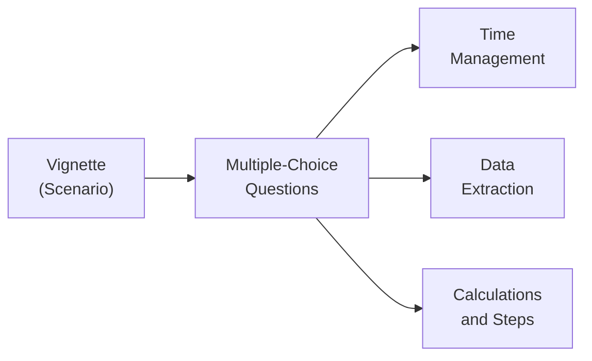

Vignette-style questions are the hallmark of the CFA Level II exam. If you’re like me, the first time I saw these item sets, I was a bit overwhelmed—so many details crammed into a single scenario! But don’t worry, it doesn’t have to be that way. With the right approach, you'll learn to blast through these question sets more confidently. Below, we’ll explore the essentials of reading, extracting, and applying the relevant information in these vignettes, especially in the context of fixed income topics.

Overview of the Vignette Format  
––––––––––––––––––––––––––––––––––––––  
• A vignette is basically a narrative or “case study” that presents real-world data: bond cash flows, yield curves, day count conventions, corporate or government rating updates, and so on. After the narrative, you’ll get multiple-choice questions (typically six per vignette).  
• Each question references the same underlying data, so you should be prepared to tap the details provided in the scenario—like interest rate assumptions or bond features—for multiple sub-questions.  
• The key is efficiency: you’ll have a limited time to read carefully, extract the vital details, and answer the questions.  

Common Pitfalls (and How to Avoid Them)  
––––––––––––––––––––––––––––––––––––––  
• Getting Lost in Extraneous Data: These item sets often include distractors—irrelevant details meant to tilt you off course or waste your time. Maybe it’s an unusual day count convention that doesn’t matter for your final calculation, or a yield measure that’s misleading. Identify what’s necessary.  
• Overcomplicating Calculations: We’ve all been there—spending ages on a single multi-step derivation. If a question seems ultra-complex, see if partial computations can carry over. In many vignettes, you can reuse a single intermediate step to answer more than one question.  
• Forgetting Time Management: Typically, you’ll want to allocate around 3 minutes per question. Maybe you do a quick “triage,” tackling the soft conceptual questions first (like a query about the rationale behind a strategy) before diving into heavier calculations.  
• Misreading the Prompt: Sometimes a question focuses on effective duration while you zero in on yield to maturity. Always double-check exactly what you’re being asked for—especially if the vignette is loaded with multiple bond metrics.  
• Missing Dependencies: In some item sets, you’ll see that question #2 might rely on your result from question #1, or at least from the scenario data relevant to #1. Don’t skip earlier steps that feed into later calculations.

Key Strategies for Success  
––––––––––––––––––––––––––––––––––––––  

Read the Questions First  
• Odd as it may sound, scanning the multiple-choice questions upfront can help you figure out which numbers and facts in the vignette are crucial. If you see a question about a forward rate, you know you’ll need the spot rates or the yield curve data from the text.  

Highlight and Annotate  
• Use your scratch paper (or digital highlighting, if permitted) to note coupon rates, maturities, yield measures, or forward rates.  
• In the swirl of exam adrenaline, it’s easy to lose track of which bond you’re dealing with—Bond A might be a floating-rate note, Bond B might be callable. Mark these clearly!

Embrace Triage  
• Answer simpler or conceptual questions first. Some questions only require you to interpret a scenario—like, “Which hedging strategy most effectively reduces interest rate risk?” This might be faster to address than a multi-step free-cash-flow or bond-convexity calculation.  
• Save the more intricate math for later, once you’ve secured easy points.

Make a Mental Formula Sheet  
• The exam moves fast. Keep critical formulas in your head (or note them down briefly at the start): discount factors for bond valuation, forward rate derivations, I/Y conversions, duration, convexity, and so forth. You don’t want to waste precious minutes recalling something you can memorize.  

Time Management Tips  
• By the time you reach Level II, you’ve probably heard the 3-minutes-per-question guideline. It’s a rough average. Some questions will take a bit longer (especially those with multiple steps), while conceptual ones might be faster.  
• Keep a watchful eye on the clock. I like to quickly confirm I’m on track after every few item sets. If you’re significantly behind, speed up. If you’re well ahead, double-check your tricky computations.  

Partial Computations and Dependencies  
• Sometimes, you’ll see a question that asks for an intermediate metric like a spot rate. The next question might ask you to value the bond using the spot rate from question #1. Don’t discard that partial work.  
• If you realize you made a slip in question #1, correct it as soon as you can, or at least keep consistent with your initial logic for #2 if you’re short on time.  

Real-World Angle: Controversies and Qualitative Insights  
• Vignettes frequently mention credit rating changes, transitions from LIBOR to SOFR-based benchmarks, or potential yield curve twists. These details aren’t just fluff—they test your ability to interpret real-market shifts.  
• You might see an item set that references a credit rating downgrade. One question could measure your understanding of the spread widening effect, while another might test your knowledge of how it impacts the bond’s yield to maturity.

Illustrating the Vignette Flow  
Below is a simple diagram to visualize how a vignette typically flows into multiple derivative questions:

In practice, you move from the central vignette to each question, applying good time management, carefully extracting data, and performing the necessary calculations or interpretations.

An Example of a Bond Price Formula  
To illustrate a standard formula that often pops up, recall the present value of a bond’s future cash flows:

$$
\text{Bond Price} \;=\; \sum_{t=1}^{T}\frac{C_{t}}{(1+r)^{t}} \;+\; \frac{F}{(1+r)^{T}}
$$

Where:  
• \\( C_t \\) represents the coupon payment at time \\( t \\).  
• \\( r \\) is the required yield per period.  
• \\( F \\) is the face (par) value of the bond.  
• \\( T \\) is the total number of periods until maturity.  

In a vignette, you might be given a partial yield curve or a forward rate structure. You could be asked to discount each coupon at the specific spot rate for that period, or to interpret how the bond’s price changes if the yield curve shifts. The big trick is swiftly extracting only the data you need from the text.

Practical Tips for Exam Simulation  
• Practice Under Timed Conditions: Make it as real as possible—no phone, no interruptions, a single timed session.  
• Mix Quantitative and Qualitative: Don’t only drill math. Some questions will ask about the rationale behind your steps—“Why is Duration X relevant to hedge interest rate risk?”  
• Use Carter’s Law: Okay, that’s just my personal name for something I noticed— after 2–3 practice vignettes, your attention can drift. Break up your study sessions to stay sharp.  
• Focus on Common Pitfalls in the Answer Explanations: That’s where you learn the most. If you get something wrong, note whether you fell for a distractor or overlooked a simpler approach.

Best Practice: Linking Concepts  
Remember that the exam loves to test integrated topics. Perhaps you’ll see a question referencing yield curve theories (corresponding to Chapter 4 in this Volume) but in the same item set, you might have to do an OAS calculation from Chapter 11. If the scenario references multiple bonds—one government, one corporate, one mortgage-backed—it’s probably because the questions intend to see if you can prioritize the right yield or day-count method for each.

Final Thoughts  
• Confidence is Key: Even if the vignette is lengthy, remind yourself that you have the tools.  
• Keep Calm, Triage On: Start with the big-picture questions, gather clarity on data points, and proceed methodically.  
• Learn from Each Mistake: Practicing item sets with detailed answer explanations is your best bet.  

References and Further Reading  
• CFA Institute, “How to Approach Item Set Questions,” Level II Exam Guides.  
• Kaplan Schweser or Wiley Level II practice vignettes and question banks.  
• CFA Program Mock Exams and Online Practice Questions.  

Below you’ll find a short quiz to test your understanding of these strategies. Good luck, and may your next item set feel like a breeze!

## Mastering the Vignette Format: Test Your Knowledge



### When starting a vignette, which of the following should you do first to improve efficiency?
- [ ] Focus on solving detailed calculations immediately.
- [ ] Skip the vignette entirely and jump to the next item set.
- [x] Quickly scan the multiple-choice questions before reading the entire vignette.
- [ ] Read the vignette from start to finish without taking notes.

> **Explanation:** Skimming the questions first helps you identify the relevant data in the vignette and focus your efforts on what will actually be asked.

### Which best describes a “distractor” in the CFA Level II vignette format?
- [ ] A formula that appears at the end of the vignette.
- [ ] The correct but tricky part of the question.
- [x] Irrelevant or extraneous information that can mislead or consume time.
- [ ] A separate question tied to a different item set altogether.

> **Explanation:** A distractor is data or information placed in the vignette that doesn’t actually affect the solution but might cause confusion or time-wasting if you focus on it.

### In managing your exam time for each vignette, what is a commonly recommended principle?
- [ ] Spend 5–6 minutes per multiple-choice question.
- [x] Aim for roughly 3 minutes per multiple-choice question on average.
- [ ] Answer every question in under 1 minute.
- [ ] Use up as little time as possible, then move on immediately.

> **Explanation:** While the exact time can vary, 3 minutes per question is a rough benchmark that helps ensure you complete the exam within the allocated time.

### One question in an item set requires calculating a spot rate that appears to be used in a subsequent question. Which approach is best?
- [x] Perform the spot rate calculation carefully and keep the result handy for subsequent usage.
- [ ] Skip the first question entirely since it takes too long.
- [ ] Assume the next question won’t need the spot rate calculation.
- [ ] Wait until the end of the item set to review everything.

> **Explanation:** Often in item sets, the first question’s computations feed into later ones. Holding onto that intermediate result can save you time and ensure consistency.

### You encounter a multi-step calculation that seems time-consuming. What’s the recommended approach?
- [x] Triage and answer simpler questions first, then return to the multi-step calculation.
- [ ] Ignore it completely because it’s too difficult.
- [x] Check if partial computation is required for multiple questions and plan accordingly.
- [ ] Always do the hardest calculation first.

> **Explanation:** Triage ensures you don’t lose easy points. Also, multi-step calculations might apply to multiple questions, so approach them strategically.

### Which statement best captures a risk of reading the entire vignette in a linear way without looking at the questions first?
- [ ] You build a broader conceptual overview.
- [x] You might spend time absorbing data that isn’t relevant to the question.
- [ ] You can quickly solve each question without triage.
- [ ] You have no risk; it’s the best strategy.

> **Explanation:** Often, you’ll find data that isn’t needed. Scanning the questions first gives you clarity on which details really matter.

### Which of the following is true about merging technical and qualitative questions in a single item set?
- [x] The exam frequently integrates bond math with conceptual insights on strategies or rationales.
- [ ] All questions remain purely quantitative, with no conceptual angles.
- [x] Understanding real-world implications can help answer strategy-based questions.
- [ ] Qualitative questions are never included at Level II.

> **Explanation:** Vignettes often blend calculation-based tasks with rationales behind investment strategies, ensuring you apply both numeric and conceptual knowledge.

### What’s the best reason to keep a quick “mental (or written) formula sheet” during the exam?
- [ ] To show off your advanced knowledge to the proctor.
- [ ] There is no benefit; you won’t have time.
- [x] Quick recall of essential equations for valuation, duration, or forward rates speeds up problem-solving.
- [ ] The exam provides all formulas in the vignette.

> **Explanation:** The exam does not provide a formula sheet. Having key formulas at your fingertips (mentally or briefly jotted down) prevents you from losing time.

### You notice a reference to a rating downgrade in the vignette. Which statement is correct regarding subsequent questions?
- [x] There may be questions about the effect on credit spreads or yield.
- [ ] Ignore it because rating changes are always distractors.
- [ ] It only matters for ethics questions, not fixed income.
- [ ] Rating changes never appear in vignettes.

> **Explanation:** A rating downgrade can affect spreads, yield, or bond prices and is often featured in integrated items.

### True or False: You should always complete multi-step calculations before looking at any conceptual questions in the vignette.
- [x] True
- [ ] False

> **Explanation:** Actually, this is a trick. Many successful candidates prefer to tackle conceptual questions first if they’re easier, then do the detailed calculations. But some prefer the reverse. The “best” strategy can vary by test-taker. In practice, most people find triage methods more effective, yet some folks like completing the math while it’s fresh in mind if it’s the bigger portion of the question set.




