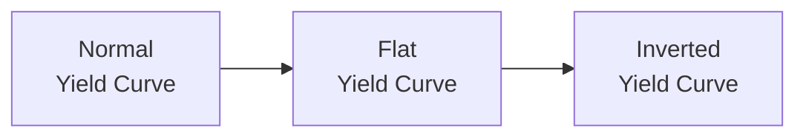

## Revisiting Bond Pricing Fundamentals

If you’re like me, you might remember the moment in Level I when you first encountered the bond pricing formula and realized just how many details go into a “simple” bond trade. It’s not just a matter of loaning someone money and getting coupons plus principal back—there’s coupon frequency, day count conventions, yield metrics, and a bunch of math that can feel a bit overwhelming at first. But trust me: these fundamentals lay the groundwork for the deeper discussions we’ll have here in Level II.

At its core, a bond is priced by discounting all expected future cash flows (coupons and final principal repayment) back to the present at a rate that reflects its risk. The standard bond pricing formula (for an annual-pay bond) is usually expressed as:


\text{Bond Price} = \sum_{t=1}^{T} \frac{C_t}{(1 + r)^t} + \frac{\text{Face Value}}{(1 + r)^T},


where:  
• \\( T \\) is the number of coupon periods until maturity.  
• \\( C_t \\) is the coupon payment in period \\( t \\).  
• \\( r \\) is the discount rate, often equal to the yield to maturity (YTM).  

In practice, you might deal with semiannual or quarterly coupons, so the formula adjusts to match the timing of those payments. The big takeaway? A bond’s price is determined by the present value of all its future goodies (coupon payments, final principal), discounted at a rate that captures its risks.

Here’s a little memory I love: the very first time I tried to compute a bond’s price using monthly coupons, my calculator basically rebelled—apparently, I typed in the discount rate incorrectly and got something outrageous. The lesson was that consistent compounding frequency is key. Eagle-eyed detail management with time periods, discount factors, and compounding is essential in higher-level fixed income analysis.

## The Time Value of Money (TVM)

I’m sure you’re no stranger to the concept of TVM, but let’s put it front and center once again. Money available today can be invested to earn interest; hence, it’s more valuable than the same nominal amount in the future. You might recall:

• Present Value (PV): The value today of a future sum or cash flow.  
• Future Value (FV): The value at some specified time in the future of an investment made today.  

Adding to that, you’ve likely seen annuities—streams of equal cash flows spaced evenly in time. They show up in bonds all the time because most coupon-bearing bonds create an annuity-like flow plus a lump-sum principal at the end.

While in Level I you might have used these formulas for simpler scenarios (like a single payoff or a standard annuity), in Level II the same logic remains, but we may incorporate it into more complex instruments—LEAPS, structured notes, et cetera. The principle doesn’t go away. The basics of discounting future cash flows is the lens through which we analyze everything else.

## Key Yield Metrics: YTM, Current Yield, Yield to Call, and Yield to Worst

You probably remember the standard yield metrics:

• Yield to Maturity (YTM) is the internal rate of return (IRR) on a bond’s cash flows if held until maturity.  
• Current Yield = Annual Coupon / Current Bond Price.  
• Yield to Call (YTC) is the yield you’d earn if the bond is called by the issuer at the first call date.  
• Yield to Worst (YTW) takes the lowest result among YTM, YTC, or any other embedded-option scenario that could adversely affect the investor.

All these come in handy in advanced bond analysis, especially once we start factoring in embedded options (like calls, puts, and convertible features) here at Level II. These measures help us gauge return under different redemption or call scenarios.

One important note is that exam vignettes sometimes test your ability to know which yield measure applies in which scenario. If a bond is callable in a couple of months, the YTW might well be the yield to that call date, not to final maturity. So, watch out for trick questions that mention multiple call or put dates—sometimes the best approach is systematically checking each scenario to see which yield is the lowest (for calls from an investor’s perspective) or highest (if it’s putable).

## Day Count Conventions

Now, let’s talk about day count conventions, which I used to find just a bit fussy. But everything about accrued interest hinges on these. The main ones you’ll see:

• 30/360: Assumes 30 days per month and 360 days per year.  
• Actual/365 (Fixed): Uses actual days in the interest period over a 365-day year.  
• Actual/Actual (also called Actual/Actual ISDA or ICMA, depending on the variant): Uses actual days in both the numerator and the denominator.  

Below is a small table summarizing key aspects:

| Convention      | Numerator (Days)             | Denominator (Days) | Common Usage                             |
|-----------------|------------------------------|--------------------|-----------------------------------------|
| 30/360          | 30 per month, 360 per year   | 360                | Corporate bonds in the US                |
| Actual/365      | Actual days                  | 365                | UK Treasury bills, many money markets    |
| Actual/Actual    | Actual days                  | Actual days        | US Treasury notes, some global bonds     |

Remember, the day count convention matters when you calculate accrued interest or partial period coupon amounts. If you guess incorrectly or get sloppy, you might introduce a pricing difference that can be material—particularly for short-term trades with large volumes.

## Duration and Convexity: The Cornerstones of Interest Rate Risk

Let’s talk about interest rate risk measures—because soon, you’ll be up to your ears in yield curve shifts, scenario analyses, and stress testing. Duration and convexity are your major friends here:

• Macaulay Duration: The weighted average time to receive the bond’s cash flows, measured in years.  
• Modified Duration: A direct measure of the percentage change in a bond’s price for a 1% change in yield, derived from Macaulay duration:
  
  
  \text{Modified Duration} = \frac{\text{Macaulay Duration}}{1 + r}
  

• Convexity: Captures the curvature in the relationship between bond prices and yields. When yields move significantly, duration alone isn’t enough; adding a convexity correction helps estimate more accurately how the price changes.

At Level II, we focus on deeper, more practical applications. For instance, using effective duration for bonds with embedded options, or employing partial (key rate) durations to see how the bond reacts to different segments of the yield curve shifting. But if you’re shaky on the fundamentals, advanced concepts can feel like you’re juggling chainsaws. So, keep practicing your basic duration and convexity math.

A mental hack I used to keep it straight: If you think of duration as that first derivative (slope) of the price-yield curve, convexity is the second derivative (curvature). It’s basically “how quickly the slope is changing.”  

## Basic Credit Analysis Refresher

It’s easy to think that credit analysis is all about reading a rating from Moody’s or S&P. But, we know it’s more nuanced than that. At Level I, we covered the basics: corporate, sovereign, and municipal bonds each has unique risk factors. There’s issuer risk (the chance that a particular company or country can’t pay), plus seniority structure (e.g., subordinated versus senior bonds).

When analyzing credit:

• Look at the issuer’s financial statements for leverage, coverage ratios, profitability, liquidity, and other indicators.  
• Understand debt ranking (senior secured, senior unsecured, subordinated, etc.).  
• Factor in rating agencies, but also do your own analysis of macro conditions, industry trends, and the issuer’s track record.

Level II dives deeper into structured credit products—like mortgage-backed securities (MBS), collateralized mortgage obligations (CMOs), asset-backed securities (ABS), and other forms of obligation slicing and dicing. If you have a solid handle on the “plain vanilla” corporate bond credit analysis, you’ll be more comfortable layering in the extra complexities just around the corner.

## Understanding the Yield Curve

We’ve all heard about normal, inverted, and flat yield curves. A normal yield curve usually suggests that longer maturities have higher yields, reflecting greater uncertainty in the distant future. An inverted yield curve can predict economic downturns (though not always with perfect accuracy), and a flat curve might indicate a transitionary phase or unusual monetary policy conditions.

Yield curves come up a lot at Level II:  
• Pricing strategies around forward rates.  
• Bootstrapping spot rates to value coupon bonds.  
• Arbitrage-free valuations.  
• Riding the yield curve strategies (where you buy longer term bonds hoping yields will drop as maturity shortens).

Understanding how yield curve shapes relate to economic expectations and central bank actions helps you interpret interest rate moves. This knowledge is critical for scenario analysis and active bond portfolio management.

Here’s a simple Mermaid diagram to visualize the typical shapes you might encounter:



You can think of it as a progression sometimes: when economic signals change, the yield curve might shift from normal to flat to inverted or even revert back again, driven by growth expectations, demand for capital, and policy rates.

## Breaking Down Bond Returns

Bond returns are not just about clipping coupons. They have three primary components:

1. Coupon Income: The periodic interest.  
2. Capital Gains or Losses: Price appreciation (capital gain) or depreciation (capital loss) due to yield changes.  
3. Reinvestment Income: Interest earned on reinvested coupon payments.

At Level I, these distinctions were introduced. Now in Level II, you’ll see them integrated into strategies like rolling down the yield curve or exploring total return if yields shift. The reinvestment piece often gets overlooked—especially by folks new to fixed income. Over longer horizons, reinvestment income can matter a lot, especially if yields are changing.

## Relationship Between Price and Yield

Yes, bond prices and yields move inversely—when yields (discount rates) go up, bond prices drop, and vice versa. We’re comfortable with that. But expect exam vignettes to test your understanding under subtler conditions. For instance, how does a bond with an embedded call or put diverge from the simple linear relationship? Or how does a floating-rate note’s price stick closer to par because its coupon resets periodically?

Work lots of practice problems to see how different yield environment changes might affect your bond’s price. The more you do, the easier it’ll feel to parse an item set question on exam day.

## Key Premiums in Required Yield

At Level I, we discussed several key yield components that go above the “risk-free rate”:

• Default Risk Premium: Compensation for the chance the issuer can’t pay.  
• Liquidity Premium: Extra yield if the bond is not easily traded without significantly affecting its market price.  
• Maturity (Term) Premium: Longer maturity means higher uncertainty for interest rates and inflation.  

The sum of these premiums (plus any other idiosyncratic factor) leads to the yield required by investors. Understanding how each piece works helps you build intuition later, particularly in advanced credit products where credit risk, liquidity, and maturity risk play out in complicated ways (think of CDO tranches and how differently each layer might respond to market shocks).

## Clean Price vs. Dirty Price

Oh, the dreaded day you realized you’d bought (or sold) a bond in the secondary market and the “price” you pay is not just the quoted clean price. Yes, the world of bond trading typically quotes a clean price—no accrued interest considered. But the actual settlement price is the dirty (full) price, which equals:


\text{Dirty Price} = \text{Clean Price} + \text{Accrued Interest}.


Accrued interest typically is:


\text{Accrued Interest} = \frac{\text{Days since last coupon}}{\text{Days in coupon period}} \times \text{Coupon Payment}.


Day count conventions matter here, too. If you guess the wrong convention or miscount the days, you can get the accrued interest portion all wrong, and that might be enough to cost you big in an exam or real life. Don’t let that happen—stay sharp and consistent in your approach.

## Quick Examples to Tie It All Together

Let’s do a fast example showing how everything works in a basic scenario. Suppose you have a \$1,000 par bond with a 5% annual coupon (paid semiannually), 2 years to maturity, and a yield to maturity of 6% (semiannual compounding). Let’s illustrate:

1) Calculate the coupon per period:  
   5% of \$1,000 = \$50 annual → \$25 every six months.

2) Number of periods:  
   2 years * 2 = 4 semiannual periods.

3) Semiannual yield:  
   6% annually → 3% per semiannual period.

4) Bond price:


P = \sum_{t=1}^{4} \frac{25}{(1 + 0.03)^t} + \frac{1000}{(1 + 0.03)^4}.


5) Calculate or use a financial calculator (just be cautious about entering the right compounding frequency!). That gives you the clean price.  

6) If settlement is, say, halfway between two coupon dates using a 30/360 convention, your accrued interest might be:


\frac{15}{180} \times 25 = \$2.08 \quad (\text{roughly}).


7) Dirty price = Clean price + \$2.08.

This is simplified, but it captures how day count, yield, coupon frequency, and compounding come together.

A Python snippet might look like this:

```python
import math

par = 1000
annual_coupon_rate = 0.05
ytm = 0.06
periods_per_year = 2
coupon_payment = (par * annual_coupon_rate) / periods_per_year
n = 2 * periods_per_year
periodic_ytm = ytm / periods_per_year

bond_price = 0
for t in range(1, n+1):
    bond_price += coupon_payment / ((1 + periodic_ytm) ** t)
bond_price += par / ((1 + periodic_ytm) ** n)

print(f"Clean Bond Price: {bond_price:.2f}")
```

That’s just a tiny demonstration of how you might incorporate some quick calculations into your study routine.

## Concluding Thoughts

Everything above sets the stage for the deeper waters of Level II. As you move forward, you’ll refine your bond pricing models (like building binomial trees in later chapters). You’ll refine your understanding of how day counts can shift accrued interest, how embedded options complicate yield analysis, and how credit risk can be sliced and diced through structured products.

If any of these fundamentals still feel a bit scary or unsteady, take a breath, revisit a few example questions from your Level I notes, and remind yourself that the clarity you build now will pay off big time in your advanced explorations.

## References & Further Reading

• CFA Institute, “Fixed Income Analysis” from Level I foundational materials.  
• Fabozzi, Frank J. Bond Markets, Analysis, and Strategies.  
• Bodie, Zvi, Kane, Alex, and Marcus, Alan J. Investments, bond basics sections.  

They’re a great place to get more practice or refresh. Don’t forget to look for practice item sets in your prep materials as well. The more you do, the more those fundamentals will become second nature.

---

## Practice Questions: Bond Pricing and Yield Fundamentals



### Which yield measure represents the internal rate of return on a bond's cash flows, assuming it's held until maturity?

- [ ] Current yield
- [ ] Yield to call (YTC)
- [x] Yield to maturity (YTM)
- [ ] Yield to worst (YTW)

> **Explanation:** Yield to maturity (YTM) is the discount rate that makes the present value of all future cash flows (coupons plus principal repayment) equal the bond's current market price.  

### Which of the following best describes the relationship between bond price and yield?

- [ ] They move in the same direction.
- [x] They move in opposite directions.
- [ ] Both are always fixed.
- [ ] The relationship changes at maturity.

> **Explanation:** Bond prices move inversely with yields. As yields (discount rates) rise, the present value of future cash flows falls, causing price to decrease.  

### If a bond's coupon rate is 5% and its current price is $950, what is its current yield?

- [ ] 5.26%
- [x] 5.26% (rounded)
- [ ] 5.00%
- [ ] 4.75%

> **Explanation:** Current yield = (Annual Coupon) / (Price). With a 5% coupon on $1,000 par, the annual coupon is \$50. \$50 / \$950 = about 5.26%.  

### Under a 30/360 day count convention, which assumption is true for each month?

- [ ] Each month has actual days.
- [ ] Each month has 31 days.
- [ ] Each month has 28 days except February.
- [x] Each month has 30 days.

> **Explanation:** In a 30/360 convention, each month is treated as having 30 days, and each year 360 days, used primarily in certain corporate bond markets.  

### Which of the following is the correct formula for “dirty” bond price?

- [ ] Dirty price = clean price – accrued interest
- [ ] Dirty price = par value + accrued interest
- [ ] Dirty price = coupon payment + accrued interest
- [x] Dirty price = clean price + accrued interest

> **Explanation:** The dirty price, sometimes called the full price, includes the accrued interest from the last coupon payment to the settlement date.  

### Macaulay duration is often described as:

- [x] A weighted average time until cash flows are received, measured in years.
- [ ] The first derivative of a bond’s price with respect to yield.
- [ ] A measure of the loan’s spot rate.
- [ ] A rating agency’s measure of default risk.

> **Explanation:** Macaulay duration is literally the weighted average term to maturity of a bond’s cash flows.  

### When a bond’s yield changes significantly, which measure helps account for the curvature of the price-yield relationship?

- [ ] Macaulay duration
- [ ] Current yield
- [ ] Yield to maturity
- [x] Convexity

> **Explanation:** Convexity captures the second derivative—or curvature—in the bond’s price-yield relationship, correcting duration estimates for large yield changes.  

### An investor is analyzing a callable bond. Which is most likely to be the yield to worst for that investor?

- [ ] Yield to maturity only
- [ ] Current yield
- [x] Yield to call, if it provides a lower return than yield to maturity
- [ ] There is no difference between YTM and YTC

> **Explanation:** The yield to worst is the minimum of the yield to all possible call or maturity dates. If the call date produces the lowest yield, that is the yield to worst.  

### The liquidity premium demanded by investors is:

- [ ] Always negative.
- [x] Compensation for the risk that the bond may be difficult to sell quickly at a fair price.
- [ ] Unrelated to bond market depth or bid-ask spreads.
- [ ] Added only to short-term government bills.

> **Explanation:** The liquidity premium is added by investors to compensate for the potential difficulty in quickly selling a bond without loss of value.  

### A yield curve that slopes downward, indicating that short-term yields are higher than long-term yields, is known as:

- [x] Inverted
- [ ] Flat
- [ ] Positive
- [ ] Humped

> **Explanation:** An inverted yield curve slopes downward, often interpreted as a sign of potential economic slowdown or tighter monetary policy.  


