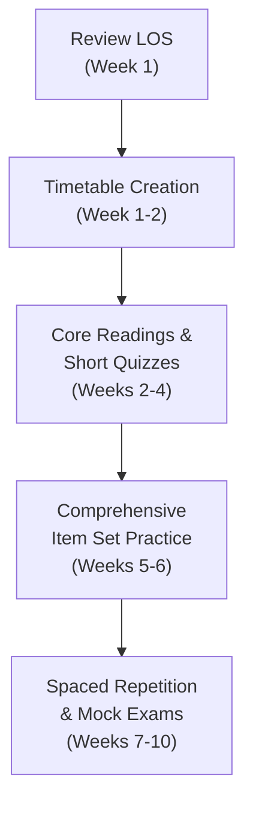

## Overview

So, you’re about to embark on the CFA® Level II journey for Fixed Income, huh? I remember the first time I opened the textbook and thought, “Wow, I’ll need a serious plan or else I’m going to drown in yield curves and bond math!” Level II is known for ramping up the complexity, especially with items like binomial trees, credit risk, and structured products. You’ll notice the exam expects you to integrate multiple topics in vignette-style questions—no more one-off factoids. In other words, you need a more robust, well-thought-out roadmap.

Below are some tips, suggestions, and personal insights to help you build an effective study plan that balances conceptual depth, practice, and efficient time management.

## Identifying Key LOS and Topics

A powerful place to begin is by reviewing the official Learning Outcome Statements (LOS) specifically for Fixed Income. These statements outline the skills and knowledge areas you’re expected to master by exam day. If you look closely, you’ll see that each reading highlights certain tasks—like analyzing bond pricing under no-arbitrage conditions or computing effective duration for mortgage-backed securities. These LOS become your anchor. They tell you:

• Which formulas to memorize (like Option-Adjusted Spread or forward-rate calculations).  
• How deeply to dive into a concept (e.g., thoroughly understanding the shape of the credit spread curve).  
• The sorts of vignettes you’ll likely see.  

In my humble opinion, print them out or have them on a visible section of your study board. Checking each item off as you go can be surprisingly motivating.

## Establishing a Timetable

One of the biggest mistakes is giving the more complicated topics too little time—trust me, credit risk modeling can be a beast if you don’t schedule enough practice. So, let’s talk about timetables. If you have, say, 12 weeks (which is common for dedicated prep), you might map out your schedule like this:

• First 2 weeks: Detailed reading and note-taking on yield measures, bond pricing, term structure of interest rates.  
• Next 2 weeks: Deep dive into structured products (MBS, CMOs, ABS) and practice short quizzes.  
• Following 2 weeks: Bond portfolio management strategies, active management, credit risk frameworks.  
• Last 2 weeks: Full-length item set practice, advanced scenario drills, and timed mock exams.  

You can tweak the weeks or reorder them depending on your strengths. For instance, if you mastered MBS at Level I, maybe you can cut that down by a few days and add more time to interest rate volatility or convertible bonds. The important thing is building a realistic timetable with wiggle room. Because real life happens. You know, that friend’s wedding or an unexpected business trip. If you structure your plan to accommodate some leeway, you’ll be way less stressed when the curveball hits.

Here’s a rough visual flow using Mermaid:

It’s not strict. Adapt it to fit your schedule, but do keep track of your progress.

## Multiple Rounds of Practice

If you’re anything like me, you might be tempted to read the chapter, nod, and think, “Yep, I got this.” Then you try a practice question and go, “Uh, what’s the difference between a forward rate and a par rate again?” Instead, plan for multiple touchpoints:

1. Read the material and make your summary notes.  
2. Tackle quick practice sets right after you finish a section—these keep concepts fresh.  
3. Summarize mistakes, silly or not, to track patterns. Did you forget to apply the correct day count convention? Overlook OAS adjustments? Let’s fix that early.  
4. After a few topics, do a bigger quiz or item set that integrates them.  

This cyclical workflow of “study → practice → review → more practice” ensures that concepts stick for the long haul.

## Integrating Advanced Scenario Exercises

The shift from Level I to Level II is night-and-day in how the exam questions are structured. It’s scenario-based, meaning you’ll see a single vignette talk about a firm’s bond portfolio, their hedging strategies, and their potential exposure to credit risk from a new corporate bond issuance. You have to pick through the data, interpret it, do calculations, and figure out the correct approach.

So, do your best to mimic that environment early. Don’t limit yourself to single-topic drills for too long. Mix yield curve analytics with credit spread analysis in one question set. This cross-topic style helps you be flexible, so you’re not flustered on exam day when multiple ideas converge.

## Spaced Repetition Strategy

Spaced repetition is like the secret sauce. Let’s say you learn binomial tree models for pricing bonds with embedded options in Week 3. By Week 5, you may already feel a bit fuzzy about the steps in backward induction or how to calibrate the up and down factors. Revisit these topics on a scheduled basis: maybe 1 week after your first pass, then again 2 weeks later, and then once more 4 weeks later. Each time, test yourself with at least a few item set questions. That schedule might look something like:

Week X: Learn Binomial Valuation → Week X+1: Quick recap quiz → Week X+3: Another small quiz → Week X+7: Comprehensive item set.

Spacing out your reviews is proven to boost retention—and personally, I’ve felt a huge difference in my recall when I regularly pop back into older readings.

## Collaboration and Group Discussions

It might feel strange to chat about negative convexity or Merton’s structural model with friends, but having a study group or active forum membership can be super helpful. Sometimes an extra pair of eyes clarifies the complexities of mortgage-backed securities or the fine print on a CDS contract. If you’re stuck on something like the difference between path-dependency in Monte Carlo vs. binomial trees, talking it through can spark that “aha” moment.

## Regular Self-Assessment

We all claim to do “self-assessment,” but being consistent about it can be harder than it sounds. It’s easy to get stuck in a pattern of, “I can’t do well in structured finance. I’m just not good at it.” Instead, treat self-assessment like small experiments. Do weekly or biweekly mini-tests to measure how you’re improving in each domain:

• Are you faster at calculating effective duration for a CMO?  
• Do you grasp the differences in OAS under changing volatility assumptions?  
• How about forward rate parity or building a zero-coupon yield curve?  

Record your score or your level of confidence. Adjust your timetable if you’re lagging behind your goals. The earlier you identify weaknesses, the more time you can devote to them.

## Flashcards for Formulas and Concepts

I used to think flashcards were for, like, high school exams. But flashcards can be your best friend here at Level II. The wide array of formulas—like the binomial model steps or forward rate calculations—are easier to memorize using active recall. Keep them brief, keep them direct, and quiz yourself while on the go. One tip: use spaced repetition flashcard apps that automatically handle intervals for you.

## Harnessing Mock Exams and Official Practice

Official CFA mocks, third-party practice exams, and even time-based quizzes are fundamental near the last month of your study cycle. Go under timed conditions, replicate the exam environment, and push yourself to answer item sets in the approximate time they’ll allow (roughly 1.5 minutes per question, give or take). Then here’s the crucial part: thoroughly review your mistakes. If you got a forward-rate question wrong, rework the entire calculation step by step. If you missed a conceptual question on credit risk modeling, revisit that reading in the CFA curriculum.  

## Using Real-World Data for Context

If you have access to Bloomberg or FactSet, great—pull up some real bond yield curves or credit default swap data. Maybe you won’t see that exact data on the exam, but it helps you appreciate the fluid nature of rates and the complexities of day-to-day trading. You’ll see the real spread transitions, how interest rate volatility can spike, or how a credit rating downgrade immediately impacts bond prices. This context cements your theoretical knowledge in real-world scenarios.

## Common Pitfalls

• Procrastination: “I’ll just do more intense study later.” It rarely works. Start early.  
• Skipping fundamental reviews: Brushing off Level I basics can undermine your grasp of advanced content—like ignoring the concept of Macaulay duration and jumping straight to effective duration on structured products.  
• Not practicing under exam conditions: Doing questions in “open-book” mode can trick you into thinking you’re more prepared than you truly are. Time yourself and practice with minimal resources.  
• Glossing over question details: Vignette questions can be wordy. That’s the point. You have to read carefully.  

## Final Thoughts

Ultimately, building your study roadmap is all about breaking down big goals into actionable steps. Identify your focus areas, use spaced repetition to keep knowledge fresh, and challenge yourself with scenario-based questions. And if you have an occasional meltdown—well, that’s normal, too. Just keep going. Review your plan, shift some sessions around, and lean on your resources. You’ve got this.

## References & Further Reading

- CFA Institute, 2025 Level II Fixed Income Study Sessions Overview.  
- Kaplan Schweser or Wiley CFA Review Packages for structured study and additional tests.  
- Official CFA Institute Online Practice Portal for question banks and mock exams.  
- Open-source financial data (e.g., FRED) or subscription-based data (Bloomberg, FactSet) for real market insights.

## Test Your Knowledge: Building a Study Roadmap for CFA Level II



### Which study technique involves revisiting concepts at increasing intervals to enhance retention?
- [x] Spaced repetition
- [ ] Massed practice
- [ ] Immediate re-reading
- [ ] Skimming
> **Explanation:** Spaced repetition systematically reviews material at set intervals, improving long-term recall and retention.

### Which of the following is the most effective step immediately after finishing a given reading or topic in Fixed Income?
- [x] Taking short focused quizzes
- [ ] Waiting for a full week before reviewing
- [ ] Jumping to the next section without review
- [ ] Memorizing formulas without application
> **Explanation:** Taking short quizzes locks in new information and reveals areas of weakness early.

### When building your study roadmap, what is a recommended approach if you find a particular area (e.g., MBS) is significantly easier for you?
- [x] Reallocate time from that area to topics with historically lower performance
- [ ] Spend an equal amount of time on all topics regardless of proficiency
- [ ] Skip the easier topic entirely
- [ ] Only rely on memorizing formula sheets
> **Explanation:** Optimally distribute study time, focusing on material you find difficult while giving brief refreshers on mastered topics.

### Which of the following best describes a key feature of Level II exam vignettes?
- [x] They present data from several related but distinct content areas
- [ ] They only address a single narrow topic
- [ ] They do not require numerical calculations
- [ ] They are purely theoretical without real-world context
> **Explanation:** CFA Level II vignettes frequently combine multiple aspects of reading (yield curves, credit spreads, embedded options) into one scenario.

### Which strategy is most aligned with advanced scenario-based exercises for CFA Level II?
- [x] Combining yield analytics, credit risk, and structured product questions in a single item set
- [ ] Isolating each topic in strictly separate question sets
- [ ] Studying only the official end-of-chapter questions for each topic individually
- [ ] Focusing on memorizing definitions for each concept
> **Explanation:** Scenario-based exercises should reflect real exam experience, mixing multiple areas in a single vignette to develop integrative thinking.

### Why is it important to self-assess regularly while building your study roadmap?
- [x] It helps identify weak areas for early correction
- [ ] It reduces the total study hours required
- [ ] It allows you to skip the more challenging topics
- [ ] It prevents you from reviewing any formula too often
> **Explanation:** Regular self-assessment pinpoints knowledge gaps, helping you target additional study and practice where you need it most.

### Which study material is strongly recommended for final exam preparation after completing initial reviews?
- [x] Full-length mock exams under timed conditions
- [ ] Unofficial social media posts
- [ ] Only re-reading the official curriculum
- [ ] Skipping practice tests to avoid confusion
> **Explanation:** Timed mock exams replicate the pressure and complexity of the real exam, revealing your readiness and areas for improvement.

### Which of the following best explains the benefit of creating flashcards for CFA studies?
- [x] They promote active recall, improving memory retention
- [ ] They reduce the total cost of study materials
- [ ] They eliminate the need to do practice questions
- [ ] They are only useful for beginners and not advanced learners
> **Explanation:** Flashcards require you to actively recall information, strengthening memory and aiding in faster formula retrieval under exam stress.

### What is a common pitfall that could derail your Level II Fixed Income preparations?
- [x] Failing to practice under exam time constraints
- [ ] Focusing heavily on item sets
- [ ] Revisiting challenging topics multiple times
- [ ] Collaborating with a study group
> **Explanation:** Practicing without time constraints can lead to a false sense of preparedness. Time management is essential for success in the actual exam.

### True or False: Real-world financial data (e.g., from Bloomberg or FactSet) can help contextualize theoretical concepts covered in the CFA Level II Fixed Income curriculum.
- [x] True
- [ ] False
> **Explanation:** Real-world data connect abstract ideas to actual market behavior, enhancing comprehension and practical application skills.


