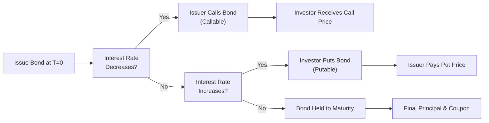

## Introduction to Callable and Putable Bonds
Embedded options can really shake up a bond’s risk, return, and cash flow characteristics. If you’ve read earlier chapters on straight bonds (sometimes referred to as option-free bonds), you know the basic price-yield relationship: bond prices generally go up when interest rates go down, and vice versa. Now, let’s add an extra twist: a callable feature or a putable feature.

• A callable bond allows the issuer to call (redeem) the bond before it formally matures.  
• A putable bond allows you, as the bondholder, to put (sell) the bond back to the issuer before maturity.

These embedded options shift decision rights. With a callable bond, the issuer holds the option, which can work against you (the investor) if the bond is redeemed when you’d prefer to keep it. With a putable bond, you hold an option that can be exercised if rates rise and you’d rather exit the position. Understanding these features and how they fit into broader market dynamics will help you properly analyze yield, price volatility, and relative value.

Sometimes, I like thinking about these embedded options in everyday terms: let’s say you lease a car, but there’s a clause allowing the dealership to take the car back if resale values improve (akin to a call). On the flip side, you might have an arrangement where you can walk away from the lease early if it becomes too expensive (akin to a put). Each side’s ability to exercise or not exercise these rights will impact the overall cost, or in the world of bonds, the yield you end up receiving or paying.

## Key Characteristics of Callable Bonds
When an issuer includes a call provision, they’re effectively putting a cap on how high the bond’s price can rise if interest rates decline significantly. Why? Because once rates drop below a certain threshold, the issuer might simply refinance at a lower rate, calling the bond away from you. This dampens the upside price potential from an investor’s perspective.

### Call Features and Lockout Periods
Callable bonds often come with a lockout period—also called “call protection”—during which the issuer cannot exercise the call. For instance, a 10-year callable bond might have a “non-call” five-year period. That means, from the time the bond is issued until year five, the issuer is legally prevented from calling the bond. After year five, the call provision typically kicks in, giving the issuer the right to redeem.

In addition, many callable bonds have a call schedule that may look like this:

• Year 5: callable at 102 (meaning 102% of par)  
• Year 6: callable at 101  
• Year 7 and onward: callable at 100 (par)  

This schedule outlines when and at what price the issuer can call the bond. The call price sometimes declines over time because as the bond ages, there’s less outstanding interest cost for the issuer.

### Yield Implications for Callable Bonds
Investors usually demand higher yields on callable bonds compared to traditional, non-callable bonds with similar maturity and credit risk. The logic? You as an investor face the risk your bond could be called away at precisely the time you stand to gain from capital appreciation after a meaningful drop in interest rates. That risk is often measured by something called “negative convexity,” which can push bond prices lower than expected as rates fall. (We will explore this further in future chapters on option-adjusted spread and effective duration.)

The yield premium compensates you for the “uncertainty” and potential downside of losing the bond when rates become more favorable. This is sometimes a decent strategy for investors comfortable with interest rate volatility, especially if their outlook suggests rates might rise (reducing the likelihood of the bond being called).

## Key Characteristics of Putable Bonds
Putable bonds give the power switch to the investor. With a putable bond, you can require the issuer to redeem the bond at par (or at some specified price) before maturity. If you see interest rates rise well above the bond’s coupon rate, you can exercise your put option and reinvest your proceeds at higher market yields—this is generally good news for you, right?

### Put Features and Timing
Like call protection for callable bonds, putable bonds will have a schedule specifying the earliest date when the put is exercisable, as well as subsequent put dates or windows. For example:

• After Year 3: putable at par (100)  
• After Year 4: putable at 99  
• After Year 5: putable at par  

Sometimes the put price remains the same (e.g., par) throughout. Other times, it may change over the years. The principle is that if interest rates jump and it’s advantageous for you to exit at par rather than hold a bond paying a below-market coupon, you can do so under these put conditions.

### Yield Effects for Putable Bonds
Putable bonds often offer lower yields versus similar maturity, option-free bonds. The reason is straightforward: as the bondholder, you have an extra “insurance policy” in a rising-rate environment or if the issuer’s credit quality deteriorates. You can simply return the bond and redeem it, limiting your loss. Because you have this beneficial right, you pay for it by accepting a somewhat lower yield. This might be attractive if you think rates could climb or if you’re risk-averse and want a measure of downside price protection baked into your bond investment.

## Price Behavior and Valuation Concepts
To make it a bit more quantitative:

• The value of a callable bond = Value of a straight bond – Value of the call option (held by issuer).  
• The value of a putable bond = Value of a straight bond + Value of the put option (held by investor).

In an environment where interest rates are dropping quickly, the embedded call option gains value from the issuer’s perspective. Conversely, in a rising-rate environment, a put option becomes more valuable to you as the bondholder.

### The Role of Interest Rate Volatility
High interest rate volatility generally increases the value of both call and put options. For a call option, greater volatility means a bigger chance that rates drop significantly, making calling the bond profitable for the issuer. For a put option, a high volatility environment means a greater likelihood that rates spike (or credit spreads widen), and you can put the bond back to the issuer. Either way, more volatility typically raises the premium embedded in these bonds.

But watch out—callable bonds have a negative convexity effect when rates decline, which can limit price appreciation. Putable bonds can display positive convexity, meaning they’ll retain more value if rates change adversely, especially if you choose to exercise the put.

## Practical Illustrated Example
Picture a 10-year bond with a 5% coupon and $1,000 par. Assume:

• Comparable option-free (straight) bonds of similar credit quality yield 5%.  
• Our hypothetical callable bond, with a non-call 3-year period, might be issued at $980 to push the yield closer to 5.3%. That’s to compensate you for the possibility the issuer calls the bond after Year 3 if rates decline below 5%.  
• Meanwhile, a similar putable bond might price at $1,020, resulting in a yield of 4.8%, because you (the investor) can put the bond back in Year 4 if rates rise above 5%.  

Notice how the callable bond is priced below par to entice investors with a higher yield. The putable bond is priced above par, with a slightly lower yield, because you have the advantage of forcing redemption if rates move against your investment. 

## Payoff Flow Diagram
Below is a simplified Mermaid diagram illustrating how callable or putable redemption can affect the flow of cash in different rate scenarios.

In this diagram:  
1. If rates drop enough to justify exercising the call feature, the issuer calls the bond, paying the call price to the investor.  
2. If rates rise enough to justify exercising the put feature, the bondholder puts the bond back, receiving the put price from the issuer.  
3. If neither side exercises their embedded option, the bond typically continues to maturity, and you get the final principal plus accrued coupon.

## Call and Put Schedules
The “call schedule” or “put schedule” is a key piece of the bond’s documentation. It will detail specific dates and pre-agreed prices at which rights can be exercised. For the exam, always check these schedules. If you see, for instance, that the first call date is still years away, the call feature doesn’t matter in the immediate future—though it might soon if interest rates keep dropping.

## Strategic Considerations for Issuers and Investors
From the issuer’s side, the call option is often about opportunistic refinancing. If interest rates tumble, the issuer can redeem the outstanding higher-coupon bond and reissue new debt at a lower coupon. That’s cost-effective for them.

From your perspective as an investor, a put option is great assurance if you worry about interest rate risk or credit risk. If the issuer’s creditworthiness deteriorates or if the market yield for similar bonds spikes, you can bail out of the position (subject to the contract terms, of course).

## Common Pitfalls and Exam Tips
• Failing to Note Lockout Periods: Some exam questions might highlight the current date and the next call or put date. If the lockout period is still in effect, the embedded option might have zero or very little immediate value in that scenario.  
• Ignoring the Impact of Volatility: Higher volatility raises the theoretical value of an option. For callable bonds, it increases the cost you pay indirectly through receiving a higher yield. For putable bonds, it increases the bond’s price because the option is more valuable to you.  
• Pricing at Premium or Discount: A bond with a call option is often issued at a discount (yield premium). A bond with a put option might be issued at or above par. Watch for how the question frames “yield advantage” or “yield sacrifice.”  
• Negative Convexity (Callables) vs. Positive Convexity (Putables): A lot of exam items revolve around “why the price of a callable bond does not rise as much as a straight bond when interest rates decline.” That’s negative convexity kicking in. For a putable bond, the floor created by the put feature fosters more price stability if rates rise.  
• Identifying Which Party Benefits: It’s easy to forget which side holds the option. A call option is an issuer’s advantage; a put option is the investor’s advantage.

## Real-World Anecdote
Some years ago, I remember (with a certain amount of frustration) buying a municipal bond with an attractive coupon. About two years in, interest rates fell sharply, and the issuer decided to refinance the entire municipality’s debt. Bam—my bond got called at 101 plus accrued interest. Sure, I made a small premium, but I lost out on several more years of that sweet coupon. Not that I’m bitter… well, a little. That’s the typical investor’s lament with callable bonds. On the bright side, had I been holding a putable bond instead, I would be in control, deciding whether or not to return the bond if rates soared.

## Cross-Reference and Future Topics
• Chapter 11 will expand on how we calibrate the value of these embedded options using option-adjusted spreads (OAS) and sophisticated measures of duration.  
• In Chapter 8 (Binomial Tree Models) and Chapter 9 (Monte Carlo Simulation), you’ll learn how to model the timing and probability of calls and puts.  
• Chapter 25 on “Measuring Interest Rate Risk” outlines how durations must be adapted to handle these optional features.  
• For deeper discussions, see references in the official CFA Program Curriculum on embedded options, as well as standard texts like Fabozzi’s “The Handbook of Fixed Income Securities.”

## Conclusion and Practical Takeaways
Callable and putable bonds are a testament to how a single contract feature can dramatically alter a security’s price dynamics and yield. As interest rate expectations shift, these transformations become even more noteworthy:

• Callable Bonds: Higher yields, but compromised upside if rates fall.  
• Putable Bonds: Lower yields, but better downside protection if rates rise.  

When analyzing or trading these bonds, always see if the current or expected interest rate environment could trigger the embedded option. Evaluate lockout periods, a call or put schedule, and the bond’s price sensitivity (convexity). Doing so will help you make more informed decisions, whether for portfolio construction, risk management, or simple yield enhancement.

---

## Test Your Knowledge: Callable and Putable Bonds Exam-Style Questions



### A bond that includes a call provision benefits the issuer under which of the following circumstances?
- [ ] When interest rates significantly increase, making the existing coupon more attractive.
- [ ] When the issuer’s credit quality deteriorates.
- [x] When interest rates decline, allowing refinancing at a lower rate.
- [ ] When the investor is unwilling to retire the bond early.

> **Explanation:** The issuer benefits from the call feature when rates drop, as it can redeem the high-coupon bond and reissue at a lower coupon, reducing interest costs.

### Which statement is most accurate regarding the lockout period for a callable bond?
- [ ] The issuer can call the bond at any time, even within the lockout period.
- [x] The issuer is prohibited from calling the bond during the lockout period.
- [ ] The issuer must call the bond if rates decline below the original coupon.
- [ ] The investor can force the issuer to redeem the bond during the lockout period.

> **Explanation:** The lockout period (or call protection) is the span during which the issuer cannot exercise the call feature. After it passes, the issuer may redeem based on the call schedule.

### Compared to otherwise identical straight (option-free) bonds, callable bonds typically:
- [ ] Have lower yields and higher prices.
- [x] Have higher yields, reflecting call risk.
- [ ] Trade at higher prices if rates are projected to decline.
- [ ] Have lower yields, reflecting the issuer’s benefit.

> **Explanation:** Callable bonds generally compensate investors for call risk by offering a higher yield. Investors must accept the risk that the bond may be called away when it’s most advantageous to the issuer.

### A putable bond can be appealing to investors primarily because:
- [ ] It eliminates interest rate risk completely.
- [x] It provides downside price protection if interest rates rise.
- [ ] It guarantees the bond will be called if rates fall.
- [ ] It locks the investor into the position if rates increase.

> **Explanation:** By embedding a right to “put” the bond back to the issuer, investors can limit losses if rates rise, since they can sell back at a predetermined put price.

### An investor compares a callable bond and a putable bond with the same maturity and coupon. Which bond is likely to offer the higher initial yield, everything else equal?
- [x] The callable bond.
- [ ] The putable bond.
- [ ] Both would have identical yields.
- [ ] Neither would have any yield premium.

> **Explanation:** The callable bond typically has a higher yield to compensate for the investor’s disadvantage (the issuer controls the call feature). The putable bond typically trades at a lower yield because the put offers extra protection to the investor.

### Which of the following is true concerning negative convexity in callable bonds?
- [ ] It means the callable bond’s price will rise faster than a straight bond when rates decline.
- [ ] It indicates smaller price drops when rates increase.
- [x] It limits the price appreciation when rates fall significantly.
- [ ] It doesn’t affect how the bond’s price reacts to interest rate changes.

> **Explanation:** Negative convexity in callable bonds signals that as rates decline, the bond’s price rise is capped by the potential for the issuer to call the bond away from investors.

### If interest rate volatility increases substantially, how is the value of an embedded put affected?
- [x] The value of the put increases.
- [ ] The put value decreases.
- [ ] The put value remains constant.
- [ ] The value of the put becomes negative.

> **Explanation:** Higher volatility amplifies the potential benefit to the holder of the put. The more rates might rise, the more valuable the put becomes.

### Suppose a bond has a put schedule allowing the investor to put the bond back to the issuer in Year 5 at par. If interest rates stay the same or decline, what is the most likely scenario?
- [ ] The investor immediately puts the bond, forcing redemption.
- [x] The investor probably will not exercise the put option.
- [ ] The issuer forces the investor to put the bond.
- [ ] The bond’s price drops dramatically in Year 5.

> **Explanation:** The investor only gains from exercising the put if rates have risen substantially, making the below-market coupon unattractive. If rates remain steady or fall, there’s little incentive to put the bond.

### In practice, an issuer might be more inclined to exercise a call option on the first call date if:
- [ ] The bond is trading at a deep discount due to high interest rates.
- [ ] The issuer’s credit rating improves significantly.
- [x] Current market rates are much lower than the bond’s coupon rate.
- [ ] The lockout period is extended.

> **Explanation:** Lower market rates present a cheaper borrowing option, so redeeming the old bond allows the issuer to lock in reduced financing costs by reissuing new debt at the lower prevailing rates.

### The value of a callable bond can be expressed as:
- [x] V(callable bond) = V(straight bond) – V(call option).
- [ ] V(callable bond) = V(straight bond) + V(put option).
- [ ] V(callable bond) = V(straight bond) – V(put option).
- [ ] V(callable bond) = V(straight bond) + V(call option).

> **Explanation:** The call option is owned by the issuer, which reduces the overall value to the investor compared to a straight bond. Hence, the callable bond’s value = straight bond’s value minus the issuer’s call option.



---

**References / Further Reading**  
• CFA Institute, “Fixed Income—Analysis of Risk,” CFA® Program Curriculum.  
• Fabozzi, Frank J. (Ed.). The Handbook of Fixed Income Securities.  
• Choudhry, Moorad. Bond and Money Markets: Strategy, Trading, Analysis.  

Feel free to review upcoming chapters on valuation techniques, option pricing, and interest rate trees (Chapters 8 and 9) to solidify your understanding of how embedded options actually get priced in the marketplace. Keep an eye on your calculator skills—on the exam, you’ll need to compute yield measures accurately under these different bond structures.  
