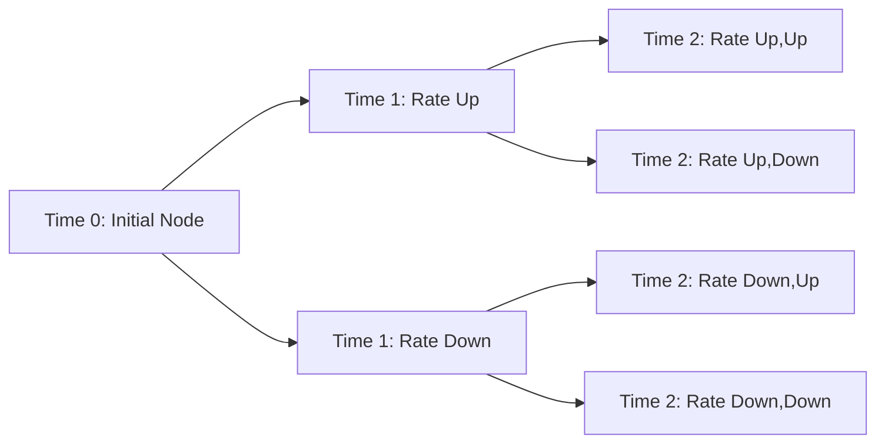
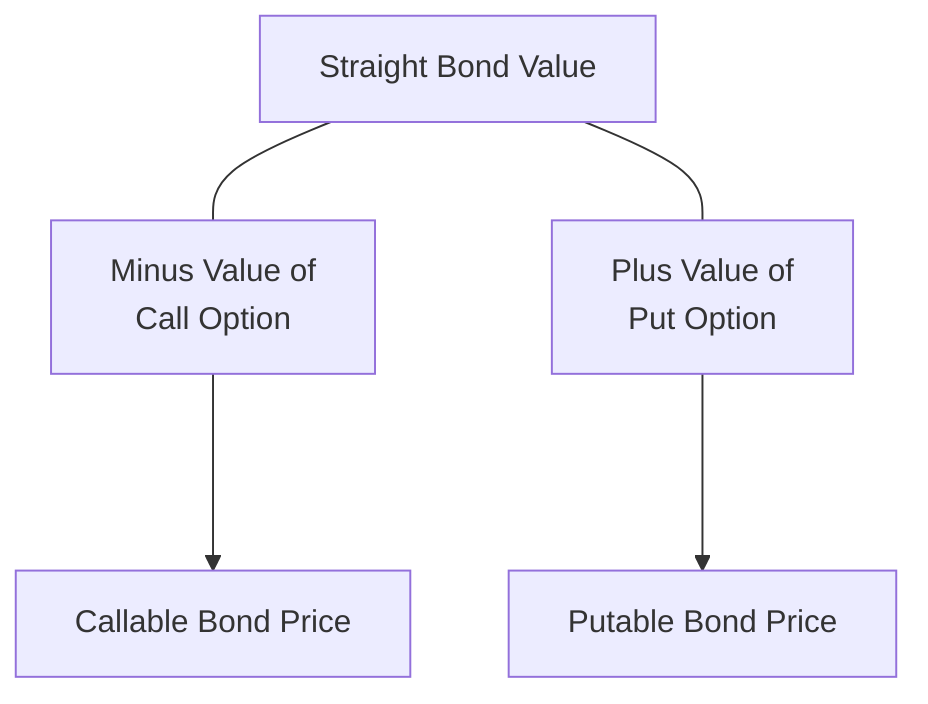

## Overview

Ever come across a bond offering a surprisingly high yield and wondered, “Hmm, why is it so generous?” Well, chances are there’s something buried in the fine print—a call provision, a put provision, or maybe even both. This section explores how to value a standard (“straight”) bond relative to one loaded with a hidden gem or two (i.e., embedded options). As we’ll see, those seemingly small add-ons can dramatically shape both risk and return.

We’re going to build on earlier sections—particularly binomial tree modeling (Chapter 8) and Monte Carlo simulation (Chapter 9)—since embedded-option valuations usually rely on these frameworks. Before diving in, let’s do a quick warm-up by revisiting how a plain vanilla bond (no call, no put, no stepping coupons—just a normal fixed-coupon bond) is valued.

## Straight Bond Valuation: The Basic Approach

When analysts talk about a “straight bond,” they’re referring to your no-frills, fixed-rate coupon bond. Conceptually, the valuation approach remains the same as you learned in previous chapters:

• Identify all future cash flows (coupon payments plus the principal repayment at maturity).  
• Discount these cash flows back to the present using an appropriate yield curve (spot rates, forward rates, or yield to maturity).  

Mathematically, the price P of a straight bond can be written as:


P = \sum_{t=1}^{T} \frac{C_t}{(1 + r_t)^t} + \frac{\text{Par}}{(1 + r_T)^T},


where:  
• \\( C_t \\) is the coupon payment in period t.  
• \\( r_t \\) is the required yield (or spot rate) for period t.  
• \\( T \\) is the total number of periods until maturity.  
• Par is the principal (or face value) repaid at maturity.

In real-world practice—and definitely on the CFA exam—you’ll often see an assumption of a flat yield curve or a set of spot rates used for discounting. Either way, the approach is straightforward: each cash flow is discounted at the appropriate rate, and then we add everything up. That’s your bond price.

When you do this for a plain vanilla bond, you’re generally not expecting the timing of coupon or principal payments to change (except in default scenarios, but that heads into credit risk territory). The bond lives out its life, paying fixed coupons until maturity.

## Adding Embedded Options: Changing the Game

With an embedded option, the timing or even magnitude of future cash flows can suddenly shift. For example:

• A callable bond gives the issuer the right to repurchase the bond at a specified price (the call price) before maturity. If market interest rates drop (or the issuer simply finds better financing terms), guess what? The issuer can call the bond away from you, leaving you to reinvest at lower yields. This reduces the bond’s attractiveness to you, the investor.  
• A putable bond is the opposite. You can “put” the bond back to the issuer if interest rates rise or you find somewhere better to put your money. This right gives you, as an investor, a safety net and usually results in a higher price (i.e., lower yield) compared to an otherwise identical straight bond.

### Why a Separate Valuation Approach?

The presence of an embedded option augments the standard discounted cash flow approach. Because the bond’s payments could be altered by an exercise event—call or put—you need a model capturing all potential interest rate paths and the associated exercise decisions at each step. Enter binomial trees (see Chapter 8) and Monte Carlo simulations (Chapter 9).

Under the hood, these models rely on a risk-neutral valuation framework. In simple terms, that means we pretend everyone is indifferent to risk (and demands the risk-free rate) when discounting expected future payoffs. This doesn’t reflect real-world risk preferences, but it simplifies modeling of derivatives or embedded options. The resulting “risk-neutral” model is consistent with no-arbitrage principles—meaning you won’t find a money machine by combining different instruments incorrectly.

## Binomial Tree Valuation (A Quick Refresher)

In a binomial interest rate tree model, we break time into discrete intervals and model interest rates as either going up or down by certain factors each period. At any node, you determine the bond’s value by looking at potential coupon or redemption amounts in the next period—plus any potential call or put exercise—and discounting back. You then move “backward” through the tree node by node until you reach the present.

A simple conceptual diagram might look like this:

Each node’s value is computed by taking the expected payoff (coupons plus redemption, factoring in call or put triggers if applicable), multiplied by the risk-neutral probabilities, and discounted back at the (risk-neutral) rate. If there’s a call feature, the issuer might call at that node if it’s advantageous to them—i.e., if the value they must pay to redeem the bond is less than the bond’s hold value. If it’s putable, you (the investor) might put the bond back if it’s advantageous to you. Whichever party holds the option will exercise it if that maximizes their value.

## Monte Carlo Simulation: A Flexible Alternative

Monte Carlo methods randomly (and repeatedly) simulate interest rate paths. You might recall from Chapter 9 that it’s especially useful when dealing with more complex path-dependent features.

• Generate thousands of hypothetical interest rate paths (using chosen volatility and mean reversion assumptions).  
• For each path, determine whether and when the call or put feature might be exercised.  
• Discount every possible path’s cash flows back to today using risk-neutral rates.  
• Average (in a risk-neutral sense) across all paths to get the bond’s theoretical price.

This method can be a bit heavy on computational time, but it’s extremely versatile. If you want to incorporate specific yield curve dynamics, or more complicated structures like step-up coupons plus a call, then Monte Carlo can often handle that more gracefully than a binomial tree.

## Option Value as the Price Differential

All right, so how do we compare a straight bond to its embedded-option cousin? The easiest way is:

• Straight Bond Value = “Plain” discounted cash flow price (assuming no early call/put).  
• Embedded-Option Bond Value = Adjusted discounted cash flow approach that incorporates the probability of the call or put being exercised at each relevant point in time.

The difference between the two can be viewed as the embedded option’s value. Specifically:

• For a callable bond,  
  Price(Callable Bond) = Price(Straight Bond) – Value(Call Option).  
  Because the issuer holds the call right, investors are effectively short that call. That short position has a monetary cost to them—and so the bond’s price is lower than its plain-vanilla sibling.  

• For a putable bond,  
  Price(Putable Bond) = Price(Straight Bond) + Value(Put Option).  
  Because the holder has the right to “put” the bond back, the investor effectively owns a built-in put. That advantage raises the bond’s price.

In practice, the yield difference from a comparable straight bond also signals the presence of an embedded option. A callable bond typically trades at a higher yield (to compensate for the negative convexity and call risk), while a putable bond trades at a lower yield (the issuer has to offer you that sweetener of lower coupons because you have a safety net).

## Interest Rate Volatility: A Key Driver

One of the biggest drivers of option value—whether it’s an equity option, an FX option, or a bond call/put option—is volatility. Higher interest rate volatility generally increases the value of both call and put features (since big swings in rates make the option more likely to land “in the money”). But notice how that plays out for callable vs. putable bonds:

• If you’re holding a callable bond, the call feature is beneficial to the issuer, so higher volatility means the issuer’s call option is more valuable—and that’s not so great for you. The bond’s price will drop even more relative to a straight bond in high-volatility environments.  
• If you hold a putable bond, your embedded put option gets more valuable when interest rate volatility rises. That means the putable bond’s price climbs closer to (or even above) the straight bond’s price, because you’re protected from adverse rate movements.

It’s almost like insurance—when storms (volatility) get more violent, insurance premiums climb (option values go up), and whoever owns the insurance gets the advantage.

## Practical Example (Short and Sweet)

Let’s imagine a 5-year, 5% annual-coupon bond. If interest rates today are 5%, the plain vanilla bond might be priced at par (100). Now tack on a call provision at par in Year 3. If the interest rate environment is likely to drop, that call feature might get exercised. The bond’s theoretical value—once we correctly model possible rate paths—might then be only about 98 because the issuer could yank it away from new coupon payments if rates fall. That 2-point difference is the cost of the embedded call.  

Flip the scenario: make it putable at par in Year 3. Now as an investor, you can put it back for 100 if yields rise. The bond might jump to 102 or 103 after we do the calculations since that put option is valuable to you, acting like a built-in rate insurance.

## No-Arbitrage Principle

Throughout these valuations, we rely on the no-arbitrage principle. You can’t magically create money by combining or decomposing securities if the market is efficient. So, the embedded-option bond’s fair value must be the same as:

• The straight bond, minus or plus  
• The fair value of the relevant embedded option.

If it isn’t, a savvy trader could do a series of trades (like going long the bond, shorting the embedded option, or some combination) to lock in a riskless profit, which shouldn’t persist in an efficient market.

## Personal Anecdote (Yep, Bonds Can Surprise You)

I remember the first time I ran into a callable bond in a client’s portfolio. It was this high-coupon bond that looked too good to be true. The client was super happy—“I’m earning 7% while the market’s at 5%!”—but then rates dipped, the issuer immediately called the bond at par, and the client’s sweet 7% vanished. Ouch. That’s the real impact of an option: it’s not always a free lunch.

## Common Pitfalls and Best Practices

• Overlooking Volatility: If you assume stable interest rates, you’ll undervalue both call and put features. Make sure your model uses a realistic volatility figure.  
• Confusing the Direction of the Benefit: Always remember that a call benefits the issuer (and penalizes the investor), but a put is the exact opposite.  
• Ignoring Convexity Effects: Callable bonds can exhibit negative convexity. That means your price sensitivity might be smaller when rates fall (call risk) and bigger when rates rise.  
• Using a Single Yield to Discount Everything: For embedded-option bonds, you should apply the spot rate (or forward rate) relevant to each potential path. A single yield is rarely enough to reflect future uncertainty.  
• Failing to Factor in Real-World Market Conditions: In practice, liquidity, credit spreads, and other factors also matter. But from a CFA exam perspective, the risk-neutral approach plus no-arbitrage logic will suffice for the theoretical fair value.

## Visual Summary

Below is a simple conceptual figure that ties everything together:

By seeing it all in one place, it’s clear how the embedded option modifies the base bond price.

## Final Thoughts

So there you have it: the skeleton of how to value a bond with or without embedded options. Basically, your approach evolves from a simple sum of discounted cash flows to a scenario-based or risk-neutral model that captures all the ways an embedded option can distort timing and amounts. Remember that factoring in realistic volatility assumptions is huge, and keep an eye on how each embedded feature affects which party benefits.

In the next sections, we’ll dig deeper into the effects of interest rate volatility on embedded-option bond pricing (10.3) and show more worked examples to solidify your new skills. For exam day, practice reading vignettes carefully to spot any tricky call or put features. Often, a big piece of the puzzle is simply noticing that a bond can be redeemed earlier or put back to the issuer under certain circumstances.

## References for Further Exploration

• Hull, John C. Options, Futures, and Other Derivatives. (Chapters on binomial and Monte Carlo valuation methods)  
• Tuckman, Bruce. Fixed Income Securities: Tools for Today’s Markets. (Advanced no-arbitrage concepts)  
• CFA Institute, “Fixed Income Valuation and Risk Models,” CFA® Program Curriculum  

## Review Questions: Valuing Straight Bonds vs. Embedded-Option Bonds



### A callable bond typically trades at:
- [ ] A lower yield than a comparable straight bond.
- [x] A higher yield than a comparable straight bond.
- [ ] The exact same yield as a straight bond.
- [ ] A negative yield if interest rates are low.

> **Explanation:** Callable bonds offer an issuer a valuable option to retire the bond early, which is detrimental to investors. Therefore, investors demand a higher yield to compensate.

### Compared to a straight bond, a putable bond has:
- [ ] Higher yield due to the investor’s advantage.
- [ ] The same yield as a straight bond under normal conditions.
- [x] Lower yield because the investor benefits from the put.
- [ ] A default risk premium.

> **Explanation:** The put option benefits the investor, so the issuer offers a lower yield compared to an otherwise identical straight bond.

### The call option in a callable bond is:
- [x] Valuable to the issuer, meaning investors are effectively 'short' that call.
- [ ] Valuable to the investor, resulting in negative convexity for the issuer. 
- [ ] Always worthless if interest rates rise.
- [ ] Always exercised at maturity.

> **Explanation:** Since the issuer owns the right to call the bond, the investor is on the losing side of the call feature. Negative convexity arises from the call structure’s impact on price sensitivity.

### Higher interest rate volatility generally:
- [ ] Decreases the value of put or call features.
- [ ] Has no effect on bond valuations.
- [x] Increases the value of both call and put features.
- [ ] Favors only callable bonds.

> **Explanation:** Greater volatility expands the potential for in-the-money outcomes for embedded options, raising their value.

### In a risk-neutral framework for valuing embedded-option bonds:
- [x] We discount expected cash flows at the risk-free rate and adjust for the probability of exercise.
- [ ] We discount all payments at the issuer’s cost of capital.
- [ ] Probability of exercise is always zero.
- [ ] We ignore the yield curve and only use a single discount rate.

> **Explanation:** Risk-neutral valuation assumes a world where all assets earn the risk-free rate, so probabilities are adjusted to ensure no arbitrage. This is central in derivative and embedded-option pricing.

### When a callable bond is likely to be called:
- [x] The issuer typically replaces old debt with new, cheaper debt, benefiting themselves.
- [ ] Investors earn a significant premium above the coupon.
- [ ] The issuer suffers a penalty from high market rates.
- [ ] The bond’s cash flows are unaffected.

> **Explanation:** In a low-rate environment, the issuer can refinance at better terms by calling the bond, which ends the investor’s opportunity to continue receiving above-market coupons.

### One reason a bond might be structured as putable is:
- [x] To attract more investors by offering downside protection if rates rise.
- [ ] To penalize investors if rates fall.
- [ ] To reduce the issuer’s flexibility.
- [ ] To ensure the bond will definitely be called at maturity.

> **Explanation:** A putable bond gives the investor the option to sell the bond back to the issuer, mitigating interest rate risk for the investor and making the bond more attractive (hence lower yield).

### Binomial trees are often used for embedded-option bonds because they:
- [ ] Ignore interest rate changes and conflicts with no-arbitrage principles.
- [x] Allow you to consider different future rate paths and possible option exercise points.
- [ ] Eliminate the need for discounting cash flows.
- [ ] Guarantee a higher price than Monte Carlo simulation.

> **Explanation:** Binomial trees break the future into discrete up/down steps to capture changes in interest rates, enabling a scenario-by-scenario analysis of option exercise.

### The no-arbitrage principle ensures that:
- [x] The value of a callable (or putable) bond is equal to the value of a straight bond minus (or plus) the corresponding option.
- [ ] You can earn unlimited risk-free profit by combining bonds and derivatives. 
- [ ] Interest rates remain constant in the model.
- [ ] Valuations are meaningless in practice.

> **Explanation:** No-arbitrage means markets price instruments so there’s no free lunch. Thus, an embedded-option bond’s fair value must reflect the separate values of its components.

### The primary factor that causes negative convexity in callable bonds is:
- [x] The call feature allowing the issuer to redeem the bond when rates fall.
- [ ] The put feature held by the bondholder.
- [ ] The automatic coupon reset mechanism.
- [ ] The issuer’s credit risk changing unexpectedly.

> **Explanation:** Negative convexity in callable bonds comes from the potential for early redemption when rates decline, capping the bond’s price appreciation.


