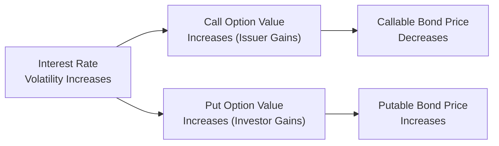

## Overview

Interest rate volatility can feel like one of those “silent forces” that’s always hovering in the background. You may not always see it, but when it changes significantly, it can hugely affect the prices of bonds—especially those with embedded options. Maybe you’ve watched interest rates move one or two percentage points and found yourself scrambling to figure out why the price of that callable bond in your portfolio was suddenly so different. Well, it’s all about how the embedded call or put responds to big swings in interest rates. Let’s break it down.

## Why Volatility Matters

Higher volatility means a wider range of possible future interest rates. For a bond with an embedded option, that option’s value responds strongly to how spread out (or volatile) those possible future rates can be. And just like with an equity option, higher volatility means more potential “in-the-money” outcomes over time. Let’s consider the two primary cases:

• Callable Bonds (where the issuer owns the call option):  
  – As volatility goes up, the call option becomes more valuable to the issuer.  
  – The issuer can call the bonds if rates drop enough to make refinancing favorable.  
  – From the investor’s perspective, a valuable issuer option means a less attractive investment; so the bond’s price is lower compared to a straight (option-free) bond.  

• Putable Bonds (where the investor owns the put option):  
  – As volatility goes up, the put option gains value for the holder (i.e., the investor).  
  – If rates rise significantly, the investor can put the bond back to the issuer, mitigating downside price risk.  
  – That extra investor protection means the bond trades at a higher price than an otherwise similar bond without the put.

So if you’re holding a bunch of callable bonds, you’ll notice that higher volatility typically leads to lower bond prices (because your bond is more likely to get called away from you at par). But if you’re holding putable bonds, you’ll notice the opposite price effect. That’s the fundamental see-saw: the more optionality, the more the bond’s price is impacted by changes in volatility.

## Intrinsic Value vs. Time Value

An embedded option’s total value comes from two components:

• Intrinsic Value: The value if the option were exercised today.  
• Time Value: The value based on the probability that, as we move through time, exercising the option might become more advantageous.

Even if interest rates remain where they are right now, higher volatility implies a greater chance that rates could move to levels that put the option in-the-money before maturity. Let’s think of a call option embedded in a bond: if rates fall, the issuer can call the bond and refinance. The chance of that happening goes up in a high-volatility environment, thus the call has a higher time value. The same logic (albeit reversed for beneficial ownership) applies to put options for the investor.

## Scenario Analysis and the “What-If” Approach

To get a feel for how the bond’s value might change, many analysts run scenario analyses:

• Implied Volatility Shift: Suppose implied volatility (the volatility estimate extracted from option prices in the market) jumps from 10% to 20%. How does that change the bond’s valuation? If you’re holding a callable bond, you’d likely observe a notable drop in the bond price, because the embedded call is more “expensive” (i.e., valuable to the issuer). For a putable bond, you might see a price increase.  

• Realized Volatility: Also consider how realized volatility might influence future payoffs. Sometimes the market’s implied volatility is an underestimate (or overestimate) of what actually occurs. If realized volatility ends up higher, you might see more frequent calls or puts exercised than initially expected.  

Analyzing these scenarios reveals how dependent bond valuation can be on our assumptions about rate volatility. It’s a bit like weather forecasting: if you expect mild, predictable conditions (low volatility), you’ll get one price. But if you think a sudden storm could blow in at any time (high volatility), the pathways branch out in big ways, and the embedded option is suddenly worth a lot more.

## Moderate vs. High Volatility Environments

Would you price a callable bond the same in a stable market as in a hyper-volatile one? Probably not. Let’s see:

• Moderate Volatility: When interest rates fluctuate within a relatively narrow band, the likelihood that the issuer will call—or the investor will put—the bond is more contained. Callable bonds may not see huge call option values, so their price discount (relative to a straight bond) is moderate. Putable bonds gain a bit from their put, but it may not be a huge protective premium.  

• High Volatility: In a major volatility spike (maybe triggered by an unexpected monetary policy shift or big geopolitical shock), the call or put option will become substantially more valuable. If rates could shoot down or up by several percentage points, that embedded option starts to carry significant weight in the bond’s overall valuation. The shape of the bond’s price-yield curve changes dramatically, increasing negative convexity for callables or providing favorable convexity support for putables.

## Effective Duration and Convexity

When interest rate volatility rises, embedded options also impact a bond’s effective duration and convexity.

• Effective Duration: Typically, a callable bond’s effective duration is lower than that of a straight bond when rates are near or below the coupon rate, because the potential call dampens further upside in price. But if volatility is high, the possibility of that call being triggered is even more pronounced, causing the bond to behave more like it might get called any time interest rates drop. Result: lower effective duration. Conversely, putable bonds have a higher effective duration if rates are low (no real reason to put), but that duration can shrink dramatically if rates climb and the put option becomes relevant.  

• Convexity: Callable bonds exhibit negative convexity in the region where the call is likely to be exercised. Higher volatility accentuates this, because the call’s time value grows. For putable bonds, you can get positive convexity, especially in rising rate environments where the put takes over and effectively floors your price. More volatility = more optionality. More optionality = more convexity effects.

Anyway, all of this is to say that a bond with an embedded option does not respond in a linear fashion to interest rate changes. It’s a bit like driving a car on a windy road: as twists and turns become more dramatic (read: volatility), your route from A to B is definitely not a straight line.

## A Quick Personal Reflection

I remember a time (and this was a few years before I started teaching CFA classes) when I was analyzing a portfolio of hybrid securities—some were callable at the issuer’s option, others were putable at the investor’s option. I was startled by how a medium shift in volatility changed the portfolio’s valuation. One big surprise was how quickly the call risk showed up in the bond’s price: the market started pricing in a much higher chance of early redemption, and suddenly that bond’s yield to maturity shot up. As an investor, it really drives home how these optionality features can become a game-changer in a volatile environment. It made me pay a lot more attention to volatility forecasts and to the shape of the implied volatility curve in the market.

## Macroeconomic Events and Policy Changes

Volatility can spike due to:

• Unexpected Monetary Policy Shifts: For instance, a central bank drastically raises or lowers benchmark rates, or hints that it might do so soon. This can trigger big changes in the yield curve and create uncertainty about the future path of rates.  

• Market Sentiment/Macro Events: Geopolitical tensions, surprising jobs data, or changes in inflation forecasts can upend stable market conditions, causing volatility to rise across the board.  

High volatility is not inherently good or bad. It’s more about whether you’re the issuer (and have the embedded call) or the investor (and have the embedded put). That’s why it’s so essential to keep an eye on volatility measures when managing or valuing these instruments.

## Visualizing the Process

Below is a simple flowchart that shows how rising interest rate volatility can alter the dynamics of both callable and putable bonds:

Notice how the net effect flows: more volatility → bigger option value → bond price response depends on who benefits.

## Best Practices and Pitfalls

• Always Separate the Option’s Value from the Underlying Bond: When analyzing interest rate volatility, it often helps to conceptually “strip out” the embedded option and see how it behaves. Make sure you’re not mixing up the effect of changing interest rates on the base bond cash flows with the effect of optionality.  

• Don’t Underestimate Time Value: Even if the option is out-of-the-money, a jump in volatility can quickly shift the probability distribution of future rates. This time value is real and can be big.  

• Watch for Changes in Implied Volatility: Market pricing might suddenly shift the implied volatility used in option valuation. If you’re only paying attention to realized volatility, you might lag behind the market’s re-pricing and be caught off guard.  

• Beware of Negative Convexity: If you hold callable bonds, your portfolio has more downside risk in a falling-rate environment than you might guess from a simple duration measure. The call can be triggered, limiting price upside.  

• Model Risk: Option pricing can get complicated, as you’ll explore in Chapter 8 (Binomial Interest Rate Tree Models) and Chapter 9 (Monte Carlo Simulation). No model is perfect—be sure to test your assumptions thoroughly (e.g., distribution of interest rates, volatility estimates).

## Glossary

• Volatility: The degree to which a variable, such as interest rates, can fluctuate over time.  
• Intrinsic Value: The immediate exercise value of an option if exercised right now.  
• Time Value: The potential future value of an option before its expiration, reflecting the probability that the option might move in- or out-of-the-money.  
• Implied Volatility: A forward-looking measure of how much market participants expect the underlying rate to vary, backed out from current option prices.  
• Effective Duration: A duration measure that accounts for changes in expected cash flows due to embedded options or other non-linearities.  
• Convexity: A measure capturing how sensitive duration is to changes in interest rates, often associated with the curvature of the bond price–yield relationship.

## References

• Fabozzi, Frank J. Bond Portfolio Management. A thorough examination of how interest rate volatility impacts callable and putable bonds.  
• Choudhry, Moorad. The Principles of Banking. Sections specific to how volatility influences pricing and risk for fixed income securities.  
• CFA Institute Research: Numerous scholarly articles discussing volatility and its effects on bond pricing, including modeling approaches for interest rate movements.

## Exam Tips and Final Thoughts

Exam item sets often mix scenario data on interest rates and volatilities to test your understanding. Watch carefully for:

• How an increase or decrease in implied volatility affects bond valuation.  
• Whether a bond is callable or putable, and which side of the trade benefits.  
• Unique metrics like effective duration and one-sided durations (more on that in Chapter 11).  
• Interpretation of negative convexity for callable bonds and how it might appear in a scenario.

Time management is crucial. Vignette questions typically provide a footnote or line reference about implied volatility or mention that “analysts expect a spike in rate volatility.” Be ready to connect that detail to the embedded options and figure out exactly who stands to gain or lose. Don’t forget to read each question thoroughly—sometimes they’ll be about pricing differences, other times about durations. Each angle can be fair game.

Ultimately, interest rate volatility is a key influencer of bond valuation, particularly for those pesky embedded options. Keeping a keen eye on the direction of volatility can help you anticipate price changes and manage risk more effectively.  

Stay curious, stay flexible, and good luck in applying these insights in all your practice sessions!

---

## Test Your Knowledge: Interest Rate Volatility and Embedded Options



### Which of the following statements regarding interest rate volatility is most accurate?

- [ ] For callable bonds, higher volatility benefits the investor by increasing the bond’s price.
- [ ] For putable bonds, higher volatility reduces the put’s time value.
- [ ] Lower volatility generally increases the time value of embedded options.
- [x] Increased volatility raises the value of embedded options, impacting callable and putable bonds differently.

> **Explanation:** More volatility raises the value of options. In callable bonds, this higher option value benefits the issuer and thus reduces the bond’s price. In putable bonds, it benefits the investor, increasing the bond’s price.

### An investor holds a callable bond and observes an unexpected spike in market volatility. All else equal, what impact should the investor expect on the bond's price?

- [ ] The bond’s price will likely increase significantly due to favorable rate movements.
- [ ] The bond’s price is unaffected by volatility shifts because coupon payments remain the same.
- [ ] The bond’s price will likely remain unchanged in the short run.
- [x] The bond’s price will likely decrease, as the issuer’s embedded call option becomes more valuable.

> **Explanation:** Higher volatility makes the call option more valuable to the issuer. As a result, the callable bond’s price decreases because the issuer can redeem (call) the bond more profitably if rates fall.

### A putable bond currently trades at par. Which statement regarding its value in a high-volatility environment is correct?

- [ ] The put option has negligible time value if interest rates are extremely low.
- [x] The bond’s value is generally higher than it would be in a low-volatility setting.
- [ ] High volatility only contributes to intrinsic value, not time value.
- [ ] The bond’s price must remain unchanged when rates don’t move.

> **Explanation:** In a high-volatility market, the put option gains extra time value because there is a higher probability that interest rates could rise enough for the investor to exercise the put.

### Which best characterizes the “time value” of an embedded option?

- [ ] The notional dollar value of coupon payments over the life of the bond.
- [x] The additional value reflecting the chance that the option becomes in-the-money before expiration.
- [ ] The guaranteed profit if the issuer redeems the bond.
- [ ] The coupon differential between a plain-vanilla bond and a callable bond.

> **Explanation:** Time value is the part of an option’s total value that arises from the possibility of future price swings (interest rate moves). It’s above and beyond the intrinsic (immediate exercise) value.

### How does a rise in interest rate volatility generally affect a callable bond’s effective duration?

- [ ] It remains unchanged, since effective duration depends only on coupon rate.
- [x] It typically decreases, reflecting a higher probability of early call.
- [ ] It typically increases, because uncertain rates lead to uncertain durations.
- [ ] It randomly shifts, with no consistent pattern.

> **Explanation:** As volatility goes up, the issuer’s option to call likely gets exercised if rates drop. That shortens the bond’s lifespan, effectively reducing its duration.

### Consider two bonds: Bond A is callable, and Bond B is putable. Both have the same coupon and maturity. What would a spike in rate volatility imply?

- [ ] Bond A and Bond B would both decline in price, since increased volatility penalizes bondholders.
- [x] Bond A would likely decrease in price, while Bond B would likely increase due to higher put option value.
- [ ] Both would increase in price, as they embed options that become in-the-money.
- [ ] Neither bond’s price changes unless interest rates actually move.

> **Explanation:** For callable bonds (Bond A), an increase in volatility benefits the issuer’s option, hurting the investor. For putable bonds (Bond B), higher volatility benefits the investor’s option, raising the bond’s price.

### In a scenario where interest rates are expected to remain constant, but implied volatility rises dramatically, which of the following is true?

- [ ] Bond prices do not respond to implied volatility, only realized volatility.
- [ ] The value of embedded options does not change if rates remain constant.
- [ ] Only the call options embedded in bonds benefit, not put options.
- [x] The bond’s embedded option value changes due to the higher probability of becoming in-the-money in the future.

> **Explanation:** Even with no rate change, the time value portion of the option can increase if the market anticipates bigger rate swings, making the option more valuable.

### Why might a callable bond exhibit negative convexity when rates decline?

- [ ] The bond’s coupon resets lower.
- [ ] The bond’s issuer must compensate investors for a decline in rates.
- [x] The call option caps the bond’s price appreciation, reducing price gains as rates fall.
- [ ] Negative convexity occurs only for bonds at high yield levels.

> **Explanation:** When rates fall, callable bonds do not appreciate in the same manner as straight bonds because the call can be exercised. This “price ceiling” effect creates negative convexity.

### Which macro event is least likely to cause a sudden change in implied interest rate volatility?

- [ ] A surprise central bank announcement of a rate hike.
- [ ] Unexpected changes in inflation data.
- [ ] A major geopolitical event causing risk-off behavior in capital markets.
- [x] A minor correction in a small-cap equity index, unrelated to rate policy or credit conditions.

> **Explanation:** While equity market changes can sometimes spill over into bond markets, a small-cap index correction without broader implications is least likely to produce a notable shift in implied interest rate volatility.

### True or False: If a bond is putable, higher interest rate volatility will generally increase its price.

- [x] True
- [ ] False

> **Explanation:** The investor’s right to sell the bond back to the issuer becomes more valuable when volatility increases, thus raising the bond’s price.


