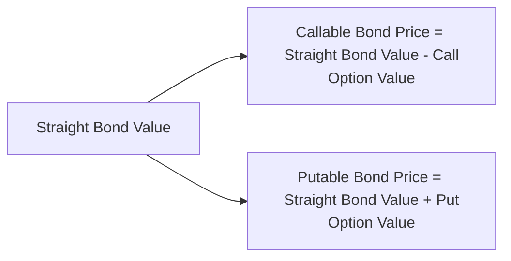

## Introduction and Key Considerations

Let’s be honest: when I first encountered bonds with embedded options, I remember thinking, “Um… how do we wrap our heads around the option part of something that’s already kind of complicated?” But then I realized that the entire process becomes way clearer once we break it down step by step. Callable and putable bonds are basically just regular bonds with a twist—the twist being that either the issuer (call option) or the bondholder (put option) has the right to exercise an option under certain conditions.

In this section, we’ll explore a practice vignette approach, mirroring what you’ll see on the CFA® Level II exam. We’ll look at a multi-paragraph scenario with data, identify the relevant embedded option features, and attribute any bond price changes to the call or put option’s value. We’ll also consider how interest rate volatility influences those embedded option values. By the end, you should be able to handle—and maybe even enjoy—these sorts of questions under exam constraints.

## Embedded Options and Vignette-Style Questioning

Before diving into the practice scenario, let’s recall from earlier sections (e.g., 10.1 Introduction to Callable and Putable Bonds) that:

• A callable bond grants the issuer the right to redeem the bond before maturity, typically when interest rates have dropped enough to make reissuance at a lower rate attractive.  
• A putable bond gives the holder the right to sell the bond back to the issuer, often triggered when market rates increase or the credit environment deteriorates.

The CFA® Level II exam’s vignette format generally presents a scenario with details on coupon rates, maturity, call/put dates, call/put prices, and occasionally historical or implied volatility. The question then is: how does all of this data change the bond’s fair value, yield, or spread compared to an otherwise similar bond without an embedded option?

## Recognizing Option Value in Bond Pricing

To see the option’s impact clearly, separate the bond’s price into two components:

• The “straight bond,” valued just like a plain-vanilla fixed coupon bond with no embedded features.  
• The option value itself, which either reduces the total price in the case of a call (because it’s a benefit to the issuer) or increases the total price in the case of a put (because it’s a benefit to the bondholder).

From a purely “formulaic” perspective, we often say:

• Callable Bond Price = Straight Bond Value – Call Option Value  
• Putable Bond Price = Straight Bond Value + Put Option Value  

Here’s a simple mermaid diagram showing this decomposition:

The call option reduces what investors will pay for the bond because, at times, their upside is capped (the issuer can call the bond away if rates become favorable). Conversely, a put option boosts the bond’s price because investors gain downside protection (they can put the bond back if rates spike, or credit conditions worsen).

## Setting the Stage: A Hypothetical Scenario

Imagine a vignette describing Thompson Industries, a mid-sized technology firm, which issues a 4.5% semiannual coupon, 10-year callable bond. Let’s say the bond is callable in 3 years at par (100% of face value). The scenario outlines the following data:

• Current yield curve:  
  – 1-year spot rate: 3.0%  
  – 3-year spot rate: 3.5%  
  – 5-year spot rate: 4.0%  
  – 10-year spot rate: 4.30%  

• Implied volatility assumptions for interest rates: 15% (annualized).  
• The bond has an outstanding principal of $1,000 per bond, with a price quoted at 101.25% of par.  
• Market participants are discussing whether volatility might move from 15% to 25% over the next few months.  

In a typical question set, the item might say:

– Using the current volatility assumption of 15%, compute the bond’s fair value with the embedded call.  
– Then revalue the bond if volatility rises to 25%.  
– Explain why the price changes and by how much the call option’s value shifts.

Understanding exactly how to do these calculations involves building or using a model similar to the ones you encountered in binomial tree frameworks (Chapter 8) or Monte Carlo simulation (Chapter 9). Anyway, let’s outline the typical steps.

## Step-by-Step: Approach to Vignette Analysis

### Step 1: Read the Scenario Carefully

Highlight anything that matters for the bond’s pricing. Pay special attention to:

• Maturity, coupon, and par value.  
• The call or put schedule (date, price, any lockouts).  
• The volatility assumption, which will influence the option’s value.  
• Current yield curve or implied forward rate structure.

### Step 2: Calculate the “Straight Bond” Value

Ignoring any embedded options, we discount the bond’s coupon payments and principal redemption at the appropriate spot rates. In practice, that might be something like:

• Each coupon = 4.5% of face value annually, or 2.25% per semiannual period if we’re dealing with two periods per year.  
• If we discount those cash flows using current market yields or the spot curve up to final maturity, we get the baseline price.  

You can do this with standard present value sum-of-cash-flows. Or you can rely on a binomial or Monte Carlo approach, ensuring no call or put is exercised in the model. This straight bond value is your foundation.

### Step 3: Incorporate the Embedded Option into the Valuation

Now the fun begins. With a call option (issuer’s perspective), you typically do a backward induction approach in a binomial model, checking at each node whether the issuer would call the bond or let it ride. The probability of calling depends on whether redeeming at par is cheaper than remaining outstanding based on the model’s forward rates and coupon obligations. Meanwhile, with a put option (investor’s perspective), you check if “putting” the bond at a specified price yields a better payoff than holding it.

Volatility is crucial. Higher volatility, everything else the same, typically boosts the value of an option. For a callable bond:

• The higher the volatility, the greater the potential for rates to drop significantly, which increases the issuer’s potential gain from calling. Hence, the call option’s value goes up, and the overall bond price goes down.

For a putable bond:

• The higher the volatility, the more valuable that put is to the bondholder, as there’s a bigger chance that rates and spreads might spike, prompting a profitable exercise of the put. So the bond’s overall value goes up.

### Step 4: Interpret the Results

After recalculating with the changed interest rate or volatility scenario, note:

• How the total bond price changed.  
• How much of that was due to the change in the option’s value (call or put).  
• Whether this makes it more likely or less likely that the option will be exercised.

You’ll often be asked to compare yields as well. For instance, a callable bond typically has a higher yield compared to a straight bond with identical maturity and credit quality. Why? Because investors are compensated for the possibility that their bond will be called away if interest rates drop. Conversely, a putable bond typically has a lower yield. Investors accept a lower yield because they have the beneficial put feature.

## Practical Example: Revaluation Under Volatility Shift

Let’s go through a miniature example to illustrate. We’ll keep the numbers small to make the concept clearer.

### Baseline Data

• Face Value = $1,000  
• Annual Coupon = 5% (paid semiannually at 2.5% each half-year)  
• Maturity = 5 years (ten semiannual periods)  
• Bond is callable in 2 years at par ($1,000).  
• Current yield curve suggests a flat yield of 4% annualized for discounting (2% semiannual).  
• Volatility = 15%.  

First, we compute the value of the bond if it did NOT have a call feature. The approximate price of a straight 5-year note with a 5% coupon in a 4% yield environment would be around:

PV of Coupon Annually = (50 / 0.04) * [some present value factor], or more precisely discounted by 2% per semiannual period. Let’s do a straightforward approximate approach (assuming a simple yield approach) just for illustration:

• The present value of an annuity of 25 (i.e., 2.5% * 1000 face value) for 10 periods at 2% discount = 25 × PVIFA(2%, 10).  
• The sum of coupon PV plus redemption of 1,000 face at the end of 10 periods, discounted at the same 2%.

Let’s say that’s about $1,040 as the “straight bond” estimate. Now we incorporate the call option. With a call at par in 2 years, what’s that worth to the issuer? A simplistic approach might be:

• The more likely rates will fall below 4%, the more valuable that call is. The bond might get “taken away” from you at $1,000.  
• Perhaps the call option is currently worth around $20, given a 15% volatility. So the callable bond might be priced at $1,020.

If volatility spikes to 25%, well, the call option value might jump to $30, because the issuer now sees an even greater chance to refinance. So the new bond price might drop to $1,010 ($1,040 – $30). If you’re asked in the vignette, “Hey, why did the price drop from $1,020 to $1,010?” you’d point out that the extra volatility increased the call option value by $10 (from $20 to $30), lowering the overall bond price.

## Best Practices in Answering Exam-Style Vignettes

• Double-check the call (or put) schedule. Candidates sometimes ignore the date or redemption price details, which are crucial to the outcome.  
• Be mindful of whether the bond is a European-style call (exercisable only on specific dates) or is continuously callable after a certain date. This changes the modeling.  
• Don’t mix up “option cost” from the issuer’s perspective with “option value” to the investor. For a callable bond, that option has negative value to the investor but has positive value to the issuer.  
• Cite the steps you used to decompose the bond’s price so you can clearly attribute differences in bond price to differences in the embedded option.  
• Pay attention to yield measures (Yield to Call vs. Yield to Maturity) in the question. Sometimes the vignette specifically wants to see if you can identify which yield measure is more relevant, especially if the bond is likely to be called.  

## Table: Spotting Option Value Differences at a Glance

Below is a quick table showing how changes in interest rates and volatility can affect a callable or putable bond’s overall price. The baseline assumption is that everything else—credit quality, liquidity, maturity—remains the same.

| Factor Change                     | Callable Bond Impact                      | Putable Bond Impact                       |
|----------------------------------|-------------------------------------------|-------------------------------------------|
| Interest Rates Decrease          | Bond price may not increase as much       | Bond price likely rises, put option is less relevant because you wouldn’t typically exercise a put if the bond becomes more valuable |
| Interest Rates Increase          | Bond price may drop, call option less relevant to issuer | Bond price is protected somewhat, put option gains value and partially offsets price drop |
| Volatility Increases             | Call option value rises, lowering bond price | Put option value rises, increasing bond price |
| Volatility Decreases             | Call option value decreases, bond price rises | Put option value decreases, bond price drops |

The key is to see how each factor changes the weight of that embedded option in the total bond valuation.

## Common Pitfalls to Avoid

• Ignoring the effect of volatility: A lot of times, you might see interest rate changes overshadow everything else, but the examiners love testing whether you recall that volatility directly affects option values.  
• Mixing up call and put vantage points: A call is an advantage for the issuer, a put is an advantage for the investor. Don’t confuse which side benefits when rates or volatility shift.  
• Failing to connect yield vs. price changes: If you see that a callable bond is trading at a certain yield relative to a straight bond, understand that the difference in yield (the spread) often reflects the negative convexity that a callable bond experiences.  

## Brief Personal Reflection

I vividly recall messing up my first “callable vs. straight bond comparison” question because I forgot to factor in the call schedule properly. I basically tried to do a neat discounting of cash flows out to maturity without even checking that the issuer might call that bond in year 3. Lesson learned: read carefully. So on the actual exam, slow down, read the entire item set, and parse out the crucial data.

## Exam Tips

• Manage your time: Don’t let the quantitative parts overshadow the explanation. The item set might want a numerical answer plus a rationale.  
• Show your work: Even though it’s multiple-choice, you may need partial calculations (especially in practice and in written notes).  
• Remember the difference between price decomposition and option decomposition. They’re essentially the same concept, but watch the direction of how you subtract or add the option premium.  
• If you see references to volatility in a question on embedded options, expect to discuss or compute how the option component of the bond value changes.

## References for Further Exploration

- CFA Institute, “Item Set Practice: Fixed Income,” CFA® Program Curriculum.  
- Tuckman, Bruce. Fixed Income Securities: Tools for Today’s Markets.  
- Fabozzi, Frank J. Bond Markets, Analysis, and Strategies.  

These resources dig deeper into the quantitative modeling behind embedded-option valuation, scenario analysis, and how to properly interpret changes in bond prices due to interest rate movements and volatility shifts.

## Engage Your Understanding: Identifying Option Value in Bonds



### A callable bond typically trades at:

- [ ] A higher price compared to an identical straight bond.
- [ ] The same price as an identical straight bond.
- [x] A lower price compared to an identical straight bond.
- [ ] An indeterminable price without referencing creditworthiness.

> **Explanation:** The embedded call feature is advantageous to the issuer; hence, investors pay less (i.e., a lower price) for callable bonds compared to otherwise identical straight bonds.

### When interest rate volatility increases, which of the following is generally true for a callable bond?

- [ ] The call option value falls, raising the bond’s overall price.
- [x] The call option value rises, lowering the bond’s overall price.
- [ ] The call option value remains unchanged.
- [ ] The call option value decreases; correlation with volatility is inverse.

> **Explanation:** Higher volatility increases the value of an option. For a callable bond, that added option value belongs to the issuer and reduces the investment value for the bondholder.

### A putable bond has a lower yield relative to an otherwise identical straight bond primarily because:

- [x] The bondholder has additional protection that increases its price.
- [ ] It carries higher default risk.
- [ ] The issuer compensates investors for bearing extra volatility.
- [ ] It has a delayed coupon payment feature.

> **Explanation:** A putable bond’s holder can exercise the put to mitigate risk if interest rates rise or the issuer’s credit quality deteriorates, so the bond trades at a higher price (and hence lower yield).

### In a binomial model for valuing a callable bond, the decision to call at each node depends on:

- [ ] Whether the coupon rate surpasses the risk-free rate.
- [ ] The length of time to maturity alone.
- [x] Comparing the bond’s holding value at that node to the call price (par).
- [ ] The issuer’s stock price in the equity market.

> **Explanation:** In a binomial interest rate tree, at each node you compare the bond’s price if it continues to exist with the benefit of calling it at par. The issuer will call whenever it’s economically beneficial.

### If a bond can be called at 100% of par in two years, and you observe in the model that the bond’s value in two years is projected at 104, the issuer will most likely:

- [x] Call the bond at 100, retiring it early.
- [ ] Let the bond continue because coupon payments are beneficial to investors.
- [x] Potentially call the bond at a premium above 104.
- [ ] Avoid calling the bond, as it inconveniences investors.

> **Explanation:** The issuer calls the bond if it’s cheaper to do so and refinancing at lower rates is possible. In practice, if the bond’s market price is 104, a call at par (100) is advantageous for the issuer. (Note: A second correct answer refers to a premium above 104 only if the call schedule explicitly states a premium call price. Some questions have multiple correct answers if indicated, but be sure to check the scenario details.)

### When analyzing the implied volatility in a bond’s embedded call, a jump from 15% to 25% typically:

- [x] Increases the call option’s value and lowers the overall bond price.
- [ ] Increases the call option’s value and raises the overall bond price.
- [ ] Leaves the bond price unchanged unless interest rates also rise.
- [ ] Reduces the call option’s value significantly.

> **Explanation:** The call option becomes more valuable as volatility increases. This is beneficial to the issuer but detrimental to bondholders, causing the bond’s price to drop.

### Which best describes the difference in yield between a callable bond and a putable bond, assuming identical credit risk, maturity, and coupon structure?

- [x] Callable bonds usually need to offer a higher yield; putable bonds usually have a lower yield.
- [ ] Both callable and putable bonds generally carry higher yields than straight bonds.
- [x] Putable bonds typically come with a yield premium over straight bonds; callable bonds have yield discounts.
- [ ] There is no established relationship in yields among these structures.

> **Explanation:** Because a callable bond’s embedded option favors the issuer, the investor expects a higher yield. A putable bond’s embedded option benefits the holder, so it often carries a lower yield than a comparable straight bond.

### A key difference between a bond’s value if interest rates decrease significantly and the actual market price of a callable bond is often attributed to:

- [x] The negative convexity introduced by the call option.
- [ ] A mismatch in coupon payment frequency.
- [ ] Sovereign risk premium.
- [ ] The bondholder’s inability to sell the bond.

> **Explanation:** Callable bonds exhibit negative convexity when rates fall. Instead of price shooting up, it’s restrained because of the higher likelihood of the bond being called away by the issuer.

### Suppose you have a 5-year callable bond priced at 102 when volatility is 20%. After recalibrating the model for a 25% volatility, the price drops to 101.50. The most likely explanation is:

- [x] The call option value has increased, reducing the bond’s price.
- [ ] The coupon rate has changed, causing pricing uncertainty.
- [ ] The bond’s maturity has extended, hence a lower price.
- [ ] The yield curve flattened, though that typically increases bond prices.

> **Explanation:** When you raise volatility in a valuation model, the embedded call option’s value goes up, making the issuer’s right to call more attractive and thus lowering the bond’s price.

### A true statement about callable and putable bonds is:

- [x] Callable bonds generally trade at higher yields than putable bonds.
- [ ] Callable bonds price in positive convexity at low interest rates.
- [ ] Putable bonds limit an investor’s upside if yields drop.
- [ ] Both callable and putable bonds are unaffected by changes in volatility.

> **Explanation:** Because the issuer possesses the call right, investors usually demand a higher yield in callable bonds. Meanwhile, putable bonds confer a right to the bondholder, so their yields are typically lower.


