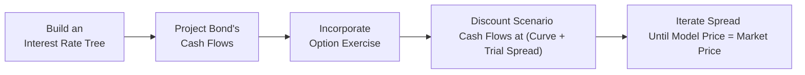

## Introduction

Let’s be honest: when I first heard about Option-Adjusted Spread (OAS), it sounded like just another fancy acronym in the world of fixed income. I remember sitting in a small study group, half of us nodding politely while rummaging through formula sheets, trying to piece together how a “spread” could be "option-adjusted." But once I dug into it, I realized OAS is simply one of the most practical ways to compare bonds that carry embedded options—like callable or putable bonds—to standard (option-free) bonds. And that’s a big deal, especially for those of us studying for the CFA® Level II exam where scenario-based bond valuation and comparing different yield measures are crucial skills.

In this section, we’ll unravel the concept of OAS step by step. We’ll see how it differs from other spread measures (nominal spread, Z-spread), understand what computations go into deriving an OAS, peek at a simplified example of the binomial model approach, and highlight best practices and pitfalls. Finally, we’ll tie it all together with how you’ll encounter OAS in real-world portfolio management and in the Level II exam context.

## Why OAS Matters

When you hold a bond that has an embedded option, such as a call or a put, the bond’s expected cash flows can change depending on future interest rate scenarios. An issuer can call the bond away if rates drop significantly (to refinance at lower rates), or an investor can put the bond back to the issuer if rates climb (to reinvest at higher yields). This optionality clearly impacts the bond’s price—and your overall yield.

So, how do you compare these embedded-option bonds to “regular” (plain vanilla) bonds? Enter OAS. By stripping out the cost (or value) of the embedded option, OAS reveals the true yield spread over a benchmark (like a Treasury curve) that is attributable purely to the bond’s credit and liquidity risk, not to the presence of embedded optionality. This helps you decide if a callable or putable issue is cheap, fairly priced, or expensive relative to other bonds with similar risks.

## Key Concepts: OAS vs. Nominal Spread vs. Z-Spread

Before we dive into the computations, let’s clarify the main spread concepts:

• Nominal Spread: The most basic measure. It’s the spread between a bond’s yield and a single-point benchmark yield (e.g., the yield of a Treasury with a similar maturity). Because it’s a direct yield difference at one maturity point, it doesn’t incorporate the entire term structure of rates or the time-varying nature of optionality.

• Z-Spread (Zero-Volatility Spread): This is a constant spread that, when added to the entire Treasury spot rate curve, discounts the bond’s *anticipated* cash flows to arrive at the current market price. The Z-spread accounts for the full term structure but does not adjust for the option risk. As a result, for a callable bond, the Z-spread often overstates the effective spread that an investor actually earns, because part of that spread compensates for potentially unfavorable call outcomes.

• Option-Adjusted Spread (OAS): This measure goes a step further by factoring in the bond’s possible cash flow variations due to the embedded option. In effect, it’s the Z-spread minus the cost (or plus the value) of the option. If you think show-and-tell style: first we show the underlying yield curve, we add a spread to it, we incorporate the possibility of calls or puts under different interest rate scenarios, and we find the constant spread that prices the bond exactly at its market price. That final puzzle piece is the OAS.

## Steps to Compute OAS

While OAS calculations can be performed using either binomial trees, trinomial trees, or Monte Carlo simulations, the process is broadly consistent across methods. Below is a high-level flowchart illustrating the steps:

1. Build an Interest Rate Tree or a distribution of forward rates that align with the current yield curve and volatility assumptions (because if you’re valuing an option, volatility matters!).
2. Project the bond’s cash flows in each node or path of the model. For a callable bond, the issuer may redeem early if it’s advantageous. For a putable bond, the investor may exercise the put under certain rate conditions.
3. Incorporate the option exercise conditions. Determine which scenarios result in the bond being called or put. This alters future cash flows.
4. Discount these (potentially altered) cash flows back to the present, using a trial spread plus the underlying forward or spot rates.
5. Keep adjusting (iterating) that trial spread until the model price matches the actual market price of the bond. The trial spread that achieves that equality is the OAS.

## The Math Behind the Scenes

Let’s say you have a set of possible future rates r(t), with t indexing time across the tree or simulation paths. You assume a constant spread s across all future discount rates. The price P of the bond, given this spread s, is typically expressed as:


P(s) = \sum_{i=1}^{N} \Bigl( \text{Expected Scenario CF}_i \times \prod_{t=1}^{i} \frac{1}{1 + r(t) + s} \Bigr).


Here, “Expected Scenario CFᵢ” means the bond’s projected cash flow (including principal redemption or coupon plus principal if exercised) under scenario i. The factor \\(\prod_{t=1}^{i} \frac{1}{1 + r(t) + s}\\) discounts that future value back to present using the path-specific forward rates r(t) plus s. By definition, the OAS is found when:


P(\text{OAS}) = \text{Market Price}.


So the process looks a bit like guess-and-check (often done via specialized software). You start with a trial spread, compute the price, compare that price to the bond’s actual price. If it’s higher, you might reduce the spread a bit. If it’s lower, you might bump the spread up. Eventually, you hone in on the OAS that reconciles the two.

## Simple Binomial Tree Example

Let’s do a quick, highly simplified example. Suppose you have a 2-year annual-pay callable bond with:

• Face Value: $1,000.  
• Annual Coupon: 5%.  
• Currently trading at par ($1,000).  
• The bond is callable at $1,025 at the end of Year 1.  
• The current 1-year yield is 4%, and you expect that in one year, the yield can either go up to 6% or down to 3%. Assume a similar movement for the second year.  
• Let’s assume the bond is not called at the end of Year 2 (it simply matures).  

At the end of Year 1, if rates go down (to 3%), calling the bond might be beneficial for the issuer because it can refinance at a lower rate. Let’s see the possible cash flows:

• If the bond is called at the end of Year 1, the investor receives $1,025 + $50 coupon = $1,075.  
• If not called, the bond continues into Year 2, paying a $50 coupon in Year 1 and Year 2, plus $1,000 par at the end of Year 2—unless the Year 2 rates also induce a call scenario (for simplicity, we’ll ignore call beyond Year 1 in this example).  

We then discount these potential flows back to the present using a binomial interest rate tree that includes a guess for the spread. We keep adjusting the spread until the model price is $1,000 (the actual bond price). That final spread is your OAS. Yes, the real market has daily changes, complexity, more nuanced call provisions, but the principle remains the same.

## Interpreting OAS for Callable vs. Putable Bonds

• Callable Bonds: Because the call option tends to favor the issuer, the investor effectively “lends” an option to the issuer. This typically lowers the bond’s OAS relative to a non-callable bond with the same coupon and maturity—once that option cost is stripped out, the net compensation to the investor is less.  
• Putable Bonds: Here, the investor holds the valuable option. This typically boosts the bond’s price or lowers the yield. Once you remove that option’s effect, the underlying OAS can be higher compared to a plain vanilla bond, reflecting the investor’s option advantage.

In short, the embedded option’s presence can muddy the waters when comparing yields. OAS is what clarifies them.

## Practical Considerations and Common Pitfalls

• Volatility Assumptions: Option valuation is highly sensitive to volatility. If you assume a higher interest rate volatility, the call or put option becomes more likely to get exercised (or at least more valuable), which meaningfully impacts OAS. Keep an eye on how the exam vignette calibrates volatility or references implied vol.  
• Model Precision vs. Overfitting: Some exam items might trick you by presenting an overly simplistic approach or by providing partial information about call/put schedules or partial volatility data. Know that in reality, you need comprehensive data for precise OAS.  
• Benchmark Curve Selection: Are you using Treasury yields, swap rates, or something else as your base curve? The OAS will differ based on the benchmark’s reference rates.  
• Embedded Option Schedules: A bond might be callable on multiple dates at different prices. Each date and price can alter expected cash flows and is crucial to incorporate in the analysis.  
• Negative Convexity: Callable bonds often exhibit negative convexity when interest rates fall. Watch out for how negative convexity interacts with your OAS analysis, especially in the face of swiftly declining yields.

## Real-World Applications

Portfolio managers frequently compare OAS among callable or putable bonds to decide if they’re getting enough compensation for the embedded options. They might say, “Bond A has an OAS of 50 bps, but Bond B has an OAS of 70 bps for similar credit quality,” and guess which one looks more attractive? Typically, the one with the higher OAS. Of course, they’ll also weigh credit risk, liquidity considerations, sector outlook, and so forth. 

Moreover, if you anticipate rate volatility to be higher than the market is currently implying, you might reevaluate how “cheap” or “rich” a bond’s OAS is. Maybe that callable bond is underpriced if you think the issuer is less likely to call it than the market’s implying under a lower-vol volatility assumption. All these angles come into play in real-world bond selection and trading strategies.

## Exam Tips

1. Always note the type of yield curve in your vignette. Are they giving you a spot curve? A par yield curve? This matters for your discounting process.  
2. Pay attention to references to volatility or any mention of “one-sided duration.” This is a clue that optionality is significant to the problem.  
3. Check call schedules or put schedules carefully—dates, strike prices, premium amounts. They might drastically alter the bond’s average life.  
4. Know your spread definitions cold: nominal < Z-spread < OAS for a callable bond. The OAS is typically less than the Z-spread for a callable bond because the difference is the call option cost.  
5. Time management: In a typical CFA exam item set, you might have six multiple-choice questions after a one-page vignette. Appropriately budget your time to parse call options or put options details.  

## Conclusion

OAS is like the ultimate normalizer—it strips out the optionality from the yield so you can compare apples to apples across the bond market. Whether you’re tackling a callable corporate issue or analyzing a putable municipal bond, OAS is your go-to measure for capturing just the spread you’re earning over a reference curve, removing the distracting swirl of optionality. 

Sure, it takes a bit of grunt work (or software muscle) to build and calibrate an interest rate tree and iterate to find that magic spread. But once you wrap your head around it, it’s a powerful tool for any Level II candidate’s kit. And beyond the exam, you’ll find it invaluable for real portfolio management decisions.

## References and Further Reading

• CFA Institute Level II Program Curriculum, “Valuation of Bonds with Embedded Options.”  
• Fabozzi, Frank J. “Fixed Income Analysis.” CFA Institute Investment Series.  
• Tuckman, Bruce, and Angel Serrat. “Fixed Income Securities: Tools for Today’s Markets.”  

These sources provide in-depth discussions of binomial and Monte Carlo models, essential for mastering OAS concepts.

## Practice Questions: Mastering OAS Computation



### A Callable Bond’s OAS
- [ ] Is typically higher than its Z-spread because of issuer benefits.
- [ ] Is typically higher than its nominal spread for the same maturity.
- [x] Is typically lower than its Z-spread because the call option reduces the bond’s value to the investor.
- [ ] Has no relationship to volatility assumptions.

> **Explanation:** For callable bonds, the call option benefits the issuer. This reduces the investor’s spread relative to a Z-spread calculation where no optionality adjustment is made. Hence, OAS < Z-spread for a callable bond.

### Comparing Nominal Spread vs. OAS
- [x] Nominal spread does not use a full spot rate curve, whereas OAS incorporates the entire interest rate term structure plus embedded option effects.
- [ ] OAS is always higher than the nominal spread.
- [ ] Nominal spread is typically used in binomial tree valuation.
- [ ] OAS and nominal spread converge as volatility goes to zero.

> **Explanation:** The nominal spread simply measures the difference between the bond’s yield and a single benchmark yield. OAS uses the full term structure (spot or forward rates) and also accounts for how the embedded option changes cash flows.

### Significance of Volatility in OAS Calculation
- [ ] Volatility has no effect on OAS.
- [ ] Higher volatility always reduces OAS.
- [ ] Lower volatility always increases OAS.
- [x] Volatility assumptions affect the likelihood and value of the embedded option, influencing the OAS.

> **Explanation:** OAS is sensitive to how often and under what interest rate conditions the option is exercised. Changing volatility changes the probability distribution of future rates, thus affecting option exercise decisions and resulting spreads.

### Building the Interest Rate Tree
- [x] It must be consistent with the current yield curve and volatility estimates.
- [ ] You only need a single forward rate assumption to build a binomial tree.
- [ ] A binomial tree for OAS calculations does not require volatility inputs.
- [ ] The tree uses nominal yields only, ignoring spot rates.

> **Explanation:** Constructing the tree involves working with the current term structure and an assumed volatility measure that drives the up and down movements in interest rates for each period.

### OAS Computation Techniques
- [x] Can be done with a binomial tree or Monte Carlo simulation.
- [ ] Uses only historical interest rate data, disregarding current market forward rates.
- [x] Involves iterative methods to match the model price with the bond’s market price.
- [ ] Can be solved in a single step without iteration.

> **Explanation:** OAS valuation requires projecting cash flows under multiple scenarios (via binomial trees or Monte Carlo) and iterating the spread until the price matches market observations.

### Callable vs. Putable Bonds
- [ ] Both callable and putable bonds have the same OAS for the same coupon.
- [x] Callable bonds generally have lower OAS because the option favors the issuer.
- [ ] Putable bonds generally have lower OAS because the option favors the investor.
- [ ] OAS is never used to compare callable and putable bonds.

> **Explanation:** Callable bonds typically have a lower OAS compared to an otherwise similar plain vanilla bond, while a putable bond might offer a higher OAS once the investor-favorable option is stripped out.

### Z-Spread vs. OAS
- [x] For callable bonds, the Z-spread minus the option cost is the OAS.
- [ ] For callable bonds, the Z-spread plus the option cost is the OAS.
- [ ] The Z-spread is always equal to the OAS, regardless of embedded options.
- [x] The difference between the Z-spread and OAS represents the value of the embedded option.

> **Explanation:** The Z-spread does not remove the effect of the option, whereas the OAS does. Subtracting the option cost effectively gets you from the Z-spread to the OAS for callable bonds.

### Common Pitfalls in OAS Analysis
- [x] Ignoring call schedules and missing possible early redemption dates.
- [ ] Using Monte Carlo simulation automatically ensures no modeling error.
- [ ] Assuming volatility has no impact on option exercises.
- [x] Improper discounting of scenario cash flows along each path in the tree.

> **Explanation:** Realistic OAS analysis must incorporate all aspects of the embedded option, including call/put dates and proper discounting under different rate scenarios. Volatility and correct tree-based or path-based valuation are essential.

### Real-World OAS Applications
- [x] Used by portfolio managers to compare bonds with similar maturities and credit ratings.
- [ ] Indicates the bond’s probability of default under adverse rate scenarios.
- [x] Helps identify mispriced embedded-option bonds relative to market benchmarks.
- [ ] Eliminates the need to consider credit spreads altogether.

> **Explanation:** OAS is especially valuable for relative-value analysis: portfolio managers seek out bonds with higher OAS for similar credit quality. However, OAS doesn’t tell you everything about default probabilities (you’d also look at credit risk metrics and spreads).

### True or False: OAS Eliminates the Embedded Option's Impact on Spreads
- [x] True
- [ ] False

> **Explanation:** By design, the OAS is the spread that remains after you remove the contribution of the embedded option. This is crucial for making “apples-to-apples” comparisons with non-option bonds.


