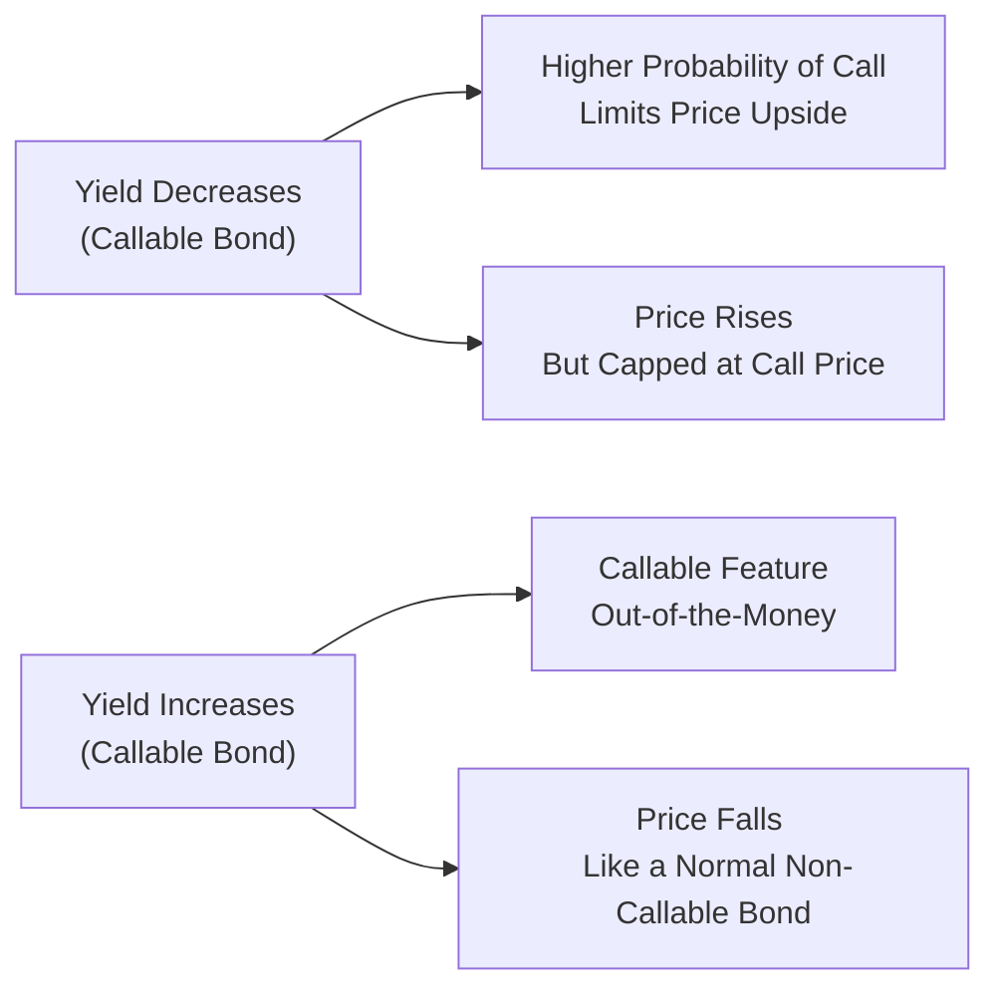
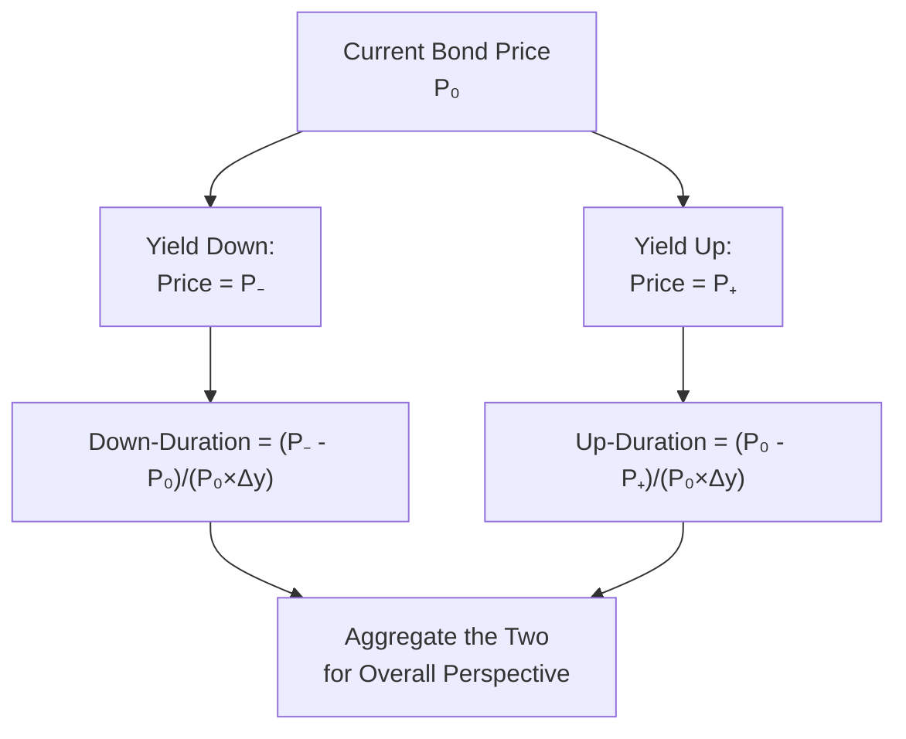

## Introduction and Context

So you're analyzing a callable bond, and you think you've got its risk profile all sorted out. Then you realize something’s off: your standard duration measure (be it Macaulay duration or modified duration) blinks a big error signal when it comes to embedded options. Callable and putable bonds have that tricky feature: their cash flows can change if interest rates shift enough to trigger a call or put. Then you start hearing about “effective duration” or “option-adjusted duration,” and maybe someone mentions “one-sided durations.” It can be confusing, even frustrating. But this is where we get to dive into how professionals accurately measure the true interest rate risk of bonds that have potential early redemption features.

In this section, we’ll walk through effective duration step by step—why it’s helpful, how to calculate it, and where the usual pitfalls hide. We’ll also explore the concept of one-sided durations, which measure a bond’s sensitivity to upward and downward rate moves separately. This is absolutely crucial for embedded-option bonds because their price dynamics are decidedly asymmetric. Along the way, we’ll sprinkle in real-world examples, share a bit of anecdotal wisdom, and outline some best practices for both exam success and professional application.

## Why Traditional Duration Falls Short

Maybe you've already used that old formula for Macaulay or modified duration, which basically tells you how sensitive a bond’s price is to small parallel shifts in yields—assuming fixed cash flows. But when a bond can be called away (or put back to the issuer), the timing and size of future coupon and principal payments can change as rates move. If interest rates drop, a callable bond might be redeemed early; if rates rise, a putable bond might be handed back by investors. That means the bond’s risk profile morphs depending on the path of rates.

Traditional duration measures ignore that possibility. They assume the same cash flows no matter what, and that’s simply not correct for embedded-option securities. This is where effective duration muscled its way into the conversation. Effective duration tries to factor in all those scenario-based changes in a bond’s projected cash flows. In other words, it was designed to handle the call or put features head-on, giving you a more realistic gauge of the bond’s price volatility.

## Effective Duration: A Closer Look

At its core, effective duration reflects your bond’s sensitivity to small, parallel yield curve shifts while capturing the effect of potential changes in cash flows due to embedded options. These days, many market participants rely on effective duration for anything other than the simplest, plain vanilla bonds. 

How does it work? In short:

1. You assume a small upward shift in the yield curve (Δy).  
2. You assume a small downward shift in the yield curve (also Δy but in the opposite direction).  
3. You revalue the bond under each scenario, factoring in if that shift triggers the call or put.  
4. You combine those new bond values to get a measure of how the price changes per 1% change in yield.

In formula form, it’s typically presented like this:


\text{Effective Duration} \approx \frac{P_{-} - P_{+}}{2 \times P_0 \times \Delta y}


• P₀ = current bond price (initial)  
• P₋ = bond price if yields go down by Δy (accounting for possible exercise of the call/put)  
• P₊ = bond price if yields go up by Δy  
• Δy = the change in yield (in decimal form, e.g., 0.01 for 1%)  

Notice that everything is in approximate terms. We treat the up and down moves as symmetrical shifts in yield and measure the difference in price. But for many bonds, especially those with an early redemption feature, P₋ and P₊ might differ from what you’d get applying a simple formula for a fixed-cash-flow bond. The embedded option can drastically alter the shape of the final payoff.

## Step-by-Step Calculation

Let’s get more granular:

• Step 1: Identify Bond Characteristics  
  Think of the coupon rate, maturity, issue date, call or put schedule, and any other embedded features. The more comprehensive your data, the better you can project cash flows under different yield scenarios.

• Step 2: Pick the Yield Shift (Δy)  
  Typically, analysts choose something like ±25 bps or ±50 bps, though for exam and illustration, ±100 bps is common. The main requirement is that it’s small enough to approximate “infinitesimal” changes while large enough to capture a realistic scenario.

• Step 3: Value the Bond at +Δy  
   1. Shift the yield curve up by Δy.  
   2. Re-calculate the bond’s cash flows, checking whether the call or put would be in the money. If it makes sense for the issuer to call the bond at that scenario, assume the bond is redeemed. If it makes sense for the holder to put the bond, assume that scenario.  
   3. Discount the resulting cash flow stream to obtain P₊.

• Step 4: Value the Bond at −Δy  
   1. Shift the yield curve down by Δy.  
   2. Re-check the call/put logic. The downshift might now strongly favor the issuer calling a callable bond, for instance.  
   3. Discount the relevant cash flow stream to get P₋.

• Step 5: Plug Values into the Formula  
  Use the effective duration formula to approximate how sensitive the bond is to interest rate changes.  

Ultimately, this yields a single measure for your bond, capturing those changing cash flows from the embedded option. That measure is usually referred to as the bond’s “effective duration” or “option-adjusted duration.”

## One-Sided Durations: Why Go the Extra Step?

Sometimes, a single measure of sensitivity (like effective duration) is not enough. Picture a callable bond. When interest rates fall, the issuer is more likely to call the bond, so your upside price rally is capped. But if rates rise, the same bond doesn’t have a symmetrical response—there’s no penalty for the issuer if the bond price declines. This asymmetry leads investors to look at “one-sided durations,” or “up-duration” and “down-duration.”

• When Rates Go Up (Up-Duration)  
  The price of a callable bond may tumble more significantly because the call option is typically irrelevant if rates increase. The call probability is basically zero at that point, so your bond’s price is free to decline as a normal bond would (ignoring the credit risk aspect).  

• When Rates Go Down (Down-Duration)  
  That same callable bond’s price won’t necessarily increase by the same magnitude, because once rates drop below the coupon, the issuer has an incentive to call. So the bond’s value doesn’t appreciate much beyond its call price.

For a putable bond, the shoe is on the other foot. The investor can put the bond back when rates rise, limiting the price drop, so the up-duration is smaller in absolute magnitude than the down-duration.

This phenomenon is central in advanced bond risk management. If you rely strictly on a single measure (effective duration) to model your risk, you might be ignoring a big chunk of the real-life picture.

## Relationship to Negative Convexity

You might hear about negative convexity in the context of callable bonds. Effective duration and one-sided durations are intimately connected to the shape of the price-yield curve. A callable bond often exhibits negative convexity once yields fall below a certain threshold: that means the bond price doesn’t rise as much, relative to a bond without a call. In that region, your down-duration is smaller than your up-duration because the call has effectively truncated the upside price potential. Understanding this dynamic is crucial.  

If you prefer a visual, let’s try a simple Mermaid diagram to illustrate how the price-yield relationship changes with embedded options:

In this diagram, note how the callable bond’s price is effectively “stuck” once yield dips enough to make the call feature relevant. That capping effect is a hallmark of negative convexity.

## Putting It into a Quick Example

Imagine a 5-year bond with a coupon of 5%, callable at par (100) any time after year 2. Let’s do a small illustration (purely hypothetical numbers):

• Current yield is 5%. Bond price is 100.  
• If yield goes down to 4% (Δy = 1%), the issuer is tempted to call. Let's say the new price is 101, because everyone assumes the issuer might call soon. (It’s not rising much above 100, because it only has limited upside if the bond is going to be redeemed at par.)  
• If yield goes up to 6% (Δy = 1% in the other direction), the bond’s value might fall to, say, 94.  

Hence, P₀ = 100, P₋ = 101, P₊ = 94, and Δy = 0.01. Plugging into the formula:

Effective Duration  
= (101 – 94) / (2 × 100 × 0.01)  
= 7 / 2  
= 3.5  

So this bond has an effective duration of 3.5. But if you do the math for one-sided durations:

• Down-Duration = (101 – 100) / (100 × 0.01) = 1 / 1 = 1.0  
• Up-Duration = (100 – 94) / (100 × 0.01) = 6 / 1 = 6.0  

Now that’s stark. When rates fall by 100 bps, the bond only picks up about 1% in price, so the duration with respect to downward moves is around 1.0. Meanwhile, if rates rise by 100 bps, the bond loses about 6% in price, so the up-duration is 6.0. This huge asymmetry is precisely why one-sided metrics matter. If you only rely on an “average” effective duration of 3.5, you might incorrectly assume symmetrical price risk.

## Practical Tips and Common Pitfalls

1. Always Check Consistency in Yield Shifts  
   You want to ensure you’re applying the same magnitude for the up and down shift when computing effective duration. An exam question might talk about a 50 bps rise and 50 bps fall, so double-check you haven’t used 100 bps for one scenario and 50 for the other.

2. Consider the Impact of Volatility  
   Option value is also impacted by implied volatility. Even if the yields remain at a certain level, changes in expected interest rate volatility can push the value of the call or put up or down. Sometimes item sets or exam questions might hint at that, so keep your eyes open.

3. Negative Convexity Implications  
   For callable bonds, negative convexity can wreak havoc on your portfolio risk if you only think in terms of linear durations. Recognize that your bond might behave differently in bull markets vs. bear markets for rates.

4. Know When to Use One-Sided Durations  
   If the question specifically says, “Compute the bond’s price sensitivity to an upward shift in rates only,” or “by how much will the bond price change if yields drop by x basis points?” you’re basically being asked for up-duration or down-duration. This can also come disguised in scenario questions within item sets.

5. Model Risk and Data Quality  
   Garbage in, garbage out: If your model incorrectly calculates the call redemption points or misjudges the shape of the forward curve, your effective duration estimates could be off. The exam might test your analytical reasoning: “Given the firm’s call policy, how accurate is the provided effective duration figure?”

6. Ethical Considerations  
   If you’re an investment manager, you must present your performance and risk metrics honestly, consistent with the CFA Institute Code and Standards. For embedded-option bonds, disclaimers about the complexity of effective duration or potential model error might be necessary to maintain client trust.

## A Lighthearted Personal Note

I remember the first time I tried computing a callable bond’s duration using the standard (read: naive) approach. It felt no different from doing plain-vanilla duration math—until I realized my result was significantly off from the official desk price feed. My friend sitting next to me literally tapped me on the shoulder and said something like, “Dude, you forgot about the call feature.” That was my aha moment! The moral of the story: always keep your eyes peeled for embedded options, especially if the bond name has “callable” or “putable” in it. 

## Real-World Example: The Mortgage-Backed Security Twist

Mortgage-backed securities (MBS) often have embedded prepayment options that act somewhat like calls. Homeowners can refinance (prepay) their mortgage when rates drop, which shortens or reshapes the MBS’s cash flow. So MBS effective durations can collapse in falling rate environments, similar to a callable bond. If you only used standard duration measures, you might severely underestimate your interest rate risk. This is one reason professionals spend so much time on advanced modeling for MBS, typically employing option-adjusted spread (OAS) analysis, Monte Carlo simulations, and scenario-based valuations.

## Using Technology and Software

Many professional analytics software packages will do the grunt work for you, producing not only effective duration but also up-duration and down-duration (and sometimes a fuller distribution of scenario-based durations). For exam settings, you’ll do simpler calculations, but in a real job, your main challenge might be interpreting the outputs. You’ll want to confirm the assumptions behind the model, especially the choice of volatility, the yield curve scenarios, and any path dependency for complex structures.

## Additional Mermaid Diagram

Let’s visualize the concept of one-sided durations a bit more explicitly:

## Conclusion

Effective duration and one-sided durations might seem like nerdy geek-outs over bond risk measurements, but these metrics are vital for proper portfolio management. If you only used plain vanilla duration for a callable or putable bond, you’d be missing out on the crucial nuance that prices just don’t move symmetrically when yields shift up vs. down. The presence of the call or put might cap your upside, limit your downside, or otherwise warp the typical linear relationship we love assigning to fixed income products.

As you prepare for the exam, watch for scenario-based questions that stress this asymmetry. They might give you a bond’s price under a few different yield assumptions and ask you to compute the “effective duration,” or the “down-duration,” or to compare the difference between the two. Keep calm, read carefully, and remember: if the question mentions changes in interest rates up and down for an embedded-option bond, you almost certainly want to think about one-sided durations or an option-adjusted approach.

Above all else, know that once you master these tools, you’ll be able to handle real-world instruments like callable corporates, putable Treasuries, and mortgage-backed securities with greater confidence. And that’s half the battle in modern fixed income portfolio management.

## References

• CFA Institute Level II Curriculum – “Risk Management Applications of Fixed Income.”  
• Fabozzi, Frank J. Bond Markets, Analysis, and Strategies.  
• Various articles on option-adjusted spread modeling and negative convexity in the CFA Institute’s Financial Analysts Journal.

--------------------------------------------------------------------------------

## Test Your Knowledge: Effective Duration & One-Sided Durations



### A callable bond is priced at 100. If yields go up by 50 bps, the price falls to 95. If yields go down by 50 bps, the price only rises to 101. Which of the following best describes the effective duration?

- [ ] (101 – 100) / (2 × 100 × 0.005)
- [ ] (100 – 95) / (2 × 100 × 0.005)
- [x] (101 – 95) / (2 × 100 × 0.005)
- [ ] (101 – 95) / (100 × 0.005)

> **Explanation:** Effective duration uses (P₋ – P₊) / [2 × P₀ × Δy]. In this case, P₋ = 101, P₊ = 95, P₀ = 100, Δy = 0.005.

### If an exam question specifically references the separate effect of a 25 bps rise versus a 25 bps drop on a putable bond, what concept are you most likely expected to calculate?

- [ ] Macaulay duration
- [x] One-sided durations
- [ ] Simple yield duration
- [ ] Bond equivalent yield

> **Explanation:** One-sided durations measure the sensitivity to an upward or downward shift in yields independently, critical for putable bonds' asymmetry.

### For a callable bond that exhibits negative convexity, which statement is likely the most accurate?

- [ ] The bond’s price falls more than expected when yields decrease.  
- [ ] The bond’s price rises more than expected when yields decrease.  
- [ ] The bond’s price declines more than a putable bond when yields increase.  
- [x] The bond’s price appreciation is capped when yields fall substantially.

> **Explanation:** Negative convexity often arises in callable bonds, limiting price appreciation when yields fall due to the call feature.

### When yields increase significantly for a callable bond, which statement is generally correct about its price?

- [x] The call option is out-of-the-money, so the price will behave more like a standard bond.
- [ ] The issuer will likely call the bond, capping price movement.
- [ ] The bond will maintain the same price level due to negative convexity.
- [ ] The bond’s price will not change significantly because interest rates do not affect callable bonds.

> **Explanation:** With higher yields, the call feature typically becomes worthless, so the bond behaves more like a plain-vanilla bond with no embedded option limiting its price decline.

### An investor wants to calculate the bond’s “down-duration” on a callable instrument. Which inputs are most important to isolate in that calculation?

- [x] P₀ (the current price), P₋ (price with lower yields), and Δy
- [ ] P₀ (the current price), P₊ (price with higher yields), and Δy
- [ ] P₋ and P₊ alone (no current price)
- [ ] Only the difference between P₋ and P₊

> **Explanation:** Down-duration focuses on the price change when yields decrease. So you need the current price (P₀), a scenario price with lower yields (P₋), and the change in yields (Δy).

### If you rely solely on effective duration for a callable bond, what potential risk are you running?

- [ ] Overestimating the bond’s sensitivity to falling rates
- [x] Underestimating the asymmetry in price changes for upward vs. downward yield moves
- [ ] Double-counting the call feature’s value
- [ ] None, because effective duration fully accounts for all scenarios

> **Explanation:** A single effective duration number may mask asymmetric risk; one-sided durations are necessary to see the difference in up vs. down rate sensitivity.

### Which best describes the relationship between implied volatility and the estimated effective duration of a bond with an embedded call option?

- [x] Higher implied volatility typically increases the value of the embedded call, reducing the bond’s effective duration during falling rate environments.
- [ ] Higher implied volatility tends to make the bond behave like a plain-vanilla bond.
- [ ] Lower implied volatility makes the embedded option worthless.
- [ ] Implied volatility has no impact on effective duration calculations.

> **Explanation:** With higher implied volatility, the embedded call option typically becomes more valuable; thus, the bond’s sensitivity to falling rates can be dampened as the call is more likely to be exercised.

### A putable bond is currently priced at 102. If yields drop by 40 bps, the bond goes to 106. If yields rise by 40 bps, the bond falls to 100. What is the approximate effective duration if Δy = 0.004?

- [ ] (100 – 106) / (2 × 102 × 0.004)
- [x] (106 – 100) / (2 × 102 × 0.004)
- [ ] (106 – 102) / (2 × 102 × 0.004)
- [ ] (102 – 100) / (2 × 102 × 0.004)

> **Explanation:** The correct application is (P₋ – P₊) / [2 × P₀ × Δy]. Here, P₋ = 106, P₊ = 100, P₀ = 102, and Δy = 0.004.

### Which of the following best illustrates negative convexity?

- [ ] A steepening yield curve that raises short-term interest rates more than long-term rates
- [ ] A flattening yield curve scenario
- [x] A bond’s price appreciation slows drastically once rates fall below a certain level
- [ ] A bond’s price declines slower than expected when rates rise

> **Explanation:** Negative convexity is all about capping price gains when yields drop significantly, common in callable bonds.

### The term “one-sided duration” is particularly important for analyzing bonds with embedded options because:

- [x] It captures the asymmetry in price changes for up vs. down moves in technology-based cash flow models.
- [ ] It is required by regulators as part of IFRS compliance. 
- [ ] It assures no arbitrage in transactions. 
- [ ] It references only spot curves and forward curves.

> **Explanation:** One-sided duration is crucial for highlighting how embedded-option bonds will react differently to upward vs. downward shifts in yields, making it key for realistic modeling.


