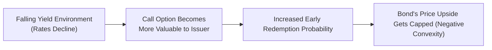

## Introduction
Let’s imagine you’re sitting down with a friend in the bond market—yes, I know that sounds funny, but bear with me. This friend is bragging about the sweet yield she’s getting on a callable corporate bond. On the surface, it looks pretty great: it’s paying more interest than a plain-vanilla, non-callable bond from the same issuer. You might even say, “Wow, that’s cool.” But here’s the twist: once interest rates start dropping, that seemingly generous yield may not translate to the price appreciation you’d expect. Instead, something called negative convexity comes into play, limiting the bond’s upside. You think, “Wait—why does it do that?” That’s exactly what we’ll explore here.

In most “normal” bonds without embedded options, if interest rates decline, prices go up in a relatively smooth, accelerating fashion—this is what we call positive convexity. However, certain bonds, especially callable ones, can exhibit negative convexity in a falling yield environment. This drastically changes how you value such bonds and manage them in a portfolio. In this section, we’ll explore the concepts, mechanics, and practical repercussions of negative convexity in callable bonds, contrasting them here and there with putable bonds for extra clarity. We’ll also dip into how to measure negative convexity, interpret it in real-world scenarios, and dodge pitfalls that might catch you off-guard during exam vignettes or real-market decisions.

## Recap: The Concept of Convexity
Convexity is an extension of duration-based analysis—it captures the curvature in the price-yield relationship. Duration alone (think modified duration or Macaulay duration) measures a linear approximation of price sensitivity to yield changes, but convexity refines that approximation by accounting for how bond price sensitivity itself changes when yields move.

• Positive Convexity  
Most standard fixed-rate bonds exhibit positive convexity. That means if yields fall by a certain amount, the bond’s price rises more than a simple duration-based linear approximation would predict. Conversely, if yields rise, the bond’s price declines less (again, relative to that linear approximation). It’s good news for buy-and-hold investors because you gain a bit more when rates go your way and lose a bit less when rates move against you.

• Negative Convexity  
Negative convexity flips that dynamic on its head. When yields decline, the bond’s price increases at a slower rate than you might expect. The “curve” in price-yield land flattens out on the upside, limiting the bond’s potential price appreciation. This effect becomes particularly relevant whenever there’s an embedded option that benefits the issuer in a falling-rate environment, such as a call option.

## Why Negative Convexity Arises in Callable Bonds
A callable bond gives the issuer the right (but not the obligation) to redeem the bond early, typically at a predetermined call price. Let’s say the coupon is 8%, but if market rates drop well below that, the issuer might decide to call the bond and refinance at a cheaper rate. That’s great for the issuer—kind of like a homeowner refinancing a mortgage—but not so great for investors who were counting on that nice, fat coupon for the entire term or on the bond’s price going through the roof if rates plummeted.

### The Call Option’s Effect
As soon as interest rates begin trending downward, the value of the issuer’s right to call the bond increases. In an extreme scenario, if rates fall drastically, the probability of a call is almost certain, capping the bond’s price near or slightly above the call price. In a price-yield graph, you’ll see the line flatten well before you’d expect in a non-callable bond, making the shape exhibit negative convexity in that region.

Below is a simple diagram illustrating how an embedded call can lead to negative convexity:

Notice how the call option basically cuts off the bond’s price appreciation: instead of soaring when yields plummet, price hits a ceiling, tied to the call price or a region near it.  

## Measuring Negative Convexity
In practice, we often discuss effective convexity for bonds with embedded options since the standard (modified or Macaulay) convexity calculations assume fixed cash flows. When interest rates shift, the probability of the bond being called shifts too, altering the bond’s cash flows. Hence, we use an option-adjusted approach.

### Effective Convexity Formula
A simplified formula for effective convexity is:

\text{Effective Convexity} \;=\; \frac{(P_{-} + P_{+}) - 2P_0}{( \Delta y )^2 \times P_0},

where:
• \\( P_{-} \\) = Bond price if yield decreases by \\(\Delta y\\)  
• \\( P_{+} \\) = Bond price if yield increases by \\(\Delta y\\)  
• \\( P_0 \\) = Current bond price  
• \\(\Delta y\\) = Small change in yield  

For callable bonds that exhibit negative convexity, \\( P_{-} \\) (the price if rates decline) doesn’t rise as much as it would in a normal bond scenario. This flattening means that the numerator can become smaller or even negative relative to what we’d expect from a bond with positive convexity.  

### Option-Adjusted Spread (OAS) Considerations
When analyzing callable bonds, many practitioners (and plenty of item sets on the CFA exam) use option-adjusted spread to separate the bond’s credit and term structure component from the embedded option cost. High implied volatility in interest rates raises the value of the call option in the model, which leads to a higher option cost to the investor and lowers the bond’s option-adjusted price. This phenomenon intensifies negative convexity. When you see a scenario in an exam question that changes the assumed volatility in the yield curve, keep your antenna up for an impact on the bond’s negative convexity measures.

## Real-World Examples of Negative Convexity
• Callable Corporate Bonds  
Imagine a 10-year corporate bond with a 6% coupon, callable after 3 years at par. If market yields tumble to 3%, the issuer can call the bond, refinance at a 3% range, and reissue new debt. Investors who had hoped the bond price might rocket to well above par as rates fell end up stuck near par value.

• Mortgage-Backed Securities (MBS)  
MBS also exhibit negative convexity because homeowners prepay or refinance as mortgage rates drop. This is a famous example that reappears in advanced fixed income classes and, yep, in your CFA studies. Prepayments effectively reduce the bond’s life, capping its price appreciation.

In practice, you might see references to negative convexity in both corporate callables and MBS contexts. It’s critical to differentiate the triggers: corporate bonds get called by issuers, while MBS are “called” by homeowners paying off mortgages. Either way, the result for the investor is a loss of potential upside.

## Portfolio Management Implications
### Yield Expectations and Strategy
If you, as a portfolio manager, anticipate stable or rising rates, callable bonds might not be a big worry, since the call is less likely to be exercised. In fact, you might even like those higher yields. However, if rates drop significantly, you lose out on the price appreciation. That’s why some managers who foresee falling rates tend to avoid or hedge positions in callable bonds, turning instead to putable bonds or other positive-convexity securities.

### Hedging Negative Convexity
Some professionals use interest rate derivatives, like swaptions, to hedge the negative convexity embedded in callables. For instance, if you are worried about significant rate declines, you could buy an interest rate call option (i.e., a payer swaption or perhaps a receiver swaption, depending on your scenario) that gains value if rates drop. That hedge can offset some or even all of the flattening effect on your callable bond holdings. However, it’s tricky and can be expensive, so you typically only see institutional managers adopt elaborate hedging strategies.

## Contrasting Putable and Callable Bond Convexities
While the focus here is on callable bonds, it helps to see the other side:

• Putable Bonds  
A putable bond generally exhibits positive convexity. Even in a rising rate environment, the investor can often sell the bond back (put it) to the issuer and avoid large losses, “flooring” the price. This protective feature effectively mitigates interest rate risk to some extent. So, putable bonds are generally friendlier to an investor’s desire for stable or limited downside.

• Portfolio Blending  
Sometimes, portfolio managers will blend callable and putable bonds if they want to balance the negative convexity from callables with the positive convexity from putables. You’d be adding a bit of yin to your yang, so to speak.

## Best Practices and Pitfalls
### Best Practices
1. Always check if a bond is callable (or putable!) before analyzing convexity. It might sound obvious, but in exam scenarios, it’s easy to miss a casual mention of embedded options.  
2. Use option-adjusted measures—like effective duration and convexity—when modeling callable bonds. Plain vanilla duration and convexity measures can be misleading if you treat the cash flow as fixed.  
3. Stay aware of implied volatility assumptions. If an exam vignette says something like “Volatility is projected to increase 50% next quarter,” you might anticipate a higher call option value, reducing your bond’s upside.  
4. Compare yields on callable bonds to non-callable or bullet bonds of the same maturity and credit risk. You’ll often see a yield premium on the callable side as compensation for that negative convexity risk.

### Common Pitfalls
1. Confusing Bond Price Caps With Yield Changes  
   Some candidates incorrectly attribute negative convexity to the general shape of the yield curve. Remember: negative convexity is primarily driven by the embedded option.  
2. Overlooking the Impact of Calls Near Maturity  
   Even if the call date is close, the embed might still significantly alter the bond’s price sensitivity.  
3. Failing to Distinguish Between Negative Convexity and Credit Effects  
   If the issuer’s credit improves drastically, the bond price might rise a bit. But if rates are dropping at the same time, the call feature might still cap the price. Keep them separate in your mind and your analysis.

## Example Analysis
Suppose you have a callable bond priced at 101 when yields are 5%. If yields drop to 4%, you might expect a bullet bond’s price to jump to 104 or 105. But if the call price is 102, your bond might only rise to 102.5 or so—that’s the flattening effect. On the exam, watch for item sets showing a scenario where yields are projected to fall by some basis points. If the question provides a new price for the bond at only a slight premium above par (call price), it’s a clue that negative convexity is playing out.

## Conclusion and Exam Tips
So, in my opinion, negative convexity is one of those “love/hate” features in the world of fixed income. Investors—especially yield-starved ones—love callable bonds for the extra yield spread but might neglect the heartbreak that comes if rates fall and their bond gets called away. For the Level II exam, pay close attention to:

• The difference between standard (positive) convexity and negative convexity.  
• How changes in volatility and yield levels affect the call option’s value and, by extension, the bond’s price.  
• How to identify negative convexity in a vignette, usually signaled by a “flattening of the price-yield curve” or bond prices not rising in tandem with a decline in yields.  
• Contrasting putable bonds (positive convexity) with callable bonds (negative convexity).  

Practice with sample item sets, focusing on the options features. Whenever you see a bond in a scenario, highlight any mention of calls or puts. Then, consider whether effective duration/convexity calculations need to incorporate the embedded option. And always remember that if interest rates head down, the issuer might just call your bond—and your upside is gone.

## References and Further Reading
• CFA Institute Level II Curriculum (Fixed Income Readings on Embedded Options).  
• Tuckman, B. & Serrat, A. (2011). “Fixed Income Securities: Tools for Today’s Markets.”  
• Fabozzi, F. (2016). “Bond Markets, Analysis, and Strategies.”  
• Research articles from the CFA Institute on mortgage-backed securities and embedded options.

---

## Test Your Knowledge: Negative Convexity in Callable Bonds



### A callable bond generally exhibits negative convexity in which market scenario?  
- [ ] When interest rates rise significantly.  
- [x] When interest rates fall significantly.  
- [ ] When credit spreads widen.  
- [ ] When inflation is declining but interest rates remain stable.  

> **Explanation:** As rates fall, the call option embedded in the bond gains value for the issuer, capping the bond’s upside potential and creating the negative convexity effect.

### Which measure best incorporates the value of embedded options when analyzing a callable bond’s interest rate risk?  
- [ ] Modified duration.  
- [x] Effective duration and effective convexity.  
- [ ] Macaulay duration.  
- [ ] Yield to maturity only.  

> **Explanation:** Effective duration and effective convexity calculations capture the changing cash flow patterns under various interest rate scenarios, accounting for the issuer’s call option.

### The main reason investors demand a higher yield on callable bonds relative to non-callable bonds is:  
- [x] Callable bonds exhibit negative convexity, limiting price appreciation if rates fall.  
- [ ] Callable bonds have longer maturities than non-callable bonds.  
- [ ] Issuers of callable bonds are usually less creditworthy.  
- [ ] Bond indentures of callable bonds have stricter covenants.  

> **Explanation:** Negative convexity reduces the investor’s potential price appreciation. Because of this unfavorable feature, investors require a higher yield or spread.

### An issuer is most likely to exercise the call option on its outstanding bond when:  
- [ ] The bond is trading below par.  
- [ ] Market interest rates have risen above the coupon rate.  
- [x] Market interest rates have fallen below the coupon rate.  
- [ ] Credit spreads have widened significantly.  

> **Explanation:** Calls typically happen when the issuer can refinance its debt at a lower rate, saving on future interest costs.

### Which of the following best describes the visual representation of negative convexity on a price-yield curve?  
- [ ] The slope is steeper as yields increase and as they decrease.  
- [x] The curve “flattens” for lower yields, reflecting limited price upside.  
- [ ] The curve spikes sharply upward at higher yields.  
- [ ] The curve mirrors that of a typical bullet bond.  

> **Explanation:** Negative convexity appears as a flattening of the curve at lower yields because the call caps price appreciation.

### A bond’s call feature is most likely to increase in value to the issuer when:  
- [x] Implied volatility in interest rates increases.  
- [ ] Inflation expectations rise.  
- [ ] The time to maturity is about to expire in one month.  
- [ ] Market yields remain unchanged.  

> **Explanation:** Higher interest rate volatility makes it more advantageous for an issuer to have the option to call the bond, as the probability of rates moving even lower increases.

### In analyzing a callable bond, an investor performs an option-adjusted spread (OAS) calculation under two different volatility assumptions. In the higher volatility scenario, the OAS is most likely to:  
- [x] Decrease because the call option is more valuable to the issuer.  
- [ ] Increase because the investor gains from the issuer’s option.  
- [ ] Remain unchanged because volatility doesn’t affect OAS.  
- [ ] Rise and then fall with no net effect.  

> **Explanation:** As volatility increases, the call option becomes more valuable to the issuer, effectively lowering the bond’s option-adjusted value (hence a lower OAS).

### For a callable bond with a call price of $102, if the market yield drops well below the coupon rate, the bond’s market price is most likely to:  
- [ ] Rise indefinitely above $110.  
- [x] Cap near $102, reflecting negative convexity.  
- [ ] Trades significantly below $102 in anticipation of call.  
- [ ] Show normal convexity and keep increasing without a cap.  

> **Explanation:** Once yields fall enough to make the call likely, the bond’s price shouldn’t rise much beyond the call price.

### The “flattened” portion of the price-yield curve for callable bonds occurs primarily because:  
- [ ] The investor benefits from the put option.  
- [ ] The bond’s maturity is extended.  
- [x] The embedded call option is likely to be exercised by the issuer.  
- [ ] The yield curve is sloping upwards.  

> **Explanation:** The flattening occurs because the issuer can redeem the bond when it becomes advantageous (i.e., if rates fall sufficiently), capping the bond’s price.

### True or False: Negative convexity in callable bonds disappears if rates never decline below the coupon rate.  
- [x] True  
- [ ] False  

> **Explanation:** Negative convexity is most relevant when falling rates make the call option “in the money.” If rates stay above the coupon, the bond behaves more like a normal bond with positive convexity.


