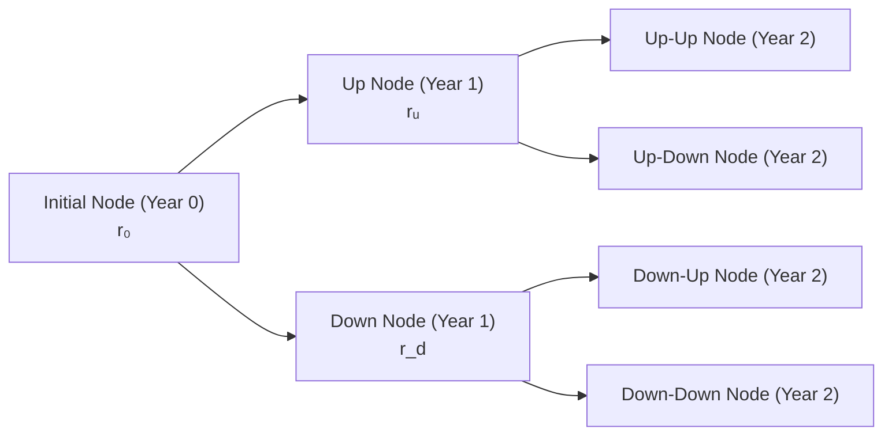

## Introduction and Overview

When a bond has a call or put provision, it can sometimes feel like you’re juggling a few extra puzzle pieces—particularly when you attempt to crunch the numbers for valuation. Option-Adjusted Spread (OAS) tries to unify all those puzzle pieces into a single, consistent measure of additional yield. Essentially, an OAS indicates what extra spread a bond with embedded options offers over a benchmark curve (e.g., Treasury or swap curve). Then there's effective duration, which helps us understand how sensitive the bond’s price is to changes in interest rates—accounting for the option features that might alter expected cash flows.

So maybe you’re wondering: “But how do I actually compute an OAS or gauge the bond’s effective duration in a real-world scenario?” This section shows you how to tackle those tasks in a vignette-style question (the standard format for the CFA exam). We’ll walk through each step using a binomial interest rate tree, discounting the bond’s possible future cash flows, and factoring in the call or put triggers.

We’ll take a hypothetical example that mirrors what you might see on exam day. Let’s start with the storyline and data, then we’ll proceed to unravel the mechanics of calculating OAS and effective duration.

## Vignette-Style Setup: Data and Key Bond Features

Imagine you’ve been handed a short case about the following bond:

• A 5-year, semiannual coupon bond with a 6% annual coupon (3% paid semiannually).  
• Callable at par (100) at the end of year 2.  
• Current price: 102.0 per 100 of par.  
• The relevant spot curve is given, and you’re told that the implied volatility for interest rates is around 19–20%.  
• You’re asked to:  
  1. Determine the OAS of this callable bond.  
  2. Calculate its effective duration using small shifts in the benchmark yield curve.  

Additionally, you see a table showing possible interest rates over the next two years (up or down moves), along with a note on when the issuer might call the bond. For instance, if rates drop significantly right after issuance, the issuer’s cost of refinancing will be cheaper than the bond’s coupon, so they’ll probably call.

Anyway, let’s see how to handle the problem.

## Building or Interpreting the Binomial Tree

The first step is constructing (or reading, if provided) a binomial interest rate tree. If you recall from Chapter 8 (Binomial Interest Rate Tree Models), we start with a current (initial) 1-year interest rate and then branch into high (up) and low (down) nodes for subsequent periods.

Here’s a simple illustration of a two-period binomial tree. Let’s say the current rate for the next period is r₀. Then we have an “up” rate, rᵤ, and a “down” rate, r_d, for the next period, and so on. A minimal depiction might look like this:

Those final nodes (D, E, F, G) represent rates (or discount factors) for year 2. You could expand this to 5 years if needed, but on an exam, you’re often given some or all of these node values, so no worries if it looks complicated.

## Projecting Bond Cash Flows Under Each Rate Path

Next, we figure out the bond’s cash flows at each node. To do this:

1) At each node, you ask: “Is the bond called? If yes, then the cash flow is the call price (likely 100 par in many problems) plus the final coupon payment, depending on the question details.”  
2) If the bond is not called, you get the coupon payment plus any principal if you’re at maturity.  
3) For a putable bond, you might see the investor’s option to return the bond to the issuer at a certain price, generating a different final (or early) cash flow.

### Example

Say that at the Up-Up node in year 2, rates have dropped so far that the issuer calls the bond. The call price is 100 plus the final coupon at that time. So the payoff is 100 + 3% coupon (assuming par of 100 and semiannual coupon), or 103. Meanwhile, if the bond is not called in another node, the holder just collects the coupon.  

In a real test item set, these payoffs are typically arranged in a handy table. Your job is to confirm them or plug them into your valuations.

## Discounting with a Trial Spread: Searching for OAS

Now, here’s where OAS fun begins. The idea is:

1. We start with the base discount rates from the binomial tree at each node.  
2. We add a trial spread (for instance, 100 basis points) to discount the bond’s cash flows in each node.  
3. We compute the present value (PV) of all future node cash flows.  
4. If the PV is above the current bond price (102.0 in our scenario), that means we used too small a spread. If the PV is below the current bond price, obviously our spread guess is too high.  
5. We iterate (like a search, sometimes called a “spread guess-and-check”) until the PV matches the bond’s actual market price. The final spread that equates the two is the Option-Adjusted Spread.

Algebraically, you can think of it this way:
  
(1)  
PV(bond) = ∑ [CashFlowᵢ / (1 + rᵢ + OAS)^(tᵢ)]  

We find the OAS such that PV(bond) = Market price (which is 102.0). But remember: for each node i, rᵢ might be the local interest rate from the tree, adjusted by the volatility assumptions.

### Watch for the Option Impact

Because the bond is callable, if it’s beneficial for the issuer to redeem early, you’ve got to reflect that in the projected cash flows. This is the main difference from a regular “straight” bond. The more likely it is that the bond gets called, the lower the potential future coupon stream—and the more that changes our discounting exercise. This is why we say OAS is a measure of the bond’s “true” yield over the benchmark once we factor in the embedded option.

## Calculating Effective Duration: Small Shifts in Rates

After you’ve pinned down the OAS, the next item on your to-do list might be to find the effective duration. You do this by:

1. Shifting all rates in the binomial tree up by some small amount (say 25 bps).  
2. Recomputing the bond’s value (V₊) at that new set of rates, plus the OAS.  
3. Shifting all rates in the binomial tree down by the same amount (25 bps).  
4. Recomputing the bond’s value (V₋).  
5. Applying the effective duration formula:


\text{Effective Duration} 
= \frac{V_{-} - V_{+}}{2 \times V_0 \times \Delta y}


Where:  
• V₀ is the initial price of the bond (i.e., 102.0).  
• V₊ is the bond’s value after shifting rates up by Δy.  
• V₋ is the bond’s value after shifting rates down by Δy.  
• Δy is the yield shift (in decimal form).

### Why Effective Duration?

With embedded options, your plain-vanilla modified or Macaulay duration just won’t cut it. Those measures neglect that big calls and puts can alter future cash flows in complicated ways. Effective duration tries to incorporate the effect that a rate move might have on whether the option is used (or not). That’s why we revalue the bond for small upward and downward shifts.  

A small personal anecdote: the first time I worked through an OAS/Effective Duration problem, I remember thinking, “This is so mechanical; I'm basically just toggling rates up and down.” But that’s exactly the point—by revaluing the bond under these shifts, we see how the embedded option could come into play and distort the usual symmetrical price–yield relationship.

## Putting It All Together: Step-by-Step Example

Let’s ground this in a short demonstration. Suppose you have the following data:

• Current bond price: 102.0.  
• Annual coupon: 6% (paid semiannually).  
• Maturity: 5 years, callable in year 2 at par.  
• Binomial tree sets the year-1 rate to either 4.00% or 6.25%. By year 2, if the rate goes “up,” it’s 7.00%, and if “down,” it’s 3.50%, etc. (We’d have a bigger table for five years, but let’s keep it short for illustration.)

### Steps

1) Create the binomial tree of rates, including up/down branches for each period.  
2) For each node, determine if the bond is called or not, and record the cash flow.  
3) Discount each node’s cash flow using (rate from the tree + trial OAS).  
4) Sum the PVs, compare it to 102.0, and adjust your OAS guess until the PV = 102.0.  
5) That final spread is your OAS. Let’s say it ends up at 120 bps.  
6) Next, to find effective duration, push all node rates up by 25 bps (both the up and down branches) and recalculate the bond’s value. Let’s say that’s 99.75. Then push rates down by 25 bps, and maybe the value is 104.10.  
7) Plug into the formula:


\begin{aligned}
\text{Effective Duration} 
&= \frac{V_{-} - V_{+}}{2 \times V_0 \times \Delta y} \\
&= \frac{104.10 - 99.75}{2 \times 102.0 \times 0.0025} \\
&= \frac{4.35}{0.51} \\
&= 8.53
\end{aligned}


(That’s just an example calculation, not necessarily real numbers you’ll see in an exam, but you get the idea.)

## Exam Tips and Common Pitfalls

Okay, so how might the CFA exam try to trick you?

• Data Overload: The vignette might give you volumes of detail—extra yield curve info that doesn’t affect the call date, or repeated stats about volatility. Don’t get lost in the noise. Zero in on the relevant call triggers, coupon payments, and discount rates.  
• Partial Values Provided: Sometimes, the exam might give you partial present values or partial tree computations. Verify them quickly if time allows, but don’t redo them if they match. The exam rarely expects you to compute a giant 5-year binomial tree from scratch.  
• Mixed-Up Rates: Keep an eye on day count conventions (Chapter 2) or whether they mention semiannual or annual compounding. A small slip there can derail your entire OAS calculation.  
• Overlooking the Option: Don’t forget that call or put possibilities can drastically alter the final or intermediate cash flow. If the call price is 100 and that’s beneficial to the issuer, they will likely exercise at that node.  
• Time Constraints: The CFA exam item sets have multiple questions, so watch out for time. If a question states the bond is “likely to be called,” that’s your clue to factor in the call payoff, no matter how complicated other data might appear.

## Additional Diagrams or Tables

Just for clarity, a table of final node cash flows might look something like this:

| Node           | Interest Rate (%) | Action           | Cash Flow at Node |
|----------------|--------------------|------------------|--------------------|
| UU (Up-Up)     | 3.50              | Called at 100    | 100 + coupon       |
| UD / DU        | 5.00              | Not called       | coupon + keep bond |
| DD (Down-Down) | 7.00              | Not called       | coupon + keep bond |

(Exact rates and calls would vary depending on the problem, but you get the structure.)

## Practical Considerations Beyond the Exam

In the real world, interest rates may not move in a neat binomial pattern. Nonetheless, the principle remains the same: try to incorporate all possible interest rate paths when modeling a callable or putable bond. Methods like Monte Carlo (Chapter 9) can handle path dependencies or more distribution assumptions.

Moreover, the OAS can shift with changes in implied volatility. For example, if the market is expecting bigger rate moves, the value of a callable bond might decline (the issuer’s call option becomes more valuable, so the bond is worth less to you), and that directly affects the OAS.

## References and Further Reading

• Fabozzi, Frank J. “Fixed Income Analysis” – for more on binomial trees and OAS.  
• CFA Program Curriculum Volumes for official practice problems.  
• Chapter 8 (Binomial Interest Rate Trees) and Chapter 10–11 sections on callable/putable bonds in this text.  
• Chapter 25 (Measuring Interest Rate Risk) for deeper dives into duration measures.

## Final Exam Tips

• Keep an eye on the discount rate used for each node. Multiple discounting confusion is a frequent error.  
• If the question references partial valuations, trust (but verify) them.  
• Practice your time management with item sets.  
• Revisit definitions: OAS, effective duration, and how each relates to embedded options.  
• Don’t be afraid to do a quick sanity check. If rates have gone way down, a callable bond is more likely to be called (bond price relative to par might confirm that).

## Master Your Vignette Skills: Calculating OAS and Effective Duration Quiz



### Which best describes the Option-Adjusted Spread (OAS)?

- [ ] It is the premium that investors pay for interest rate caps against a benchmark index.  
- [ ] It is a spread deducted from all binomial tree rates to match the bond’s coupon rates.  
- [x] It is the constant spread added to the benchmark yield curve that equates a bond’s modeled value with its market price when factoring in embedded options.  
- [ ] It strictly measures credit risk separate from market risk.  

> **Explanation:** The OAS is the constant spread added to discount rates such that the present value of expected cash flows (including option effects) equals the bond’s market price.

### In a callable bond valuation using a binomial tree, what triggers the call exercise at a node?

- [x] The issuer can borrow at lower rates than the current bond’s coupon, making early redemption beneficial.  
- [ ] The issuer is forced to call if the bond price is above par.  
- [ ] The bond’s coupon automatically adjusts to match new rates.  
- [ ] The investor chooses to exercise the call if rates rise.  

> **Explanation:** The call feature is beneficial to the issuer. If rates fall below the bond’s coupon rate, the issuer can refinance cheaply and exercise the call, redeeming the bond at par (or the specified call price).

### How is the effective duration of a callable bond typically measured?

- [x] By shifting the entire yield curve up/down by a small amount and revaluing the bond with the embedded option.  
- [ ] By measuring the bond’s price response to a parallel shift in credit spreads only.  
- [ ] By computing Macaulay Duration and adjusting for convexity.  
- [ ] By computing yield to maturity at each node in the tree directly.  

> **Explanation:** Effective duration incorporates the effect of calls by revaluing the bond at slightly higher and lower yields; it contrasts with standard duration measures (e.g., Macaulay) that ignore option exercises.

### What does it mean when the present value from your first trial spread is higher than the market price of the bond?

- [ ] The guess for the spread is too high; you need to reduce it.  
- [x] The guess for the spread is too low; you need to increase it.  
- [ ] The bond’s coupon structure is misaligned with the spot curve.  
- [ ] The bond has negative convexity.  

> **Explanation:** If the present value is too high, it implies you have discounted the cash flows at a rate that’s too low. You must raise the spread to reduce the PV to match the bond’s market price.

### In a typical OAS calculation for a callable bond, which of the following is NOT a relevant input?

- [ ] The benchmark yield curve.  
- [ ] Estimated interest rate volatility.  
- [ ] The bond’s call schedule.  
- [x] The investment banker’s underwriting fee.  

> **Explanation:** While underwriting fees are a real-world factor, they are not part of the OAS mechanics. OAS requires discount rates, volatility (to model up/down moves), and knowledge of when (and at what price) the bond can be called.

### Suppose you calculate a bond’s effective duration using a 25 bp rate shift up and down. You observe V₊ = 100.2, V₋ = 104.2, and the current price V₀ = 102.0. What is the effective duration?

- [x] 7.80  
- [ ] 8.33  
- [ ] 3.12  
- [ ] 4.63  

> **Explanation:**  
> Effective Duration = (V₋ – V₊) / [2 × V₀ × Δy]  
> = (104.2 – 100.2) / [2 × 102.0 × 0.0025]  
> = 4.0 / 0.51 ≈ 7.80.

### An investor wonders why his callable bond price doesn't rise as much as a similar non-callable bond when interest rates fall. Which concept best explains this difference?

- [ ] The nominal spread.  
- [x] Negative convexity.  
- [ ] Reinvestment risk.  
- [ ] Macaulay Duration.  

> **Explanation:** Callable bonds often exhibit negative convexity in a falling rate environment, because the likelihood of the issuer calling the bond increases, capping the bond’s price appreciation.

### When shifting the tree’s rates up or down to measure effective duration, which discount rate changes?

- [x] Each year’s forward rate in every node is increased or decreased by Δy, and the OAS remains constant.  
- [ ] Only the final node’s rate is shifted; earlier nodes remain the same.  
- [ ] The OAS is re-estimated for each shift.  
- [ ] You only shift the base case by a large margin of 100 bps.  

> **Explanation:** Basic procedure is to shift the entire yield curve (thus every node’s rate) by the same small increment. The OAS itself is not changed while computing the duration.

### In a three-step binomial tree, which statement about OAS is correct?

- [ ] The OAS can be determined by simply averaging the option costs at each node.  
- [x] The OAS is the spread that aligns the model’s discounted cash flow with the bond’s actual price, considering all paths.  
- [ ] A single up/down rate outcome is sufficient to compute OAS accurately.  
- [ ] OAS only applies to putable bonds.  

> **Explanation:** OAS aligns the estimated bond value (considering all possible interest rate paths and potential call/put actions) with the market price. Averaging option costs or just using a single scenario wouldn’t fully capture the embedded option’s effect.

### True or False: When you add the OAS to your discount rates, you must also add the same spread to the bond’s coupon.

- [x] True  
- [ ] False  

> **Explanation:** The statement “you must also add the same spread to the bond’s coupon” is technically false; we do not modify the coupon rate itself. We only shift the discount rate. Because the statement is contradictory to standard practice, the correct answer to the question “True or False: …you must also add the same spread to the bond’s coupon?” is False. You only add the OAS to the discount rates, not the coupon.  



---

**Key Takeaways:**
• Calculating OAS and effective duration for callable/putable bonds requires careful mapping of future interest rates and option exercise decisions.  
• The binomial tree approach, introduced in earlier chapters, is your go-to tool for these embedded option valuations.  
• Remember “trial and error” for OAS; keep adjusting the spread until you hit the market price.  
• For effective duration, small parallel shifts in the discount curve reveal the bond’s real sensitivity to interest rate changes when factoring in optionality.

Feel free to dig deeper with the references provided, and don’t forget to practice with more item sets—like the quiz above—to strengthen your exam agility. Finance can sometimes be tricky, but with enough repetition and a sturdy conceptual framework, you’ll be well-prepared for your big day.
