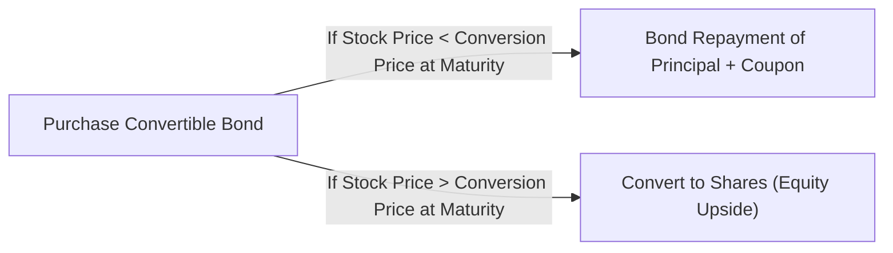

## Understanding the Hybrid Nature of Convertible Bonds

So, let me first say, I remember the day a colleague walked me through a convertible bond for the first time. I’d been staring at this security that looked part-bond, part-stock, and I kept wondering, “Why on earth would anyone want something half and half?” But, you know, it turns out convertibles can provide a pretty neat opportunity: they give investors stable coupon income plus a shot at the issuing company’s equity upside. If the stock price goes up enough, you can convert the bond into shares—voilà, you’re effectively in equity territory. But if the stock remains lackluster, you still collect coupon payments and recoup principal at maturity, absent any default event of course. 

Investors typically like convertibles because they combine bond-like downside protection with equity-like upside participation. On the issuer side, companies often like them because the coupon rates are generally lower than straight bonds, which can reduce interest costs. At the same time, if conversions eventually happen, the firm manifests an increase in equity capital with less immediate debt overhang, albeit at the cost of diluting existing shareholders.

Below is a simple diagram illustrating the dual paths a convertible bond can take—repaying the bond principal if conditions are not ripe for conversion, or morphing into equity if the share price soars:



## Key Terms and Concepts

I think it’s helpful to lay out the main concepts. These definitions serve as the building blocks of understanding how a convertible bond’s embedded option translates into potential equity upside.

### Conversion Ratio
A convertible bond’s conversion ratio indicates the number of shares you receive upon converting one bond. You can calculate it by dividing the bond’s par (face) value by the conversion price. Symbolically:

$$
\text{Conversion Ratio} = \frac{\text{Par Value}}{\text{Conversion Price}}.
$$

For example, if a bond has a par value of \$1,000 and the conversion price is \$50, you get 20 shares of stock upon conversion. That’s the ratio: 20 shares per bond.

### Conversion Price
This is the implied price at which the bond converts to equity. So if the market price of the stock is, say, \$40 but your bond’s conversion price is \$50, you probably won’t convert right away (because you could buy the shares in the open market at \$40 instead of “paying” \$50). If the stock price moves up above \$50, your conversion becomes more appealing. 

### Conversion Premium
The conversion premium is the percentage difference between the conversion price and the current stock price. A premium means the stock needs to rise in value before conversion becomes economical. A higher conversion premium might make the bond less likely to be converted early on, but it may also reflect the investor willingness to pay for the bond’s protective features (coupons, bond principal protection).

Let’s say the stock is \$45, and your conversion price is \$50. Then, the conversion premium in dollar terms is \$5 per share. As a percentage of the current stock price (\$45), that’s about 11%. So the stock has to rally by about 11% before you’re “in the money” on a pure conversion basis.

### The Bond Floor (Investment Value)
Although convertible bonds can be viewed partly as an equity play, they don’t fully lose their bond characteristics. If the share price is below the conversion price, the convertible behaves more like a regular bond—its value won’t be driven by equity, but by interest rates and credit risk. This minimum theoretical value, known as the bond floor or investment value, is roughly the price at which the bond would trade if it weren’t convertible at all. 

In practice, the convertible’s actual price should never drop far below this bond floor because if it did, arbitrageurs could buy the undervalued bond, short the company’s stock as a hedge, and lock in a riskless profit.

### Forced Conversion (Call Provision)
Many convertible bonds have call provisions: the issuer can “call” the bond after a certain date and at a certain price. Often, issuers trigger forced conversion if the stock price trades above the conversion price long enough to make conversion effectively a done deal. The issuer’s perspective: If our stock is doing well, we’d prefer to force conversion so we can remove this debt and reduce coupon obligations. Consequently, investors are sometimes compelled to convert if they don’t want the bond called away at a less attractive redemption price. 

### Equity Upside Potential
The moment the stock trades well above the conversion price, each convertible bond can be turned into equity shares that collectively may be worth more than the bond’s par value. Let’s do a quick scenario:

• Par Value: \$1,000  
• Conversion Price: \$50 per share → conversion ratio of 20 shares  
• Current Stock Price: \$60  

If you convert, you’d get 20 shares, which (if sold) are worth \$1,200. That’s above \$1,000, so your convertible is “in the money.”  
Hence, the convertible bond is no longer just a bond. It’s now effectively an equity position shaped by the share price. This “equity upside” is precisely the reason many investors find convertibles attractive.

### Potential Dilution for Existing Shareholders
There’s always a bit of conflict for existing shareholders. If a swath of convertible bondholders decide to convert, the total number of shares outstanding increases. More shares in circulation means the ownership slice of each existing shareholder shrinks accordingly—this is dilution. Issuers sometimes try to manage the timing or magnitude of conversions to avoid sudden, large expansions in share count.

### Dividend Policy and Its Impact
Convertible bondholders don’t directly receive stock dividends—they get coupon payments on the bond instead. If the company significantly increases its dividend, equity holders might benefit from that stable payout. However, once you convert into equity, you collect dividends. So big changes in the company’s dividend policy can shift the relative attractiveness of the bond side (coupon plus par redemption) versus the equity side (dividends plus share price growth). 

### Anti-Dilution Provisions
Sometimes, convertible bonds feature anti-dilution clauses. These provisions automatically adjust your conversion ratio if the company does certain things, like issuing new shares below the current market price or granting stock splits. The logic is to protect convertible holders from being short-changed if the issuer dilutes shares in a manner that’s unfavorable to them. So if you see an anti-dilution clause, it’s basically the bondholders’ insurance that their conversion option won’t be substantially diminished by future corporate actions.

## Real-World Considerations and Market Conditions

Not every convertible is created equal. Let’s consider a few market-based angles:

• Volatility: A convertible bond effectively has an embedded call option on the issuer’s stock. Options gain value when volatility increases. So in periods of higher equity volatility, the “option value” can be worth more, boosting the convertible’s price potential.  

• Interest Rates: Although convertible coupon rates can be more modest than plain-vanilla bonds, higher interest rates in the market typically lower bond valuations. Of course, if the equity is surging, that might overshadow any negative impact from rising rates.  

• Credit Environment: Convertibles are still corporate bonds with default risk. If the issuer’s creditworthiness deteriorates, the bond floor can shrink, dragging the convertible’s overall price down—unless the equity portion soars in value enough to offset that.  

• Issuer Motivation: Companies may issue convertibles to reduce their borrowing costs. Some also like the possibility of ultimately converting this debt into equity if their stock does well. For example, a firm might foresee robust growth but needs capital upfront. The cost advantage of convertibles can be tempting because, from the company’s standpoint, it’s cheaper than paying a high coupon on a regular bond or issuing equity at a price they consider undervalued.  

## Example Calculations and Decision Points

Imagine a convertible bond with these details:

• Par Value: \$1,000  
• Annual Coupon: 4% (paid semiannually at 2%)  
• Maturity: 5 years  
• Conversion Price: \$50 → Conversion Ratio: 20 shares  
• Current Stock Price: \$48  

Note that the stock price is slightly below \$50, so the bond might trade near or slightly above its bond floor. One year later, if the stock price jumps to \$55, the bond’s conversion value is now \$1,100 (i.e., 20 shares × \$55). Because \$1,100 is above the \$1,000 par value, the convertible’s price will typically rise toward or above \$1,100.  

But your decision might still lean on:  
• Remaining time to maturity (you could hold the bond longer for coupons).  
• Anticipation of further stock appreciation.  
• Interest rates and the bond’s yield.  
• Probability of a forced conversion (call by the issuer).

In a practical sense, convertible holders sometimes keep a close eye on call features. If the bond is callable at \$1,030, for instance, the issuer might call it if the stock remains above \$50. Conversion or redemption might be forced upon you, so your best bet is to do the math, see where you come out ahead, and possibly convert to shares if you believe in the issuer’s equity story.

Below is a simplified Python snippet that calculates a convertible bond’s current conversion value and conversion premium.

```python

par_value = 1000
conversion_price = 50
stock_price = 48

conversion_ratio = par_value / conversion_price

current_conversion_value = conversion_ratio * stock_price  # e.g., 20 x 48 = 960

premium = (conversion_price - stock_price) * conversion_ratio  # e.g., (50-48)*20 = 40

print(f"Conversion Ratio: {conversion_ratio:.2f} shares per bond")
print(f"Current Conversion Value: ${current_conversion_value:.2f}")
print(f"Conversion Premium: ${premium:.2f}")
```

If you run this snippet (with a bond par value of \$1,000, a conversion price of \$50, and a stock price of \$48), you’ll see the current conversion value is \$960, which is below par, and there’s a \$40 premium until it’s at-par when viewed strictly from an equity conversion standpoint.

## Potential Pitfalls and Best Practices

I can’t help but note that convertible bonds can catch you off-guard. Here’s why:

• Price Volatility: Convertibles can get whipsawed by both credit market moves (driven by interest rates, issuer credit risk) and equity market swings. This dual sensitivity can be tricky to model.  
• Forced Conversion: Sudden calls force you to convert when you might have preferred to keep that juicy coupon for longer. This can complicate your yield calculations.  
• Dividend Policy Changes: If the stock’s dividend yield becomes very appetizing, equity shares might be better. But as a bondholder, you don’t benefit from dividends until conversion actually occurs.  
• Dilution Surprises: You might not think about how many other convertibles are out there until a wave of conversions hits. Suddenly, the stock’s supply changes, your equity position is diluted, and share prices can be pressured.  

That said, a methodical approach—carefully computing conversion values and monitoring the bond’s call features—usually provides clarity. Understand how a convertible’s “bond floor” underpins your downside and how equity participation delivers that upside.

## Bringing It All Together

To wrap things up, I love to think of a convertible bond as having two distinct personalities. On the one hand, it’s a bond that promises coupons and principal repayment. On the other, it’s an embedded stock option that can deliver share price gains if the issuer’s equity rallies enough. Whether you hold tight for the bond interest, convert for the stock upside, or get forced into conversion depends on market conditions and the issuer’s call decisions.

Focus on the following for exam success:  
• Mastering the relationship between the bond’s par value, the conversion ratio, and the conversion price.  
• Understanding how to value a convertible by comparing its bond floor to its conversion value.  
• Interpreting the effect of forced conversion.  
• Recognizing the role of dividend policy and potential dilution.  

Thanks for reading thus far. Convertibles definitely keep me on my toes—they’re not purely debt nor purely equity, but that is precisely what makes them so appealing for many investors and corporations alike.

## Final Thoughts and Exam Tips

• On exam day, you’ll likely face a vignette requiring you to calculate a convertible bond’s conversion value, see if it’s worth converting, and evaluate the bond’s call provisions.  
• Practice identifying when the price of the convertible bond is driven by its bond floor or by its equity option value.  
• Don’t forget forced conversion is a game-changer. The issuer might decide to call the bond, effectively compelling you to convert.  
• Keep an eye on how changes in share price, interest rates, and coupon structure can shift your best course of action.  

Effective exam-time management:  
1. Scan the vignette for numerical data: par value, coupon, maturity, conversion ratio, and especially the stock price.  
2. Use the formulas swiftly—practice them until you can do them in your sleep.  
3. If asked about the advantages or disadvantages from the issuer or investor’s perspective, be ready with bullet points.  
4. Watch for phrases like “callable at,” “forced conversion at,” or “trigger,” which might indicate the convertible can be redeemed sooner than you think.  

Check out these references if you want to go deeper:

• “Fixed Income Analysis” by CFA Institute (chapters on convertible bonds).  
• “Convertible Securities: A Complete Guide to Investment and Corporate Financing Strategies” by Tracy V. Maitland and Adam Z. Ruder.  
• Academic article: “Convertible Bond Design and Capital Investment,” Journal of Finance (for a deep dive into corporate finance angles).

---

## Test Your Knowledge: Conversion Features and Equity Upside Quiz



### A convertible bond has a par value of $1,000 and a conversion price of $40. Which statement is correct?

- [ ] The conversion ratio is 40 shares per bond.  
- [x] The conversion ratio is 25 shares per bond.  
- [ ] The conversion ratio is 0.04 shares per bond.  
- [ ] Not enough information is provided.  

> **Explanation:** Conversion Ratio = Par Value ÷ Conversion Price = 1,000 ÷ 40 = 25 shares per bond.

### If a convertible bond’s conversion value is well below its bond floor, which scenario is most likely?

- [ ] The bond is deeply in the money.  
- [x] The bond trades like a regular corporate bond with minimal equity influence.  
- [ ] The issuer will likely force conversion soon.  
- [ ] The dividend yield is probably very high.  

> **Explanation:** If the conversion value (based on the stock price) is below the bond floor, it indicates that the equity option is currently “out of the money.” Therefore, the bond behaves more like a regular bond, reflecting credit and interest rate conditions primarily.

### Which of the following correctly describes “forced conversion” under a typical call provision?

- [x] The issuer can call the bond, effectively pushing investors to convert if the call price is less favorable than the conversion value.  
- [ ] Investors can choose conversion at any time to lock in the premium.  
- [ ] It only applies when market interest rates fall below the coupon rate.  
- [ ] It is mandatory for all corporate bond offerings.  

> **Explanation:** Forced conversion is commonly associated with a call feature that lets the issuer redeem the bond at a set call price. If it’s more profitable for bondholders to convert, they’ll do so rather than accept the call price.

### Dividend policy primarily affects a convertible bond investor in which of the following ways?

- [ ] The investor receives higher dividends if they choose not to convert.  
- [x] Once converted to equity, the investor may receive dividends; before that, they only receive bond coupons.  
- [ ] Convertible bonds have dividend participation rights exactly like preferred shares.  
- [ ] Issuers are barred from changing their dividend policy while convertible bonds are outstanding.  

> **Explanation:** Until conversion, investors get the coupon, not dividends. After conversion, they are common shareholders eligible for dividends.

### A convertible bond is in the money if:

- [x] The conversion value exceeds the current bond price.  
- [ ] The bond floor is equal to its call price.  
- [x] The conversion value exceeds the bond’s par value.  
- [ ] The coupon rate is higher than the prevailing market rate.  

> **Explanation:** A bond is “in the money” if the equity value upon conversion is higher than the bond’s market price (and typically above par as well). Both answers (conversion value exceeds the bond price and par value) can be seen as correct indicators of “in the money.”

### Which factor would most likely increase the value of the embedded call option in a convertible bond?

- [x] Higher stock price volatility.  
- [ ] Decreasing interest rates alone.  
- [ ] A falling share price far below the conversion price.  
- [ ] A stable share price with low volatility.  

> **Explanation:** The equity option’s value generally rises with stock price volatility. More volatility heightens the probability of ending above the conversion price.

### An anti-dilution provision in a convertible bond typically:

- [x] Adjusts the conversion ratio if the issuer conducts a stock split or issues shares at below-market prices.  
- [ ] Allows bondholders to decline forced conversion.  
- [x] Increases the coupon rate if the firm’s credit rating falls.  
- [ ] Reduces the bond’s maturity.  

> **Explanation:** Anti-dilution provisions protect convertible bondholders against certain actions that would reduce the value of their conversion rights, like stock splits or discounted share issuance. (Note: Some anti-dilution provisions can take multiple forms, including adjusting conversion ratios.)

### A convertible bond is currently priced at $1,050 with a conversion value of $980. What best describes this situation?

- [x] The bond carries a conversion premium of $70.  
- [ ] The bond is trading below its bond floor.  
- [ ] The call feature must have been exercised.  
- [ ] The stock price is above the conversion price.  

> **Explanation:** The convertible bond’s market price ($1,050) exceeds its conversion value ($980). The difference ($70) is the conversion premium.

### Which of the following statements about dilution is accurate in the context of convertible bonds?

- [x] When bondholders convert, the total number of shares outstanding increases, diluting existing shareholders’ ownership.  
- [ ] Dilution reduces the bond’s par value for existing bondholders.  
- [ ] The coupon rate automatically adjusts to compensate for dilution.  
- [ ] Dilution only occurs if the conversion ratio is less than 10.  

> **Explanation:** Conversion increases the share count, thus diluting each existing shareholder’s percentage ownership.

### A convertible bond that is “out of the money” will most likely:

- [x] True
- [ ] False

> **Explanation:** True. If a convertible is “out of the money,” it indicates the stock price is below the conversion price, so the equity conversion feature is currently worthless. The bond trades primarily on its fixed-income value (its bond floor).


