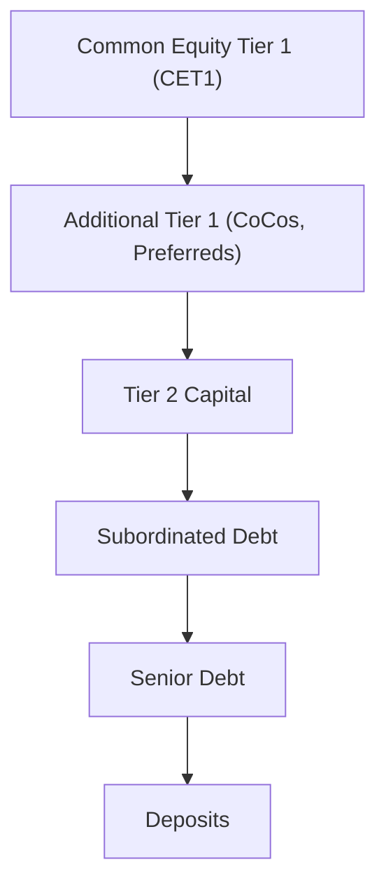
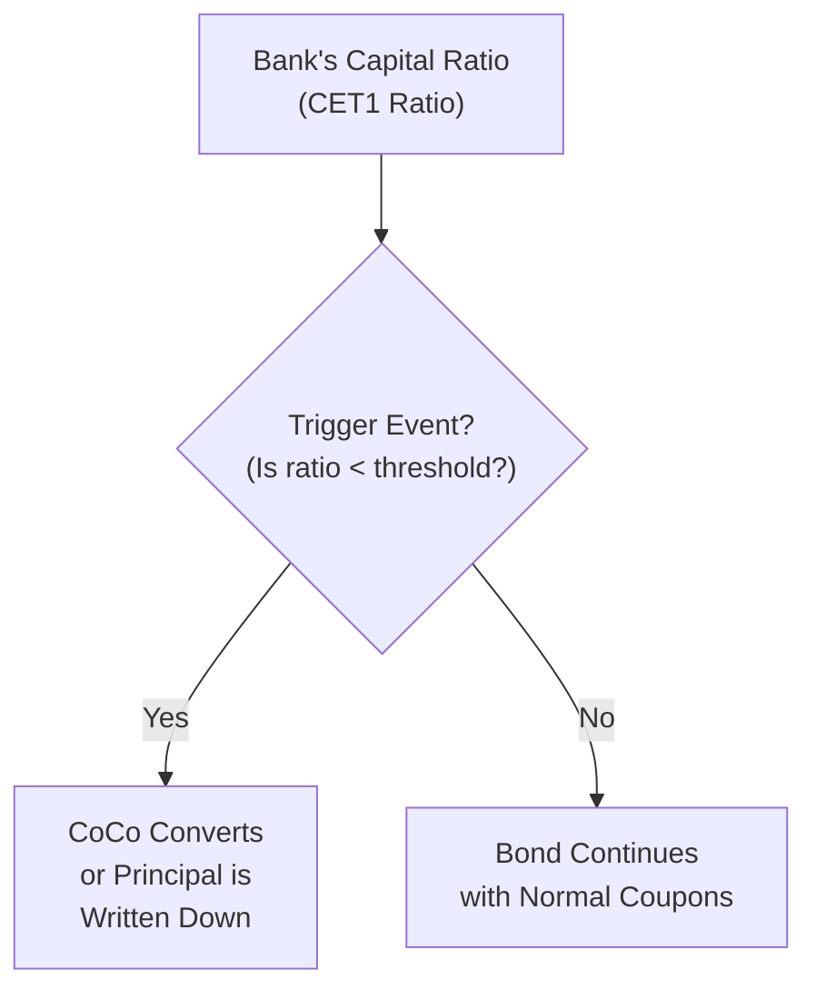

## Overview and Context

Contingent Convertibles—better known by the slightly quirky name “CoCos”—are one of those financial instruments that raise eyebrows whenever I mention them at gatherings of finance pros and complete novices alike. They’re not your typical convertible bond. CoCos are often issued by banks and serve as a backbone piece of Additional Tier 1 (AT1) capital. In other words, they’re a super important tool for banks to shore up their regulatory capital ratios during times of stress. 

Why do regulators and banks care so much about this? Well, picture a bank heading into rough waters. Maybe there’s a major economic downturn, or the bank is saddled with high loan defaults, or it’s stuck with crumbling assets on its balance sheet. Usually, in that scenario, the bank’s capital ratio drops. When the ratio falls below certain thresholds, guess what? The CoCo “kicks in,” either converting into equity or writing down principal. Either way, it stabilizes the bank’s capital base.

If that sounds intense, it’s because it is. But it’s also what makes CoCos attract attention. Investors might find them appealing since they typically offer juicier coupons than traditional bonds. Yet they come with the real risk that one day they’ll transform into equity under stressful conditions—exactly when you might least want more bank shares.

## Distinction from Standard Convertibles

All right, so how exactly do CoCos differ from your run-of-the-mill convertible bonds (the ones you might have studied in Chapter 12.1)? Well, typical convertibles usually give their holders the option to convert into equity at some point, often to capitalize on stock price appreciation. They’re basically a bond plus an embedded call option on the issuer’s equity.

CoCos, on the other hand, have a forced-conversion feature that’s triggered by regulators or by a bank’s financial metrics. There’s no “Hey, I’ll convert when it’s advantageous” scenario. Instead, if the bank’s situation deteriorates (for instance, the Common Equity Tier 1 (CET1) ratio plummets below a specified threshold), the bond will either:

• Convert to equity automatically, effectively turning bondholders into shareholders.  
• Suffer a principal write-down, so the face value of the bond is permanently slashed (or temporarily, depending on the type).  

In both cases, the bank is able to reduce its leverage or boost its equity capital base, thus meeting regulatory capital requirements and, ideally, avoiding a worst-case scenario like insolvency.

## Regulatory Motivation and the AT1 Capital Framework

Historically, bank failures have painful ripple effects across global financial markets. Regulators—and especially the Basel Committee on Banking Supervision—are keen to ensure that systemically important institutions can absorb losses and still perform necessary banking functions (like lending) during a crisis. Additional Tier 1 (AT1) capital was introduced to help address these stern requirements. 

CoCos are a prime example of AT1 capital instruments. They’re structured in a way that, upon deterioration of the issuer’s financials, the instrument either converts or is written down, transferring the losses (in large part) to bondholders rather than depositors or taxpayers. 

Here’s a quick look at how you might visualize the CoCo’s position in a bank’s capital structure:



At the top, we have the bank’s core equity (CET1). Then come instruments like CoCos that absorb losses after equity but before more senior obligations—one of the reasons that coupons on CoCos can be higher is precisely because investors are placing themselves closer to the line of fire if things go south.

## How the Trigger Mechanisms Work

The fundamental design of a CoCo is that there is a predefined trigger event. If you’re an investor in CoCos, you’ll want to be laser-focused on how these triggers are defined. They generally fall under two broad types:

• Mechanical (capital-based) triggers: If the bank’s Common Equity Tier 1 ratio slips below, say, 5.125% (just as an example), the instrument automatically converts to equity or undergoes a principal write-down. This threshold is typically spelled out in the bond’s prospectus.  
• Point of Non-Viability (PONV) triggers: This one is more discretionary because it is determined by the regulator (for instance, the central bank or a supervisory authority). If they decide the financial institution is non-viable without additional capital, they can trigger the CoCos.  

These triggers are absolutely crucial. You could be happily collecting coupons for a long time, but if the bank’s capital ratio takes a nose-dive, you might wake up the next morning as a shareholder, or with a portion of your principal wiped out.

## Risk-Reward Profile

It’s no secret that CoCos are riskier than typical senior bonds. Let’s see why:

• Loss-absorption feature: Bondholders can be forced to convert to equity or suffer a principal haircut. That’s clearly less favorable (in normal circumstances) than continuing to receive interest and eventually principal repayment.  
• Regulatory discretion: For PONV triggers, regulators can exercise judgment in deciding when a bank is on the edge. Bondholders might face sudden changes if regulators say “We’re done. It’s time to convert these CoCos.”  
• Coupon cancelation: Some CoCos allow for coupon payments to be suspended (on a non-cumulative basis) at the issuer’s discretion or at the insistence of regulators.  

So where’s the upside? Higher coupons. Income-seeking investors, especially during periods of low interest rates, might find CoCos appealing because they tend to pay more than vanilla debt. In normal conditions, if the bank stays healthy, you just collect a lofty coupon with only a modest threat of conversion. However, if a financial crisis looms, CoCos can quickly become far less appealing.

## Temporary vs. Permanent Write-Down CoCos

Some CoCos permanently write down part or all of the principal—meaning that once it’s written down, you’re out that face value for good. Others adopt a temporary write-down approach, where the principal might be restored if the issuer’s health improves. However, many regulatory structures favor permanent write-downs because they immediately strengthen a bank’s capital ratio without leaving the door open to re-inflate liabilities.

## Real-World Case Studies

CoCos gained popularity in Europe post the Global Financial Crisis of 2008 (and the subsequent Eurozone crisis). European banks, such as those in the United Kingdom and Switzerland, ramped up their issuance to absorb potential losses and to shore up capital in a cost-effective manner.

One anecdote: I recall reading about a major European bank (name withheld) in 2016 facing market rumors about capital shortfalls. Its CoCo bonds suddenly sold off dramatically in the secondary market because people were spooked that a trigger event might be around the corner. The bank’s actual capital ratio was well above the official trigger threshold—but fear alone can be enough to depress CoCo bond prices. Eventually, the bank clarified its position, and bond prices recovered. That moment underscored how investor psychology plays an outsized role in CoCo markets—some folks simply don’t like the uncertainty of these triggers.

## Modeling CoCo Risk and Valuation

Modeling CoCos is notoriously complex. It’s not just about standard bond math and yield calculations. You have to forecast:

• Future capital ratios for the issuer. This can require analyzing the bank’s loan portfolio projections, profitability, cost of capital, and general macroeconomic conditions.  
• Regulatory frameworks. As rules evolve, so do the odds of a forced conversion or write-down.  
• Probability of coupon cancelation. Some CoCos allow for coupon payments to be suspended entirely or partially.  

Pricing can incorporate option pricing methods, since the conversion feature has an embedded “option,” but the standard convertible bond approach may not fully capture the discretionary nature of triggers and coupon suspensions. Many analysts rely on scenario-based modeling—if the bank’s capital ratio is expected to drop below X% over N years, discount that scenario accordingly. 

Could you attempt a quick simulation? Absolutely. A simple approach might be to simulate unpredictable losses on a bank’s portfolio and see if or when the capital ratio dips below a trigger level:

```python
import numpy as np

np.random.seed(42)

capital_ratio = 10.5  

# (just a made-up normal distribution for demonstration)
mu = -0.2     # mean annual change
sigma = 1.2   # volatility

years = 5
trigger = 7.0  # CoCo conversion threshold
capital_ratios = []

for t in range(years):
    annual_change = np.random.normal(mu, sigma)
    capital_ratio = capital_ratio + annual_change
    capital_ratios.append(capital_ratio)
    if capital_ratio < trigger:
        print(f"Trigger event in year {t+1}, capital ratio fell to {capital_ratio:.2f}%.")
        break

print("Capital Ratio Path:", capital_ratios)
```

Of course, this is just a simplified illustration. Real banks face credit risk, interest rate risk, operational risk, and a host of macro variables that wouldn’t fit neatly into a quick little code snippet.

## Coupon Cancelation

It’s worth emphasizing that CoCo coupon cancelation is a serious risk. Unlike typical bonds, the bank may have the flexibility—or might even be forced by regulators—to skip coupon payments if the bank’s capital ratio or net income is under stress. This is not just a “technical possibility.” We’ve seen high-profile instances of coupons being suspended, leaving investors high and dry with no recourse. Since these are often non-cumulative, investors may not ever recoup the skipped interest.

## Supervisory Perspective and Financial Stability

From a regulator’s vantage point, CoCos are a great way to strengthen a banking system. They instill market discipline and shift part of the burden of bank failures onto investors rather than depositors or governments. By creating a mechanism that automatically injects equity into banks under duress, regulators hope CoCos will contain contagion. 

That said, they are no silver bullet. One critique is that if a CoCo is triggered at a very late stage (i.e., the issuer is practically insolvent), the resulting equity might not be enough to stabilize the bank. Another is that CoCo triggers can be procyclical, further spooking the market exactly in times of turmoil.

## Potential Pitfalls and Best Practices

• Complex documentation: Always read the fine print. Each CoCo has its own unique terms for coupon suspension, conversion price, principal write-down triggers, and more.  
• Market sentiment: CoCos can become “event-driven.” Even rumor or a mild bank scandal can inflate perceived conversion risk.  
• Regulatory uncertainty: Regulations can shift, especially after crises. Adequate modeling might require frequent updates.  
• Portfolio concentration: Some banks issue large volumes of CoCos. If you load up on CoCos from a single name or even multiple banks in one region, you could find yourself overexposed to a regional crisis or regulatory change.  

## Exam Application and Common Question Formats

Expect exam scenarios to revolve around evaluating the effect of a potential trigger event on a CoCo’s price or yield. The item set may present you with a bank’s capital ratio metrics, a threshold for conversion, and a hypothetical stress scenario. You might have to:

• Determine if/when the CoCo is triggered.  
• Calculate the bond’s implied yield in varying scenarios (pre- and post-conversion).  
• Compare the CoCo’s risk and coupon to standard debt instruments.  
• Recommend or reject the CoCo as part of a portfolio strategy under different yield appetites or risk constraints.  

Pay special attention to the difference between mechanical triggers and PONV triggers. They can appear almost identical at first glance, but the discretionary element of PONV triggers introduces an extra layer of uncertainty.

## Practical Example

Imagine a bank’s CET1 ratio stands at 8%. Its CoCo’s prospectus states that if the CET1 ratio dips under 7%, the bond will automatically convert into equity at a 10% discount to the share price at conversion. Now, you might be asked: “If the ratio is projected to be 6.8% in a stress test, how does that affect the bondholder’s position?” The short answer is that the bond’s face value might be forcibly converted into shares, thus drastically changing its risk profile from a more stable coupon-bearing bond to an equity position exposed to market volatility.

## Diagram of a CoCo Trigger Event

Here’s a simplified flow that helps conceptualize the CoCo’s mechanical trigger:



## Concluding Thoughts for Candidates

CoCos are an important part of the modern landscape of bank regulatory capital. They’re not a mere theoretical curiosity—banks really do rely on them, and it’s likely you’ll see them come up in your future investment or risk management roles. 

For exam success:
• Recognize that CoCos differ from standard convertibles through their forced, trigger-based conversion or principal write-down.  
• Know that they form part of Additional Tier 1 capital, essential for post-crisis regulatory frameworks.  
• Be prepared for a scenario-based question that tests your understanding of how triggers are reached, how the bond’s payoff changes, and whether coupons can be suspended.  
• Think about how to weigh their higher coupon against their unique risks.  

Yes, they can pay handsomely “in good times.” But the story can shift quickly if the issuing bank hits a rough patch. Be ready for item sets that also quiz you on the interplay between capital ratios, interest rates, and your potential upside or downside as an investor.

## References for Further Reading

• Bank Capital and Risk-Taking: Contingent Capital for Banks (OECD working paper).  
• Contingent Convertibles (CoCos): Structure, Pricing and Risks by Moorad Choudhry.  
• Basel Committee on Banking Supervision publications on Additional Tier 1 instruments:  
  – https://www.bis.org  


## Test Your Knowledge: Contingent Convertibles (CoCos) Questions



### Which of the following most accurately describes a key characteristic of a Contingent Convertible (CoCo)?
- [x] It converts to equity or faces a principal write-down when a specific capital threshold is breached.
- [ ] It provides bondholders with the option to convert at any time for potential capital gains.
- [ ] It can be called at par value by the issuer at any time after issuance.
- [ ] It automatically redeems at maturity at a premium over par value.

> **Explanation:** CoCos contain a forced or automatic conversion/write-down feature triggered by the bank’s capital ratio or a regulator’s decision, contrasting with standard convertibles where conversion is typically optional for the bondholder.

### A bank issues a CoCo with a mechanical trigger of 7% for its Common Equity Tier 1 ratio. If the ratio falls below that threshold, which of the following actions is the MOST likely outcome?
- [x] The CoCo converts to equity or experiences a principal write-down, depending on the bond’s terms.
- [ ] The bank is automatically declared insolvent and taken over by a regulatory authority.
- [ ] The bank must repay the bond’s principal immediately at par plus accrued interest.
- [ ] The CoCo’s coupon rate permanently doubles.

> **Explanation:** Crossing the specified capital threshold triggers the bond’s loss-absorption feature (conversion or write-down). It does not imply automatic insolvency or a forced repayment at par.

### Why might a CoCo offer a higher coupon than a straight corporate bond from the same issuer?
- [x] The increased risk due to the possibility of forced conversion or principal write-down.
- [ ] Governments require CoCos to pay higher coupons to attract investors.
- [ ] CoCos lack covenants and thus must reflexively pay more.
- [ ] CoCos are highly senior in the capital structure and assume less risk.

> **Explanation:** CoCos carry more risk than standard bonds because of their loss-absorption feature and potential coupon cancelation. This higher risk typically results in a higher coupon.

### Which statement is correct regarding Point of Non-Viability (PONV) triggers for CoCos?
- [x] Regulators can decide that a bank is failing or likely to fail, triggering the CoCo’s conversion/write-down.
- [ ] CoCo bondholders can individually demand to trigger the CoCo for personal gain.
- [ ] They are only triggered when the bank’s share price rises above a certain level.
- [ ] They apply solely to government bonds rather than corporate bonds.

> **Explanation:** With a PONV trigger, regulators have discretion to determine if a bank has become non-viable, effectively forcing the CoCo to convert or be written down. Bondholders cannot decide this themselves.

### A CoCo’s prospectus states: “In the event of a trigger event, the instrument’s principal is permanently written down by 40%.” Which is the most likely implication for holders of this CoCo?
- [x] The par value of the bond is reduced by 40%, and the holder’s principal losses cannot be reversed.
- [ ] The bond simply converts into common equity at a 40% premium to the current share price.
- [x] The bond adjusts its coupon payments upward by 40%.
- [ ] The returned principal can be recovered if the bank’s capital ratio rises back above the threshold.

> **Explanation:** A permanent write-down CoCo means that once the trigger event occurs, the holder’s principal is proportionately lost with no possibility of restoration.

### Which of the following best captures coupon cancelation risk for CoCos?
- [x] Coupons can be suspended entirely if regulators or the issuer decide it’s necessary, with no obligation to pay them later.
- [ ] Coupons are paid out in additional shares of common stock if the issuer’s capital ratio is above the threshold.
- [ ] Coupons are generally guaranteed by a third party if the bank is financially stressed.
- [ ] Coupons convert into short-term debt obligations if the issuer chooses to skip a payment.

> **Explanation:** CoCos can contain provisions allowing coupon payments to be suspended (often at the bank’s or regulators’ discretion) without any guarantee of later repayment.

### If a bank’s CoCo is triggered, resulting in conversion to equity at a steep discount to the current market price, what immediate effect does this have on the bank?
- [x] It boosts the bank’s CET1 ratio because liabilities are reduced or equity is increased.
- [ ] It eliminates the bank’s Tier 2 capital obligations altogether.
- [x] It reduces the bank’s share price by 50% automatically.
- [ ] It’s simply a formality with no impact on the bank’s balance sheet.

> **Explanation:** By converting debt into equity or writing down principal, the bank’s common equity increases relative to its risk-weighted assets, thereby improving its CET1 ratio.

### Which of the following factors is MOST relevant when valuing a CoCo bond?
- [x] The probability of the bank’s capital ratio falling below the trigger level.
- [ ] Projected inflation rates over the next decade.
- [ ] The bank’s P/E ratio compared to its peers.
- [ ] The amount of outstanding secured debt unrelated to the bank’s core operations.

> **Explanation:** While several factors can affect pricing, the most critical for CoCos is the issuer’s capital adequacy and the probability of breach, which directly leads to conversion or write-down.

### A mechanical trigger CoCo and a point of non-viability trigger CoCo share which common characteristic?
- [x] Both are intended to absorb losses if the issuer faces severe stress.
- [ ] Both automatically pay back principal at a premium when triggered.
- [ ] Both require bondholders’ unanimous consent for conversion.
- [ ] Both rely solely on regulator stipulations for any conversion event.

> **Explanation:** Regardless of trigger mechanism, the fundamental purpose of CoCos is to absorb losses when a bank is in trouble, either through forced conversion or principal reduction.

### True or False: In some cases, CoCo coupon payments can be canceled on a non-cumulative basis, and investors may not receive any missed payments in the future.
- [x] True
- [ ] False

> **Explanation:** CoCo structures often allow the issuer (with or without regulatory instruction) to suspend or cancel coupon payments without any requirement to make them up later.


