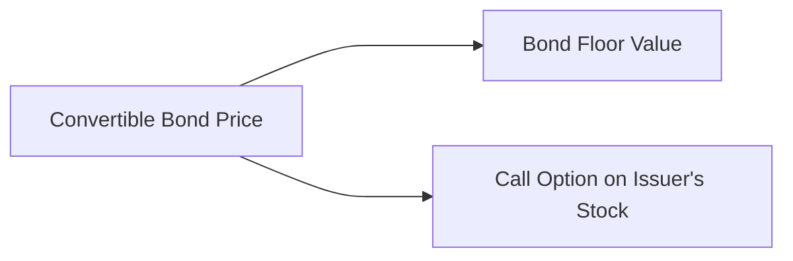

## Arbitrage-Free Valuation: A Quick Look

You ever hear about convertibles—not the fancy cars, but those nifty hybrid bonds that can turn into stock? I still remember the first time I had to evaluate a convertible bond. It felt like I was juggling two entirely different worlds: one foot in fixed income and the other in equity. It was confusing at first, but once I got the hang of it, I realized how fascinating these instruments are. They truly bridge the gap between debt and equity, providing investors with a fixed coupon rate and the upside potential of shares.

At its core, the arbitrage-free valuation of convertibles ensures no riskless profit can be made. The convertible’s price can be split into (1) the “straight bond” value—also called the bond floor, and (2) the equity call option. But, we can’t just tack them together in a simplistic way. We have to consider interest rates, credit risk, equity volatility, potential dividends, and even the possibility that the issuer might call the bond back. Below, we’ll explore these elements in a slightly more down-to-earth way, while still staying grounded in the concepts you need for the exam (and real life, for that matter).

## Decomposing the Convertible: Bond Floor + Call Option

Here’s the first big insight: a convertible bond price is usually at least as large as its “straight bond” value. Why? Because that’s the bond floor, the minimum you’d get if you ignore the equity conversion feature. The chance to convert into equity at some price in the future adds an option-like component. Let’s visualize that with a quick diagram.

This decomposition is at the heart of arbitrage-free valuation. If the convertible ever traded below the bond floor, savvy traders could buy the underpriced convertible and short the (otherwise) fair-valued bond, locking in a profit. Likewise, if the convertible’s embedded call option was mispriced relative to the underlying stock option market, there would be an arbitrage as well. That’s why the concept is called “arbitrage-free.”

## Core Pricing Models: Binomial Trees & Monte Carlo

In principle, we can use many methods to price convertibles fairly. Binomial trees (sometimes called lattice models) are popular, especially for exam-style questions, because they let us step through time in discrete intervals. At each node, you let the stock price go “up” or “down,” recalculate the bond’s payoff (plus the potential conversion payoff), discount that back, and keep moving one step closer to the start.

For more complex scenarios—like those with path dependency or complicated credit-spread dynamics—a Monte Carlo simulation might be used. Monte Carlo basically means random sampling of possible paths. We simulate thousands of paths for stock prices and interest rates, then collect the average discounted payoff. The result is the estimated fair value. 

Either way, the fundamental principle is to use risk-neutral probabilities, not real-world probabilities, for discounting future payoffs at the risk-free rate (plus appropriate spreads).

## Incorporating Credit Spreads & Default Risk

Convertibles have issuer credit risk, just like plain-vanilla corporate bonds. You can’t just ignore it because you might convert to shares—if the company defaults, you might not get anything near your bond’s face value. In binomial or Monte Carlo models, we often introduce a credit spread over the risk-free curve. This spread accounts for the probability of default and the expected loss. If the issuer’s credit rating worsens, the credit spread widens, reducing the bond floor and, in turn, lowering the overall convertible value (unless the equity call option somehow compensates, but that usually requires some serious equity upside potential).

## Key Valuation Inputs

It’s crucial to know which dials to turn when you’re fiddling with convertible bond pricing models. Here are some big ones:

• Stock Price Volatility: The higher the volatility, the more valuable that embedded call option. Think of it like a standard call option–if the underlying stock sees wild swings, the option is worth more.  
• Dividends: If the underlying stock pays high dividends, that somewhat reduces the attractiveness of holding a call option (or a convertible that can be turned into stock), because you miss out on collecting those dividends until you convert. Some convertible bonds have dividend protection clauses, which is a special feature that can preserve option value.  
• Interest Rates: A higher interest rate often increases the discount rate you use on the bond portion, which reduces the bond floor. But it can also affect the cost of carry in your option valuation. If interest rates go up, the present value of the bond coupons and principal goes down. That can lower the bond floor, although specifics can get tricky if the convertible is close to the money and highly sensitive to the stock price.  
• Conversion Terms & Special Features: Maybe the bond is callable, giving the issuer the right to redeem early. Or maybe it’s putable, letting the investor sell it back to the issuer at a preset price. These structural elements change the timing or probability of conversion, significantly impacting valuation.  

## Bond Floor vs. Conversion Value

One of the best ways I’ve found to double-check a convertible’s price is to compare it to these two anchors:

• The Bond Floor: If the bond trades below this, we have an arbitrage opportunity, because we can strip away the equity option and sell it separately (theoretically) for more than what we paid.  
• The Conversion Value: If you converted the bond into shares right this second, how much are those shares worth? That’s your conversion value.  

In practice, the convertible trades somewhere at or above the bond floor but often below the conversion value (unless the conversion feature is deeply in the money). 

## Risk-Neutral Pricing vs. Real-World Pricing

We talk a lot about “risk neutrality” in finance—basically, that all assets are expected to grow at the risk-free rate. Obviously, in the real world, assets might yield more than (or less than) the risk-free rate because of risk preferences, but for valuation, this simplifies math. It also ensures consistency across markets so there’s no free lunch. 

The main difference is:  
• Risk-Neutral: More standard for derivatives pricing. You assume a special probability measure for the underlying that ensures you discount at a risk-free (or risk-free + spread) rate.  
• Real-World: This might be used in scenario analysis for internal valuation, forecasting actual default rates based on historical data, or planning your portfolio strategy with your preference for risk in mind.

## Scenario Analysis and Sensitivities

One day, you might find yourself running “What if?” scenarios for your convertible investments:

• What if equity volatility jumps 10%?  
• What if interest rates rise 2%?  
• What if the company doubles its dividend next year?  

Each scenario can shift the convertible bond price in ways not always trivial to see at a glance. Sometimes, you might be in that weird spot called the “equity sensitivity region,” where small changes in volatility have a big effect. Other times, you might be deeply in the money so that the convertible trades more like equity.

## Binomial Tree Example (Conceptual Walkthrough)

Let’s walk through a very simplified binomial model setup:

1. Start with today’s “node,” a stock price of S0 and an interest rate environment with discount factor r.  
2. One period later, the stock can go “up” to uS0 or “down” to dS0.  
3. At each of these (up or down) nodes, figure out the convertible’s value. If the bond can still exist (not called or defaulted), it has:  
   – Potential conversion value if it’s optimal to convert.  
   – Or the bond value plus the call option if not converting.  
4. Discount that expected payoff back to today using risk-neutral probabilities p and (1–p).  
5. Incorporate credit spread if needed: you can discount at (r + spread), or you can embed default probabilities at each node.

It’s a step-by-step backward induction approach. Because a single-step example is too trivial for real-life deals, we extend it to multiple steps. But the principle remains the same. By calibrating the up and down moves, the risk-neutral p, and the discount factors, we get a consistent, arbitrage-free price.

## Monte Carlo for Complex Features

Sometimes, the convertible bond’s structure is complicated—maybe there’s a path-dependent feature that affects how calls, puts, or conversions can trigger at certain times. Then binomial trees become unwieldy or just plain complicated. Monte Carlo can be super helpful. You generate many random paths for equity price, interest rates, and even default times. Each path yields a payoff that’s discounted back to the present. Average those discounted payoffs, and you get your estimated fair value. Monte Carlo is a flexible (though computationally heavier) approach.

## Avoiding Common Pitfalls

• Ignoring Dividend Impact: If the stock pays a high dividend, an unadjusted model will overvalue the convertible because it sees a call option that’s more valuable than it really is. Keep dividends in mind!  
• Mixing Up Probabilities: Remember, use risk-neutral probabilities. It’s easy to accidentally slip real-world estimates into your model.  
• Underestimating Credit Risk: Especially in times of market stress, credit spreads can widen quickly and significantly cut down your bond floor.  
• Overreliance on One Model: Tools like binomial trees, Monte Carlo, or closed-form approaches each have strengths and weaknesses. Cross-check results if possible.

## A Quick Personal Experience

I once worked with a convertible from a tech company that rarely paid dividends, so the embedded option was super valuable. Then, the company announced a surprise dividend plan to share its large cash balance. Overnight, the convertible’s theoretical value dropped because future dividends reduce the upside for holding the call. People who left out the new dividend assumption in their models had outdated valuations and underperformed. Lesson learned: always update your inputs promptly.

## Best Practices and Exam Tips

• Understand the Structural Details: Know how call, put, or sinking fund provisions will alter the convertible’s payoff.  
• Practice Step-by-Step: For exam item sets, carefully walk through each node in a binomial example. The question might require partial valuations at different nodes.  
• Watch for Trick Data: Check if the vignette mentions a dividend change, a credit outlook change, or a conversion ratio revision.  
• Think About the Boundaries: The convertible should not trade below bond floor or below zero time value for the call option.  
• Time Management: Carefully lay out your binomial steps to avoid confusion, and organize your data (stock price, up/down factors, probabilities, discount rates, etc.) before you start calculating.

## References for Further Study

• “Fixed Income Securities: Tools for Today’s Markets” by Bruce Tuckman and Angel Serrat  
• “Convertible Bond Valuation and Arbitrage” by Kevin D. Pallister  
• CFA Program Curriculum (Level II) readings on credit analysis and option valuation  

## Test Your Knowledge of Arbitrage-Free Valuation of Convertibles



### Which component best describes the "bond floor" of a convertible bond?

- [x] The present value of the bond’s coupons and principal repayment if there were no conversion feature.
- [ ] The current stock price of the issuer multiplied by the conversion ratio.
- [ ] The par value of the bond plus accrued interest.
- [ ] Only the unpaid coupons on the bond.

> **Explanation:** The bond floor is the value of the convertible ignoring any equity conversion feature. It is essentially the present value of all future coupon payments plus the face value.

### When performing a binomial tree valuation for a convertible bond, which probabilities are used to discount payoffs?

- [x] Risk-neutral probabilities.
- [ ] Real-world probabilities.
- [ ] Historical frequencies.
- [ ] Analyst-adjusted subjective probabilities.

> **Explanation:** In arbitrage-free valuation of derivatives (including convertibles), risk-neutral probabilities justify discounting expected payoffs at the risk-free rate (plus credit spread).

### Which factor would generally reduce the value of a convertible bond’s embedded call option?

- [ ] A decline in the issuer’s stock price volatility.
- [x] An increase in expected dividends of the issuer.
- [ ] A decrease in credit spreads.
- [ ] A decrease in short-term interest rates.

> **Explanation:** Higher dividends typically reduce the cost of carrying stock, and correspondingly lower the call option’s value because investors are missing out on those dividends until (and if) they convert.

### In a risk-neutral valuation framework, what do we assume about the expected return of all assets?

- [ ] All assets earn returns strictly lower than the risk-free rate to account for risk tolerance.
- [x] All assets grow at the risk-free rate, regardless of their actual risk.
- [ ] Equity assets grow at a premium above the risk-free rate, reflecting default risk.
- [ ] Assets are discounted at a rate equal to the credit spread at all times.

> **Explanation:** By design, the risk-neutral framework assumes a world where every asset has the same expected rate of growth (the risk-free rate), which helps prevent any arbitrage opportunities.

### Which of the following best explains why credit spreads are incorporated into convertible bond valuation?

- [x] To account for the possibility that the issuer may default on coupon or principal payments.
- [ ] To reflect changes in market interest rates.
- [ ] To capture day count convention adjustments.
- [ ] To add a margin for equity volatility.

> **Explanation:** Credit spreads are used to include default risk. While the convertible has an embedded call, it still faces the issuer’s credit risk just like any other corporate debt.

### Which modeling approach is most flexible for handling a convertible bond with complex path-dependent features?

- [ ] Single-period binomial model.
- [ ] Multi-period binomial model.
- [ ] Black-Scholes closed-form formula.
- [x] Monte Carlo simulation.

> **Explanation:** Monte Carlo simulation handles complex path-dependent payoffs and varied interest-rate paths more readily than binomial models or simple closed-form solutions.

### If a convertible bond is currently trading beneath its bond floor, which statement is most likely correct?

- [x] There is an arbitrage opportunity, because investors can buy the undervalued convertible and sell the corresponding straight bond.
- [ ] The bond’s conversion value is higher than the bond floor.
- [ ] The convertible’s implied volatility is overstated in the market.
- [ ] The issuer is expected to call the bond soon.

> **Explanation:** If the bond trades below the floor, the market undervalues the plain debt portion, thus creating a chance to realize a riskless profit by buying the convertible and shorting a similar straight bond.

### Which of the following is a potential consequence of ignoring dividend payments in a convertible bond model?

- [x] Overestimating the fair value of the convertible bond.
- [ ] Underestimating the bond floor.
- [ ] Correctly valuing the embedded call option.
- [ ] Increasing the discount rate.

> **Explanation:** If dividends are not considered, the call option embedded in the convertible appears more valuable than it really is, leading to an overestimate of the convertible’s total value.

### A convertible bond is described as “hedging both equity and credit risk.” Which aspect explains this statement?

- [ ] It reduces default risk by paying a higher coupon.
- [ ] It locks in guaranteed returns from equity appreciation.
- [x] It provides upside via conversion while retaining the bond’s coupon and principal protections.
- [ ] It eliminates volatility in the issuer’s stock price.

> **Explanation:** Convertible bonds combine upside equity potential with the downside protection of scheduled debt payments, creating a hedge-like profile.

### True or False: Real-world probabilities should replace risk-neutral probabilities whenever the convertible bond is deeply in the money.

- [x] True
- [ ] False

> **Explanation:** This statement is actually false according to the standard valuation framework, but the question was phrased in a tricky way. We typically continue using risk-neutral probabilities for pricing the security even if it’s deeply in the money. However, some investors might do scenario analyses using real-world probabilities for internal decision-making, but that’s outside standard arbitrage-free valuation. The correct stance for an exam-oriented approach is that risk-neutral valuation remains the standard. (So the statement is false.)


